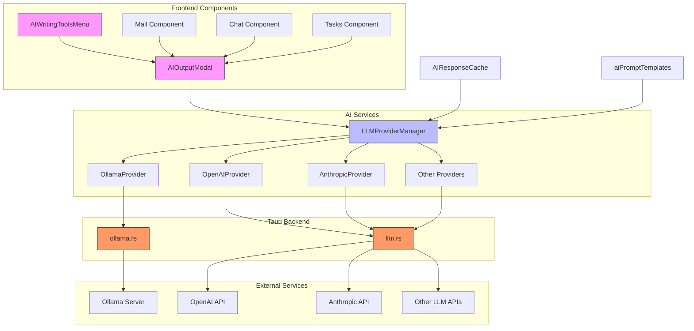
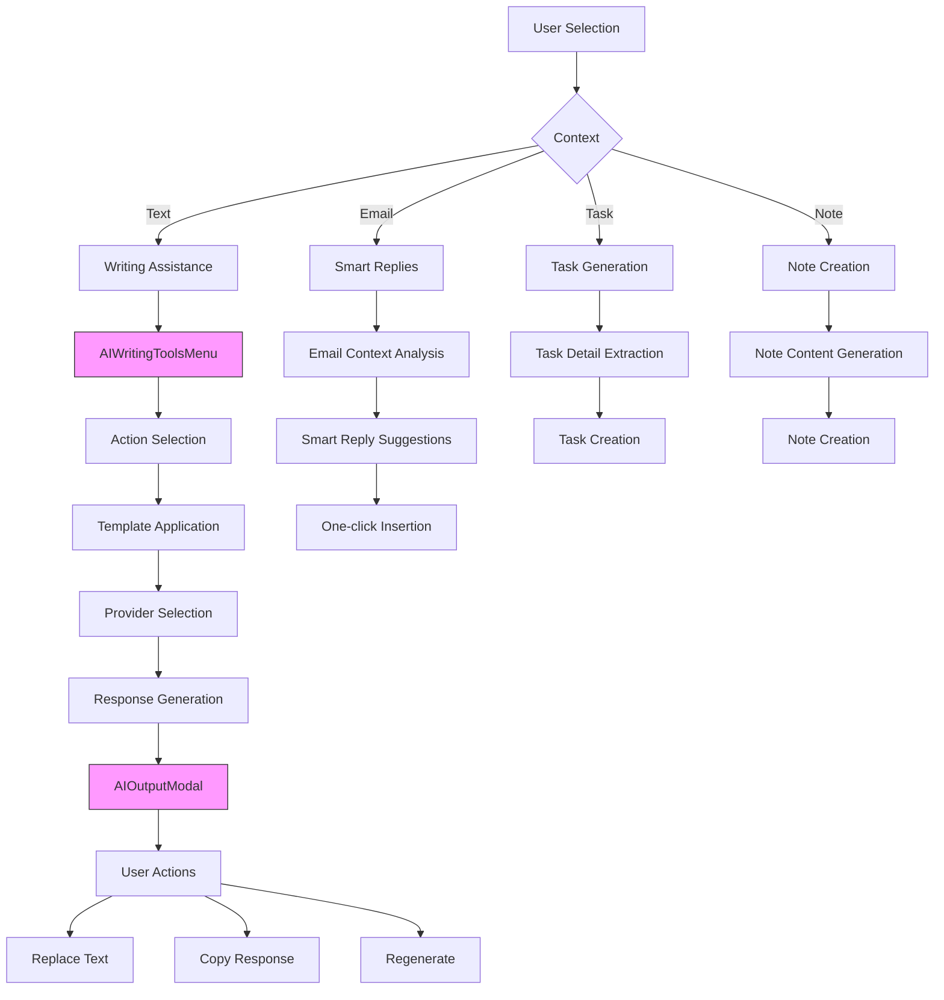
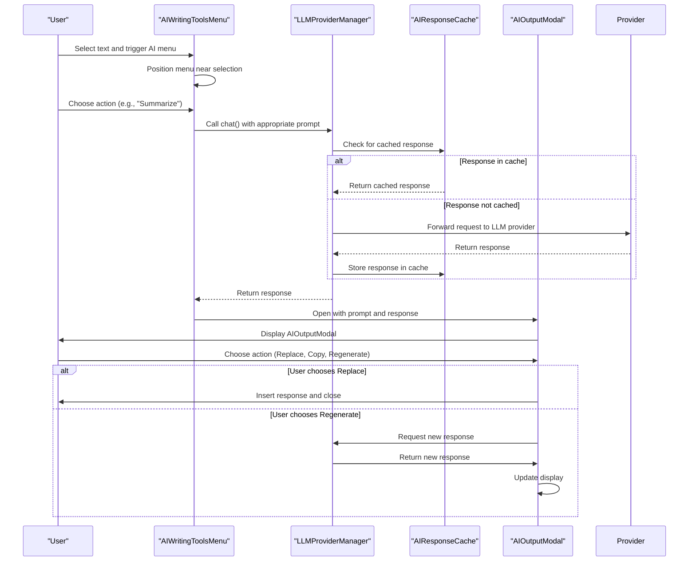
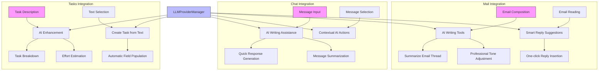
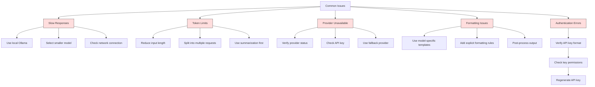

# AI Integration

<cite>
**Referenced Files in This Document**   
- [llmProviders.ts](file://src/services/llmProviders.ts)
- [aiPromptTemplates.ts](file://src/services/aiPromptTemplates.ts)
- [aiResponseCache.ts](file://src/services/aiResponseCache.ts)
- [ollamaService.ts](file://src/services/ollamaService.ts)
- [AIWritingToolsMenu.tsx](file://src/components/ai/AIWritingToolsMenu.tsx)
- [AIOutputModal.tsx](file://src/components/ai/AIOutputModal.tsx)
- [llm.rs](file://src-tauri/src/commands/llm.rs)
- [ollama.rs](file://src-tauri/src/commands/ollama.rs)
</cite>

## Table of Contents
1. [Introduction](#introduction)
2. [Architecture Overview](#architecture-overview)
3. [Core Components](#core-components)
4. [Prompt Templating System](#prompt-templating-system)
5. [Response Caching Mechanism](#response-caching-mechanism)
6. [Streaming Responses](#streaming-responses)
7. [AI-Powered Features](#ai-powered-features)
8. [Usage Patterns](#usage-patterns)
9. [Integration with Mail, Chat, and Tasks](#integration-with-mail-chat-and-tasks)
10. [Common Issues and Solutions](#common-issues-and-solutions)
11. [Performance Considerations](#performance-considerations)

## Introduction
LibreOllama provides a comprehensive AI integration system that enables users to leverage multiple LLM providers including Ollama, OpenAI, Anthropic, and others. The system supports advanced features like writing assistance, content generation, smart replies, and task automation through a unified interface. This documentation explains the architecture, implementation details, and usage patterns for the AI integration system.

## Architecture Overview



**Diagram sources**
- [AIWritingToolsMenu.tsx](file://src/components/ai/AIWritingToolsMenu.tsx)
- [AIOutputModal.tsx](file://src/components/ai/AIOutputModal.tsx)
- [llmProviders.ts](file://src/services/llmProviders.ts)
- [ollama.rs](file://src-tauri/src/commands/ollama.rs)
- [llm.rs](file://src-tauri/src/commands/llm.rs)

**Section sources**
- [llmProviders.ts](file://src/services/llmProviders.ts)
- [AIWritingToolsMenu.tsx](file://src/components/ai/AIWritingToolsMenu.tsx)

## Core Components

The AI integration system consists of several key components that work together to provide seamless AI capabilities:

1. **LLMProviderManager**: Central manager that handles multiple LLM providers and their configurations
2. **OllamaService**: Dedicated service for interacting with the local Ollama server
3. **AIResponseCache**: Caching system for AI responses to improve performance
4. **aiPromptTemplates**: Template system for generating optimized prompts
5. **UI Components**: Interactive components for user engagement with AI features

These components are designed to work together to provide a consistent and efficient AI experience across the application.

**Section sources**
- [llmProviders.ts](file://src/services/llmProviders.ts)
- [ollamaService.ts](file://src/services/ollamaService.ts)
- [aiResponseCache.ts](file://src/services/aiResponseCache.ts)
- [aiPromptTemplates.ts](file://src/services/aiPromptTemplates.ts)

## Prompt Templating System

```mermaid
classDiagram
class aiPromptTemplates {
+MODEL_SPECIFIC_PROMPTS : Record~string, Record~AIAction, string~~
+MODEL_SPECIFIC_SYSTEM_PROMPTS : Record~string, string~
+getPromptTemplate(action : AIAction, model : string, text : string, options? : {language? : string}) : string
}
class LLMProviderManager {
-providers : Map~LLMProvider, BaseLLMProvider~
+getInstance(settings? : LLMProviderSettings) : LLMProviderManager
+getProvider(provider : LLMProvider) : BaseLLMProvider | undefined
+chat(provider : LLMProvider, messages : LLMMessage[], model? : string) : Promise~string~
}
class BaseLLMProvider {
+provider : LLMProvider
+getRawConfig() : LLMProviderConfig
+chat(messages : LLMMessage[], model? : string) : Promise~string~
+listModels() : Promise~LLMModel[]~
+isConfigured() : boolean
}
aiPromptTemplates --> LLMProviderManager : "provides templates to"
LLMProviderManager --> BaseLLMProvider : "manages"
note right of aiPromptTemplates
Contains model-specific prompt templates
for different AI actions and models
Optimizes prompts based on model capabilities
end note
```

**Diagram sources**
- [aiPromptTemplates.ts](file://src/services/aiPromptTemplates.ts)
- [llmProviders.ts](file://src/services/llmProviders.ts)

**Section sources**
- [aiPromptTemplates.ts](file://src/services/aiPromptTemplates.ts)
- [llmProviders.ts](file://src/services/llmProviders.ts)

The prompt templating system in LibreOllama is designed to optimize AI interactions by providing model-specific templates that account for the unique characteristics of different LLMs. The system uses two main components:

1. **MODEL_SPECIFIC_PROMPTS**: Contains different template sets for various models, with special handling for models like Gemma that require very explicit instructions
2. **getPromptTemplate function**: Selects the appropriate template based on the AI action, target model, and input parameters

The system automatically detects model types (e.g., Gemma models) and applies specialized templates that include strict rules and formatting requirements. For example, Gemma models receive templates with explicit instructions like "Output ONLY bullet points" and "NO original text" to ensure consistent output format.

Different AI actions have specific templates:
- **Content transformation**: Templates for rewriting, summarizing, or expanding text
- **Content creation**: Templates for generating lists, key points, or new content
- **Editing**: Templates for proofreading and error correction
- **Translation**: Templates with language-specific parameters
- **Explanation**: Templates that simplify complex content

The system also supports model-specific system prompts that guide the AI's behavior, such as instructing Gemma models to "Output ONLY what is requested."

## Response Caching Mechanism

```mermaid
classDiagram
class AIResponseCache {
-cache : Map~string, CacheEntry~
-maxAge : number
-maxEntries : number
+get(prompt : string, action : string, model? : string, provider? : string) : string | null
+set(prompt : string, action : string, response : string, model? : string, provider? : string) : void
+clear() : void
+getHistory(prompt : string) : {action : string; response : string; model? : string; provider? : string}[]
-getCacheKey(prompt : string, action : string, model? : string, provider? : string) : string
}
class CacheEntry {
+response : string
+timestamp : number
+model? : string
+provider? : string
}
AIResponseCache --> CacheEntry : "contains"
class LLMProviderManager {
+chat(provider : LLMProvider, messages : LLMMessage[], model? : string) : Promise~string~
}
class aiResponseCache {
+instance : AIResponseCache
}
LLMProviderManager --> aiResponseCache : "uses"
aiResponseCache --> AIResponseCache : "singleton"
note right of AIResponseCache
Implements LRU cache with time-based expiration
Keys include prompt, action, model, and provider
Maximum 100 entries with 15-minute TTL
end note
```

**Diagram sources**
- [aiResponseCache.ts](file://src/services/aiResponseCache.ts)
- [llmProviders.ts](file://src/services/llmProviders.ts)

**Section sources**
- [aiResponseCache.ts](file://src/services/aiResponseCache.ts)

The response caching mechanism in LibreOllama is implemented as a singleton class that stores AI responses to improve performance and reduce redundant API calls. Key features include:

- **Time-based expiration**: Cache entries expire after 15 minutes (configurable via `maxAge`)
- **Size limiting**: Maximum of 100 cache entries to prevent memory issues
- **LRU eviction**: When the cache reaches capacity, the oldest entry is removed
- **Composite keys**: Cache keys include the prompt, action, model, and provider to ensure appropriate response retrieval

The cache stores responses along with metadata including timestamp, model, and provider, allowing for accurate retrieval and history tracking. The `getHistory` method enables users to access previous responses for the same prompt, supporting regeneration workflows.

Cache keys are generated using a combination of action, model, provider, and prompt text to ensure that responses are only reused when all parameters match exactly. This prevents inappropriate response reuse across different contexts.

## Streaming Responses

```mermaid
sequenceDiagram
participant UI as "UI Component"
participant Frontend as "Frontend Service"
participant Backend as "Tauri Backend"
participant LLM as "LLM Provider"
UI->>Frontend : Request AI action with streaming
Frontend->>Backend : ollama_chat_stream(messages, model, streamId)
Backend->>LLM : POST /api/chat (stream=true)
LLM-->>Backend : Stream JSON chunks
loop Each chunk
Backend->>Backend : Parse JSON, extract content
Backend->>UI : Emit "ollama_chat_stream" event
UI->>UI : Update UI with partial response
end
Backend-->>Frontend : Return complete response
Frontend-->>UI : Complete response received
note right of Backend
Uses reqwest : : Client for streaming
Processes newline-delimited JSON
Emits progress events to frontend
end note
```

**Diagram sources**
- [ollamaService.ts](file://src/services/ollamaService.ts)
- [ollama.rs](file://src-tauri/src/commands/ollama.rs)

**Section sources**
- [ollamaService.ts](file://src/services/ollamaService.ts)
- [ollama.rs](file://src-tauri/src/commands/ollama.rs)

LibreOllama implements streaming responses to provide real-time feedback during AI generation. The streaming architecture works as follows:

1. **Frontend request**: The UI component calls `chatStream` on `OllamaService` with a callback function to handle streaming events
2. **Backend processing**: The Tauri command `ollama_chat_stream` establishes a streaming connection with the Ollama server or other LLM provider
3. **Event emission**: As chunks of the response arrive, the backend parses the newline-delimited JSON and emits `ollama_chat_stream` events with the partial content
4. **UI updates**: The frontend listens for these events and updates the UI incrementally, creating a "typing" effect
5. **Completion**: When the stream completes, the final response is returned through the promise

The system generates a unique `streamId` for each request to ensure that events are properly routed to the correct handler, allowing multiple simultaneous streams. The streaming implementation handles error conditions gracefully, providing appropriate error messages if the connection fails.

For non-Ollama providers, similar streaming mechanisms are implemented through their respective API endpoints, with appropriate request formatting and response parsing for each provider.

## AI-Powered Features



**Diagram sources**
- [AIWritingToolsMenu.tsx](file://src/components/ai/AIWritingToolsMenu.tsx)
- [AIOutputModal.tsx](file://src/components/ai/AIOutputModal.tsx)

**Section sources**
- [AIWritingToolsMenu.tsx](file://src/components/ai/AIWritingToolsMenu.tsx)
- [AIOutputModal.tsx](file://src/components/ai/AIOutputModal.tsx)

LibreOllama offers several AI-powered features that enhance productivity across different contexts:

### Writing Assistance
The AI writing tools menu provides a comprehensive set of text transformation capabilities:
- **Rewriting**: Options to make text more professional, friendly, concise, or expanded
- **Editing**: Proofreading and error correction
- **Summarization**: Condensing content into key points
- **Transformation**: Converting text to lists or extracting key points
- **Creation**: Generating new content based on user input

### Smart Replies
In email and chat contexts, the system can generate context-aware responses that users can insert with a single click. These replies are tailored to the conversation history and tone.

### Content Generation
Users can create tasks, notes, and other content from selected text or custom prompts. The system extracts relevant information and formats it appropriately for the target content type.

### Custom AI Queries
The "Ask AI anything" feature allows users to pose custom questions about selected text, enabling research, explanation, and analysis capabilities.

## Usage Patterns



**Diagram sources**
- [AIWritingToolsMenu.tsx](file://src/components/ai/AIWritingToolsMenu.tsx)
- [AIOutputModal.tsx](file://src/components/ai/AIOutputModal.tsx)
- [llmProviders.ts](file://src/services/llmProviders.ts)
- [aiResponseCache.ts](file://src/services/aiResponseCache.ts)

**Section sources**
- [AIWritingToolsMenu.tsx](file://src/components/ai/AIWritingToolsMenu.tsx)
- [AIOutputModal.tsx](file://src/components/ai/AIOutputModal.tsx)

The typical usage pattern for AI features in LibreOllama follows a consistent workflow:

1. **Text Selection**: User selects text in any editable field (mail, chat, tasks, notes)
2. **Menu Activation**: The AI writing tools menu appears near the selection
3. **Action Selection**: User chooses an AI action from the categorized menu
4. **Request Processing**: The system generates an appropriate prompt using the templating system
5. **Response Retrieval**: The system checks the cache for a previous response before making a new request
6. **Response Display**: Results are shown in the AI output modal with options to replace, copy, or regenerate
7. **User Action**: User chooses how to use the AI-generated content

The AI writing tools menu is context-aware and appears only when text is selected. It's positioned dynamically near the selection for easy access. The menu categorizes actions into logical groups (rewrite, edit, transform, create) with intuitive icons and labels.

The AI output modal provides a clean interface for reviewing and using AI-generated content, with clear options for replacing the original text, copying to clipboard, or requesting a different response.

## Integration with Mail, Chat, and Tasks



**Diagram sources**
- [AIWritingToolsMenu.tsx](file://src/components/ai/AIWritingToolsMenu.tsx)
- [llmProviders.ts](file://src/services/llmProviders.ts)

**Section sources**
- [AIWritingToolsMenu.tsx](file://src/components/ai/AIWritingToolsMenu.tsx)

The AI integration is deeply embedded across LibreOllama's core components:

### Mail Integration
- **Composition assistance**: Users can rewrite, summarize, or adjust the tone of email drafts
- **Smart replies**: Context-aware response suggestions for incoming emails
- **Thread summarization**: Condensing long email threads into key points
- **Professional tone**: Automatically adjusting language to be more business-appropriate

### Chat Integration
- **Message generation**: Creating responses to chat messages with various tones
- **Summarization**: Condensing long chat conversations
- **Quick actions**: Transforming selected chat text with AI enhancements

### Tasks Integration
- **Task creation**: Converting selected text into structured tasks with appropriate fields
- **Task enhancement**: Expanding brief task descriptions with details and subtasks
- **Effort estimation**: Providing time estimates for task completion
- **Breakdown**: Decomposing complex tasks into manageable subtasks

The integration is seamless across these components, using the same underlying AI services and UI patterns to provide a consistent user experience.

## Common Issues and Solutions



**Diagram sources**
- [llmProviders.ts](file://src/services/llmProviders.ts)
- [ollamaService.ts](file://src/services/ollamaService.ts)

**Section sources**
- [llmProviders.ts](file://src/services/llmProviders.ts)
- [ollamaService.ts](file://src/services/ollamaService.ts)

Several common issues may arise when using AI features in LibreOllama, along with their recommended solutions:

### Slow Responses
**Causes**:
- Remote API latency
- Large model processing time
- Network connectivity issues
- Resource constraints on local machine

**Solutions**:
- Use local Ollama instead of cloud providers when possible
- Select smaller, faster models for quick tasks
- Ensure stable network connection
- Close other resource-intensive applications
- Pre-pull frequently used models to avoid download delays

### Token Limits
**Causes**:
- Input text exceeding model context window
- Very long responses exceeding response limits
- Combined prompt and response exceeding token budget

**Solutions**:
- Reduce input length by summarizing or extracting key points first
- Split large documents into sections for processing
- Use the "Summarize" or "Extract key points" features before other operations
- Configure models with appropriate context lengths for the task
- Implement chunking for very long documents

### Provider Unavailability
**Causes**:
- Ollama server not running
- Cloud provider API downtime
- Network connectivity issues
- Rate limiting

**Solutions**:
- Start Ollama sidecar through application settings
- Verify internet connection
- Check provider status pages
- Implement retry logic with exponential backoff
- Configure multiple providers as fallback options

### Formatting Issues
**Causes**:
- Model not following prompt instructions
- Inconsistent output formatting
- Special characters or markdown issues

**Solutions**:
- Use model-specific templates with explicit formatting rules
- Add stronger constraints in prompts (e.g., "Output ONLY bullet points")
- Implement post-processing to normalize output format
- Use the "Proofread" feature to correct formatting
- Test different models for consistent formatting

### Authentication Errors
**Causes**:
- Invalid API keys
- Expired credentials
- Incorrect key format
- Permission issues

**Solutions**:
- Verify API key format and copy carefully
- Check that keys have appropriate permissions
- Regenerate API keys through provider dashboard
- Store keys securely in application settings
- Test connection with provider's test endpoint

## Performance Considerations

```mermaid
graph TD
A[Performance Factors] --> B[Model Selection]
A --> C[Network Latency]
A --> D[Input Size]
A --> E[Caching Strategy]
A --> F[Resource Utilization]
B --> G[Smaller models = faster]
B --> H[Local models = lower latency]
B --> I[Specialized models = better results]
C --> J[Local Ollama = minimal latency]
C --> K[Cloud providers = variable latency]
C --> L[Network quality impact]
D --> M[Large inputs = longer processing]
D --> N[Pre-processing recommended]
D --> O[Chunking for large documents]
E --> P[Caching reduces API calls]
E --> Q[Appropriate TTL settings]
E --> R[Memory usage monitoring]
F --> S[Ollama resource usage]
F --> T[Background process impact]
F --> U[Memory vs. speed tradeoffs]
style B fill:#ff9,stroke:#333
style C fill:#ff9,stroke:#333
style D fill:#ff9,stroke:#333
style E fill:#ff9,stroke:#333
style F fill:#ff9,stroke:#333
```



**Diagram sources**
- [ollamaService.ts](file://src/services/ollamaService.ts)
- [aiResponseCache.ts](file://src/services/aiResponseCache.ts)

**Section sources**
- [ollamaService.ts](file://src/services/ollamaService.ts)
- [aiResponseCache.ts](file://src/services/aiResponseCache.ts)

Several performance factors should be considered when using AI features in LibreOllama:

### Model Selection
- **Size vs. Speed**: Larger models typically provide better results but are slower; smaller models are faster but may have reduced capabilities
- **Local vs. Cloud**: Local Ollama models have lower latency but require local resources; cloud providers have variable latency but offload processing
- **Specialization**: Some models are optimized for specific tasks (e.g., code generation, creative writing)

### Network Considerations
- Local Ollama provides the most consistent performance
- Cloud providers are subject to network latency and potential outages
- Connection quality significantly impacts response times for remote providers

### Input Optimization
- Process large documents in chunks rather than as a single request
- Use summarization or key point extraction as a pre-processing step
- Remove irrelevant content before AI processing

### Caching Strategy
- The 15-minute cache TTL balances freshness with performance
- Cache hits eliminate API call latency and costs
- Monitor memory usage as the cache grows

### Resource Management
- Ollama can consume significant CPU and memory resources
- Consider running Ollama as a background service for consistent availability
- Balance model size with available system resources
- Use model unloading for infrequently used large models

Optimal performance is achieved by selecting the right model for the task, using local processing when possible, leveraging the caching system, and optimizing input size and format.