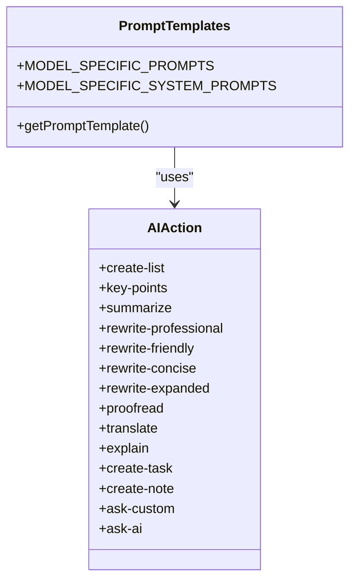
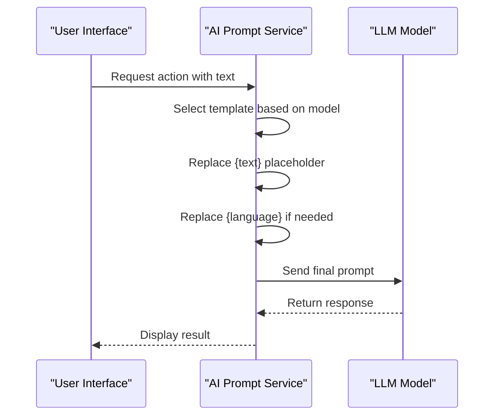
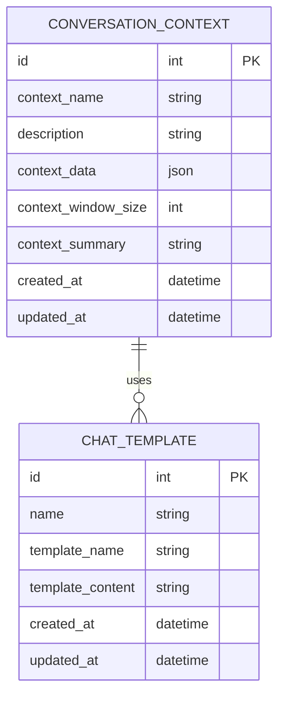
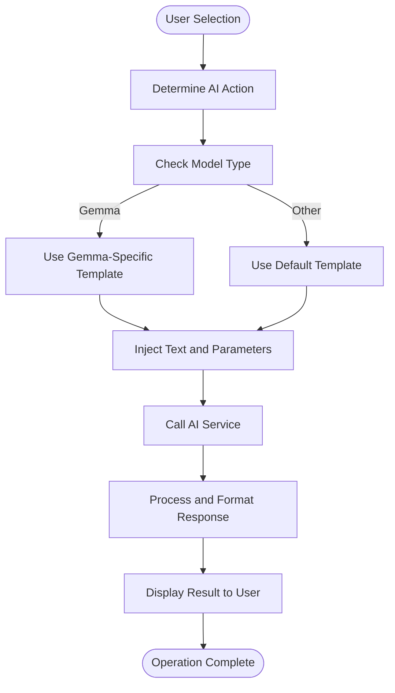
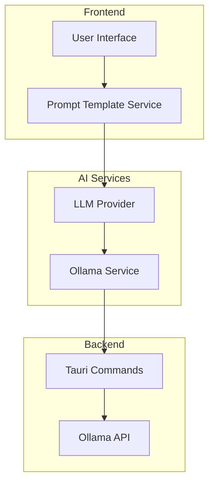
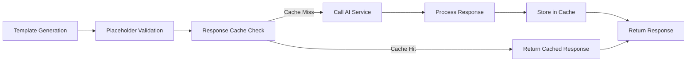

# AI Prompt Templates

<cite>
**Referenced Files in This Document**   
- [aiPromptTemplates.ts](file://src/services/aiPromptTemplates.ts)
- [AIWritingToolsMenu.tsx](file://src/components/ai/AIWritingToolsMenu.tsx)
- [AIWritingToolsContextMenu.tsx](file://src/components/ai/AIWritingToolsContextMenu.tsx)
- [ollamaService.ts](file://src/services/ollamaService.ts)
- [llmProviders.ts](file://src/services/llmProviders.ts)
- [chatStore.ts](file://src/features/chat/stores/chatStore.ts)
- [advanced.rs](file://src-tauri/src/commands/system/advanced.rs)
- [models.rs](file://src-tauri/src/database/models.rs)
</cite>

## Table of Contents
1. [Introduction](#introduction)
2. [Template Structure and Organization](#template-structure-and-organization)
3. [Variable Interpolation and Dynamic Content](#variable-interpolation-and-dynamic-content)
4. [Context Injection Patterns](#context-injection-patterns)
5. [Use Case Implementations](#use-case-implementations)
6. [Template-Service Integration](#template-service-integration)
7. [Security and Performance Considerations](#security-and-performance-considerations)
8. [Custom Template Development](#custom-template-development)
9. [Conclusion](#conclusion)

## Introduction
The AI Prompt Templates system in LibreOllama provides a structured approach to generating consistent, high-quality AI responses across various use cases. This system enables users to transform text through predefined operations such as summarization, rewriting, translation, and key point extraction. The implementation supports model-specific optimizations and dynamic content injection, ensuring optimal performance across different LLM providers. The architecture separates template definitions from execution logic, allowing for easy maintenance and extension of prompt patterns.

**Section sources**
- [aiPromptTemplates.ts](file://src/services/aiPromptTemplates.ts#L1-L202)

## Template Structure and Organization
The prompt template system is organized around action-based templates that map to specific AI operations. Templates are categorized by AI action types such as 'summarize', 'rewrite-professional', and 'key-points', with each action having corresponding prompt structures. The system implements model-specific template variations, particularly optimized for Gemma models which require more explicit instructions compared to other models.

Templates are structured with clear task definitions, rules, and input/output specifications. For example, the 'gemma' model templates include explicit RULES sections that constrain output format, while default templates use simpler instruction patterns. This dual-template approach ensures compatibility across different model architectures while maintaining high-quality output standards.

**Diagram sources**
- [aiPromptTemplates.ts](file://src/services/aiPromptTemplates.ts#L1-L202)
- [AIWritingToolsMenu.tsx](file://src/components/ai/AIWritingToolsMenu.tsx#L24-L38)

**Section sources**
- [aiPromptTemplates.ts](file://src/services/aiPromptTemplates.ts#L1-L202)
- [AIWritingToolsMenu.tsx](file://src/components/ai/AIWritingToolsMenu.tsx#L24-L38)

## Variable Interpolation and Dynamic Content
The system implements a straightforward yet effective variable interpolation mechanism using placeholder replacement. Templates contain named placeholders such as `{text}` and `{language}` that are dynamically replaced with actual content during template instantiation. The `getPromptTemplate` function handles this interpolation process, taking the base template and replacing all placeholders with provided values.

The interpolation system supports optional parameters, allowing templates to conditionally include language specifications only when translation is requested. This prevents unnecessary placeholders from appearing in prompts when not needed. The system processes text content as the primary variable, with additional context injected based on the specific AI action being performed.

**Diagram sources**
- [aiPromptTemplates.ts](file://src/services/aiPromptTemplates.ts#L177-L195)
- [ollamaService.ts](file://src/services/ollamaService.ts#L199-L250)

**Section sources**
- [aiPromptTemplates.ts](file://src/services/aiPromptTemplates.ts#L177-L195)

## Context Injection Patterns
The system employs context injection patterns to enhance AI responses with relevant information from different domains such as email, chat, and tasks. While the core template system handles basic text transformation, additional context is injected through the AI service layer. The system supports dynamic context window sizing and maintains conversation state through structured context management.

For chat-based interactions, the system maintains conversation history and injects relevant context from previous exchanges. The backend stores conversation context with metadata including context window size and summary information, enabling the AI to maintain coherence across multiple interactions. This context-aware approach allows for more natural and relevant responses that consider the conversation history.

**Diagram sources**
- [models.rs](file://src-tauri/src/database/models.rs#L474-L510)
- [advanced.rs](file://src-tauri/src/commands/system/advanced.rs#L83-L112)

**Section sources**
- [models.rs](file://src-tauri/src/database/models.rs#L474-L510)
- [advanced.rs](file://src-tauri/src/commands/system/advanced.rs#L83-L112)

## Use Case Implementations
The prompt template system supports various use cases through specialized templates and invocation patterns. For email drafting, the system uses rewrite templates with professional or friendly tone options. Task summarization leverages the 'summarize' and 'key-points' templates to extract essential information from longer texts. Chat responses utilize the full range of templates depending on user requests, from simple rewrites to complex explanations.

Each use case follows a consistent pattern: the UI component identifies the requested action, retrieves the appropriate template, injects the selected text and any additional parameters, and passes the final prompt to the AI service. The system caches responses to improve performance and reduce redundant API calls, particularly for frequently used templates with similar inputs.

**Diagram sources**
- [aiPromptTemplates.ts](file://src/services/aiPromptTemplates.ts#L134-L202)
- [chatStore.ts](file://src/features/chat/stores/chatStore.ts#L468-L498)

**Section sources**
- [aiPromptTemplates.ts](file://src/services/aiPromptTemplates.ts#L134-L202)
- [chatStore.ts](file://src/features/chat/stores/chatStore.ts#L468-L498)

## Template-Service Integration
The integration between prompt templates and AI services follows a clean separation of concerns. The `aiPromptTemplates.ts` service generates properly formatted prompts, which are then passed to the `ollamaService` for execution. The LLM provider system abstracts the underlying model provider, allowing the same template system to work with Ollama, OpenAI, and other supported providers.

When a template is invoked, the system first generates the complete prompt using `getPromptTemplate`, then passes this prompt to the appropriate LLM provider's chat or generate method. The response is processed and formatted before being returned to the UI layer. This integration pattern ensures that template logic remains independent of the specific AI service implementation.

**Diagram sources**
- [aiPromptTemplates.ts](file://src/services/aiPromptTemplates.ts#L1-L202)
- [llmProviders.ts](file://src/services/llmProviders.ts#L0-L53)
- [ollamaService.ts](file://src/services/ollamaService.ts#L0-L63)

**Section sources**
- [aiPromptTemplates.ts](file://src/services/aiPromptTemplates.ts#L1-L202)
- [llmProviders.ts](file://src/services/llmProviders.ts#L0-L53)
- [ollamaService.ts](file://src/services/ollamaService.ts#L0-L63)

## Security and Performance Considerations
The system addresses security and performance through several mechanisms. Template injection vulnerabilities are mitigated by strict placeholder replacement rather than template evaluation, preventing code injection attacks. The system uses a caching layer to store AI responses, reducing redundant processing and API calls while maintaining response quality.

Performance is optimized through response caching with a 15-minute expiration and a maximum of 100 cached entries. The system implements proper error handling and fallback mechanisms, ensuring graceful degradation when AI services are unavailable. Model-specific templates help prevent context overflow by constraining output length and format, particularly for models like Gemma that benefit from explicit output rules.

**Diagram sources**
- [aiResponseCache.ts](file://src/services/aiResponseCache.ts#L0-L48)
- [aiPromptTemplates.ts](file://src/services/aiPromptTemplates.ts#L1-L202)

**Section sources**
- [aiResponseCache.ts](file://src/services/aiResponseCache.ts#L0-L48)

## Custom Template Development
Developers can extend the system by creating custom templates following the established patterns. New AI actions can be added to the `AIAction` type, with corresponding template definitions in the `MODEL_SPECIFIC_PROMPTS` structure. Custom templates should follow the same organization principles, providing both Gemma-optimized and default versions for maximum compatibility.

When developing custom templates, developers should consider the target model's characteristics and include appropriate constraints and formatting instructions. Templates should use consistent placeholder naming conventions and provide clear task definitions. The system's modular design allows new templates to be added without modifying the core service logic, enabling safe extension of functionality.

**Section sources**
- [aiPromptTemplates.ts](file://src/services/aiPromptTemplates.ts#L1-L202)
- [AIWritingToolsMenu.tsx](file://src/components/ai/AIWritingToolsMenu.tsx#L24-L38)

## Conclusion
The AI Prompt Templates system in LibreOllama provides a robust foundation for consistent AI interactions across various use cases. By separating template definition from execution, the system enables maintainable and extensible AI functionality. The implementation balances flexibility with control, allowing for dynamic content injection while maintaining security through constrained template processing. The architecture supports both simple text transformations and complex context-aware interactions, making it suitable for a wide range of applications from email drafting to task management.