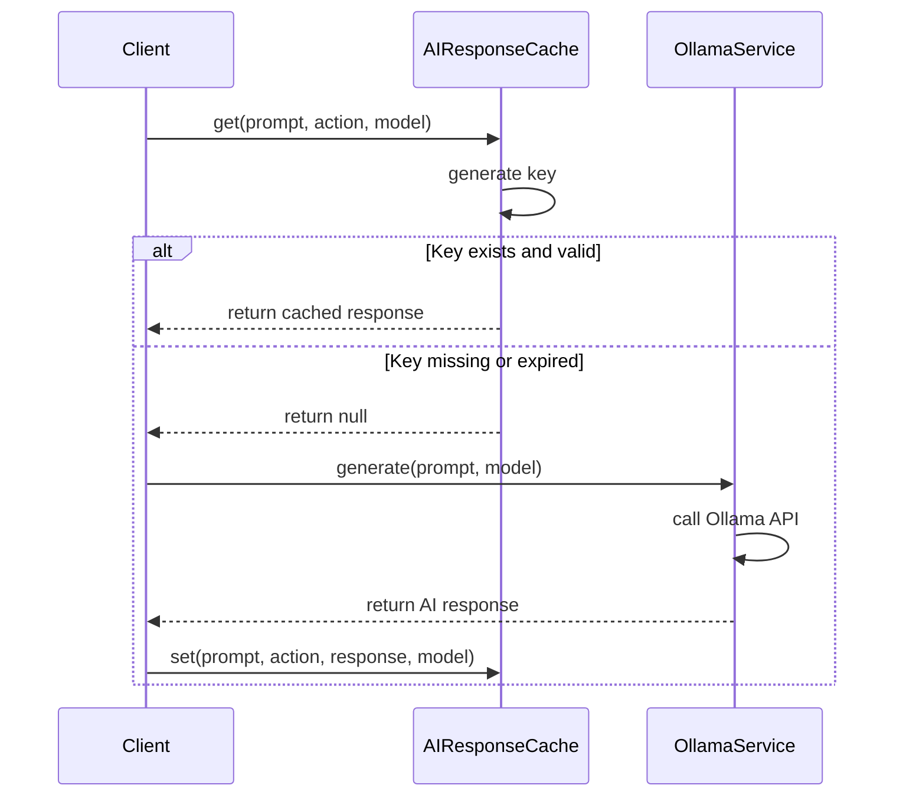
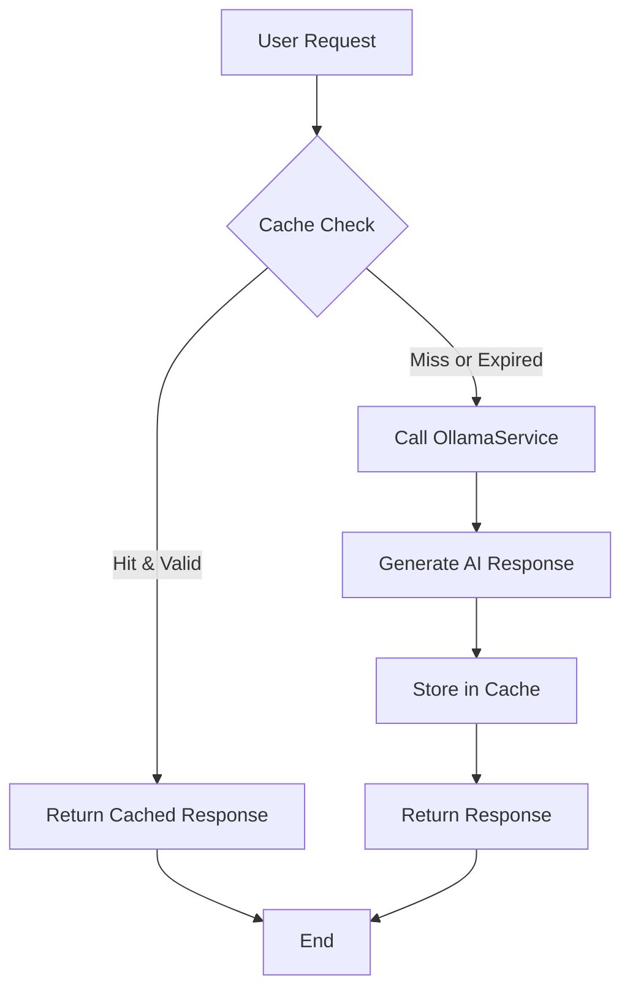

# AI Response Caching

<cite>
**Referenced Files in This Document**   
- [aiResponseCache.ts](file://src/services/aiResponseCache.ts)
- [ollamaService.ts](file://src/services/ollamaService.ts)
</cite>

## Table of Contents
1. [Introduction](#introduction)
2. [Cache Implementation Overview](#cache-implementation-overview)
3. [Cache Key Generation Strategy](#cache-key-generation-strategy)
4. [TTL and Expiration Management](#ttl-and-expiration-management)
5. [Memory Optimization Techniques](#memory-optimization-techniques)
6. [Cache Storage and Retrieval](#cache-storage-and-retrieval)
7. [Cache Invalidation and History](#cache-invalidation-and-history)
8. [Integration with AI Services](#integration-with-ai-services)
9. [Performance Benefits and Consistency](#performance-benefits-and-consistency)
10. [Common Issues and Solutions](#common-issues-and-solutions)
11. [Conclusion](#conclusion)

## Introduction
The AI Response Caching mechanism in LibreOllama optimizes performance by storing and reusing responses from AI service calls. This system reduces redundant processing, improves response times, and enhances user experience during repeated interactions with AI models. The cache is implemented as a singleton instance to ensure global consistency across the application. It supports multiple AI providers and models while maintaining isolation through structured cache keys.

**Section sources**
- [aiResponseCache.ts](file://src/services/aiResponseCache.ts#L1-L75)

## Cache Implementation Overview
The caching system is built around the `AIResponseCache` class, which uses a `Map` to store entries with string keys and structured values. Each cache entry contains the AI response, timestamp, and optional metadata about the model and provider. The system enforces two primary constraints: time-to-live (TTL) of 15 minutes and a maximum of 100 entries. When limits are exceeded, the oldest entries are evicted to make room for new ones.

```mermaid
classDiagram
class CacheEntry {
+string response
+number timestamp
+string? model
+string? provider
}
class AIResponseCache {
-Map<string, CacheEntry> cache
-readonly maxAge : number
-readonly maxEntries : number
+get(prompt : string, action : string, model? : string, provider? : string) : string | null
+set(prompt : string, action : string, response : string, model? : string, provider? : string) : void
+clear() : void
+getHistory(prompt : string) : { action : string; response : string; model? : string; provider? : string }[]
}
AIResponseCache --> CacheEntry : "contains"
```

**Diagram sources**
- [aiResponseCache.ts](file://src/services/aiResponseCache.ts#L1-L75)

**Section sources**
- [aiResponseCache.ts](file://src/services/aiResponseCache.ts#L1-L75)

## Cache Key Generation Strategy
Cache keys are generated using a deterministic combination of four components: action type, model name, provider name, and the input prompt. The `getCacheKey` method formats these into a colon-separated string, ensuring uniqueness across different contexts. Default values ("default") are used when model or provider information is not provided, preventing null or undefined values from breaking the key structure. This approach enables precise targeting of cached responses based on both functional and technical parameters.

**Section sources**
- [aiResponseCache.ts](file://src/services/aiResponseCache.ts#L10-L14)

## TTL and Expiration Management
The cache enforces a TTL of 15 minutes (900,000 milliseconds) for all entries. During each `get` operation, the system checks whether the current time exceeds the stored timestamp by more than this threshold. If an entry has expired, it is automatically removed from the cache and treated as a miss. This lazy expiration strategy avoids background cleanup overhead while ensuring stale data is not served. The fixed TTL balances freshness with performance, making it suitable for dynamic AI-generated content.

**Section sources**
- [aiResponseCache.ts](file://src/services/aiResponseCache.ts#L6-L7)
- [aiResponseCache.ts](file://src/services/aiResponseCache.ts#L16-L25)

## Memory Optimization Techniques
To prevent unbounded memory growth, the cache limits its size to 100 entries. When adding a new entry would exceed this limit, the system identifies and removes the oldest entry based on timestamp. This eviction process uses a sorted array of entries to find the least recently added item efficiently. The combination of size limiting and time-based expiration ensures predictable memory usage even under sustained load. The use of JavaScript's native `Map` provides O(1) average-case performance for lookups and insertions.

**Section sources**
- [aiResponseCache.ts](file://src/services/aiResponseCache.ts#L8-L9)
- [aiResponseCache.ts](file://src/services/aiResponseCache.ts#L27-L38)

## Cache Storage and Retrieval
Storing responses is handled by the `set` method, which constructs a key, checks size constraints, evicts the oldest entry if necessary, and inserts the new value with a current timestamp. Retrieval via the `get` method involves key construction, existence check, and expiration validation before returning the response. Both operations are synchronous and fast, enabling seamless integration into UI workflows without blocking. The cache operates entirely in memory, providing low-latency access to stored AI responses.



**Diagram sources**
- [aiResponseCache.ts](file://src/services/aiResponseCache.ts#L15-L48)
- [ollamaService.ts](file://src/services/ollamaService.ts#L248-L250)

**Section sources**
- [aiResponseCache.ts](file://src/services/aiResponseCache.ts#L15-L48)

## Cache Invalidation and History
The cache supports explicit invalidation through the `clear` method, which removes all entries at once. Individual entries are automatically invalidated upon expiration or when evicted due to size limits. Additionally, the `getHistory` method allows retrieval of all responses associated with a specific prompt, enabling features like response regeneration tracking. This method iterates through all entries, filtering by prompt inclusion, and reconstructs action, model, and provider context from stored metadata.

**Section sources**
- [aiResponseCache.ts](file://src/services/aiResponseCache.ts#L50-L75)

## Integration with AI Services
The caching system integrates closely with the `OllamaService` class, which handles communication with the Ollama AI backend. Before making a request to generate or chat with a model, the application first checks the cache using a relevant action and prompt. If a valid response is found, it is returned immediately without invoking the AI service. Otherwise, the request proceeds to Ollama, and the resulting response is stored in the cache for future use. This pattern reduces API calls and improves responsiveness.



**Diagram sources**
- [aiResponseCache.ts](file://src/services/aiResponseCache.ts#L15-L48)
- [ollamaService.ts](file://src/services/ollamaService.ts#L248-L250)

**Section sources**
- [aiResponseCache.ts](file://src/services/aiResponseCache.ts#L15-L48)
- [ollamaService.ts](file://src/services/ollamaService.ts#L199-L250)

## Performance Benefits and Consistency
Caching AI responses delivers significant performance improvements by eliminating redundant computation and network latency. Users experience faster response times for repeated queries, especially those involving complex reasoning or large models. The system maintains consistency by including model and provider in the cache key, ensuring that changes in backend configuration do not result in incorrect responses. However, developers must be aware that cached responses reflect the state of the AI model at the time of generation, which may differ from current behavior if the model has been updated.

**Section sources**
- [aiResponseCache.ts](file://src/services/aiResponseCache.ts#L1-L75)
- [ollamaService.ts](file://src/services/ollamaService.ts#L199-L250)

## Common Issues and Solutions
A common issue is stale responses due to the 15-minute TTL, which may serve outdated information if the underlying knowledge base has changed. This can be mitigated by adjusting the TTL based on use case requirements or implementing manual cache clearing after significant updates. Cache misses occur when prompts vary slightly (e.g., extra whitespace), so normalizing input before caching can improve hit rates. Memory pressure is managed by the 100-entry limit, but monitoring cache hit ratios can help determine optimal sizing for different deployment scenarios.

**Section sources**
- [aiResponseCache.ts](file://src/services/aiResponseCache.ts#L6-L9)
- [aiResponseCache.ts](file://src/services/aiResponseCache.ts#L16-L25)

## Conclusion
The AI Response Caching mechanism in LibreOllama provides an efficient, memory-conscious solution for improving AI interaction performance. By combining time-based expiration with size-limited storage and intelligent key generation, it strikes a balance between responsiveness and freshness. Its tight integration with the Ollama service ensures seamless operation while giving developers control over caching behavior. With proper understanding of its limitations and configuration options, this system can significantly enhance the user experience in AI-driven applications.