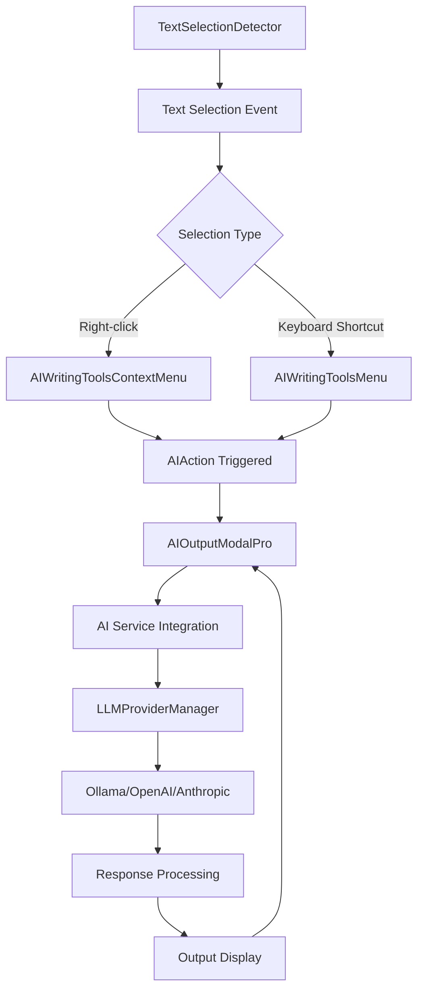
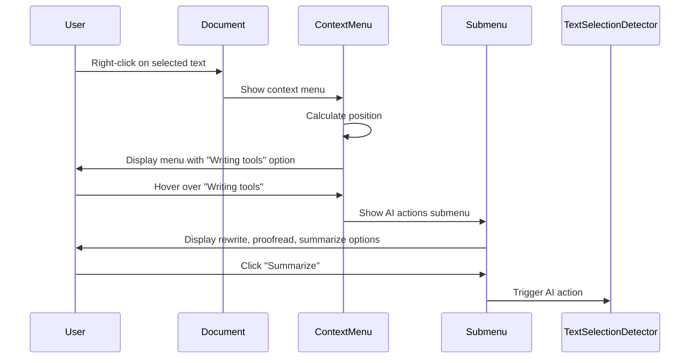
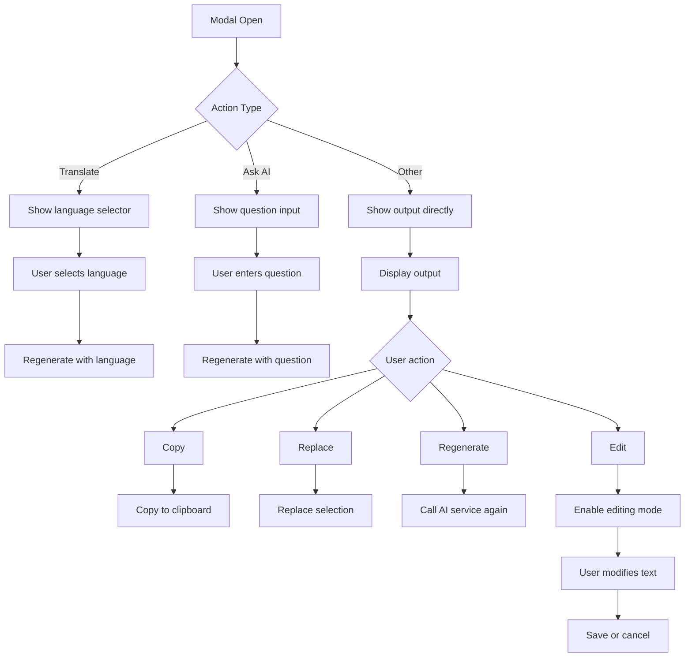
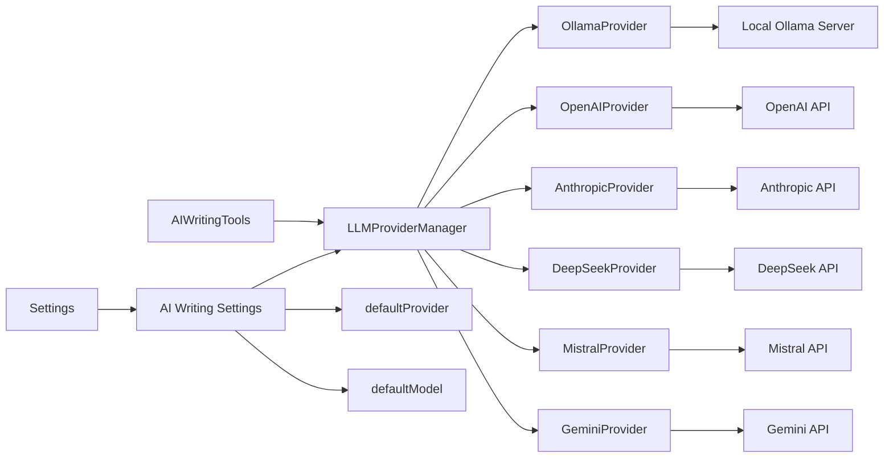
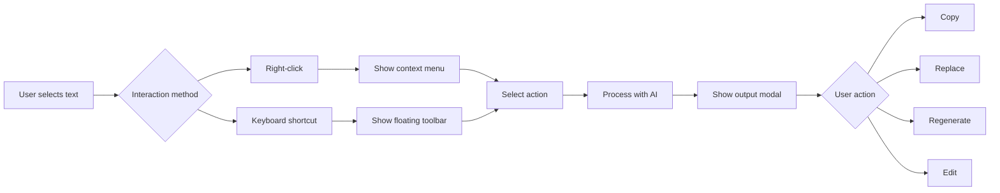
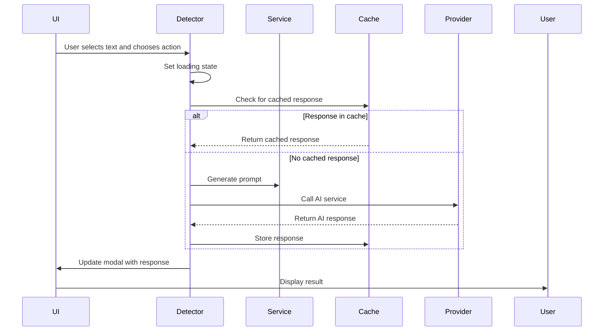

# AI Writing Tools

<cite>
**Referenced Files in This Document**   
- [AIWritingToolsMenu.tsx](file://src/components/ai/AIWritingToolsMenu.tsx)
- [AIWritingToolsContextMenu.tsx](file://src/components/ai/AIWritingToolsContextMenu.tsx)
- [AIOutputModal.tsx](file://src/components/ai/AIOutputModal.tsx)
- [AIOutputModalPro.tsx](file://src/components/ai/AIOutputModalPro.tsx)
- [TextSelectionDetector.tsx](file://src/components/ai/TextSelectionDetector.tsx)
- [useTextSelection.ts](file://src/core/hooks/useTextSelection.ts)
- [aiPromptTemplates.ts](file://src/services/aiPromptTemplates.ts)
- [llmProviders.ts](file://src/services/llmProviders.ts)
- [Settings.tsx](file://src/app/pages/Settings.tsx)
</cite>

## Table of Contents
1. [Introduction](#introduction)
2. [Core Components](#core-components)
3. [Architecture Overview](#architecture-overview)
4. [Detailed Component Analysis](#detailed-component-analysis)
5. [Integration with AI Services](#integration-with-ai-services)
6. [User Interaction Patterns](#user-interaction-patterns)
7. [State Management and Response Handling](#state-management-and-response-handling)
8. [Common Issues and Solutions](#common-issues-and-solutions)
9. [Conclusion](#conclusion)

## Introduction
The AI Writing Tools in LibreOllama provide intelligent text processing capabilities across mail, chat, and task contexts. These tools enable users to rewrite, summarize, translate, and generate content using local and cloud-based AI models. The system integrates seamlessly with the application's UI through context menus, floating toolbars, and modal interfaces that respond to text selection events. This documentation explains the implementation of these features, their integration with AI services, and how developers can extend or customize them.

## Core Components

The AI Writing Tools system consists of several key components that work together to provide writing assistance functionality. These components handle text selection detection, user interface rendering, AI service integration, and response management.

**Section sources**
- [AIWritingToolsMenu.tsx](file://src/components/ai/AIWritingToolsMenu.tsx)
- [AIWritingToolsContextMenu.tsx](file://src/components/ai/AIWritingToolsContextMenu.tsx)
- [AIOutputModalPro.tsx](file://src/components/ai/AIOutputModalPro.tsx)
- [TextSelectionDetector.tsx](file://src/components/ai/TextSelectionDetector.tsx)

## Architecture Overview

The AI Writing Tools follow a modular architecture that separates concerns between UI presentation, text selection handling, and AI service integration. The system uses a detector component to monitor text selection events, which then triggers appropriate UI components based on user interaction patterns.



**Diagram sources**
- [TextSelectionDetector.tsx](file://src/components/ai/TextSelectionDetector.tsx)
- [AIWritingToolsContextMenu.tsx](file://src/components/ai/AIWritingToolsContextMenu.tsx)
- [AIWritingToolsMenu.tsx](file://src/components/ai/AIWritingToolsMenu.tsx)
- [AIOutputModalPro.tsx](file://src/components/ai/AIOutputModalPro.tsx)

## Detailed Component Analysis

### AI Writing Tools Menu
The AI Writing Tools Menu provides a floating toolbar that appears when users select text and press the keyboard shortcut (Cmd/Ctrl + J). The menu offers quick access to common writing actions organized into categories such as rephrase, edit, transform, and create.

The component uses React's `createPortal` to render outside the normal component hierarchy, ensuring it appears above other UI elements. It calculates optimal positioning based on the selected text's bounding rectangle, adjusting placement to prevent overflow from screen boundaries.

```mermaid
classDiagram
class AIWritingToolsMenu {
+selection : TextSelection
+onClose() : void
+onAction(action : AIAction, text : string) : void
-position : {top : number, left : number}
-isPositioned : boolean
-activeCategory : string | null
-aiQuestion : string
+handleAction(action : AIAction) : void
+calculatePosition() : void
}
AIWritingToolsMenu --> TextSelectionDetector : "triggered by"
AIWritingToolsMenu --> AIOutputModalPro : "opens"
```

**Diagram sources**
- [AIWritingToolsMenu.tsx](file://src/components/ai/AIWritingToolsMenu.tsx)

**Section sources**
- [AIWritingToolsMenu.tsx](file://src/components/ai/AIWritingToolsMenu.tsx)

### AI Writing Tools Context Menu
The context menu provides an alternative interface for accessing AI writing tools, activated by right-clicking on selected text. It follows standard context menu conventions with submenu navigation for AI writing tools.

The implementation includes sophisticated positioning logic that ensures the menu and its submenus remain within viewport boundaries. It uses a "hover bridge" technique to maintain submenu visibility during mouse transitions between menu items.



**Diagram sources**
- [AIWritingToolsContextMenu.tsx](file://src/components/ai/AIWritingToolsContextMenu.tsx)

**Section sources**
- [AIWritingToolsContextMenu.tsx](file://src/components/ai/AIWritingToolsContextMenu.tsx)

### AI Output Modal
The AI Output Modal displays the results of AI processing operations and provides controls for managing the output. The Pro version (AIOutputModalPro) includes enhanced features such as output editing, translation language selection, and detailed metrics.

The modal supports multiple interaction patterns including copying, replacing, inserting, and regenerating responses. It preserves state between operations, allowing users to refine AI outputs through multiple iterations.



**Diagram sources**
- [AIOutputModalPro.tsx](file://src/components/ai/AIOutputModalPro.tsx)

**Section sources**
- [AIOutputModalPro.tsx](file://src/components/ai/AIOutputModalPro.tsx)

### Text Selection Detector
The TextSelectionDetector is a higher-order component that wraps application content and monitors text selection events. It serves as the central coordinator for AI writing tools, detecting selections and triggering appropriate UI components.

The component handles both keyboard shortcuts and right-click events, with logic to disable itself on pages that have their own text editing interfaces (like the Notes page). It manages the state flow between selection, AI processing, and output display.

```mermaid
classDiagram
class TextSelectionDetector {
+children : ReactNode
+disabled : boolean
-showMenu : boolean
-menuPosition : {top : number, left : number}
-showModal : boolean
-modalData : ModalData
-providerManagerRef : Ref<LLMProviderManager>
+handleAIAction(action : AIAction, customQuestion? : string) : Promise<void>
+processWithAI(text : string, action : AIAction, options? : any) : Promise<void>
+createTaskFromText(text : string) : Promise<void>
+createNoteFromText(text : string) : Promise<void>
+navigateToChatWithContext(text : string) : void
+handleRegenerate(options? : any) : Promise<void>
+handleReplace(text : string) : void
}
TextSelectionDetector --> useTextSelection : "uses hook"
TextSelectionDetector --> settingsStore : "reads AI settings"
TextSelectionDetector --> chatStore : "accesses chat state"
TextSelectionDetector --> LLMProviderManager : "delegates AI calls"
TextSelectionDetector --> aiResponseCache : "uses caching"
```

**Diagram sources**
- [TextSelectionDetector.tsx](file://src/components/ai/TextSelectionDetector.tsx)

**Section sources**
- [TextSelectionDetector.tsx](file://src/components/ai/TextSelectionDetector.tsx)

## Integration with AI Services

The AI Writing Tools integrate with multiple AI providers through a unified interface. The system supports Ollama, OpenAI, Anthropic, DeepSeek, Mistral, and Google Gemini, allowing users to choose their preferred provider in settings.



The integration uses a provider manager pattern with deferred initialization to optimize performance. API keys are managed through the settings store, and providers are configured based on user preferences. The system includes response caching to avoid redundant AI calls for identical requests.

**Section sources**
- [llmProviders.ts](file://src/services/llmProviders.ts)
- [Settings.tsx](file://src/app/pages/Settings.tsx)
- [TextSelectionDetector.tsx](file://src/components/ai/TextSelectionDetector.tsx)

## User Interaction Patterns

The AI Writing Tools support multiple interaction patterns to accommodate different user preferences:

1. **Right-click context menu**: Accessible by right-clicking on selected text, this pattern follows standard desktop application conventions.
2. **Keyboard shortcut (Cmd/Ctrl + J)**: Provides quick access without requiring mouse navigation.
3. **Direct action buttons**: The AI Output Modal includes buttons for common operations like copy, replace, and regenerate.

The system intelligently disables certain features based on context. For example, the Notes page disables the AI writing tools since BlockNote (the editor used) has its own integrated AI functionality.



**Section sources**
- [TextSelectionDetector.tsx](file://src/components/ai/TextSelectionDetector.tsx)
- [AIWritingToolsContextMenu.tsx](file://src/components/ai/AIWritingToolsContextMenu.tsx)
- [AIWritingToolsMenu.tsx](file://src/components/ai/AIWritingToolsMenu.tsx)

## State Management and Response Handling

The AI Writing Tools use a combination of React state, context, and external stores to manage application state. The system maintains state for the current selection, active UI components, AI processing status, and user preferences.

Response handling follows a consistent pattern across all AI actions:
1. Show loading state in the output modal
2. Generate appropriate prompt based on action type and selected text
3. Call AI service with proper system prompts
4. Process and format response
5. Cache response for future use
6. Display result in modal

The system includes special handling for list-based responses, ensuring consistent bullet point formatting regardless of the AI model's output format.



**Section sources**
- [TextSelectionDetector.tsx](file://src/components/ai/TextSelectionDetector.tsx)
- [aiResponseCache.ts](file://src/services/aiResponseCache.ts)
- [aiPromptTemplates.ts](file://src/services/aiPromptTemplates.ts)

## Common Issues and Solutions

### Modal Positioning
The AI writing tools face challenges with modal positioning, particularly when dealing with scrolling content or viewport boundaries. The implementation addresses this through:

- Dynamic position calculation based on text selection rectangle
- Boundary detection to prevent overflow from screen edges
- ResizeObserver to handle dynamic size changes
- Fallback positioning when exact selection metrics are unavailable

### Text Injection Conflicts
When multiple text editing systems coexist (like the Notes editor), conflicts can occur. The solution implemented is context-aware disabling:

- Detection of page context (e.g., /notes route)
- Conditional rendering of AI tools based on context
- Prevention of duplicate functionality

### Performance Optimization
The system includes several performance optimizations:

- Response caching to avoid redundant AI calls
- Deferred provider initialization to reduce startup time
- Debounced state updates to prevent excessive re-renders
- Efficient event handling with proper cleanup

### Cross-Provider Compatibility
Different AI providers have varying response formats and capabilities. The system handles this through:

- Standardized system prompts for consistent output
- Post-processing of responses (especially for list formatting)
- Model-specific prompt templates
- Graceful error handling when providers are unavailable

**Section sources**
- [TextSelectionDetector.tsx](file://src/components/ai/TextSelectionDetector.tsx)
- [AIOutputModalPro.tsx](file://src/components/ai/AIOutputModalPro.tsx)
- [AIWritingToolsMenu.tsx](file://src/components/ai/AIWritingToolsMenu.tsx)

## Conclusion
The AI Writing Tools in LibreOllama provide a comprehensive system for intelligent text processing across multiple contexts. The architecture balances usability with technical sophistication, offering users intuitive interfaces while maintaining flexibility for developers. By following established design patterns and addressing common challenges, the system delivers reliable AI-powered writing assistance that can be easily extended or customized.