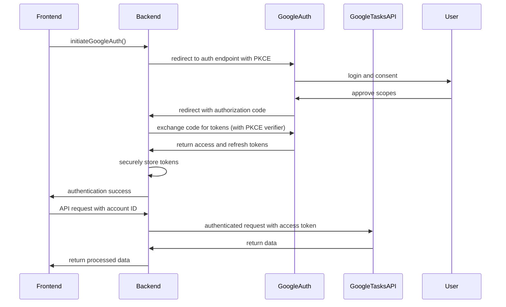
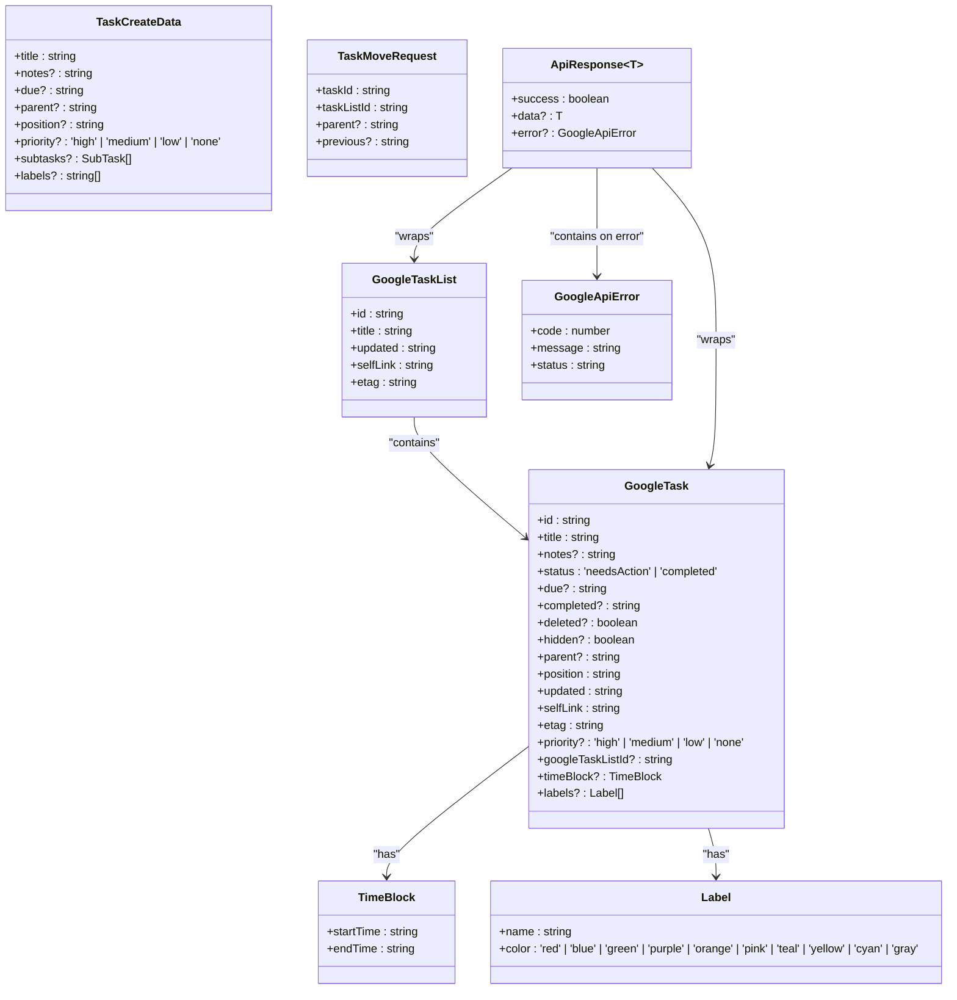
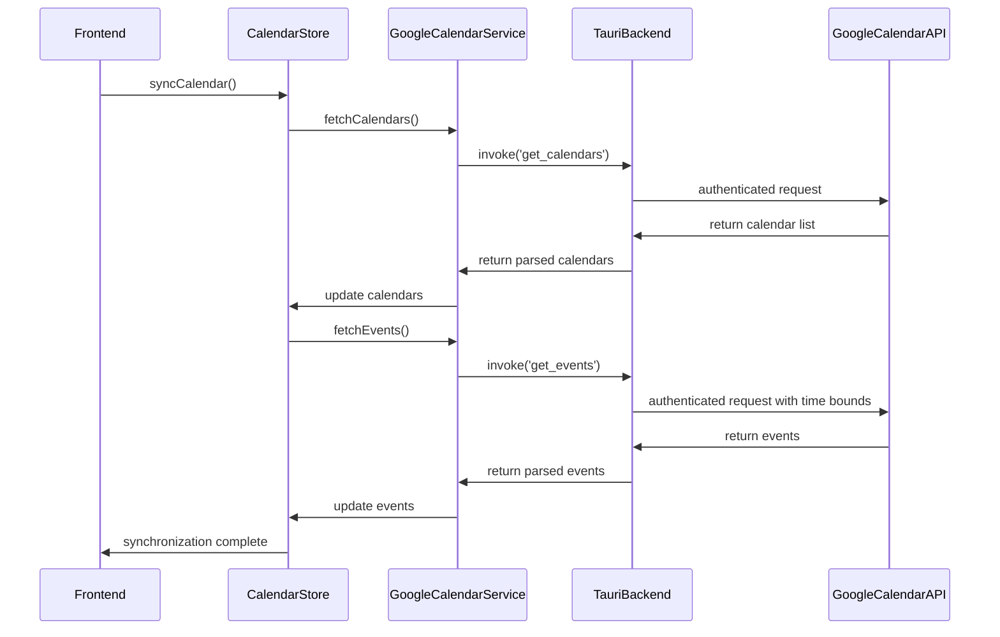
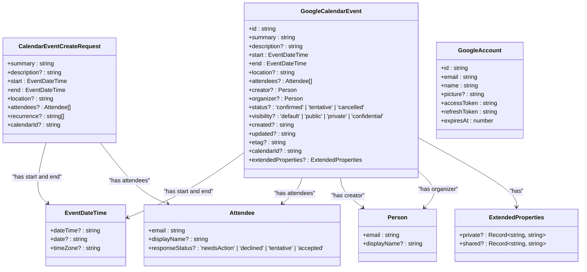
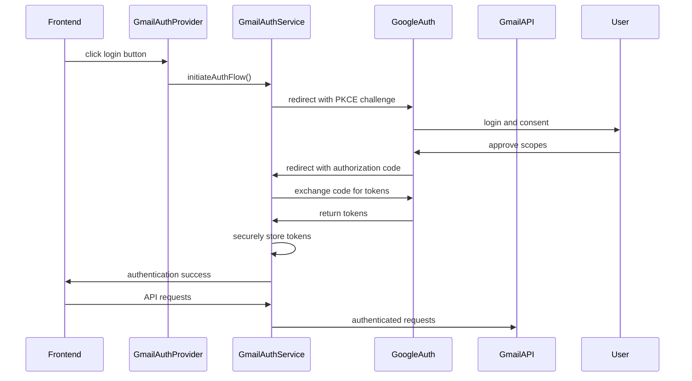
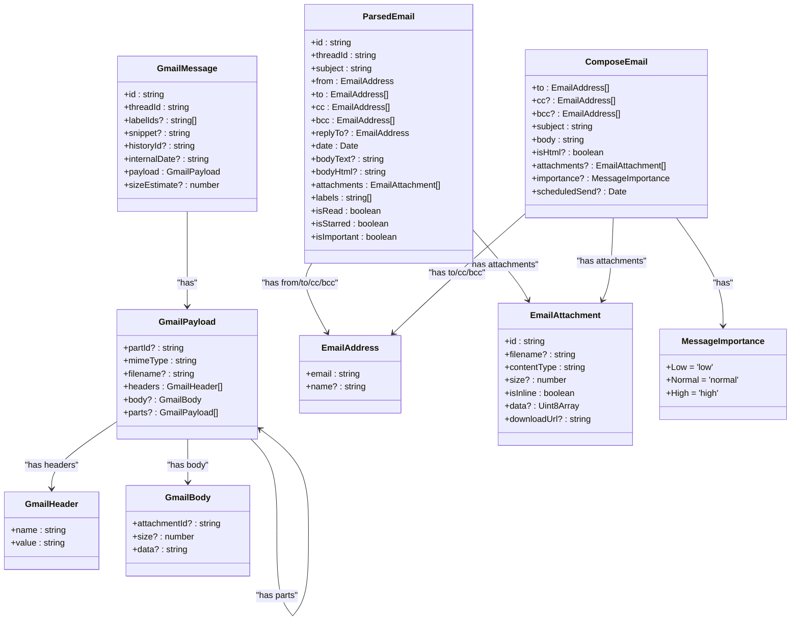
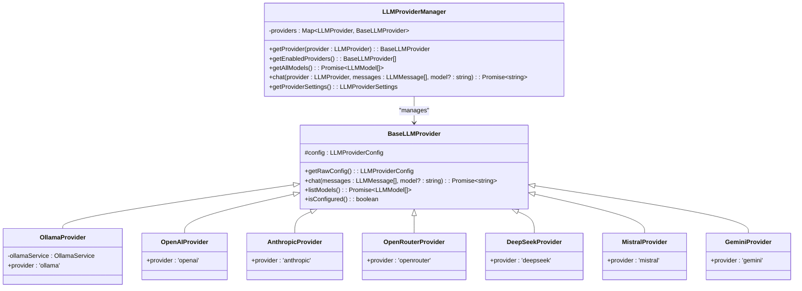
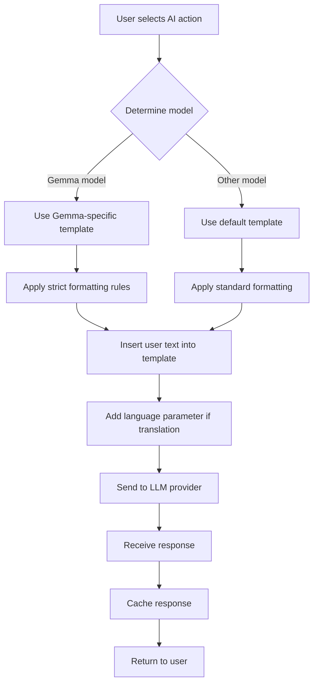
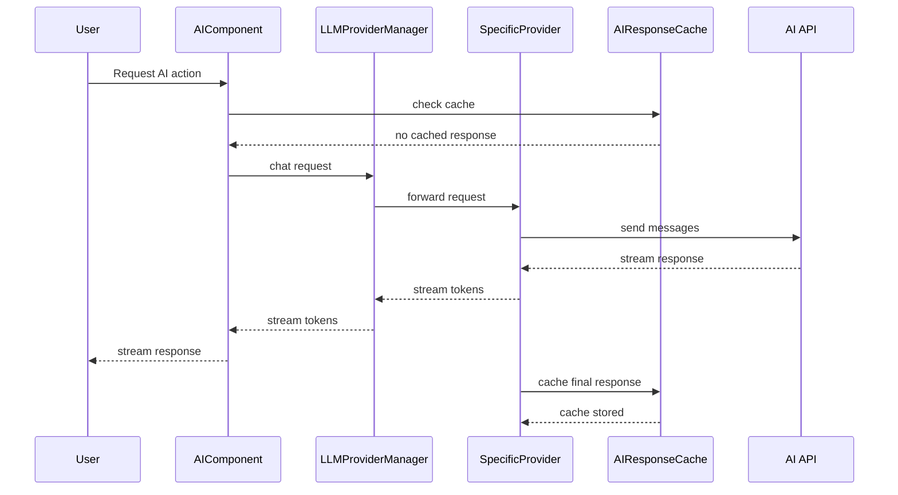

# API Integration

<cite>
**Referenced Files in This Document**   
- [googleTasksApi.ts](file://src/api/googleTasksApi.ts)
- [googleTasksService.ts](file://src/services/google/googleTasksService.ts)
- [google.ts](file://src/types/google.ts)
- [googleCalendarService.ts](file://src/services/google/googleCalendarService.ts)
- [googleCalendarStore.ts](file://src/stores/googleCalendarStore.ts)
- [api.rs](file://src-tauri/src/commands/tasks/api.rs)
- [calendar/api.rs](file://src-tauri/src/commands/calendar/api.rs)
- [gmailAuthService.ts](file://src/services/gmail/GmailAuthService.ts)
- [auth.types.ts](file://src/types/gmail/auth.types.ts)
- [email.types.ts](file://src/types/gmail/email.types.ts)
- [llmProviders.ts](file://src/services/llmProviders.ts)
- [aiPromptTemplates.ts](file://src/services/aiPromptTemplates.ts)
- [aiResponseCache.ts](file://src/services/aiResponseCache.ts)
</cite>

## Table of Contents
1. [Introduction](#introduction)
2. [Google Tasks API Integration](#google-tasks-api-integration)
3. [Google Calendar API Integration](#google-calendar-api-integration)
4. [Gmail API Integration](#gmail-api-integration)
5. [AI/LLM Provider APIs](#ai-llm-provider-apis)
6. [Client Implementation Guidelines](#client-implementation-guidelines)
7. [Performance Optimization Tips](#performance-optimization-tips)
8. [Conclusion](#conclusion)

## Introduction
This document provides comprehensive API documentation for external integrations in LibreOllama. It covers Google Tasks, Google Calendar, Gmail, and AI/LLM provider APIs with detailed specifications on authentication, endpoints, request/response schemas, error handling, and usage patterns. The integration architecture uses a Tauri-based backend to securely manage OAuth2 credentials and API requests, with frontend services abstracting the complexity for client consumption.

## Google Tasks API Integration

### Authentication Flow
The Google Tasks API integration uses OAuth2 with PKCE (Proof Key for Code Exchange) for secure authentication. Users authenticate through Google's authorization endpoint with the scope `https://www.googleapis.com/auth/tasks`. The Tauri backend securely stores tokens using encrypted local storage, with automatic refresh handling when access tokens expire.

**Diagram sources**
- [googleTasksService.ts](file://src/services/google/googleTasksService.ts#L0-L56)
- [auth.types.ts](file://src/types/gmail/auth.types.ts#L0-L168)

### Endpoint Specifications
The Google Tasks API integration provides endpoints for task list and task management through both direct gapi calls and Tauri command wrappers.

| HTTP Method | URL Pattern | Description | Authentication |
|-------------|-----------|-------------|----------------|
| GET | /tasklists | List all task lists | OAuth2 Bearer Token |
| GET | /tasklists/{tasklistId}/tasks | List tasks in a task list | OAuth2 Bearer Token |
| POST | /tasklists | Create a new task list | OAuth2 Bearer Token |
| POST | /tasklists/{tasklistId}/tasks | Create a new task | OAuth2 Bearer Token |
| PUT | /tasklists/{tasklistId}/tasks/{taskId} | Update a task | OAuth2 Bearer Token |
| DELETE | /tasklists/{tasklistId}/tasks/{taskId} | Delete a task | OAuth2 Bearer Token |
| PATCH | /tasks/move | Move a task within or between lists | OAuth2 Bearer Token |

### Request/Response Schemas
Key data structures for Google Tasks integration:

**Diagram sources**
- [google.ts](file://src/types/google.ts#L52-L115)
- [googleTasksApi.ts](file://src/api/googleTasksApi.ts#L0-L56)

### Error Handling
The Google Tasks API integration implements comprehensive error handling with retry logic and user-friendly error messages. Common error patterns include:

- Token expiration (401): Automatically refreshes tokens and retries the request
- Rate limiting (429): Implements exponential backoff with jitter
- Network errors: Retries with progressive delays
- Validation errors: Returns descriptive messages for client handling

Error responses follow the `ApiResponse` pattern with structured error information including code, message, and status.

**Section sources**
- [googleTasksService.ts](file://src/services/google/googleTasksService.ts#L0-L56)
- [googleTasksApi.ts](file://src/api/googleTasksApi.ts#L58-L163)

## Google Calendar API Integration

### Event Synchronization
The Google Calendar integration provides bidirectional synchronization of events between LibreOllama and Google Calendar. Events are synchronized using the Calendar API's watch mechanism for real-time updates, with periodic polling as a fallback.

**Diagram sources**
- [googleCalendarStore.ts](file://src/stores/googleCalendarStore.ts#L98-L168)
- [googleCalendarService.ts](file://src/services/google/googleCalendarService.ts#L49-L97)

### Calendar Management
The integration supports full calendar management capabilities including creating, updating, and deleting events, as well as managing calendar metadata.

**Diagram sources**
- [google.ts](file://src/types/google.ts#L0-L224)
- [calendar/api.rs](file://src-tauri/src/commands/calendar/api.rs#L210-L232)

### Real-time Updates
Real-time updates are implemented using Google Calendar's push notifications (watch/stop). The Tauri backend establishes a watch channel for each calendar, receiving push notifications when events change. These notifications trigger immediate synchronization to ensure the UI reflects the latest state.

**Section sources**
- [googleCalendarService.ts](file://src/services/google/googleCalendarService.ts#L99-L165)
- [googleCalendarStore.ts](file://src/stores/googleCalendarStore.ts#L238-L262)

## Gmail API Integration

### Authentication
The Gmail API integration uses OAuth2 with PKCE for secure authentication, following Google's security best practices. The integration requests the following scopes:

- `https://www.googleapis.com/auth/gmail.readonly`
- `https://www.googleapis.com/auth/gmail.modify`
- `https://www.googleapis.com/auth/gmail.compose`
- `https://www.googleapis.com/auth/userinfo.email`
- `https://www.googleapis.com/auth/userinfo.profile`
- `https://www.googleapis.com/auth/tasks`

**Diagram sources**
- [auth.types.ts](file://src/types/gmail/auth.types.ts#L0-L168)
- [GmailAuthService.ts](file://src/services/gmail/GmailAuthService.ts#L183-L215)

### Email Retrieval and Sending
The Gmail integration provides comprehensive email functionality including message retrieval, composition, and management.

**Diagram sources**
- [email.types.ts](file://src/types/gmail/email.types.ts#L0-L342)
- [GmailAuthService.ts](file://src/services/gmail/GmailAuthService.ts#L183-L215)

### Attachment Handling
Attachment handling follows Google's multipart message format. When sending emails with attachments, files are base64-encoded and included in the message payload with appropriate MIME types. When retrieving emails, attachments are downloaded on-demand to minimize bandwidth usage.

**Section sources**
- [email.types.ts](file://src/types/gmail/email.types.ts#L0-L342)
- [gmailErrorHandler.ts](file://src/features/mail/services/gmailErrorHandler.ts#L395-L445)

## AI/LLM Provider APIs

### Supported Providers
LibreOllama integrates with multiple AI/LLM providers through a unified interface:

- Ollama (local)
- OpenAI
- Anthropic
- OpenRouter
- DeepSeek
- Mistral
- Gemini

**Diagram sources**
- [llmProviders.ts](file://src/services/llmProviders.ts#L0-L522)
- [settingsStore.ts](file://src/stores/settingsStore.ts#L541-L572)

### Prompt Templates
The system uses model-specific prompt templates to optimize output quality. Different models have different strengths and require tailored prompting strategies.

**Diagram sources**
- [aiPromptTemplates.ts](file://src/services/aiPromptTemplates.ts#L0-L202)
- [aiResponseCache.ts](file://src/services/aiResponseCache.ts#L0-L75)

### Response Handling and Streaming
Response handling includes caching, error recovery, and streaming capabilities where supported by the provider. The system implements a response cache with a 15-minute TTL to avoid redundant API calls for identical requests.

**Diagram sources**
- [llmProviders.ts](file://src/services/llmProviders.ts#L104-L140)
- [aiResponseCache.ts](file://src/services/aiResponseCache.ts#L0-L75)

## Client Implementation Guidelines
When implementing clients for LibreOllama's API integrations, follow these guidelines:

1. **Authentication**: Always use the provided authentication flow rather than direct OAuth2 implementation. The Tauri backend handles token management and refresh.
2. **Error Handling**: Implement retry logic with exponential backoff for rate limiting (429) and network errors.
3. **Caching**: Leverage the built-in response caching to minimize API calls and improve performance.
4. **Rate Limiting**: Respect Google API rate limits (QPS) and implement client-side throttling when needed.
5. **State Management**: Use the provided stores (e.g., googleCalendarStore, unifiedTaskStore) for consistent state management.
6. **Type Safety**: Use the provided TypeScript interfaces for type-safe interactions with the APIs.

## Performance Optimization Tips
To optimize performance when consuming LibreOllama's API integrations:

1. **Batch Operations**: Use batch endpoints when available to reduce round trips.
2. **Selective Field Retrieval**: Request only the fields needed using API parameters.
3. **Caching Strategy**: Implement client-side caching with appropriate TTLs based on data volatility.
4. **Connection Pooling**: Maintain persistent connections to reduce handshake overhead.
5. **Prefetching**: Anticipate user actions and prefetch likely needed data.
6. **Lazy Loading**: Load data on-demand rather than upfront to reduce initial load time.
7. **Compression**: Enable gzip compression for API responses when possible.
8. **Web Workers**: Offload processing to web workers to keep the UI responsive.

## Conclusion
LibreOllama's API integrations provide robust, secure, and efficient access to Google services and multiple AI/LLM providers. The architecture balances functionality with security, using Tauri to manage sensitive credentials while providing a clean, consistent interface for client applications. By following the documented patterns and best practices, developers can create powerful integrations that enhance productivity and user experience.