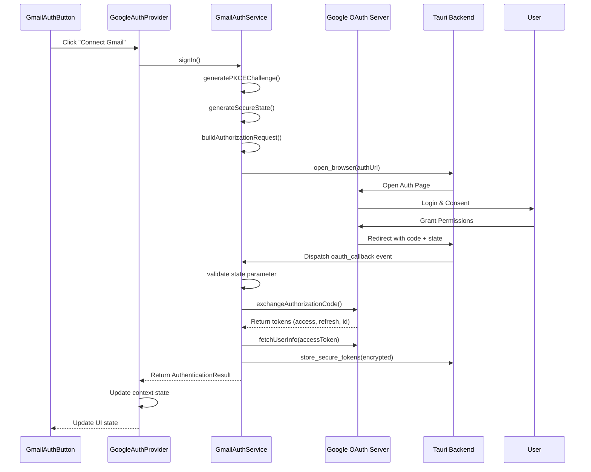
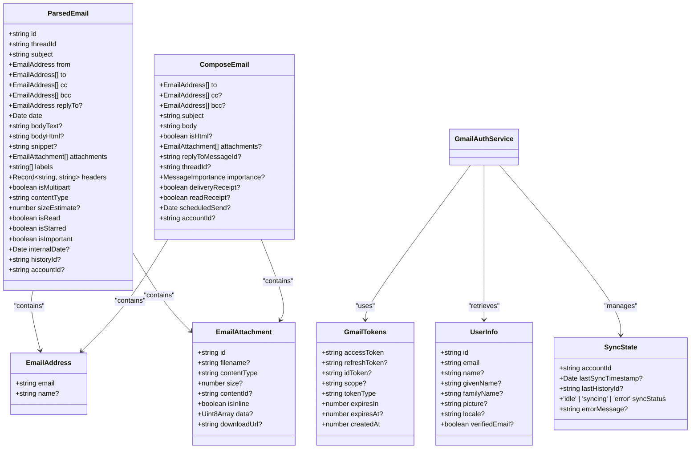
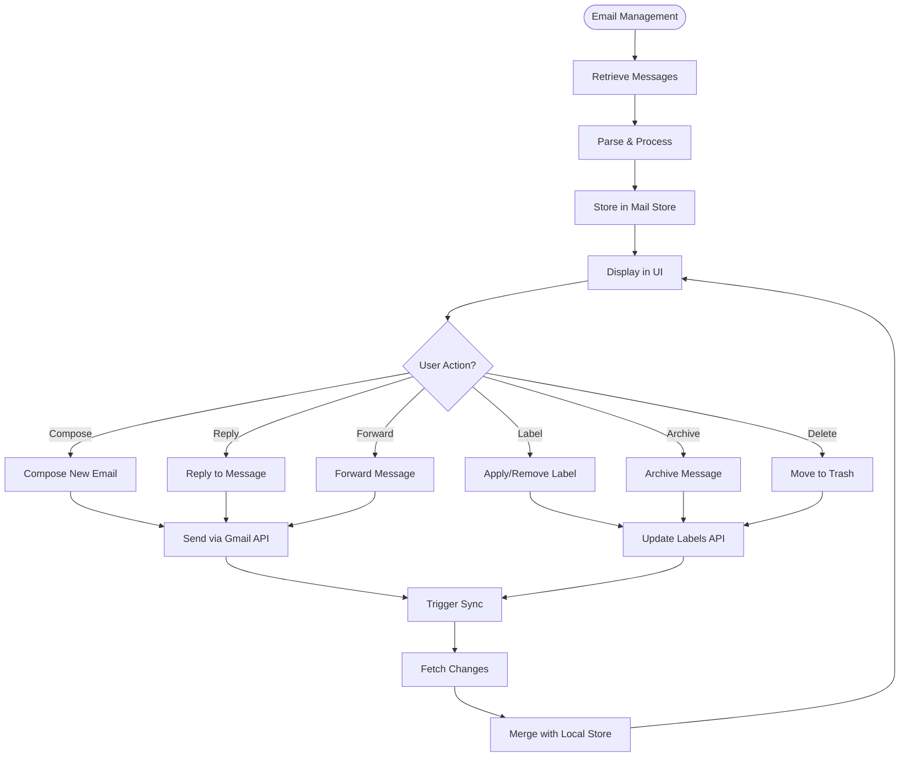
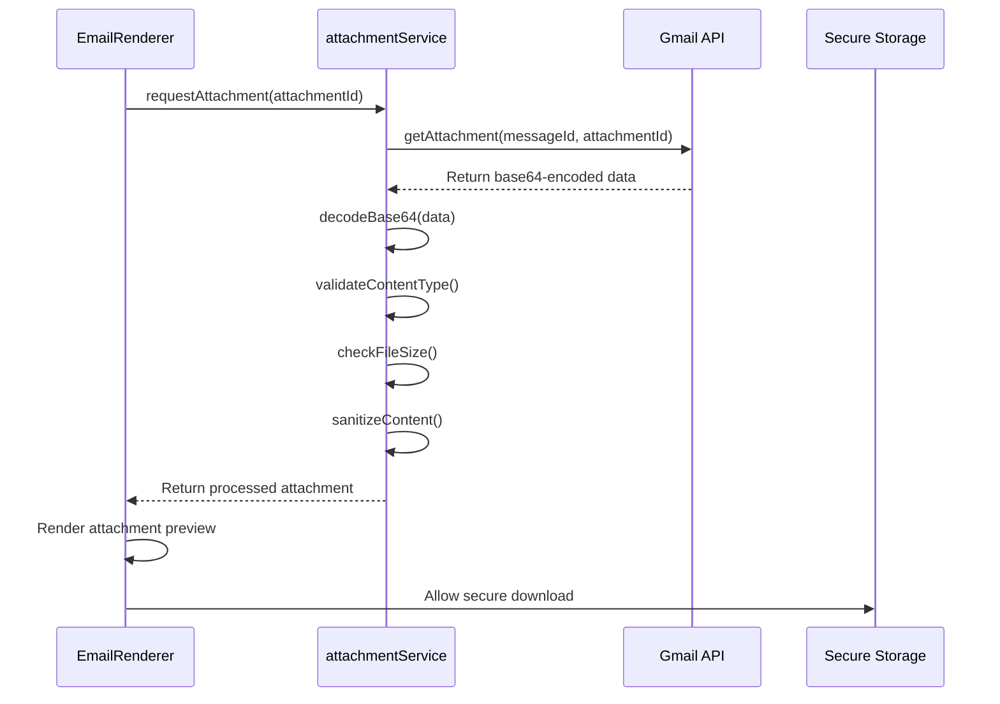
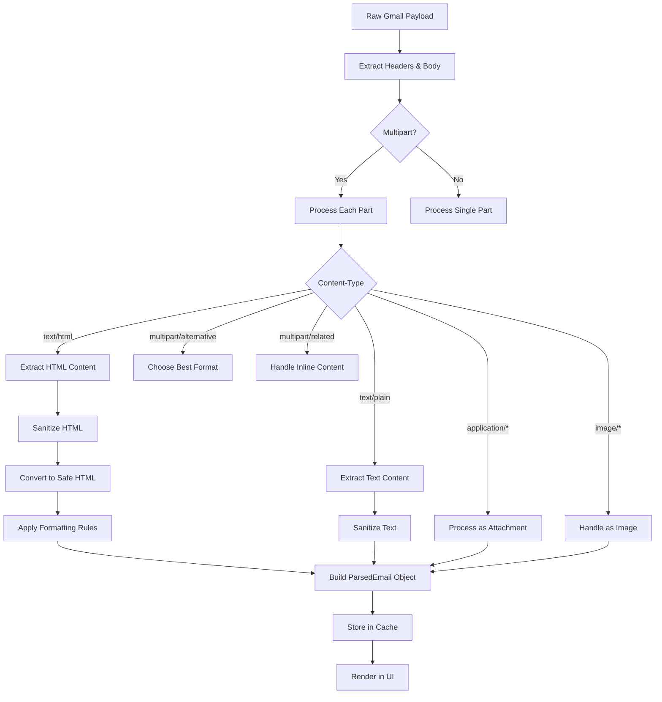
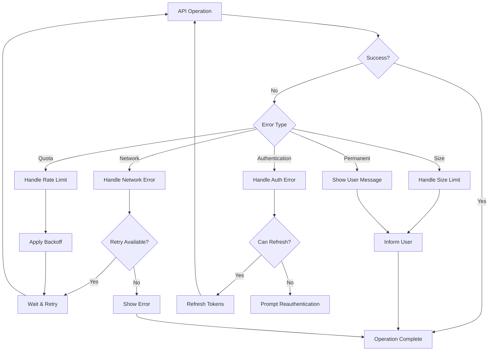

# Gmail API Integration

<cite>
**Referenced Files in This Document**   
- [GmailAuthService.ts](file://src/services/gmail/GmailAuthService.ts)
- [auth.types.ts](file://src/types/gmail/auth.types.ts)
- [email.types.ts](file://src/types/gmail/email.types.ts)
- [GmailAuthButton.tsx](file://src/components/gmail/GmailAuthButton.tsx)
- [GoogleAuthProvider.tsx](file://src/components/gmail/GoogleAuthProvider.tsx)
</cite>

## Table of Contents
1. [Introduction](#introduction)
2. [Authentication Flow](#authentication-flow)
3. [Core Data Structures](#core-data-structures)
4. [Email Management](#email-management)
5. [Attachment Handling](#attachment-handling)
6. [Email Parsing](#email-parsing)
7. [Error Handling](#error-handling)
8. [Security Considerations](#security-considerations)
9. [Conclusion](#conclusion)

## Introduction
This document provides comprehensive documentation for the Gmail API integration within LibreOllama. The integration enables secure email synchronization, message retrieval, composition, and label management through Google's OAuth 2.0 authentication and RESTful APIs. The implementation emphasizes security, performance, and user experience, supporting both read and write operations with proper scope management.

The system is designed to handle multi-account support, real-time synchronization, and secure handling of sensitive email data. It leverages modern web standards including PKCE for OAuth security, secure token storage via Tauri's native capabilities, and efficient data processing for large mailboxes.

## Authentication Flow

The Gmail API integration implements a secure OAuth 2.0 authentication flow with PKCE (Proof Key for Code Exchange) to ensure robust security during user authorization. This flow prevents authorization code interception attacks and ensures that only legitimate clients can exchange authorization codes for access tokens.

**Diagram sources**
- [GmailAuthService.ts](file://src/services/gmail/GmailAuthService.ts#L150-L300)
- [GoogleAuthProvider.tsx](file://src/components/gmail/GoogleAuthProvider.tsx#L50-L100)

**Section sources**
- [GmailAuthService.ts](file://src/services/gmail/GmailAuthService.ts)
- [GoogleAuthProvider.tsx](file://src/components/gmail/GoogleAuthProvider.tsx)

### OAuth 2.0 with PKCE
The authentication process uses the Authorization Code Flow with PKCE, which is recommended for public clients such as desktop and mobile applications. The flow includes:

- **PKCE Challenge Generation**: A cryptographically random `code_verifier` is created and transformed into a `code_challenge` using SHA-256 hashing.
- **State Parameter**: A secure random state parameter is generated to prevent CSRF attacks.
- **Secure Token Storage**: Access and refresh tokens are encrypted using Tauri's secure storage mechanisms before being persisted locally.
- **Token Refresh**: When access tokens expire, the service automatically uses refresh tokens to obtain new access tokens without requiring user re-authentication.

The default scopes requested during authentication include:
- `https://www.googleapis.com/auth/gmail.readonly` - Read mailbox
- `https://www.googleapis.com/auth/gmail.modify` - Manage labels and modify messages
- `https://www.googleapis.com/auth/gmail.compose` - Send messages
- `https://www.googleapis.com/auth/userinfo.email` - Access user email
- `https://www.googleapis.com/auth/userinfo.profile` - Access user profile
- `https://www.googleapis.com/auth/tasks` - Access Google Tasks

## Core Data Structures

The Gmail integration defines comprehensive TypeScript interfaces to represent email data, authentication state, and API responses. These types ensure type safety across the application and provide clear documentation of data structures.

**Diagram sources**
- [auth.types.ts](file://src/types/gmail/auth.types.ts#L20-L150)
- [email.types.ts](file://src/types/gmail/email.types.ts#L50-L300)

**Section sources**
- [auth.types.ts](file://src/types/gmail/auth.types.ts)
- [email.types.ts](file://src/types/gmail/email.types.ts)

### Key Interfaces
- **GmailTokens**: Represents OAuth 2.0 tokens with expiration tracking and creation timestamp.
- **UserInfo**: Contains user profile information retrieved from Google's UserInfo endpoint.
- **ParsedEmail**: Fully processed email with structured headers, body content, and attachment metadata.
- **EmailAttachment**: Describes email attachments with content type, size, and inline status.
- **ComposeEmail**: Structure for composing new messages with recipients, subject, body, and attachments.
- **SyncState**: Tracks synchronization status for each connected account.

## Email Management

The Gmail API integration provides comprehensive functionality for retrieving, organizing, and managing emails through a well-defined service layer. The system supports message retrieval, threading, label management, search, and batch operations.

### Message Retrieval
Messages are retrieved using the Gmail API's `users.messages.list` and `users.messages.get` endpoints. The integration supports pagination via `nextPageToken` and efficient filtering through search queries.

### Threading
Email threads are reconstructed by grouping messages with the same `threadId`. Each thread maintains participant lists, subject consistency, and chronological ordering of messages.

### Label Management
The system supports both system labels (INBOX, SENT, STARRED, etc.) and custom user-defined labels. Labels can be applied, removed, and managed through dedicated API endpoints.

### Search Functionality
Advanced search capabilities are implemented using Gmail's search operators, allowing users to filter messages by:
- Sender/recipient
- Subject keywords
- Date ranges
- Attachment presence
- Size constraints
- Label membership
- Read/unread/starred status

**Diagram sources**
- [email.types.ts](file://src/types/gmail/email.types.ts#L150-L250)
- [GmailAuthService.ts](file://src/services/gmail/GmailAuthService.ts#L350-L400)

**Section sources**
- [email.types.ts](file://src/types/gmail/email.types.ts)

## Attachment Handling

The integration provides secure and efficient handling of email attachments, supporting both download and upload operations with proper MIME type processing and security validation.

### Secure Download Mechanism
Attachments are downloaded through a secure proxy service that:
- Validates attachment size against configurable limits
- Scans for potentially dangerous file types
- Applies content security policies
- Provides progress tracking for large files

### Upload and Composition
When sending emails with attachments:
- Files are processed client-side before upload
- MIME types are properly encoded
- Base64 encoding is used for transmission
- Size limits are enforced before API calls

### Inline Images
The system properly handles inline images embedded in HTML emails by:
- Extracting `contentId` references
- Mapping CID URLs to attachment data
- Rendering images securely within email content
- Providing fallback mechanisms for blocked images

**Diagram sources**
- [email.types.ts](file://src/types/gmail/email.types.ts#L100-L130)
- [attachmentService.ts](file://src/features/mail/services/attachmentService.ts)

**Section sources**
- [email.types.ts](file://src/types/gmail/email.types.ts)

## Email Parsing

The email parsing functionality transforms raw Gmail API responses into structured, user-friendly content that can be safely rendered in the application UI.

### HTML Content Processing
Incoming HTML emails are processed through a multi-stage sanitization pipeline that:
- Removes potentially malicious scripts and event handlers
- Converts relative URLs to absolute where appropriate
- Preserves formatting while ensuring security
- Handles CSS styling in a sandboxed manner

### Quoted Text Identification
The parser identifies and styles quoted text from previous messages using heuristics that detect common quoting patterns (e.g., "> " prefixes, nested quotes).

### Inline Image Handling
As mentioned in attachment handling, inline images referenced via `cid:` URLs are properly mapped to their corresponding attachments and displayed inline with the message body.

**Diagram sources**
- [gmailParsingService.ts](file://src/features/mail/services/gmailParsingService.ts)
- [email.types.ts](file://src/types/gmail/email.types.ts#L50-L100)

**Section sources**
- [email.types.ts](file://src/types/gmail/email.types.ts)

## Error Handling

The integration implements comprehensive error handling for common issues encountered during Gmail API operations.

### Common Error Types
- **Attachment Size Limits**: Errors when attachments exceed Gmail's 25MB limit
- **Spam Filtering**: Handling of messages flagged as spam or rejected by Gmail's filters
- **Connection Timeouts**: Network-related errors with appropriate retry logic
- **Rate Limiting**: Management of API quota limits with exponential backoff
- **Authentication Errors**: Token expiration, invalid credentials, revoked access

### Retry Strategy
Transient errors are handled with an exponential backoff strategy:
- Initial retry after 1 second
- Subsequent retries with doubling intervals
- Maximum of 5 retry attempts
- Circuit breaker pattern to prevent cascading failures

### User-Facing Error Messages
Technical error details are translated into user-friendly messages that guide users toward resolution, such as:
- "Your attachment is too large. Please reduce the file size and try again."
- "Unable to connect to Gmail. Please check your internet connection."
- "Your login session has expired. Please reconnect your Gmail account."

**Diagram sources**
- [gmailErrorHandler.ts](file://src/features/mail/services/gmailErrorHandler.ts)
- [GmailAuthService.ts](file://src/services/gmail/GmailAuthService.ts#L450-L500)

**Section sources**
- [GmailAuthService.ts](file://src/services/gmail/GmailAuthService.ts)
- [gmailErrorHandler.ts](file://src/features/mail/services/gmailErrorHandler.ts)

## Security Considerations

The Gmail API integration prioritizes security in all aspects of its design and implementation.

### Token Security
- **PKCE Implementation**: Prevents authorization code interception
- **Encrypted Storage**: Tokens encrypted using Tauri's secure storage
- **Short-lived Access Tokens**: Regular refresh to minimize exposure
- **Secure Memory Handling**: Tokens handled in memory with minimal logging

### Data Protection
- **End-to-End Encryption**: Sensitive email content encrypted at rest
- **Secure Context Isolation**: Email data isolated from other application components
- **Content Sanitization**: All HTML content sanitized before rendering
- **Attachment Security**: File type validation and virus scanning integration

### Privacy Controls
- **Scope Minimization**: Only request necessary permissions
- **Account Isolation**: Multi-account data kept separate
- **Audit Logging**: Security-relevant actions logged for monitoring
- **Secure Deletion**: Proper token revocation and data cleanup on sign-out

The system follows the principle of least privilege, requesting only the minimum scopes needed for functionality, and provides users with clear information about what data is accessed and how it's used.

**Section sources**
- [GmailAuthService.ts](file://src/services/gmail/GmailAuthService.ts)
- [auth.types.ts](file://src/types/gmail/auth.types.ts)

## Conclusion

The Gmail API integration in LibreOllama provides a secure, efficient, and user-friendly interface for accessing and managing Gmail accounts. By implementing OAuth 2.0 with PKCE, the system ensures robust authentication security while providing seamless user experience.

Key strengths of the implementation include:
- Comprehensive type safety through well-defined TypeScript interfaces
- Secure token management with encrypted local storage
- Efficient email parsing and rendering
- Robust error handling and retry mechanisms
- Support for advanced features like attachment handling and real-time synchronization

The modular architecture separates concerns between authentication, data processing, and UI presentation, making the system maintainable and extensible. Future enhancements could include support for Gmail's push notifications for real-time updates and advanced search capabilities using Gmail's full query syntax.