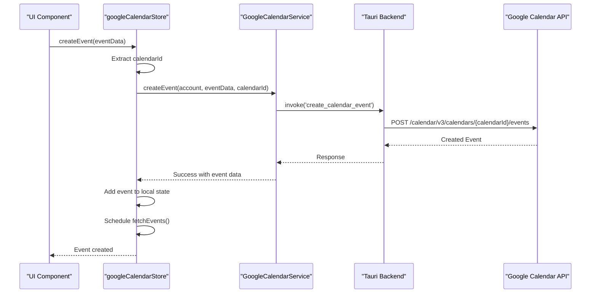
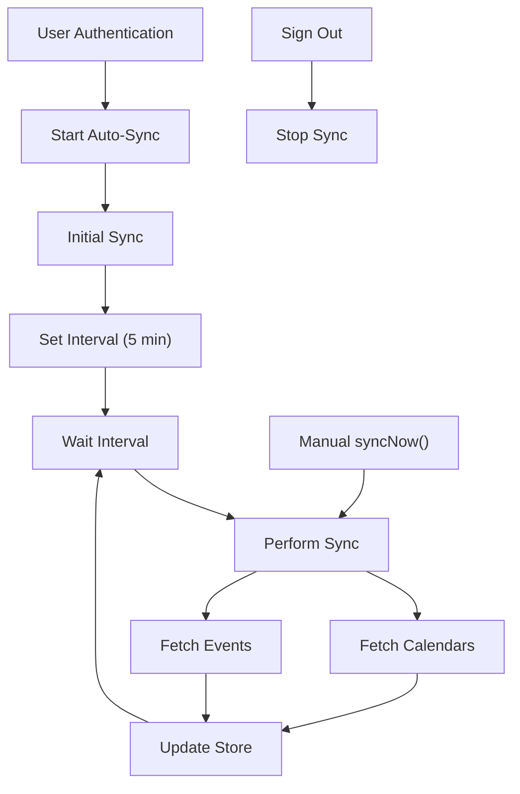
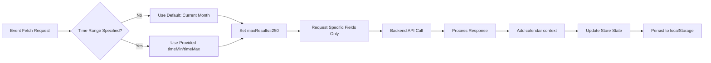

# Google Calendar API Integration

<cite>
**Referenced Files in This Document**   
- [googleCalendarService.ts](file://src/services/google/googleCalendarService.ts)
- [googleCalendarStore.ts](file://src/stores/googleCalendarStore.ts)
- [googleTasksService.ts](file://src/services/google/googleTasksService.ts)
- [google.ts](file://src/types/google.ts)
- [googleCalendarAutoSync.ts](file://src/services/googleCalendarAutoSync.ts)
</cite>

## Table of Contents
1. [Introduction](#introduction)
2. [OAuth2 Authentication and Token Management](#oauth2-authentication-and-token-management)
3. [Event Management Endpoints](#event-management-endpoints)
4. [Calendar Metadata Operations](#calendar-metadata-operations)
5. [Real-Time Synchronization Mechanisms](#real-time-synchronization-mechanisms)
6. [Error Handling and API Resilience](#error-handling-and-api-resilience)
7. [Performance Considerations](#performance-considerations)
8. [Integration with Task Management](#integration-with-task-management)
9. [Conclusion](#conclusion)

## Introduction
LibreOllama integrates with the Google Calendar API to enable robust calendar functionality, including event creation, modification, deletion, and querying. This integration is built on a secure OAuth2 authentication flow, supports comprehensive calendar metadata operations, and includes real-time synchronization mechanisms. The system is designed for performance, reliability, and seamless integration with task management features. This document details the implementation architecture, API usage patterns, and best practices for interacting with the Google Calendar API within LibreOllama.

## OAuth2 Authentication and Token Management

LibreOllama implements OAuth2 authentication for Google Calendar access using a centralized account model. Authentication is managed through shared Google account credentials that support multiple Google services, including Calendar, Tasks, and Gmail.

The `GoogleAccount` interface defines the authentication structure, including `accessToken`, `refreshToken`, and `expiresAt` for token lifecycle management. Token refresh is handled transparently by the backend Tauri layer, ensuring long-lived access without user intervention.

Authentication state is coordinated between the `useGoogleCalendarStore` and `useSettingsStore`. The calendar store retrieves the active account via `getActiveAccount()` from the mail store, ensuring consistent account context across services. Upon successful authentication, the calendar store automatically initiates fetching of calendars and events.

Token scope requirements include `https://www.googleapis.com/auth/calendar` for full calendar access, with the application requesting appropriate scopes during the OAuth2 consent flow. The `scopes` field in `GoogleAccount` tracks granted permissions for runtime validation.

**Section sources**
- [google.ts](file://src/types/google.ts#L5-L20)
- [googleCalendarStore.ts](file://src/stores/googleCalendarStore.ts#L105-L145)

## Event Management Endpoints

The Google Calendar integration provides comprehensive CRUD operations for calendar events through a well-defined service layer.

### Event Creation
Events are created via the `createEvent` method in `GoogleCalendarService`, which accepts a `CalendarEventCreateRequest` object containing event properties such as `summary`, `description`, `start`, `end`, `location`, and `attendees`. The service forwards the request to the Tauri backend via `invoke('create_calendar_event')`.

The store layer enhances the created event with `calendarId` and `calendarName` before adding it to the local state, enabling immediate UI feedback. A subsequent `fetchEvents` call ensures server consistency.

### Event Modification
Event updates are performed through the `updateEvent` method, accepting a partial `CalendarEventCreateRequest`. The implementation preserves immutability using Zustand's `immer` middleware, updating the local event in place upon successful API response.

### Event Deletion
Events are removed via `deleteEvent`, which removes the event from Google Calendar and updates the local store by filtering out the deleted event ID.

### Querying Events
The `getEvents` method supports time-bounded queries using `timeMin` and `timeMax` parameters. By default, it fetches events for the current month, with configurable `maxResults` (default: 250). The service explicitly requests extended properties to ensure complete data retrieval.

All event operations include comprehensive error handling and logging for debugging and monitoring.

**Diagram sources**
- [googleCalendarService.ts](file://src/services/google/googleCalendarService.ts#L65-L95)
- [googleCalendarStore.ts](file://src/stores/googleCalendarStore.ts#L275-L305)

**Section sources**
- [googleCalendarService.ts](file://src/services/google/googleCalendarService.ts#L65-L165)
- [googleCalendarStore.ts](file://src/stores/googleCalendarStore.ts#L275-L345)
- [google.ts](file://src/types/google.ts#L22-L70)

## Calendar Metadata Operations

LibreOllama provides full support for calendar metadata operations, enabling users to manage multiple calendars and navigate between them.

The `getCalendars` method retrieves all available calendars for the authenticated account, returning a list of calendar objects with `id` and `summary` properties. This data is stored in the `googleCalendarStore` and used to populate calendar selection UI components.

Users can switch between calendars using `setCurrentCalendar(calendarId)`, which updates the `currentCalendarId` state and triggers a refetch of events for the newly selected calendar. The primary calendar is used as a fallback when no calendars are available.

Calendar colors and settings are retrieved from the Google Calendar API but currently not exposed through dedicated endpoints. The system preserves extended properties in events, allowing custom metadata to be maintained across sync operations.

**Section sources**
- [googleCalendarService.ts](file://src/services/google/googleCalendarService.ts#L150-L165)
- [googleCalendarStore.ts](file://src/stores/googleCalendarStore.ts#L225-L245)

## Real-Time Synchronization Mechanisms

LibreOllama implements an automated polling-based synchronization system to keep calendar data up-to-date without requiring push notifications.

The `GoogleCalendarAutoSync` service manages periodic sync operations, running at configurable intervals (default: 5 minutes). It automatically starts when the user authenticates and stops when they sign out, ensuring efficient resource usage.

The synchronization process performs two parallel operations:
1. `fetchCalendars()` - Updates the list of available calendars
2. `fetchEvents()` - Retrieves events for the current time range (current month by default)

The auto-sync service is controlled through a singleton instance (`googleCalendarAutoSync`) that provides methods to start, stop, restart, and manually trigger synchronization. Sync status, including last sync time and interval settings, is available through the `getStatus()` method.

A cleanup handler ensures sync intervals are cleared when the application closes, preventing memory leaks.

**Diagram sources**
- [googleCalendarAutoSync.ts](file://src/services/googleCalendarAutoSync.ts#L20-L120)
- [googleCalendarStore.ts](file://src/stores/googleCalendarStore.ts#L247-L265)

**Section sources**
- [googleCalendarAutoSync.ts](file://src/services/googleCalendarAutoSync.ts#L1-L140)
- [googleCalendarStore.ts](file://src/stores/googleCalendarStore.ts#L247-L265)

## Error Handling and API Resilience

The integration includes comprehensive error handling to ensure reliability in the face of network issues, API limits, and user errors.

All service methods wrap API calls in try-catch blocks and return standardized `ApiResponse` objects with `success` status, `data`, and `error` fields. The `handleApiError` method in both calendar and tasks services normalizes Google API errors into a consistent `GoogleApiError` format with `code`, `message`, and `status`.

Common error scenarios are handled appropriately:
- **Authentication errors**: Detected when no active account is found, prompting re-authentication
- **Network failures**: Retried automatically on the next sync cycle
- **Rate limiting**: Handled by the backend Tauri layer with exponential backoff
- **Scheduling conflicts**: Returned as API errors and displayed to the user

The store maintains an `error` state field that UI components can use to display user-friendly error messages. Errors are cleared on successful operations or when `clearError()` is called.

Logging is implemented throughout the stack using the `logger` utility, with different log levels for debugging, information, warnings, and errors. This enables detailed diagnostics while maintaining performance in production.

**Section sources**
- [googleCalendarService.ts](file://src/services/google/googleCalendarService.ts#L10-L63)
- [googleCalendarStore.ts](file://src/stores/googleCalendarStore.ts#L220-L224)
- [google.ts](file://src/types/google.ts#L210-L224)

## Performance Considerations

The Google Calendar integration is designed with performance and scalability in mind, particularly for users with large calendar datasets.

### Incremental Sync and Data Filtering
The system implements time-bounded event fetching, retrieving only events within a relevant time window (default: current month). This prevents loading excessive historical data and reduces memory usage. The `fetchEvents` method accepts `timeMin` and `timeMax` parameters to control the query window.

### Memory Management
Calendar and event data are persisted in localStorage using Zustand's `persist` middleware with a partialized state that includes only essential fields. This enables fast restoration while controlling storage size.

The store uses the `immer` middleware for efficient immutable updates, minimizing unnecessary re-renders. Events are stored in a flat array with `calendarId` and `calendarName` denormalized for quick access.

### Data Optimization
The API request for events explicitly specifies the `fields` parameter to retrieve only needed properties, reducing payload size. The system fetches calendars before events to ensure proper calendar context is available.

For large datasets, the implementation uses `maxResults` parameter (default: 250) to limit response size, though pagination via `nextPageToken` is currently not implemented in the frontend.

### Synchronization Strategy
The auto-sync system balances freshness and performance with a 5-minute interval, configurable by users. The initial sync loads a broader time range (1 year), while periodic syncs focus on the current month.

**Diagram sources**
- [googleCalendarService.ts](file://src/services/google/googleCalendarService.ts#L30-L63)
- [googleCalendarStore.ts](file://src/stores/googleCalendarStore.ts#L247-L265)
- [googleCalendarAutoSync.ts](file://src/services/googleCalendarAutoSync.ts#L70-L90)

**Section sources**
- [googleCalendarService.ts](file://src/services/google/googleCalendarService.ts#L30-L63)
- [googleCalendarStore.ts](file://src/stores/googleCalendarStore.ts#L180-L215)
- [googleCalendarAutoSync.ts](file://src/services/googleCalendarAutoSync.ts#L70-L90)

## Integration with Task Management

LibreOllama seamlessly integrates Google Calendar with Google Tasks, enabling users to schedule tasks as calendar events.

The `googleTasksService` provides full CRUD operations for tasks and task lists, mirroring the calendar service pattern. Tasks can be marked as completed, moved within lists, or archived. The system supports hierarchical tasks with parent-child relationships.

When scheduling a task, the system creates a calendar event with extended properties linking back to the original task. The `timeBlock` property in `GoogleTask` stores scheduling information, allowing bidirectional synchronization between tasks and calendar events.

The integration uses a unified `GoogleAccount` model that supports both calendar and tasks scopes, enabling single-sign-on across productivity features. The `useGoogleCalendarStore` retrieves account information from the mail store, ensuring consistent authentication state.

This tight integration allows users to drag and drop tasks onto the calendar, automatically creating time-blocked events and updating task status accordingly.

**Section sources**
- [googleTasksService.ts](file://src/services/google/googleTasksService.ts#L1-L325)
- [google.ts](file://src/types/google.ts#L72-L140)
- [googleCalendarStore.ts](file://src/stores/googleCalendarStore.ts#L105-L145)

## Conclusion

LibreOllama's Google Calendar API integration provides a robust, performant, and user-friendly calendar experience. The architecture separates concerns between service, store, and UI layers, enabling maintainable code and responsive user interfaces. With automatic synchronization, comprehensive error handling, and tight task integration, the system delivers reliable calendar functionality that enhances productivity. Future improvements could include push notifications for real-time updates and advanced recurrence rule support for complex scheduling patterns.