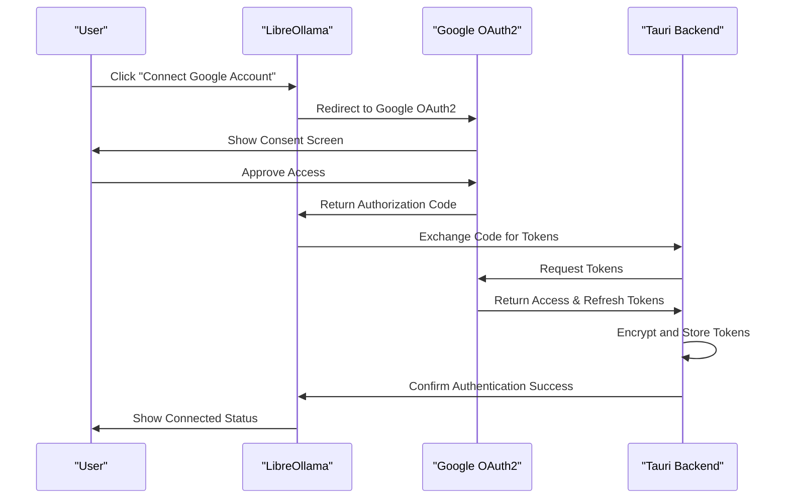
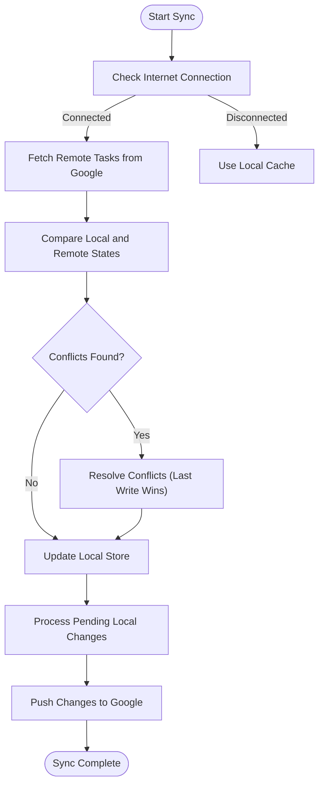
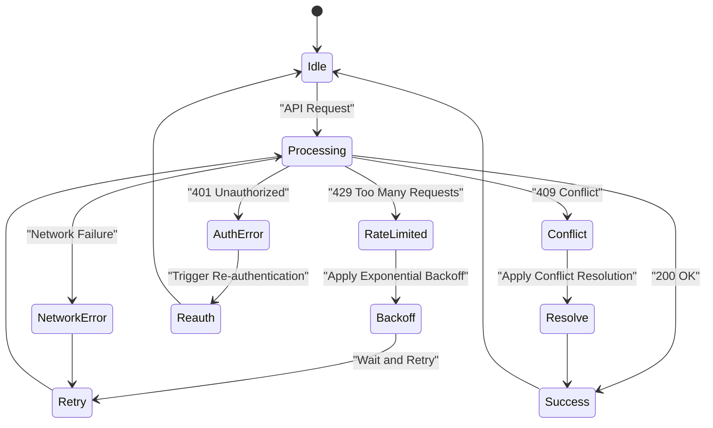
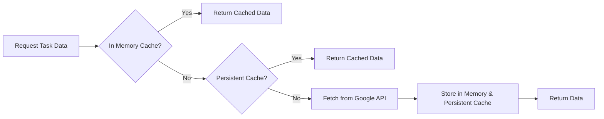

# Google Tasks API Integration

<cite>
**Referenced Files in This Document**   
- [googleTasksApi.ts](file://src/api/googleTasksApi.ts)
- [googleTasksService.ts](file://src/services/google/googleTasksService.ts)
- [google.ts](file://src/types/google.ts)
- [unifiedTaskStore.ts](file://src/stores/unifiedTaskStore.ts)
- [unifiedTaskStore.types.ts](file://src/stores/unifiedTaskStore.types.ts)
</cite>

## Table of Contents
1. [Introduction](#introduction)
2. [Authentication Flow](#authentication-flow)
3. [API Endpoints](#api-endpoints)
4. [Synchronization Strategy](#synchronization-strategy)
5. [Error Handling and Rate Limiting](#error-handling-and-rate-limiting)
6. [API Versioning](#api-versioning)
7. [Code Examples](#code-examples)
8. [Performance Optimization](#performance-optimization)
9. [Integration with Unified Task Store](#integration-with-unified-task-store)
10. [Conclusion](#conclusion)

## Introduction
This document provides comprehensive documentation for the Google Tasks API integration within LibreOllama. The integration enables users to manage their Google Tasks directly from the application, with full support for task creation, reading, updating, and deletion. It includes robust synchronization mechanisms, secure authentication via OAuth2, and seamless integration with the unified task store. The system supports hierarchical tasks, labels, time blocking, and offline operation with conflict resolution.

## Authentication Flow
The Google Tasks API integration uses OAuth2 for secure authentication and authorization. Users authenticate through Google's OAuth2 flow, which returns an access token and refresh token. These tokens are securely stored and used to make authorized API requests.

Access tokens are short-lived and automatically refreshed using the refresh token when they expire. The refresh process is transparent to the user and handled by the backend services. Token storage is encrypted and persisted across sessions to maintain continuous access.



**Diagram sources**
- [googleTasksService.ts](file://src/services/google/googleTasksService.ts#L1-L326)
- [unifiedTaskStore.ts](file://src/stores/unifiedTaskStore.ts#L1-L1026)

**Section sources**
- [googleTasksService.ts](file://src/services/google/googleTasksService.ts#L1-L326)
- [unifiedTaskStore.ts](file://src/stores/unifiedTaskStore.ts#L1-L1026)

## API Endpoints
The Google Tasks API integration exposes a set of endpoints for managing tasks and task lists. These endpoints follow REST conventions and use JSON for request and response payloads.

### Task List Endpoints
| HTTP Method | URL Pattern | Description |
|-----------|-----------|-------------|
| GET | `/tasklists` | Retrieve all task lists for the authenticated user |
| POST | `/tasklists` | Create a new task list |
| PUT | `/tasklists/{id}` | Update a task list (e.g., rename) |
| DELETE | `/tasklists/{id}` | Delete a task list |

### Task Endpoints
| HTTP Method | URL Pattern | Description |
|-----------|-----------|-------------|
| GET | `/tasklists/{listId}/tasks` | Retrieve all tasks in a task list |
| POST | `/tasklists/{listId}/tasks` | Create a new task in a task list |
| PUT | `/tasklists/{listId}/tasks/{taskId}` | Update an existing task |
| DELETE | `/tasklists/{listId}/tasks/{taskId}` | Delete a task |
| POST | `/tasklists/{listId}/tasks/{taskId}/move` | Move a task within a list |

**Section sources**
- [googleTasksApi.ts](file://src/api/googleTasksApi.ts#L1-L164)
- [googleTasksService.ts](file://src/services/google/googleTasksService.ts#L1-L326)

## Synchronization Strategy
The synchronization strategy between local state and Google Tasks is designed to handle offline operation, conflict resolution, and data consistency. The system uses a unified task store that maintains both local and remote state, with explicit sync status tracking.

When operating offline, all changes are queued locally with appropriate sync states (`pending_create`, `pending_update`, `pending_delete`). Upon reconnection, these changes are synchronized with Google Tasks in the correct order. Conflict resolution follows a last-write-wins policy with timestamp comparison, where the most recently updated task takes precedence.

For task hierarchies, parent-child relationships are maintained through the `parent` field in the task schema. Subtasks are displayed indented under their parent tasks in the UI, with proper nesting levels tracked.



**Diagram sources**
- [unifiedTaskStore.ts](file://src/stores/unifiedTaskStore.ts#L1-L1026)
- [googleTasksService.ts](file://src/services/google/googleTasksService.ts#L1-L326)

**Section sources**
- [unifiedTaskStore.ts](file://src/stores/unifiedTaskStore.ts#L1-L1026)
- [unifiedTaskStore.types.ts](file://src/stores/unifiedTaskStore.types.ts#L1-L107)

## Error Handling and Rate Limiting
The integration implements comprehensive error handling patterns to ensure reliability and user experience. All API calls are wrapped in try-catch blocks, with errors normalized into a consistent `GoogleApiError` structure that includes code, message, and status.

Rate limiting is handled according to Google's quotas. The system respects HTTP 429 responses and implements exponential backoff for retrying failed requests. A rate limiter is also implemented at the service layer to prevent exceeding quota limits during bulk operations.

Common error scenarios and their handling:
- **Network failures**: Retry with exponential backoff up to 3 times
- **Authentication errors**: Trigger re-authentication flow
- **Rate limiting**: Wait and retry with exponential backoff
- **Data conflicts**: Apply conflict resolution policy
- **Schema errors**: Log error and attempt migration if needed



**Diagram sources**
- [googleTasksService.ts](file://src/services/google/googleTasksService.ts#L1-L326)
- [unifiedTaskStore.ts](file://src/stores/unifiedTaskStore.ts#L1-L1026)

**Section sources**
- [googleTasksService.ts](file://src/services/google/googleTasksService.ts#L1-L326)
- [unifiedTaskStore.ts](file://src/stores/unifiedTaskStore.ts#L1-L1026)

## API Versioning
The Google Tasks API integration uses semantic versioning for both the client-side API and the backend service interface. The frontend uses the Google Tasks API v1, as specified in the discovery document URL.

Client-side versioning is managed through the `googleTasksApi` namespace, which exports all functions with a stable interface. Backend service commands use Rust modules with clear versioning in the command names (e.g., `create_google_task`, `update_google_task`).

The system is designed to be forward-compatible, with optional fields in request and response schemas. When Google releases new API versions, the integration will support both versions during a transition period before deprecating the old version.

**Section sources**
- [googleTasksApi.ts](file://src/api/googleTasksApi.ts#L1-L164)
- [googleTasksService.ts](file://src/services/google/googleTasksService.ts#L1-L326)

## Code Examples
The following code examples demonstrate common operations with the Google Tasks API integration.

### Batch Updates
```typescript
// Example of batch updating multiple tasks
const updateMultipleTasks = async (account: GoogleAccount, taskUpdates: Array<{
  taskListId: string;
  taskId: string;
  updates: { title?: string; notes?: string; status?: 'needsAction' | 'completed' }
}>) => {
  const promises = taskUpdates.map(update => 
    googleTasksService.updateTask(account, update.taskListId, update.taskId, update.updates)
  );
  return await Promise.all(promises);
};
```

### Task Hierarchies
```typescript
// Example of creating a parent task with subtasks
const createTaskHierarchy = async (account: GoogleAccount, parentData: TaskCreateData, subtasks: TaskCreateData[]) => {
  // Create parent task
  const parent = await googleTasksService.createTask(account, parentData.taskListId, parentData);
  
  // Create subtasks with parent reference
  const subtaskPromises = subtasks.map(subtask => 
    googleTasksService.createTask(account, parentData.taskListId, {
      ...subtask,
      parent: parent.data?.id
    })
  );
  
  await Promise.all(subtaskPromises);
  return parent;
};
```

### Label Management
```typescript
// Example of managing task labels
const manageTaskLabels = async (account: GoogleAccount, taskListId: string, taskId: string, labels: string[]) => {
  return await googleTasksService.updateTask(account, taskListId, taskId, {
    labels: labels.map(name => ({
      name,
      color: ['blue', 'green', 'purple', 'orange'][Math.floor(Math.random() * 4)] as const
    }))
  });
};
```

**Section sources**
- [googleTasksService.ts](file://src/services/google/googleTasksService.ts#L1-L326)
- [unifiedTaskStore.ts](file://src/stores/unifiedTaskStore.ts#L1-L1026)
- [google.ts](file://src/types/google.ts#L1-L225)

## Performance Optimization
The integration implements several performance optimization techniques to ensure responsive operation even with large task sets.

### Pagination
The system uses pagination for task retrieval, with a default page size of 100 tasks. This prevents performance degradation with large task lists and reduces initial load time.

### Selective Field Retrieval
When retrieving tasks, only necessary fields are requested through the API. The system avoids retrieving unnecessary fields like `etag` or `selfLink` unless specifically needed.

### Caching Strategies
The integration implements multi-layer caching:
- **In-memory cache**: Recently accessed tasks are kept in memory for quick access
- **Persistent cache**: Task data is stored locally using Tauri's filesystem access
- **Stale-while-revalidate**: Display cached data immediately while fetching fresh data in background



**Diagram sources**
- [googleTasksService.ts](file://src/services/google/googleTasksService.ts#L1-L326)
- [unifiedTaskStore.ts](file://src/stores/unifiedTaskStore.ts#L1-L1026)

**Section sources**
- [googleTasksService.ts](file://src/services/google/googleTasksService.ts#L1-L326)
- [unifiedTaskStore.ts](file://src/stores/unifiedTaskStore.ts#L1-L1026)

## Integration with Unified Task Store
The Google Tasks API integration is tightly coupled with the unified task store, which serves as the single source of truth for all task data in LibreOllama.

The unified task store uses Zustand with Immer for state management, providing a reactive and immutable update pattern. Tasks are indexed by stable local IDs, with Google task IDs mapped separately to allow for offline creation and synchronization.

The store maintains explicit sync states for each task, enabling the UI to show synchronization status and handle conflicts appropriately. Column-based organization maps directly to Google task lists, with bidirectional synchronization ensuring consistency.

```mermaid
classDiagram
class UnifiedTaskStore {
+tasks : Record~string, UnifiedTask~
+columns : TaskColumn[]
+showCompleted : boolean
+isSyncing : boolean
+syncErrors : Record~string, string~
+createTask(input : CreateTaskInput) : Promise~string~
+updateTask(taskId : string, updates : UpdateTaskInput) : Promise~void~
+deleteTask(taskId : string) : Promise~void~
+moveTask(taskId : string, targetColumnId : string, targetIndex? : number) : Promise~void~
+batchUpdateFromGoogle(updates : { taskListId : string; tasks : GoogleTask[] }[]) : void
}
class UnifiedTask {
+id : string
+googleTaskId? : string
+googleTaskListId? : string
+title : string
+notes? : string
+due? : string
+status : 'needsAction' | 'completed'
+labels : { name : string; color : string }[]
+priority : 'high' | 'medium' | 'low' | 'none'
+timeBlock? : { startTime : string; endTime : string }
+columnId : string
+syncState : TaskSyncState
}
class TaskColumn {
+id : string
+title : string
+googleTaskListId? : string
+taskIds : string[]
}
class GoogleTask {
+id : string
+title : string
+notes? : string
+status : 'needsAction' | 'completed'
+due? : string
+labels? : { name : string; color : string }[]
+priority? : string
}
class GoogleTaskList {
+id : string
+title : string
}
UnifiedTaskStore --> UnifiedTask : "contains"
UnifiedTaskStore --> TaskColumn : "contains"
UnifiedTask --> TaskColumn : "belongs to"
GoogleTask --> GoogleTaskList : "in list"
UnifiedTask --> GoogleTask : "syncs with"
```

**Diagram sources**
- [unifiedTaskStore.ts](file://src/stores/unifiedTaskStore.ts#L1-L1026)
- [unifiedTaskStore.types.ts](file://src/stores/unifiedTaskStore.types.ts#L1-L107)
- [google.ts](file://src/types/google.ts#L1-L225)

**Section sources**
- [unifiedTaskStore.ts](file://src/stores/unifiedTaskStore.ts#L1-L1026)
- [unifiedTaskStore.types.ts](file://src/stores/unifiedTaskStore.types.ts#L1-L107)

## Conclusion
The Google Tasks API integration in LibreOllama provides a robust, secure, and performant interface for managing Google Tasks. With comprehensive authentication, synchronization, error handling, and performance optimization, the integration delivers a seamless user experience. The tight coupling with the unified task store ensures data consistency across the application, while the modular design allows for future enhancements and API version upgrades.