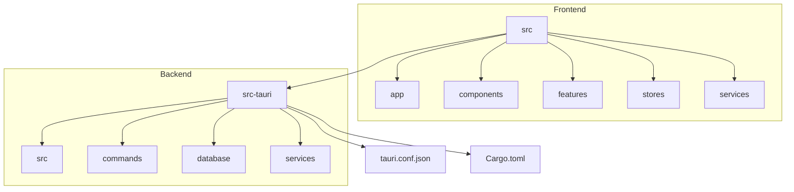
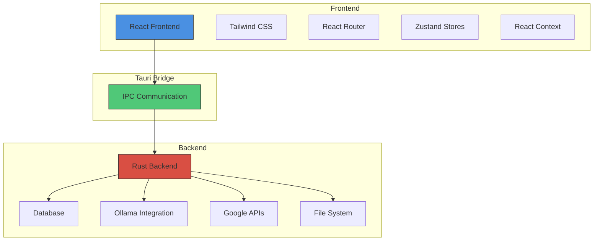
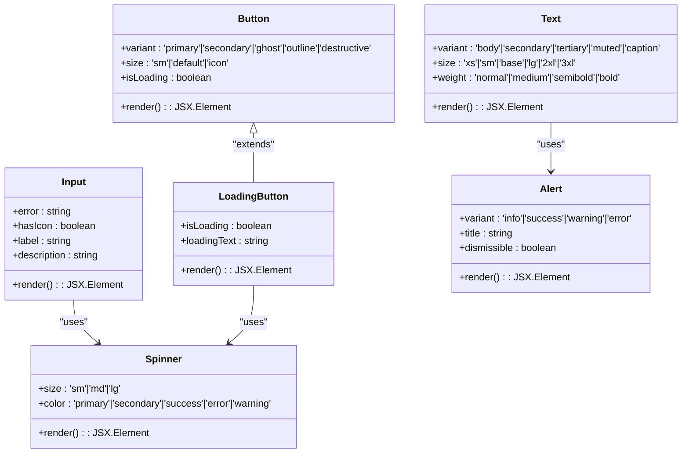
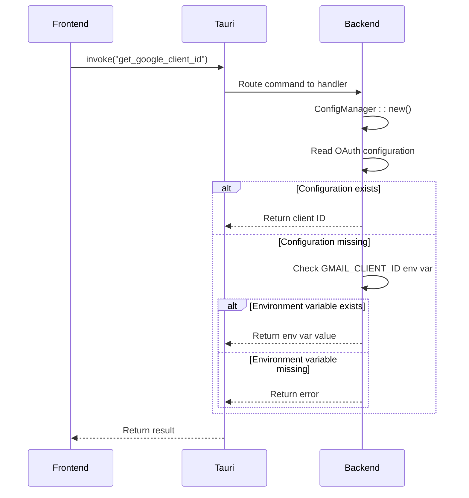
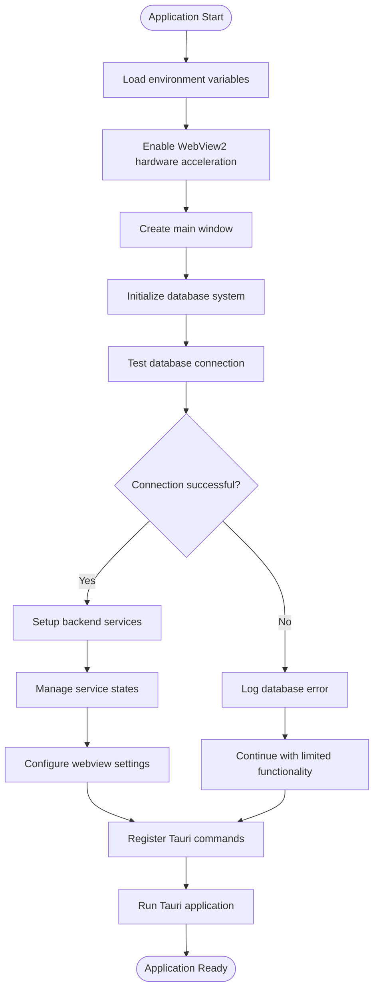

# Architecture Overview

<cite>
**Referenced Files in This Document**   
- [App.tsx](file://src/app/App.tsx)
- [main.tsx](file://src/app/main.tsx)
- [main.rs](file://src-tauri/src/main.rs)
- [lib.rs](file://src-tauri/src/lib.rs)
- [Cargo.toml](file://src-tauri/Cargo.toml)
- [tauri.conf.json](file://src-tauri/tauri.conf.json)
- [index.tsx](file://src/components/ui/index.tsx)
</cite>

## Table of Contents
1. [Introduction](#introduction)
2. [Project Structure](#project-structure)
3. [Core Components](#core-components)
4. [Architecture Overview](#architecture-overview)
5. [Detailed Component Analysis](#detailed-component-analysis)
6. [Dependency Analysis](#dependency-analysis)
7. [Performance Considerations](#performance-considerations)
8. [Troubleshooting Guide](#troubleshooting-guide)
9. [Conclusion](#conclusion)

## Introduction
LibreOllama is a hybrid desktop application built using the Tauri framework, combining a React frontend with a Rust backend. This architecture enables cross-platform desktop deployment while maintaining web-based development workflows. The application integrates AI capabilities through Ollama and connects with external services such as Google Tasks and Gmail. The system leverages modern web technologies including React, TypeScript, Tailwind CSS, and Zustand for state management, while utilizing Rust for secure, high-performance backend operations and local data persistence.

## Project Structure
The project follows a feature-based organization with clear separation between frontend and backend components. The frontend resides in the `src` directory, while the Tauri Rust backend is located in `src-tauri`. This structure supports modular development and scalable feature integration.



**Diagram sources**
- [App.tsx](file://src/app/App.tsx)
- [main.rs](file://src-tauri/src/main.rs)

**Section sources**
- [App.tsx](file://src/app/App.tsx)
- [main.rs](file://src-tauri/src/main.rs)

## Core Components
The application's core components include the React frontend with React Router for navigation, Tauri commands for IPC communication, and a modular backend with specialized services for Gmail, Google Tasks, Ollama, and local database operations. The UI layer uses a custom design system built with Tailwind CSS, while state management is handled through a combination of React Context and Zustand stores.

**Section sources**
- [App.tsx](file://src/app/App.tsx)
- [lib.rs](file://src-tauri/src/lib.rs)
- [index.tsx](file://src/components/ui/index.tsx)

## Architecture Overview
LibreOllama employs a hybrid desktop architecture where the frontend runs in a WebView container managed by Tauri, while the backend executes native Rust code. The React frontend communicates with the Rust backend through Tauri's IPC system, enabling secure access to system resources and external APIs.



**Diagram sources**
- [App.tsx](file://src/app/App.tsx)
- [lib.rs](file://src-tauri/src/lib.rs)
- [tauri.conf.json](file://src-tauri/tauri.conf.json)

## Detailed Component Analysis

### Frontend Architecture
The frontend is built with React and TypeScript, using React Router for navigation between pages such as Dashboard, Chat, Mail, and Calendar. The component hierarchy starts with the App component, which provides global context providers for theme, commands, and state management.

#### UI Component System
The application implements a comprehensive UI component system that abstracts design tokens and styling through a custom design system.



**Diagram sources**
- [index.tsx](file://src/components/ui/index.tsx)

**Section sources**
- [index.tsx](file://src/components/ui/index.tsx)

### Backend Command System
The Rust backend exposes a comprehensive set of commands through Tauri's IPC system, allowing the frontend to invoke native functionality securely.

#### Command Registration and Handling
The backend command system is structured around modular command registration, with specific command modules for different application features.



**Diagram sources**
- [lib.rs](file://src-tauri/src/lib.rs)

**Section sources**
- [lib.rs](file://src-tauri/src/lib.rs)

### Application Initialization Flow
The application initialization process involves setting up both frontend and backend components, ensuring proper configuration and database connectivity before rendering the UI.



**Diagram sources**
- [lib.rs](file://src-tauri/src/lib.rs)

**Section sources**
- [lib.rs](file://src-tauri/src/lib.rs)

## Dependency Analysis
The application has a well-defined dependency structure with clear separation between frontend and backend dependencies. The Tauri framework serves as the integration layer between these components.

```mermaid
graph TD
subgraph "Frontend Dependencies"
A[React]
B[TypeScript]
C[Tailwind CSS]
D[Zustand]
E[@tanstack/react-query]
end
subgraph "Backend Dependencies"
F[Rust]
G[Tauri]
H[rusqlite]
I[reqwest]
J[serde]
end
subgraph "Integration"
K[Tauri IPC]
end
A --> K
B --> K
C --> K
D --> K
E --> K
F --> K
G --> K
H --> K
I --> K
J --> K
style K fill:#50C878,stroke:#333
```

**Diagram sources**
- [Cargo.toml](file://src-tauri/Cargo.toml)
- [package.json](file://package.json)

**Section sources**
- [Cargo.toml](file://src-tauri/Cargo.toml)

## Performance Considerations
The application implements several performance optimizations, particularly in the area of canvas rendering and database operations. The backend enables WebView2 hardware acceleration to improve canvas performance, while the frontend uses React's rendering optimizations and efficient state management.

The database initialization process includes connection testing to ensure reliability, and the application uses asynchronous operations throughout to maintain responsiveness. Rate limiting is implemented for external API calls to prevent throttling, and caching strategies are employed for frequently accessed data.

## Troubleshooting Guide
When encountering issues with LibreOllama, consider the following common problems and solutions:

1. **Database initialization failures**: Check that the database file is writable and not corrupted. The application logs database errors to the console.
2. **Google API authentication issues**: Ensure that the GMAIL_CLIENT_ID environment variable is set or configured in the application settings.
3. **Canvas rendering problems**: Verify that hardware acceleration is enabled in the WebView2 configuration.
4. **IPC communication errors**: Check that Tauri commands are properly registered in the backend and that the frontend is using the correct command names.

**Section sources**
- [lib.rs](file://src-tauri/src/lib.rs)
- [App.tsx](file://src/app/App.tsx)

## Conclusion
LibreOllama demonstrates a robust hybrid desktop application architecture that effectively combines the strengths of web technologies with native system capabilities. The Tauri framework enables secure IPC communication between the React frontend and Rust backend, while the modular design supports extensibility and maintainability. The application's architecture balances performance, security, and developer experience, making it well-suited for AI-powered productivity tools with local data storage and cloud service integration.