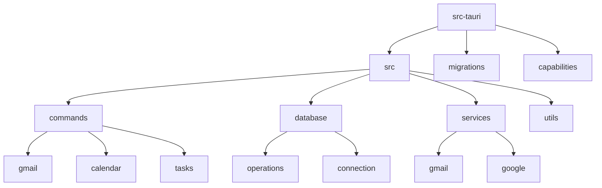
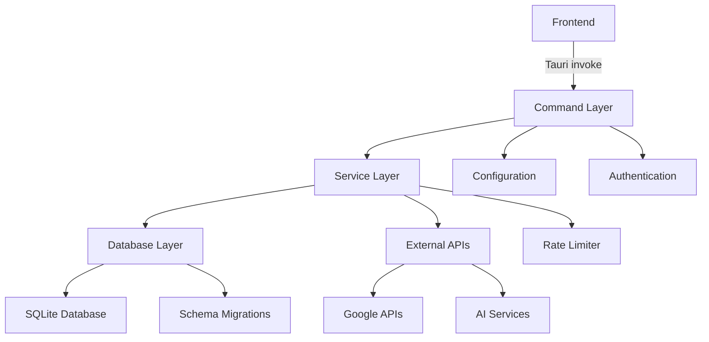
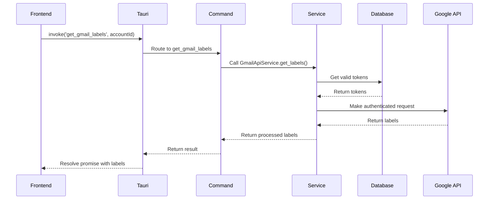
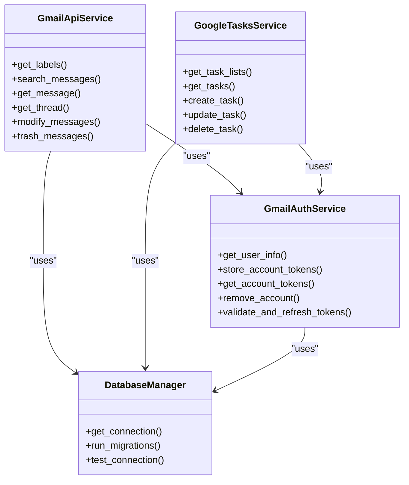
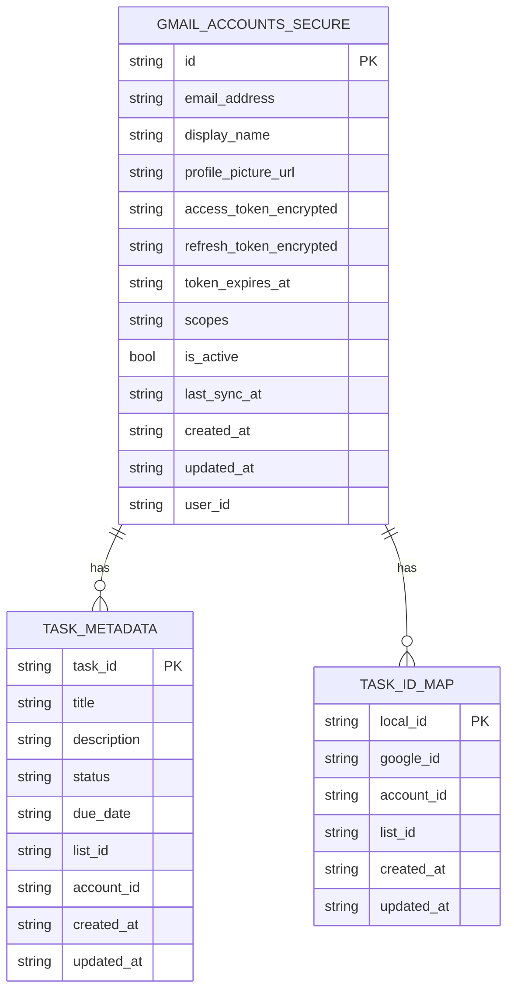
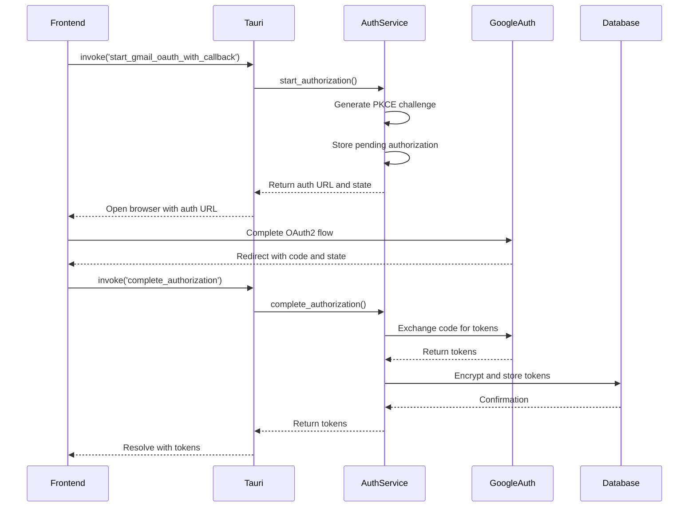
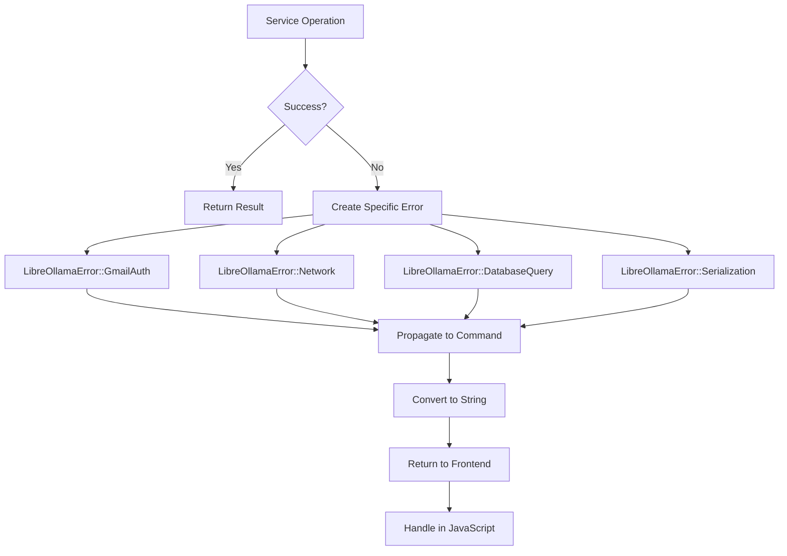
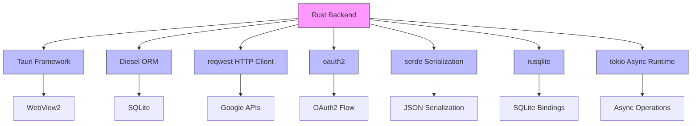

# Backend Architecture

<cite>
**Referenced Files in This Document**   
- [lib.rs](file://src-tauri/src/lib.rs)
- [Cargo.toml](file://src-tauri/Cargo.toml)
- [database\mod.rs](file://src-tauri/src/database/mod.rs)
- [database\connection.rs](file://src-tauri/src/database/connection.rs)
- [services\gmail\auth_service.rs](file://src-tauri/src/services/gmail/auth_service.rs)
- [commands\gmail\auth.rs](file://src-tauri/src/commands/gmail/auth.rs)
- [services\gmail\api_service.rs](file://src-tauri/src/services/gmail/api_service.rs)
- [commands\gmail\api.rs](file://src-tauri/src/commands/gmail/api.rs)
- [services\google\tasks_service.rs](file://src-tauri/src/services/google/tasks_service.rs)
</cite>

## Table of Contents
1. [Introduction](#introduction)
2. [Project Structure](#project-structure)
3. [Core Components](#core-components)
4. [Architecture Overview](#architecture-overview)
5. [Detailed Component Analysis](#detailed-component-analysis)
6. [Dependency Analysis](#dependency-analysis)
7. [Performance Considerations](#performance-considerations)
8. [Troubleshooting Guide](#troubleshooting-guide)
9. [Conclusion](#conclusion)

## Introduction
The LibreOllama backend is a Rust-based native implementation built on the Tauri framework, designed to provide secure, efficient, and modular communication between the frontend and system-level services. This architecture enables seamless integration with Google services including Gmail, Calendar, Tasks, and AI functionality through a well-defined command pattern and service layer organization. The backend leverages SQLite with Diesel ORM for local data persistence, implements robust authentication mechanisms for Google API access, and ensures secure storage of sensitive credentials. This document provides a comprehensive overview of the backend architecture, detailing its modular design, database layer, command invocation system, service organization, and integration patterns.

## Project Structure
The project follows a standard Tauri application structure with a clear separation between frontend (TypeScript/React) and backend (Rust) components. The backend resides in the `src-tauri` directory and is organized into modular components for commands, services, database operations, and utilities.

**Diagram sources**
- [lib.rs](file://src-tauri/src/lib.rs)
- [Cargo.toml](file://src-tauri/Cargo.toml)

**Section sources**
- [lib.rs](file://src-tauri/src/lib.rs)
- [Cargo.toml](file://src-tauri/Cargo.toml)

## Core Components
The LibreOllama backend consists of several core components that work together to provide a robust and secure foundation for the application. These include the Tauri command system for IPC communication, a modular service layer for business logic, a database layer using SQLite with Diesel ORM, and specialized modules for integrating with Google services and AI functionality. The architecture follows a clear separation of concerns, with commands handling frontend requests, services implementing business logic, and the database layer managing data persistence.

**Section sources**
- [lib.rs](file://src-tauri/src/lib.rs)
- [database\mod.rs](file://src-tauri/src/database/mod.rs)

## Architecture Overview
The LibreOllama backend architecture is built around the Tauri framework, which enables secure communication between the frontend and backend through a well-defined command invocation system. The architecture follows a layered approach with clear separation between the presentation layer (frontend), command layer (IPC interface), service layer (business logic), and data layer (database and external APIs).

**Diagram sources**
- [lib.rs](file://src-tauri/src/lib.rs)
- [database\connection.rs](file://src-tauri/src/database/connection.rs)

## Detailed Component Analysis

### Command Pattern Implementation
The backend implements a command pattern where frontend functionality is invoked through Tauri's invoke system. Each command is a Rust function annotated with `#[tauri::command]` that can be called from the frontend JavaScript code. The `lib.rs` file serves as the central entry point, registering all available commands with the Tauri runtime.

**Diagram sources**
- [lib.rs](file://src-tauri/src/lib.rs)
- [commands\gmail\api.rs](file://src-tauri/src/commands/gmail/api.rs)

**Section sources**
- [lib.rs](file://src-tauri/src/lib.rs)
- [commands\gmail\api.rs](file://src-tauri/src/commands/gmail/api.rs)

### Service Layer Organization
The service layer is organized into dedicated modules for different functionality areas, following dependency injection patterns. Services are initialized in the `setup` function of `lib.rs` and managed by the Tauri app state. The architecture uses Arc (Atomic Reference Counting) for thread-safe sharing of service instances across async contexts.

**Diagram sources**
- [services\gmail\auth_service.rs](file://src-tauri/src/services/gmail/auth_service.rs)
- [services\gmail\api_service.rs](file://src-tauri/src/services/gmail/api_service.rs)
- [services\google\tasks_service.rs](file://src-tauri/src/services/google/tasks_service.rs)

**Section sources**
- [services\gmail\auth_service.rs](file://src-tauri/src/services/gmail/auth_service.rs)
- [services\gmail\api_service.rs](file://src-tauri/src/services/gmail/api_service.rs)
- [services\google\tasks_service.rs](file://src-tauri/src/services/google/tasks_service.rs)

### Database Layer with SQLite and Diesel ORM
The database layer uses SQLite as the persistent storage engine with Diesel ORM for schema management and query operations. The `DatabaseManager` class handles connection pooling, migration execution, and connection configuration. The architecture supports schema versioning through migration files in the `migrations` directory.

**Diagram sources**
- [database\connection.rs](file://src-tauri/src/database/connection.rs)
- [database\mod.rs](file://src-tauri/src/database/mod.rs)

**Section sources**
- [database\connection.rs](file://src-tauri/src/database/connection.rs)
- [database\mod.rs](file://src-tauri/src/database/mod.rs)

### Authentication and Secure Storage
The authentication system implements OAuth2 with PKCE for secure Google API access. The `GmailAuthService` handles the complete OAuth2 flow, including authorization request generation, callback processing, token exchange, and token refresh. Sensitive credentials are encrypted using AES-GCM before storage in the SQLite database.

**Diagram sources**
- [services\gmail\auth_service.rs](file://src-tauri/src/services/gmail/auth_service.rs)
- [commands\gmail\auth.rs](file://src-tauri/src/commands/gmail/auth.rs)

**Section sources**
- [services\gmail\auth_service.rs](file://src-tauri/src/services/gmail/auth_service.rs)
- [commands\gmail\auth.rs](file://src-tauri/src/commands/gmail/auth.rs)

### Error Handling Across FFI Boundary
The backend implements comprehensive error handling across the FFI boundary using a custom `LibreOllamaError` enum. Errors are propagated from the service layer through commands to the frontend, where they can be handled appropriately. The error system includes specific variants for different error types including authentication, network, database, and serialization errors.

**Diagram sources**
- [services\gmail\auth_service.rs](file://src-tauri/src/services/gmail/auth_service.rs)
- [services\gmail\api_service.rs](file://src-tauri/src/services/gmail/api_service.rs)

**Section sources**
- [services\gmail\auth_service.rs](file://src-tauri/src/services/gmail/auth_service.rs)
- [services\gmail\api_service.rs](file://src-tauri/src/services/gmail/api_service.rs)

## Dependency Analysis
The backend has a well-defined dependency structure with clear separation between core functionality and optional features. Dependencies are managed through Cargo.toml with feature flags enabling modular compilation of different components.

**Diagram sources**
- [Cargo.toml](file://src-tauri/Cargo.toml)
- [lib.rs](file://src-tauri/src/lib.rs)

**Section sources**
- [Cargo.toml](file://src-tauri/Cargo.toml)
- [lib.rs](file://src-tauri/src/lib.rs)

## Performance Considerations
The backend architecture includes several performance optimizations, including connection pooling for database access, rate limiting for API calls, and efficient data retrieval patterns. The database is configured with WAL (Write-Ahead Logging) mode for improved concurrency and performance. The rate limiter service ensures that API calls to Google services stay within quota limits while providing a smooth user experience.

**Section sources**
- [database\connection.rs](file://src-tauri/src/database/connection.rs)
- [services\gmail\api_service.rs](file://src-tauri/src/services/gmail/api_service.rs)

## Troubleshooting Guide
The backend includes several debugging and troubleshooting features to assist with development and user support. These include debug commands for inspecting the secure token storage, checking database schema integrity, and validating authentication state. The logging system provides detailed information about authentication flows, API requests, and database operations.

**Section sources**
- [commands\gmail\auth.rs](file://src-tauri/src/commands/gmail/auth.rs)
- [services\gmail\auth_service.rs](file://src-tauri/src/services/gmail/auth_service.rs)

## Conclusion
The LibreOllama backend architecture demonstrates a well-structured, modular design that effectively leverages the Tauri framework for secure IPC communication between the frontend and native Rust code. The implementation follows best practices for authentication, data persistence, and error handling, providing a solid foundation for integrating with Google services and AI functionality. The use of Diesel ORM with SQLite ensures reliable data storage with proper schema migration support, while the service layer organization promotes code reuse and maintainability. The command pattern implementation provides a clean interface between the frontend and backend, enabling efficient development and testing of application features.