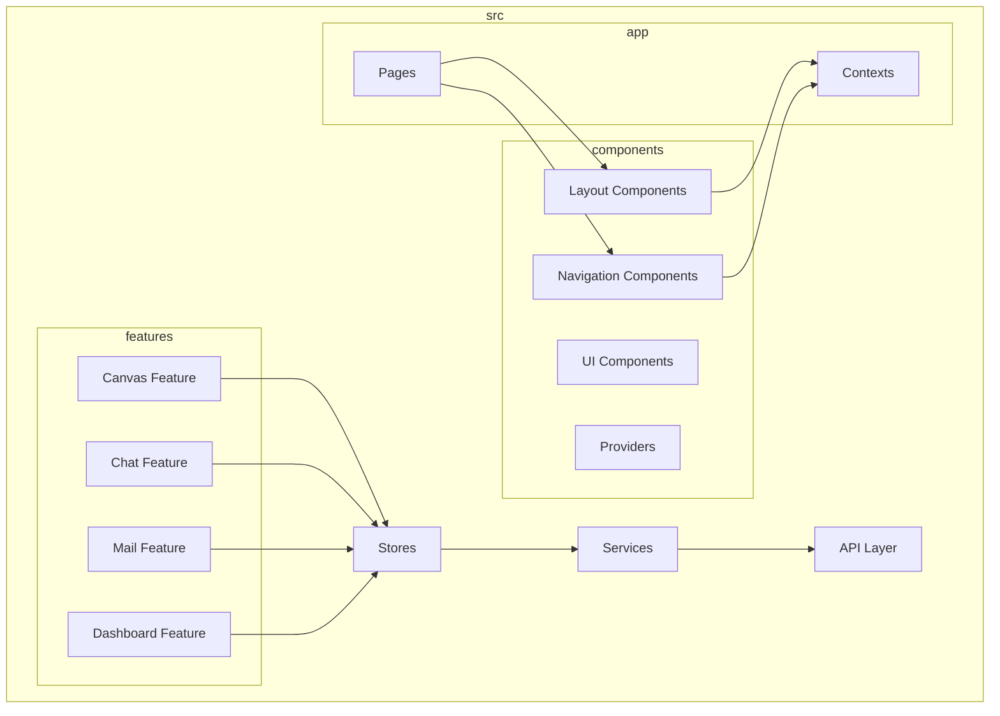
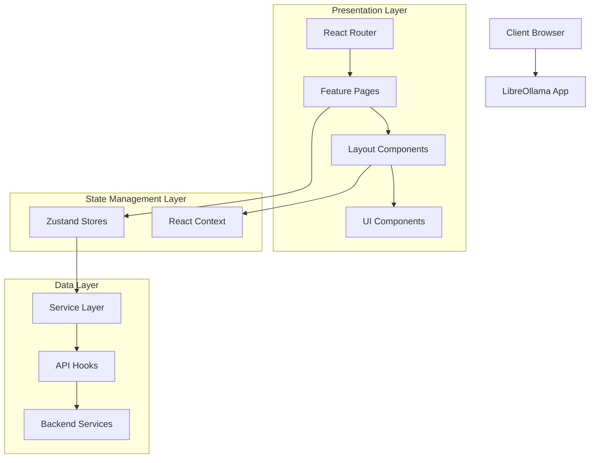
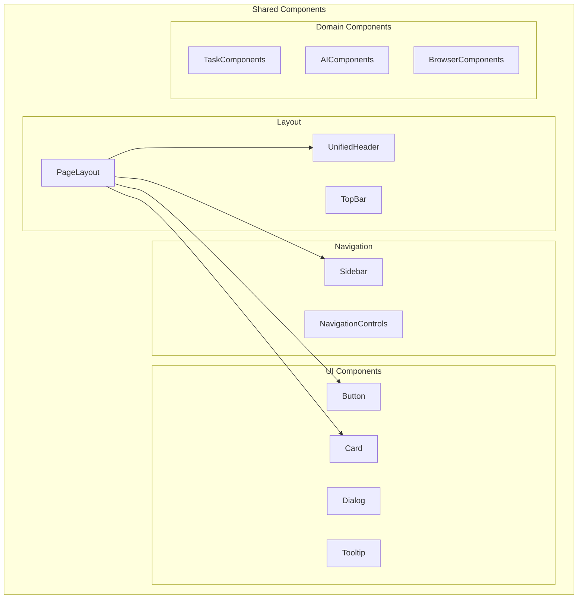
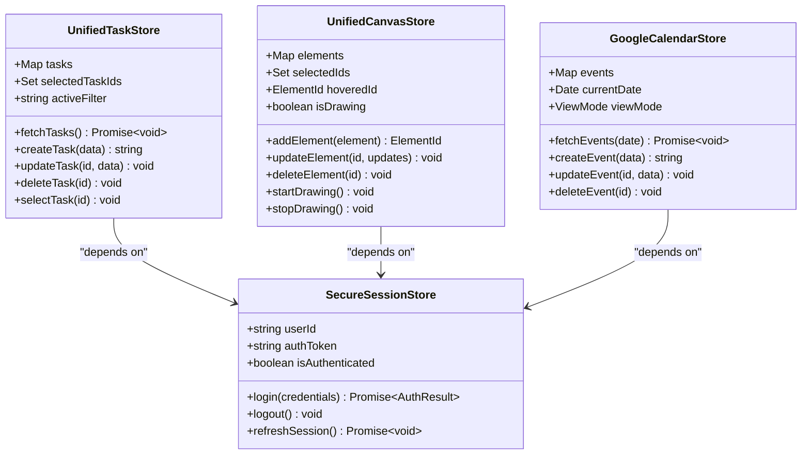
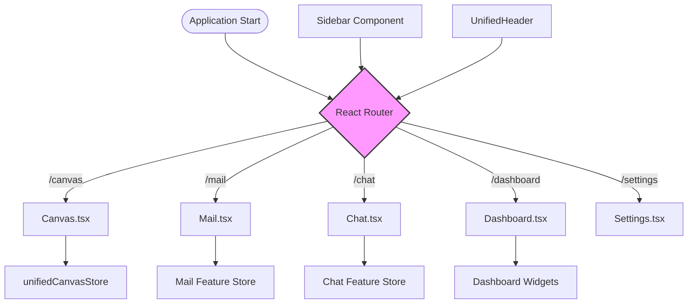
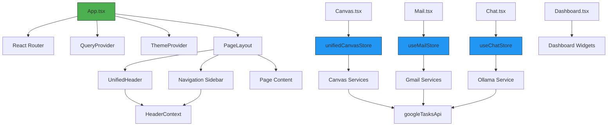
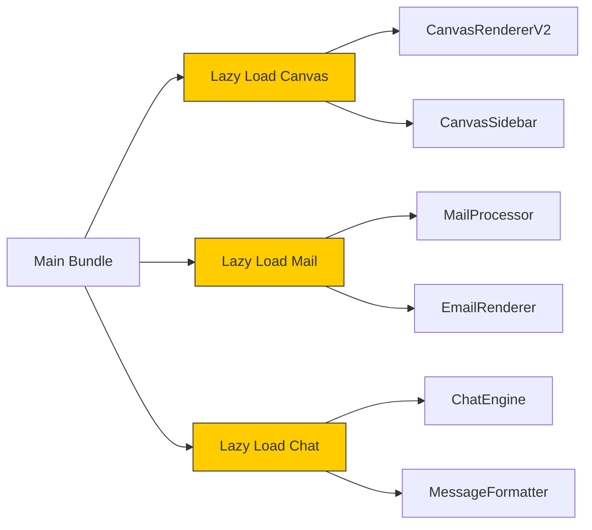

# Frontend Architecture

<cite>
**Referenced Files in This Document**   
- [App.tsx](file://src/app/App.tsx)
- [main.tsx](file://src/app/main.tsx)
- [Canvas.tsx](file://src/app/pages/Canvas.tsx)
- [Chat.tsx](file://src/app/pages/Chat.tsx)
- [Dashboard.tsx](file://src/app/pages/Dashboard.tsx)
- [Mail.tsx](file://src/app/pages/Mail.tsx)
- [HeaderContext.tsx](file://src/app/contexts/HeaderContext.tsx)
- [PageLayout.tsx](file://src/components/layout/PageLayout.tsx)
- [UnifiedHeader.tsx](file://src/components/layout/UnifiedHeader.tsx)
- [Sidebar.tsx](file://src/components/navigation/Sidebar.tsx)
- [unifiedTaskStore.ts](file://src/stores/unifiedTaskStore.ts)
- [secureSessionStore.ts](file://src/stores/secureSessionStore.ts)
- [unifiedCanvasStore.ts](file://src/features/canvas/stores/unifiedCanvasStore.ts)
- [ThemeProvider.tsx](file://src/components/ThemeProvider.tsx)
- [useTheme.ts](file://src/core/theme/useTheme.ts)
- [QueryProvider.tsx](file://src/providers/QueryProvider.tsx)
- [googleTasksApi.ts](file://src/api/googleTasksApi.ts)
- [gmailAutoSync.ts](file://src/services/gmailAutoSync.ts)
- [useDebounce.ts](file://src/core/hooks/useDebounce.ts)
- [useCommandPalette.ts](file://src/core/hooks/useCommandPalette.ts)
</cite>

## Table of Contents
1. [Introduction](#introduction)
2. [Project Structure](#project-structure)
3. [Core Components](#core-components)
4. [Architecture Overview](#architecture-overview)
5. [Detailed Component Analysis](#detailed-component-analysis)
6. [Dependency Analysis](#dependency-analysis)
7. [Performance Considerations](#performance-considerations)
8. [Troubleshooting Guide](#troubleshooting-guide)
9. [Conclusion](#conclusion)

## Introduction
The LibreOllama frontend is a React-based application built with TypeScript that provides a comprehensive workspace for managing tasks, communication, and creative workflows. The architecture is designed around feature-based organization, state management with Zustand, and a responsive UI system powered by Tailwind CSS. This document details the architectural decisions, component hierarchy, state management strategy, theming system, and performance optimizations that enable a seamless user experience across Canvas, Mail, Chat, and Dashboard interfaces.

## Project Structure

The project follows a modular structure with clear separation between features, shared components, and core utilities. The `/src` directory organizes code by responsibility, with `/features` containing domain-specific modules, `/components` housing reusable UI elements, and `/stores` managing application state.

**Diagram sources**
- [App.tsx](file://src/app/App.tsx#L1-L50)
- [main.tsx](file://src/app/main.tsx#L1-L30)

**Section sources**
- [App.tsx](file://src/app/App.tsx#L1-L100)
- [main.tsx](file://src/app/main.tsx#L1-L50)

## Core Components

The frontend architecture centers around several core components that provide the foundation for the application's functionality. The `App.tsx` component serves as the root container, orchestrating the integration of routing, state providers, and layout systems. Feature pages such as `Canvas.tsx`, `Chat.tsx`, `Mail.tsx`, and `Dashboard.tsx` represent the primary user interfaces, each implemented as independent modules within the `/app/pages` directory.

State management is unified through Zustand stores located in the `/stores` directory, with `unifiedTaskStore.ts` managing task-related state and `secureSessionStore.ts` handling authentication and session data. The canvas functionality is powered by a specialized store in `/features/canvas/stores/unifiedCanvasStore.ts` that manages drawing elements, selection states, and rendering performance.

**Section sources**
- [App.tsx](file://src/app/App.tsx#L25-L100)
- [Canvas.tsx](file://src/app/pages/Canvas.tsx#L10-L40)
- [Chat.tsx](file://src/app/pages/Chat.tsx#L10-L40)
- [Mail.tsx](file://src/app/pages/Mail.tsx#L10-L40)
- [Dashboard.tsx](file://src/app/pages/Dashboard.tsx#L10-L40)

## Architecture Overview

The LibreOllama frontend implements a layered architecture that separates concerns across presentation, state management, and data access layers. React Router enables navigation between feature pages, while React Context provides header and layout coordination. Zustand stores maintain unified state across task, canvas, and session domains, ensuring consistency throughout the application.

**Diagram sources**
- [App.tsx](file://src/app/App.tsx#L15-L60)
- [PageLayout.tsx](file://src/components/layout/PageLayout.tsx#L5-L25)
- [unifiedTaskStore.ts](file://src/stores/unifiedTaskStore.ts#L10-L40)

## Detailed Component Analysis

### Feature-Based Component Organization

The application organizes components by feature in the `/features` directory, with each major functionality area (Canvas, Chat, Mail, Dashboard) having its own dedicated module. This approach enables independent development and testing of features while maintaining clear boundaries between domains.

Within each feature, components are further organized into subdirectories:
- `components`: Feature-specific UI elements
- `hooks`: Custom hooks for feature logic
- `stores`: Zustand stores for feature state
- `services`: Integration with backend APIs
- `types`: TypeScript interfaces and types
- `utils`: Helper functions and utilities

This structure promotes code reusability and makes it easier to locate related functionality.

**Section sources**
- [features/canvas](file://src/features/canvas#L1-L10)
- [features/chat](file://src/features/chat#L1-L10)
- [features/mail](file://src/features/mail#L1-L10)
- [features/dashboard](file://src/features/dashboard#L1-L10)

### Shared UI Components

The `/components` directory contains reusable UI elements organized by functionality:
- `layout`: PageLayout, TopBar, UnifiedHeader
- `navigation`: Sidebar, navigation controls
- `ui`: Atomic design system components (Button, Card, Dialog)
- `tasks`: Task-specific components like TaskDetailPanel
- `ai`: AI-related components like AIOutputModal
- `providers`: Context providers like LinkPreviewProvider

These components follow a consistent design system and are built with accessibility and theming in mind.

**Diagram sources**
- [PageLayout.tsx](file://src/components/layout/PageLayout.tsx#L1-L30)
- [Sidebar.tsx](file://src/components/navigation/Sidebar.tsx#L1-L20)
- [Button.tsx](file://src/components/ui/Button.tsx#L1-L15)

### State Management Strategy

The application uses Zustand for state management, providing a lightweight and efficient solution for managing global state. Key stores include:

- `unifiedTaskStore.ts`: Central store for task management across all features
- `secureSessionStore.ts`: Authentication and session state
- `googleCalendarStore.ts`: Calendar-specific state
- `linkPreviewStore.ts`: Link preview functionality
- `unifiedCanvasStore.ts`: Canvas drawing and element state

These stores follow a unified pattern with selectors, actions, and persistence mechanisms.

**Diagram sources**
- [unifiedTaskStore.ts](file://src/stores/unifiedTaskStore.ts#L15-L50)
- [secureSessionStore.ts](file://src/stores/secureSessionStore.ts#L10-L40)
- [unifiedCanvasStore.ts](file://src/features/canvas/stores/unifiedCanvasStore.ts#L20-L60)

### Navigation and Routing

React Router manages navigation between the main application views: Canvas, Mail, Chat, and Dashboard. The routing configuration is defined in the application root, with each feature page registered as a route. The Sidebar component provides visual navigation controls that sync with the router state.

**Diagram sources**
- [App.tsx](file://src/app/App.tsx#L30-L70)
- [Sidebar.tsx](file://src/components/navigation/Sidebar.tsx#L25-L50)
- [Canvas.tsx](file://src/app/pages/Canvas.tsx#L5-L15)

## Dependency Analysis

The frontend architecture demonstrates a well-defined dependency graph with clear separation of concerns. Feature components depend on shared UI components and state stores, while service layers handle integration with backend APIs.

**Diagram sources**
- [App.tsx](file://src/app/App.tsx#L1-L100)
- [unifiedCanvasStore.ts](file://src/features/canvas/stores/unifiedCanvasStore.ts#L1-L20)
- [useMailStore.ts](file://src/features/mail/stores/useMailStore.ts#L1-L20)
- [googleTasksApi.ts](file://src/api/googleTasksApi.ts#L1-L15)

**Section sources**
- [App.tsx](file://src/app/App.tsx#L1-L120)
- [unifiedCanvasStore.ts](file://src/features/canvas/stores/unifiedCanvasStore.ts#L1-L80)
- [useMailStore.ts](file://src/features/mail/stores/useMailStore.ts#L1-L50)
- [googleTasksApi.ts](file://src/api/googleTasksApi.ts#L1-L30)

## Performance Considerations

The LibreOllama frontend implements several performance optimization techniques to ensure a responsive user experience, particularly in the canvas and mail features which handle large datasets.

### Code Splitting and Lazy Loading

The application uses dynamic imports to lazy load heavy components such as the canvas renderer and mail processing modules. This reduces initial bundle size and improves startup performance.

**Diagram sources**
- [Canvas.tsx](file://src/app/pages/Canvas.tsx#L20-L40)
- [Mail.tsx](file://src/app/pages/Mail.tsx#L20-L40)
- [Chat.tsx](file://src/app/pages/Chat.tsx#L20-L40)

### Memoization and Optimization

Critical components use React.memo, useMemo, and useCallback to prevent unnecessary re-renders. The canvas feature implements advanced optimizations including:

- **useMemo**: For expensive calculations like spatial indexing
- **useCallback**: For stable function references in event handlers
- **React.memo**: For component memoization based on props
- **useRAFManager**: Request Animation Frame management for smooth animations

The unified task store implements memoized selectors to efficiently compute filtered and sorted task lists without recalculating on every render.

### Advanced Canvas Optimizations

The canvas feature includes specialized performance enhancements:

- **Spatial Indexing**: For efficient element lookup during eraser and selection operations
- **Progressive Rendering**: For handling large numbers of elements
- **Shape Caching**: To reduce re-rendering of complex shapes
- **Performance Circuit Breaker**: To disable advanced features on low-end devices
- **RAF Throttling**: To maintain smooth frame rates during intensive operations

These optimizations are managed through hooks in `/features/canvas/hooks` such as `usePerformanceMonitoring`, `useShapeCaching`, and `useSpatialIndex`.

**Section sources**
- [useMemo.ts](file://src/core/hooks/useMemo.ts#L1-L20)
- [useCallback.ts](file://src/core/hooks/useCallback.ts#L1-L20)
- [usePerformanceMonitoring.ts](file://src/features/canvas/hooks/usePerformanceMonitoring.ts#L1-L30)
- [useShapeCaching.ts](file://src/features/canvas/hooks/useShapeCaching.ts#L1-L30)

## Troubleshooting Guide

When diagnosing issues in the LibreOllama frontend, consider the following common scenarios and their solutions:

### State Management Issues

If state updates are not propagating correctly:
1. Verify that Zustand store actions are being called correctly
2. Check that components are properly subscribed to the relevant store slices
3. Ensure that immer produce patterns are correctly updating state
4. Validate that selector functions are not creating new references unnecessarily

### Rendering Performance Problems

For slow rendering or janky animations:
1. Check if memoization is properly implemented with React.memo and useMemo
2. Verify that expensive calculations are cached
3. Inspect the canvas performance dashboard (if enabled)
4. Ensure that the performance circuit breaker is appropriately configured
5. Review the use of useEffect dependencies to prevent unnecessary re-renders

### Integration Failures

When API integrations fail:
1. Verify that service layer error handling is properly implemented
2. Check network requests in browser developer tools
3. Validate that authentication tokens are present and valid
4. Ensure that API rate limiting is properly handled
5. Confirm that data transformation between API responses and store format is correct

### Navigation Issues

For routing problems:
1. Verify that React Router routes are correctly defined
2. Check that navigation components are properly linked to route changes
3. Ensure that URL parameters are correctly parsed and used
4. Validate that lazy-loaded components are properly chunked

**Section sources**
- [unifiedTaskStore.ts](file://src/stores/unifiedTaskStore.ts#L100-L200)
- [usePerformanceMonitoring.ts](file://src/features/canvas/hooks/usePerformanceMonitoring.ts#L50-L100)
- [gmailAutoSync.ts](file://src/services/gmailAutoSync.ts#L20-L60)
- [useDebounce.ts](file://src/core/hooks/useDebounce.ts#L5-L15)

## Conclusion

The LibreOllama frontend architecture demonstrates a well-structured React application built with TypeScript, featuring a clear separation of concerns through feature-based organization and shared components. The use of Zustand for state management provides a lightweight and efficient solution for handling complex application state across multiple domains.

Key architectural strengths include:
- **Modular Design**: Feature-based organization enables independent development
- **Consistent State Management**: Unified stores provide predictable state updates
- **Responsive UI**: Tailwind CSS and React Context enable adaptive layouts
- **Performance Focus**: Advanced optimizations ensure smooth interactions
- **Scalable Structure**: Clear component hierarchy supports future growth

The integration between UI components and backend services is well-factored through service layers and API hooks, while performance optimizations like code splitting, memoization, and lazy loading ensure a responsive user experience. This architecture provides a solid foundation for the LibreOllama application's diverse functionality across canvas, mail, chat, and dashboard interfaces.