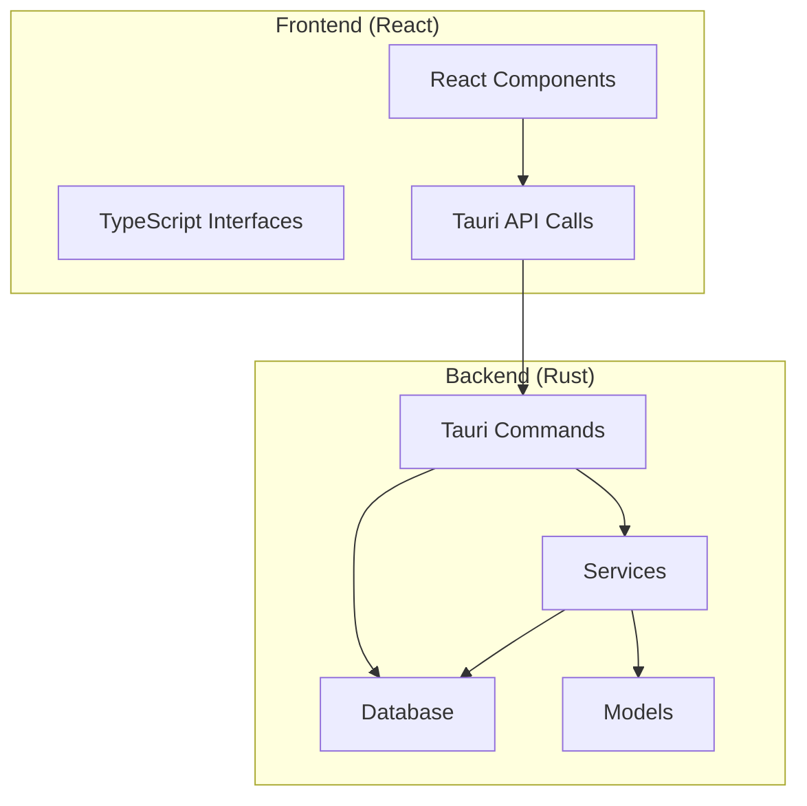
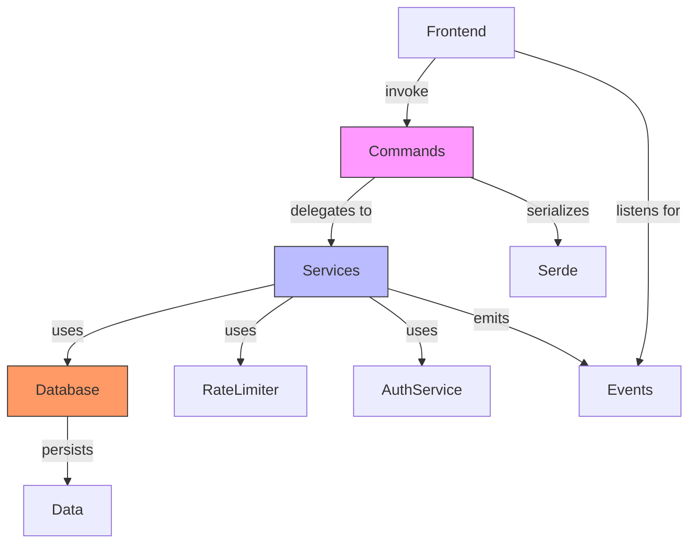
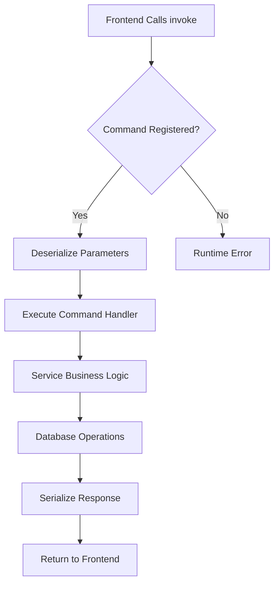
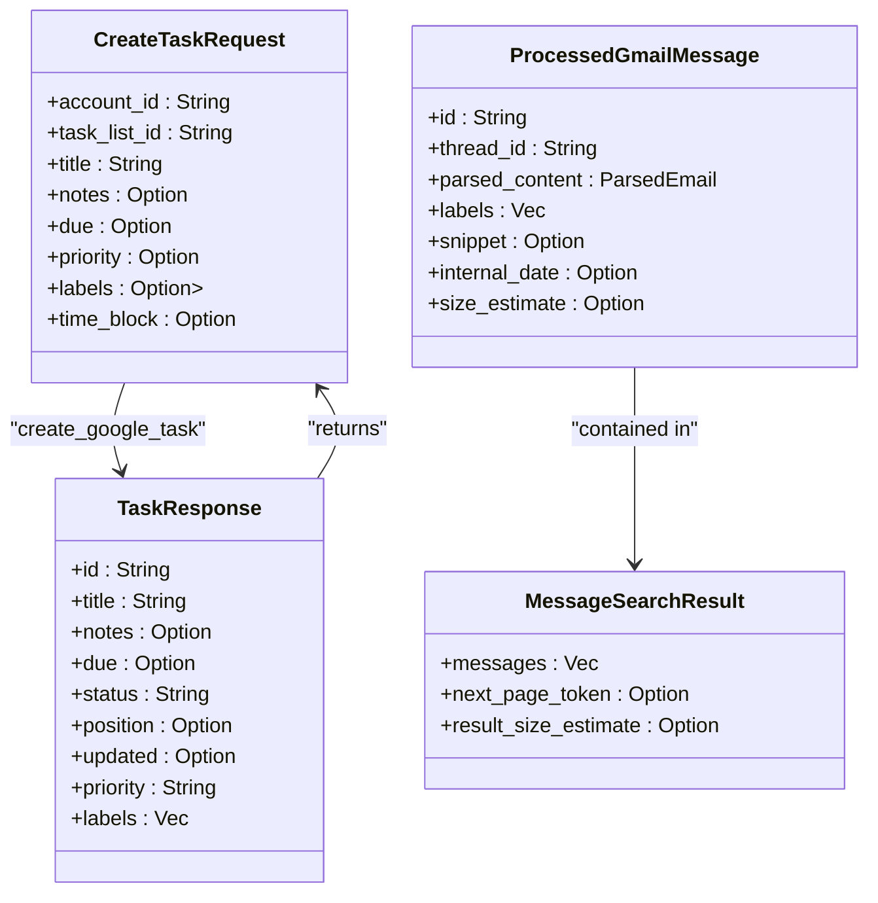
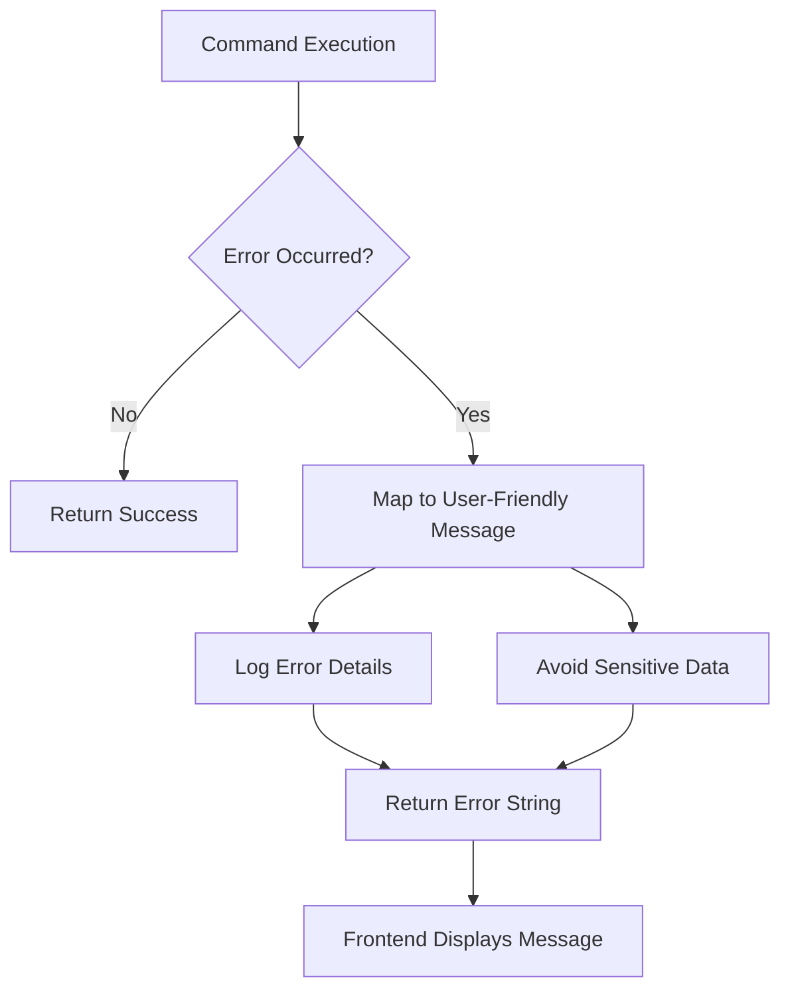
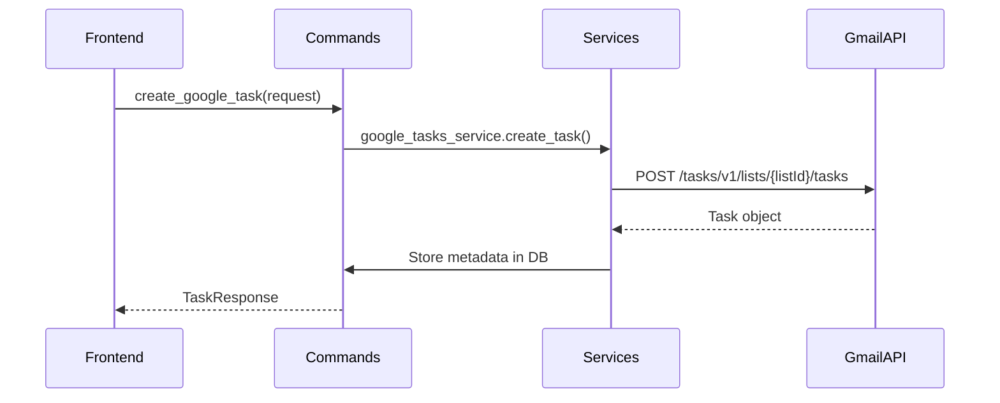
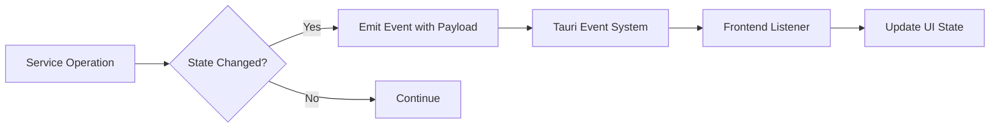
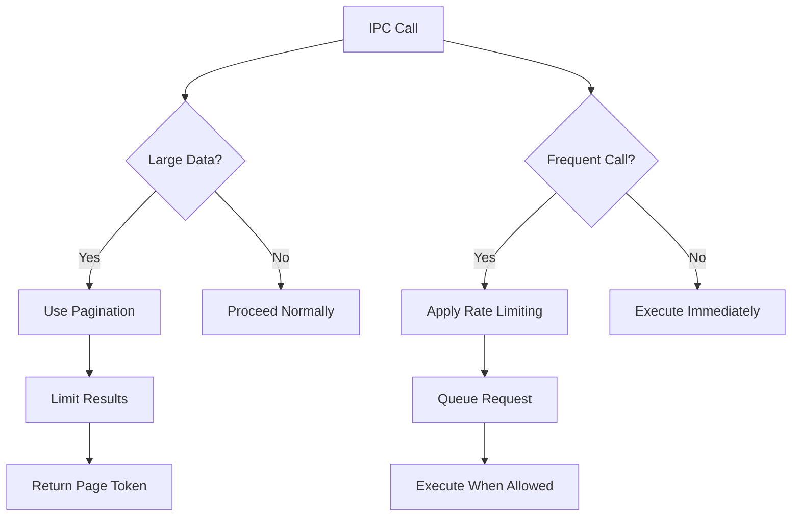
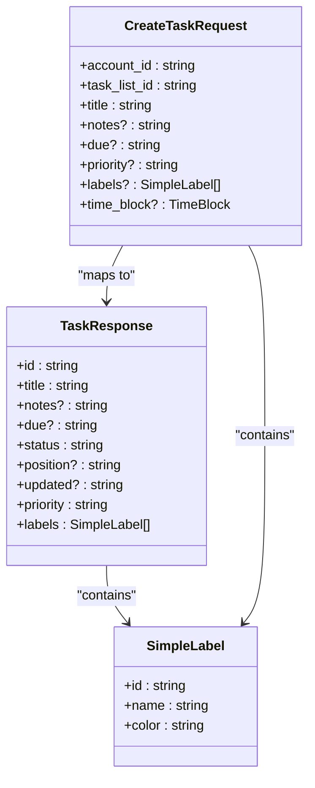
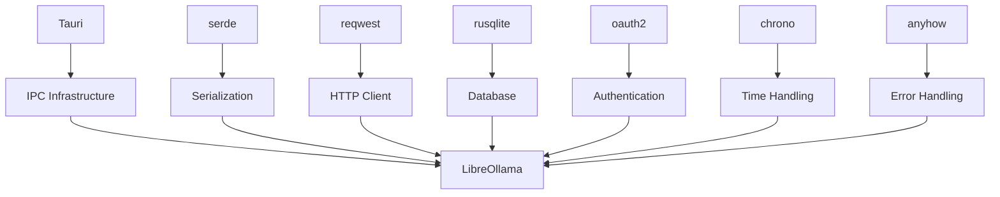

# IPC Communication System

<cite>
**Referenced Files in This Document**   
- [main.rs](file://src-tauri/src/main.rs)
- [lib.rs](file://src-tauri/src/lib.rs)
- [mod.rs](file://src-tauri/src/commands/mod.rs)
- [sync_fixed.rs](file://src-tauri/src/commands/tasks/sync_fixed.rs)
- [api.rs](file://src-tauri/src/commands/gmail/api.rs)
- [auth.rs](file://src-tauri/src/commands/gmail/auth.rs)
- [api_service.rs](file://src-tauri/src/services/gmail/api_service.rs)
- [Cargo.toml](file://src-tauri/Cargo.toml)
</cite>

## Table of Contents
1. [Introduction](#introduction)
2. [Project Structure](#project-structure)
3. [Core Components](#core-components)
4. [Architecture Overview](#architecture-overview)
5. [Detailed Component Analysis](#detailed-component-analysis)
6. [Dependency Analysis](#dependency-analysis)
7. [Performance Considerations](#performance-considerations)
8. [Troubleshooting Guide](#troubleshooting-guide)
9. [Conclusion](#conclusion)

## Introduction
This document provides comprehensive architectural documentation for the IPC communication system in LibreOllama, a Tauri-based desktop application that integrates React frontend with Rust backend. The system enables bidirectional communication between the UI and native functionality through Tauri's invoke and emit mechanisms. The architecture supports secure Gmail integration, task management, and AI-powered features while maintaining type safety across the FFI boundary. This documentation details the command registration process, data serialization, error handling, event-driven updates, and performance optimization strategies.

## Project Structure
The LibreOllama project follows a modular architecture with clear separation between frontend and backend components. The React frontend resides in the `src` directory with standard component organization, while the Rust backend is located in `src-tauri` following Rust crate conventions. The IPC system is centered around Tauri commands organized by domain in the `src-tauri/src/commands` directory, with services encapsulating business logic in `src-tauri/src/services`. Database operations are abstracted in the `database` module, and configuration is managed through the `config` module.

**Diagram sources**
- [lib.rs](file://src-tauri/src/lib.rs#L1-L325)
- [mod.rs](file://src-tauri/src/commands/mod.rs#L1-L47)

**Section sources**
- [src-tauri](file://src-tauri)
- [src](file://src)

## Core Components
The IPC communication system in LibreOllama is built on Tauri's invoke/emit pattern, enabling secure bidirectional communication between the React frontend and Rust backend. The core components include command handlers for Gmail integration, task management, and authentication, with data flowing through well-defined interfaces. The system uses serde for serialization of complex types across the FFI boundary, ensuring type safety and data integrity. Error handling is implemented through Result types that propagate errors from Rust to JavaScript with descriptive messages.

**Section sources**
- [lib.rs](file://src-tauri/src/lib.rs#L1-L325)
- [Cargo.toml](file://src-tauri/Cargo.toml#L1-L84)

## Architecture Overview
The IPC architecture in LibreOllama follows a service-oriented design where Tauri commands act as entry points to backend functionality, delegating business logic to dedicated services. The system uses a rate limiter to prevent API abuse, particularly for Gmail operations, and implements secure token storage for OAuth2 authentication. Database access is abstracted through a DatabaseManager that provides connection pooling and transaction management. The architecture supports feature gating through Cargo features, allowing optional functionality to be compiled in or out based on requirements.

**Diagram sources**
- [lib.rs](file://src-tauri/src/lib.rs#L1-L325)
- [main.rs](file://src-tauri/src/main.rs#L1-L7)

## Detailed Component Analysis

### Command Registration and Routing
The command registration process in LibreOllama is centralized in the `run()` function of `lib.rs`, where all Tauri handlers are registered using `tauri::generate_handler!`. Commands are organized by domain in submodules under `src-tauri/src/commands`, with a top-level `mod.rs` that exports the modules. The routing is static, with each command function annotated with `#[tauri::command]` and registered explicitly in the handler list. This approach provides compile-time safety and clear visibility into all available IPC endpoints.

**Diagram sources**
- [lib.rs](file://src-tauri/src/lib.rs#L1-L325)
- [mod.rs](file://src-tauri/src/commands/mod.rs#L1-L47)

**Section sources**
- [lib.rs](file://src-tauri/src/lib.rs#L1-L325)
- [mod.rs](file://src-tauri/src/commands/mod.rs#L1-L47)

### Data Serialization with Serde
LibreOllama uses serde for serializing complex types across the FFI boundary between Rust and JavaScript. Data structures are defined in Rust with serde derive macros, enabling automatic serialization to JSON format that can be consumed by the TypeScript frontend. The system handles nested objects, enums, and optional fields consistently, with camelCase naming conventions applied to ensure compatibility with JavaScript conventions. This approach eliminates manual serialization code and reduces the risk of data corruption during IPC calls.

**Diagram sources**
- [sync_fixed.rs](file://src-tauri/src/commands/tasks/sync_fixed.rs#L1-L199)
- [api_service.rs](file://src-tauri/src/services/gmail/api_service.rs#L1-L799)

**Section sources**
- [sync_fixed.rs](file://src-tauri/src/commands/tasks/sync_fixed.rs#L1-L199)
- [api_service.rs](file://src-tauri/src/services/gmail/api_service.rs#L1-L799)

### Error Handling Strategy
The IPC system implements a comprehensive error handling strategy that ensures robust error propagation from Rust to JavaScript. All command handlers return a `Result<T, String>` type, where the error case contains a descriptive string message that can be easily consumed by the frontend. The system uses a custom error type hierarchy in the `errors` module that categorizes errors by domain (Gmail API, database, network, etc.), with appropriate error messages generated for each case. This approach provides meaningful feedback to users while maintaining security by avoiding leakage of sensitive implementation details.

**Section sources**
- [lib.rs](file://src-tauri/src/lib.rs#L1-L325)
- [api_service.rs](file://src-tauri/src/services/gmail/api_service.rs#L1-L799)

### Command Patterns Implementation
LibreOllama implements several common command patterns for task and email management. The `get_tasks` pattern retrieves task data from both Google Tasks API and local metadata storage, combining them into a unified response. The `create_task` pattern creates tasks in Google Tasks while storing extended metadata locally, with proper error handling for API failures. The `sync_gmail` pattern synchronizes email data with rate limiting to prevent quota exhaustion, using incremental sync where possible to minimize data transfer.

**Diagram sources**
- [sync_fixed.rs](file://src-tauri/src/commands/tasks/sync_fixed.rs#L1-L199)
- [api.rs](file://src-tauri/src/commands/gmail/api.rs#L1-L132)

**Section sources**
- [sync_fixed.rs](file://src-tauri/src/commands/tasks/sync_fixed.rs#L1-L199)
- [api.rs](file://src-tauri/src/commands/gmail/api.rs#L1-L132)

### Event-Driven Communication
The system implements event-driven communication for real-time updates using Tauri's event system. Services can emit events to the frontend when significant state changes occur, such as sync status changes or new email notifications. The frontend subscribes to these events using the `listen` function, allowing for immediate UI updates without polling. This pattern improves responsiveness and reduces unnecessary API calls, particularly for frequently changing data like sync status.

**Section sources**
- [lib.rs](file://src-tauri/src/lib.rs#L1-L325)
- [api_service.rs](file://src-tauri/src/services/gmail/api_service.rs#L1-L799)

### Performance Optimization
The IPC system includes several performance optimizations for handling large data transfers and reducing call frequency. The rate limiter prevents API abuse and ensures compliance with service quotas, particularly important for Gmail operations. Data is paginated where appropriate, with `max_results` and `page_token` parameters supporting incremental loading. The system implements caching at multiple levels, including in-memory caching of frequently accessed data and database caching of API responses. For large data transfers, the system uses efficient serialization and minimizes unnecessary data copying.

**Section sources**
- [lib.rs](file://src-tauri/src/lib.rs#L1-L325)
- [api_service.rs](file://src-tauri/src/services/gmail/api_service.rs#L1-L799)

### Type Safety Mechanisms
LibreOllama maintains type safety across the FFI boundary through a combination of Rust's strong typing and TypeScript interfaces. Rust data structures are defined with explicit types and serde annotations, ensuring consistent serialization to JSON format. The frontend uses TypeScript interfaces that mirror the Rust structs, providing compile-time type checking for IPC responses. This approach prevents runtime type errors and enables better developer tooling, such as autocompletion and refactoring support. The system also uses strict null checking to handle optional fields appropriately.

**Diagram sources**
- [sync_fixed.rs](file://src-tauri/src/commands/tasks/sync_fixed.rs#L1-L199)
- [types](file://src/types)

**Section sources**
- [sync_fixed.rs](file://src-tauri/src/commands/tasks/sync_fixed.rs#L1-L199)
- [types](file://src/types)

## Dependency Analysis
The IPC communication system has well-defined dependencies managed through Cargo and npm. The backend depends on Tauri for IPC infrastructure, serde for serialization, reqwest for HTTP requests, and rusqlite for database operations. The frontend depends on Tauri's API package for invoke and listen functions, along with TypeScript for type safety. The system uses feature flags to manage optional dependencies, allowing features like Gmail compose and folder management to be compiled conditionally. This approach reduces binary size and attack surface for users who don't need all functionality.

**Diagram sources**
- [Cargo.toml](file://src-tauri/Cargo.toml#L1-L84)
- [lib.rs](file://src-tauri/src/lib.rs#L1-L325)

**Section sources**
- [Cargo.toml](file://src-tauri/Cargo.toml#L1-L84)
- [lib.rs](file://src-tauri/src/lib.rs#L1-L325)

## Performance Considerations
The IPC system is designed with performance in mind, particularly for operations involving large data transfers or frequent API calls. The rate limiter prevents quota exhaustion and ensures fair usage of external APIs. Data is paginated to avoid overwhelming the system with large result sets, and caching is implemented at multiple levels to reduce redundant operations. The system uses efficient data structures and algorithms to minimize memory usage and processing time. For long-running operations, the system provides progress updates through events to maintain UI responsiveness.

**Section sources**
- [lib.rs](file://src-tauri/src/lib.rs#L1-L325)
- [api_service.rs](file://src-tauri/src/services/gmail/api_service.rs#L1-L799)

## Troubleshooting Guide
Common issues with the IPC communication system typically involve authentication failures, rate limiting, or serialization errors. Authentication issues can be diagnosed using the debug commands that check token validity and expiration. Rate limiting problems can be identified by examining the rate limiter state and adjusting configuration as needed. Serialization errors often indicate a mismatch between frontend and backend data structures and can be resolved by ensuring TypeScript interfaces match Rust structs. Network issues may require checking proxy settings or firewall rules that could block API requests.

**Section sources**
- [auth.rs](file://src-tauri/src/commands/gmail/auth.rs#L1-L504)
- [api_service.rs](file://src-tauri/src/services/gmail/api_service.rs#L1-L799)

## Conclusion
The IPC communication system in LibreOllama provides a robust foundation for bidirectional communication between the React frontend and Rust backend. By leveraging Tauri's invoke/emit mechanisms, the system enables secure and efficient data exchange while maintaining type safety through serde serialization and TypeScript interfaces. The architecture supports complex operations like Gmail integration and task management with proper error handling, rate limiting, and performance optimizations. The modular design allows for easy extension and maintenance, making it well-suited for the application's requirements.