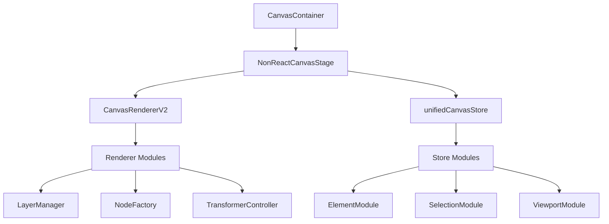
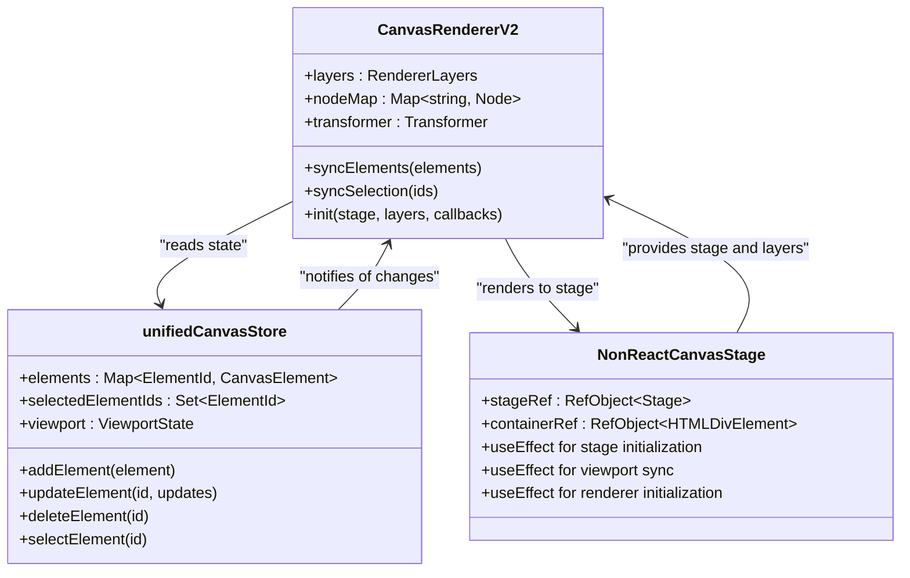
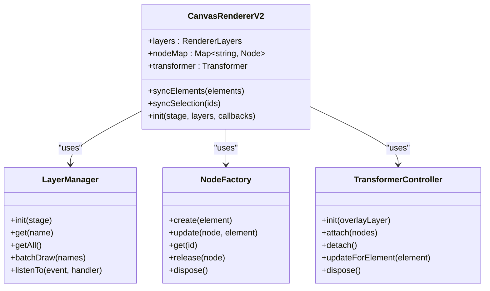
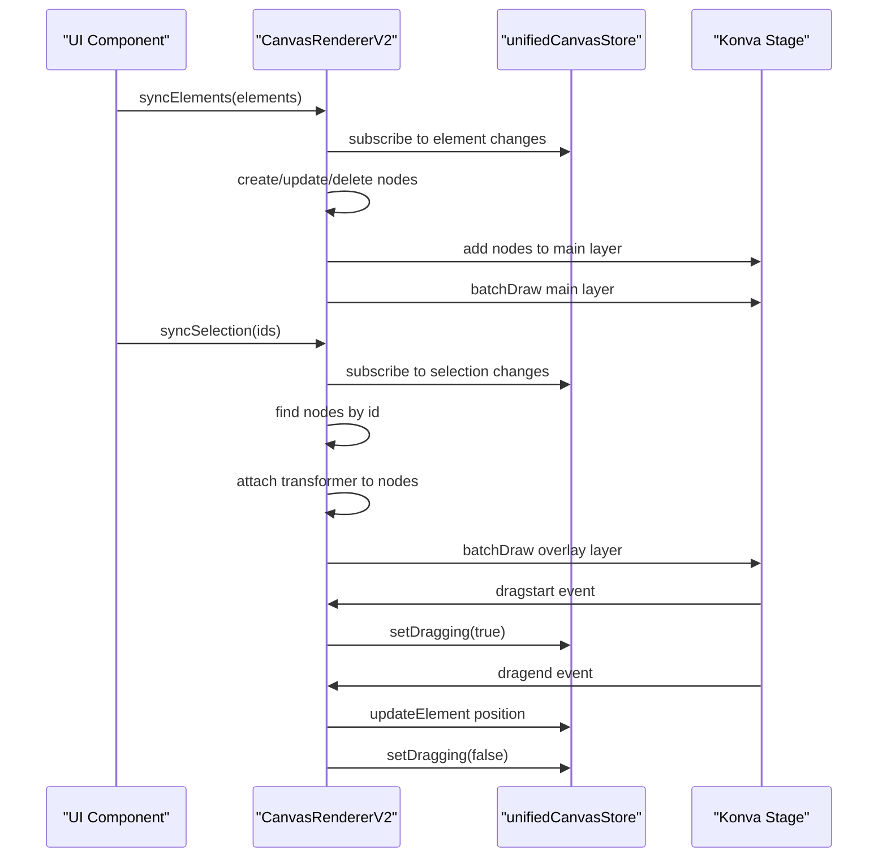
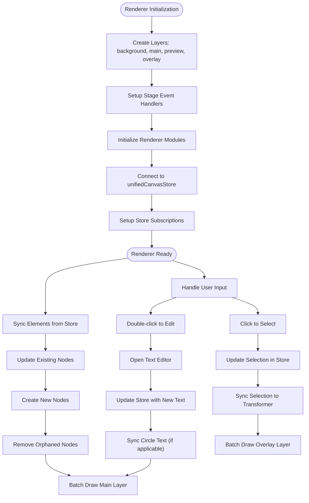
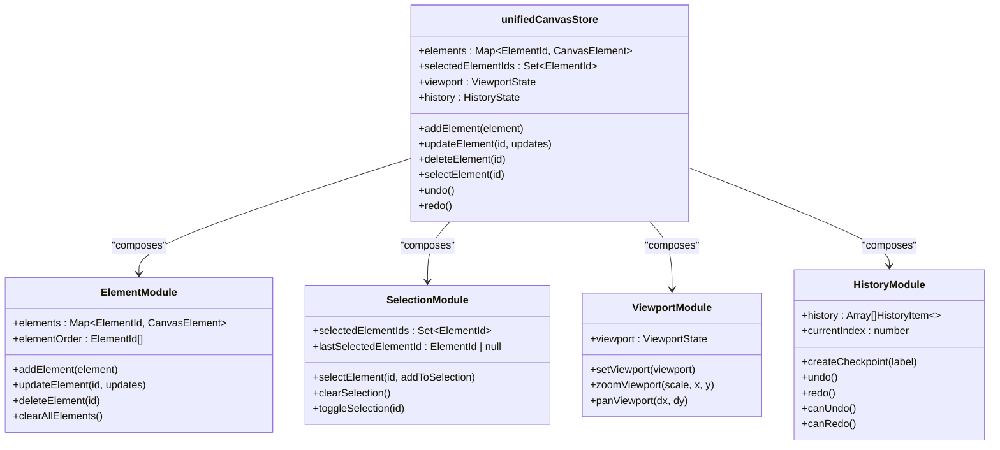
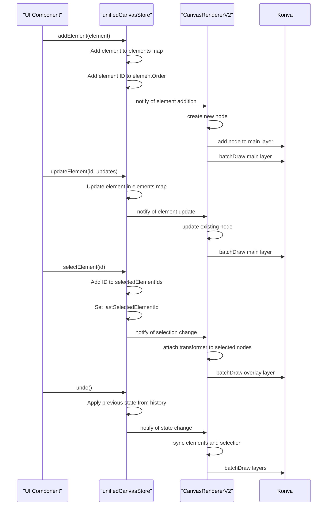
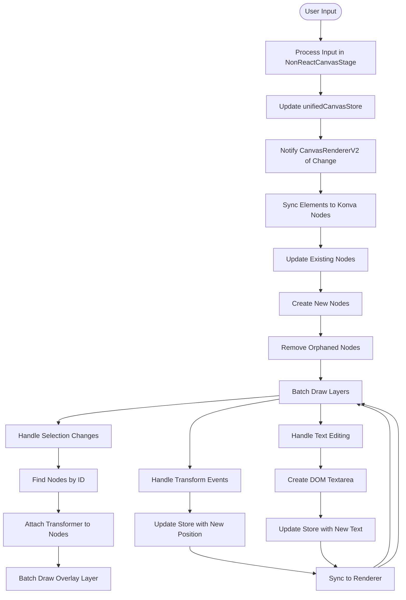
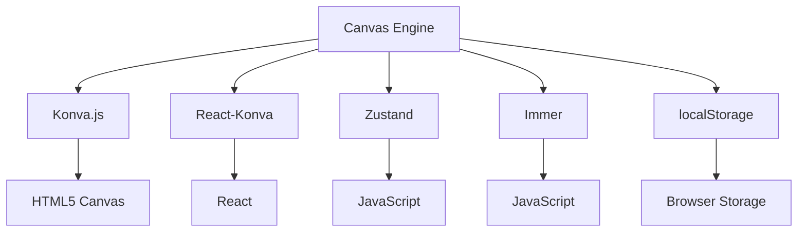

# Canvas Engine

<cite>
**Referenced Files in This Document**   
- [CanvasContainer.tsx](file://src/features/canvas/components/CanvasContainer.tsx)
- [NonReactCanvasStage.tsx](file://src/features/canvas/components/NonReactCanvasStage.tsx)
- [unifiedCanvasStore.ts](file://src/features/canvas/stores/unifiedCanvasStore.ts)
- [CanvasRendererV2.ts](file://src/features/canvas/services/CanvasRendererV2.ts)
- [index.ts](file://src/features/canvas/renderer/index.ts)
- [types.ts](file://src/features/canvas/renderer/types.ts)
- [store-adapter.ts](file://src/features/canvas/renderer/store-adapter.ts)
- [CANVAS_SYSTEM_DOCUMENTATION.md](file://src/features/canvas/CANVAS_SYSTEM_DOCUMENTATION.md)
</cite>

## Table of Contents
1. [Introduction](#introduction)
2. [Project Structure](#project-structure)
3. [Core Components](#core-components)
4. [Architecture Overview](#architecture-overview)
5. [Detailed Component Analysis](#detailed-component-analysis)
6. [Dependency Analysis](#dependency-analysis)
7. [Performance Considerations](#performance-considerations)
8. [Troubleshooting Guide](#troubleshooting-guide)
9. [Conclusion](#conclusion)

## Introduction
The Canvas Engine in LibreOllama is a high-performance drawing and collaboration tool designed to deliver a seamless user experience for creating diagrams, visual content, and interactive designs. Built on modern web technologies, the engine leverages Konva.js for rendering and React-Konva for integration with the React ecosystem. This documentation provides a comprehensive overview of the system's architecture, detailing its component interactions, rendering pipeline, and optimization strategies. The engine supports real-time collaboration, accessibility compliance, and advanced performance optimizations to ensure smooth operation even with complex canvases.

## Project Structure
The Canvas Engine is organized within the `src/features/canvas` directory, which contains a modular and well-structured codebase. The project is divided into several key subdirectories: `components` for UI elements, `hooks` for reusable logic, `renderer` for rendering logic, `services` for business logic, `stores` for state management, `types` for type definitions, and `utils` for utility functions. This structure promotes separation of concerns and facilitates maintainability. The engine integrates with the broader LibreOllama application through the `CanvasContainer` component, which serves as the entry point for the canvas feature.

**Diagram sources**
- [CanvasContainer.tsx](file://src/features/canvas/components/CanvasContainer.tsx)
- [NonReactCanvasStage.tsx](file://src/features/canvas/components/NonReactCanvasStage.tsx)
- [CanvasRendererV2.ts](file://src/features/canvas/services/CanvasRendererV2.ts)
- [unifiedCanvasStore.ts](file://src/features/canvas/stores/unifiedCanvasStore.ts)

**Section sources**
- [CanvasContainer.tsx](file://src/features/canvas/components/CanvasContainer.tsx)
- [NonReactCanvasStage.tsx](file://src/features/canvas/components/NonReactCanvasStage.tsx)

## Core Components
The Canvas Engine consists of several core components that work together to provide a rich drawing experience. The `CanvasContainer` component serves as the main container for the canvas, integrating the stage, toolbar, and sidebar. The `NonReactCanvasStage` component manages the Konva stage and layers, handling user interactions and rendering. The `unifiedCanvasStore` provides centralized state management using Zustand, while the `CanvasRendererV2` class orchestrates the rendering process, coordinating between the store and the Konva stage. These components are designed to be modular and reusable, allowing for easy extension and maintenance.

**Section sources**
- [CanvasContainer.tsx](file://src/features/canvas/components/CanvasContainer.tsx)
- [NonReactCanvasStage.tsx](file://src/features/canvas/components/NonReactCanvasStage.tsx)
- [unifiedCanvasStore.ts](file://src/features/canvas/stores/unifiedCanvasStore.ts)
- [CanvasRendererV2.ts](file://src/features/canvas/services/CanvasRendererV2.ts)

## Architecture Overview
The Canvas Engine follows a modular architecture that separates concerns between rendering, state management, and user interface. The system is built around a central `CanvasRendererV2` class that coordinates the rendering process, working in conjunction with a `unifiedCanvasStore` for state management. The renderer uses Konva.js to manage multiple layers, including background, main content, preview, and overlay layers. This layered approach allows for efficient rendering and interaction handling. The engine supports a wide range of element types, including shapes, text, images, and connectors, each with its own rendering and interaction logic.

**Diagram sources**
- [CanvasRendererV2.ts](file://src/features/canvas/services/CanvasRendererV2.ts)
- [unifiedCanvasStore.ts](file://src/features/canvas/stores/unifiedCanvasStore.ts)
- [NonReactCanvasStage.tsx](file://src/features/canvas/components/NonReactCanvasStage.tsx)

## Detailed Component Analysis

### Canvas Renderer Analysis
The `CanvasRendererV2` class is the heart of the Canvas Engine, responsible for coordinating the rendering process and managing interactions between the Konva stage and the application state. It uses a modular architecture with specialized classes for different aspects of rendering, such as `LayerManager` for layer management, `NodeFactory` for node creation and pooling, and `TransformerController` for selection and transformation. The renderer supports a wide range of element types, each with its own rendering logic, and provides a clean API for creating, updating, and deleting elements.

#### For Object-Oriented Components:

**Diagram sources**
- [CanvasRendererV2.ts](file://src/features/canvas/services/CanvasRendererV2.ts)
- [renderer/index.ts](file://src/features/canvas/renderer/index.ts)

#### For API/Service Components:

**Diagram sources**
- [CanvasRendererV2.ts](file://src/features/canvas/services/CanvasRendererV2.ts)
- [unifiedCanvasStore.ts](file://src/features/canvas/stores/unifiedCanvasStore.ts)

#### For Complex Logic Components:

**Diagram sources**
- [CanvasRendererV2.ts](file://src/features/canvas/services/CanvasRendererV2.ts)
- [unifiedCanvasStore.ts](file://src/features/canvas/stores/unifiedCanvasStore.ts)

**Section sources**
- [CanvasRendererV2.ts](file://src/features/canvas/services/CanvasRendererV2.ts)
- [index.ts](file://src/features/canvas/renderer/index.ts)

### State Management Analysis
The `unifiedCanvasStore` is a Zustand-based store that provides centralized state management for the Canvas Engine. It composes multiple focused modules for better maintainability, including `elementModule` for element CRUD operations, `selectionModule` for multi-selection management, `viewportModule` for pan/zoom state, and `historyModule` for undo/redo operations. The store uses Immer for immutable updates and supports persistence through localStorage. This modular approach allows for better code organization and easier testing.

#### For Object-Oriented Components:

**Diagram sources**
- [unifiedCanvasStore.ts](file://src/features/canvas/stores/unifiedCanvasStore.ts)

#### For API/Service Components:

**Diagram sources**
- [unifiedCanvasStore.ts](file://src/features/canvas/stores/unifiedCanvasStore.ts)
- [CanvasRendererV2.ts](file://src/features/canvas/services/CanvasRendererV2.ts)

**Section sources**
- [unifiedCanvasStore.ts](file://src/features/canvas/stores/unifiedCanvasStore.ts)

### Rendering Pipeline Analysis
The rendering pipeline in the Canvas Engine is designed to be efficient and responsive, handling user input and state changes in a coordinated manner. The pipeline begins with user input, which is processed by the `NonReactCanvasStage` component and translated into actions on the `unifiedCanvasStore`. The `CanvasRendererV2` class listens for changes to the store and updates the Konva stage accordingly. This separation of concerns allows for a clean and maintainable codebase, with clear boundaries between input handling, state management, and rendering.

#### For Complex Logic Components:

**Diagram sources**
- [NonReactCanvasStage.tsx](file://src/features/canvas/components/NonReactCanvasStage.tsx)
- [CanvasRendererV2.ts](file://src/features/canvas/services/CanvasRendererV2.ts)
- [unifiedCanvasStore.ts](file://src/features/canvas/stores/unifiedCanvasStore.ts)

**Section sources**
- [NonReactCanvasStage.tsx](file://src/features/canvas/components/NonReactCanvasStage.tsx)

## Dependency Analysis
The Canvas Engine has a well-defined dependency structure that promotes modularity and maintainability. The core dependencies include Konva.js for rendering, React-Konva for React integration, and Zustand for state management. The engine also uses Immer for immutable updates and supports persistence through localStorage. The modular architecture of the `unifiedCanvasStore` allows for easy extension and testing, with each module responsible for a specific aspect of state management. The `CanvasRendererV2` class depends on the store for state and the Konva stage for rendering, but has no direct dependencies on the UI components, allowing for greater flexibility in the user interface.

**Diagram sources**
- [package.json](file://package.json)

**Section sources**
- [CanvasRendererV2.ts](file://src/features/canvas/services/CanvasRendererV2.ts)
- [unifiedCanvasStore.ts](file://src/features/canvas/stores/unifiedCanvasStore.ts)

## Performance Considerations
The Canvas Engine includes several performance optimizations to ensure smooth operation even with complex canvases. These include object pooling for node reuse, viewport culling to hide off-screen elements, progressive rendering for large canvases, and shape caching for pre-computed element rendering. The engine also uses RAF (RequestAnimationFrame) coordination for single animation frame scheduling and debounced operations for rate-limited user actions. Memory management is handled through weak map caching and automatic garbage collection, with memory pressure detection for auto-cleanup on low memory.

**Section sources**
- [CANVAS_SYSTEM_DOCUMENTATION.md](file://src/features/canvas/CANVAS_SYSTEM_DOCUMENTATION.md)

## Troubleshooting Guide
When troubleshooting issues with the Canvas Engine, start by checking the browser console for any error messages. Common issues include problems with the Konva stage initialization, which can be caused by incorrect container sizing or missing dependencies. If elements are not rendering correctly, verify that the `unifiedCanvasStore` is properly synchronized with the `CanvasRendererV2`. For performance issues, check the browser's performance profiler to identify any bottlenecks in the rendering pipeline. If the canvas is not responding to user input, ensure that the event handlers are properly attached to the Konva stage.

**Section sources**
- [NonReactCanvasStage.tsx](file://src/features/canvas/components/NonReactCanvasStage.tsx)
- [CanvasRendererV2.ts](file://src/features/canvas/services/CanvasRendererV2.ts)

## Conclusion
The Canvas Engine in LibreOllama is a sophisticated and well-architected drawing and collaboration tool that leverages modern web technologies to deliver a high-performance user experience. Its modular design, with clear separation of concerns between rendering, state management, and user interface, makes it both maintainable and extensible. The engine's support for real-time collaboration, accessibility compliance, and advanced performance optimizations ensures that it can handle complex use cases while remaining responsive and user-friendly. By following the principles of clean code and modular architecture, the Canvas Engine provides a solid foundation for future enhancements and integrations.