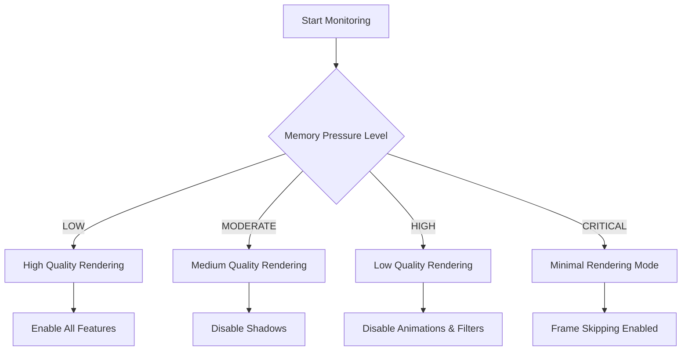
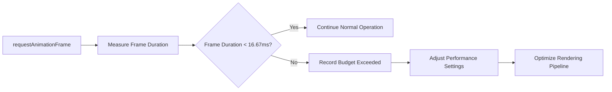
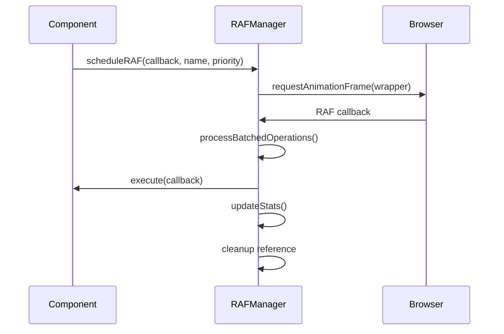
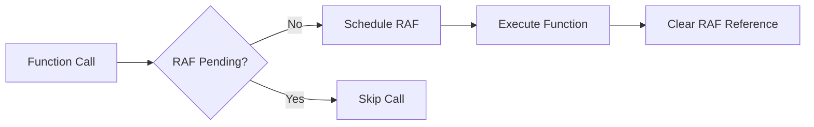
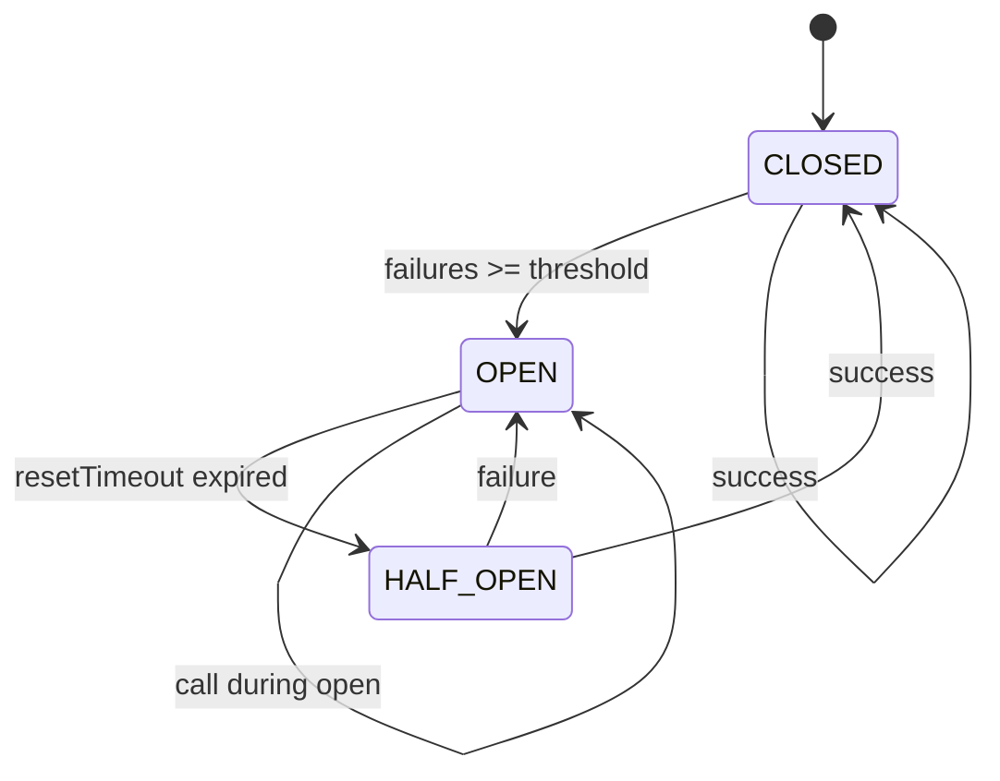
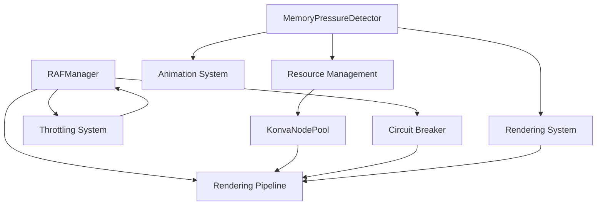

# Performance Optimization

<cite>
**Referenced Files in This Document**   
- [KonvaNodePool.ts](file://src/features/canvas/utils/KonvaNodePool.ts)
- [memoryPressureDetector.ts](file://src/features/canvas/utils/memoryPressureDetector.ts)
- [useRAFManager.ts](file://src/features/canvas/hooks/useRAFManager.ts)
- [circuitBreaker.ts](file://src/features/canvas/utils/circuitBreaker.ts)
- [useRafThrottle.ts](file://src/features/canvas/hooks/useRafThrottle.ts)
</cite>

## Table of Contents
1. [Introduction](#introduction)
2. [Memory Management](#memory-management)
3. [Frame Rate Optimization](#frame-rate-optimization)
4. [Resource Pooling](#resource-pooling)
5. [RequestAnimationFrame Management](#requestanimationframe-management)
6. [Throttling and Circuit Breaker Patterns](#throttling-and-circuit-breaker-patterns)
7. [Component Relationships](#component-relationships)
8. [Common Performance Issues and Solutions](#common-performance-issues-and-solutions)
9. [Conclusion](#conclusion)

## Introduction
This document provides a comprehensive analysis of the Canvas Performance Optimization system in the LibreOllama project. It details the implementation of memory management, frame rate optimization, and resource pooling strategies designed to maintain high responsiveness and prevent performance degradation. The system employs advanced techniques such as requestAnimationFrame management, throttling, and circuit breaker patterns to ensure smooth operation even under heavy load. This documentation aims to make these complex optimization techniques accessible to developers of all experience levels while providing sufficient technical depth for advanced users.

## Memory Management

The Canvas Performance Optimization system implements sophisticated memory management techniques to prevent memory leaks and handle memory pressure effectively. The core of this system is the Memory Pressure Detector, which continuously monitors system resources and adapts application behavior accordingly.

The memory pressure detection system classifies memory conditions into four levels: LOW, MODERATE, HIGH, and CRITICAL. Based on the detected pressure level, the system automatically adjusts various performance parameters including maximum element count, animation settings, shadow rendering, filter application, and render quality. This adaptive approach ensures that the application remains responsive even on devices with limited memory resources.

When memory pressure reaches critical levels, the system implements aggressive optimization measures such as disabling animations and shadows, reducing render quality to low, and enabling frame skipping. These adjustments are made seamlessly to the user while preserving core functionality.



**Diagram sources**
- [memoryPressureDetector.ts](file://src/features/canvas/utils/memoryPressureDetector.ts#L1-L385)

**Section sources**
- [memoryPressureDetector.ts](file://src/features/canvas/utils/memoryPressureDetector.ts#L1-L385)

## Frame Rate Optimization

Frame rate optimization is achieved through a combination of requestAnimationFrame management, performance monitoring, and adaptive rendering techniques. The system targets a consistent 60fps performance by carefully managing the execution of rendering operations and other time-sensitive tasks.

The performance monitoring system tracks frame rate over time, maintaining a history of recent frame durations. This data is used to calculate average frame rates and detect performance degradation. When frame rates drop below acceptable thresholds (45fps or 30fps), the system triggers appropriate responses through the memory pressure detection mechanism.

The system also implements frame budget management, allocating approximately 16.67ms per frame to maintain 60fps. Operations are monitored to ensure they don't exceed this budget, with warnings generated when execution times approach or exceed the allocated time.



**Diagram sources**
- [useRAFManager.ts](file://src/features/canvas/hooks/useRAFManager.ts#L1-L350)

**Section sources**
- [useRAFManager.ts](file://src/features/canvas/hooks/useRAFManager.ts#L1-L350)

## Resource Pooling

Resource pooling is implemented through the KonvaNodePool class, which provides object recycling for Konva elements to reduce garbage collection overhead. This is particularly important during rapid drawing operations where frequent object creation and destruction would otherwise cause performance issues.

The KonvaNodePool maintains separate pools for different node types including lines, rectangles, circles, text elements, groups, images, and transformers. Each pool has a maximum size limit to prevent memory bloat, with a default maximum of 50 nodes per type.

When a node is requested, the system first attempts to reuse an existing node from the pool. If no nodes are available, a new node is created. After use, nodes are reset to their default state and returned to the pool rather than being destroyed. This recycling process significantly reduces the performance cost of frequent element creation.

The system includes periodic cleanup to prevent memory buildup, trimming pools that exceed 80% of their maximum size by removing 30% of their nodes. This ensures that memory usage remains bounded while still providing the performance benefits of object pooling.

```mermaid
classDiagram
class KonvaNodePool {
+pools : Map~string, Node[]~
+maxPoolSize : number
+stats : Map~string, PoolStats~
+acquire(type : string) : Node
+release(node : Node, type : string) : void
+getEfficiencyMetrics() : Metrics
+clearPool(type? : string) : void
}
class PoolStats {
+created : number
+reused : number
+released : number
+maxPoolSize : number
+currentPoolSize : number
}
KonvaNodePool --> PoolStats : "maintains"
KonvaNodePool --> "Node" : "pools"
```

**Diagram sources**
- [KonvaNodePool.ts](file://src/features/canvas/utils/KonvaNodePool.ts#L1-L351)

**Section sources**
- [KonvaNodePool.ts](file://src/features/canvas/utils/KonvaNodePool.ts#L1-L351)

## RequestAnimationFrame Management

The requestAnimationFrame (RAF) management system provides a comprehensive solution for scheduling and executing animation frames efficiently. The useRafManager hook offers advanced features including named RAF tracking, priority-based scheduling, and automatic cleanup.

The system supports multiple priority levels for RAF operations: LOW, NORMAL, HIGH, and CRITICAL. This allows important operations to be prioritized over less critical ones, ensuring that essential updates are processed first. The manager also provides batching capabilities, allowing multiple operations to be grouped and processed within a single frame to improve efficiency.

Automatic cleanup is implemented to prevent memory leaks, with all pending RAF calls canceled when components are unmounted. The system also includes development-time monitoring that warns about high RAF counts or long-running RAF operations, helping developers identify potential performance issues.

The useSingleRAF hook provides a simplified interface for components that need only one active RAF at a time, automatically canceling the previous RAF when a new one is scheduled.



**Diagram sources**
- [useRAFManager.ts](file://src/features/canvas/hooks/useRAFManager.ts#L1-L350)

**Section sources**
- [useRAFManager.ts](file://src/features/canvas/hooks/useRAFManager.ts#L1-L350)

## Throttling and Circuit Breaker Patterns

### Throttling Implementation

The system implements throttling through the useRafThrottle hook, which limits function calls to once per animation frame. This prevents excessive updates during rapid events such as mouse movements or scroll operations.

The throttling mechanism uses requestAnimationFrame to batch multiple function calls that occur within the same frame, executing only the last call. This significantly reduces the number of executions while maintaining responsiveness.



**Diagram sources**
- [useRafThrottle.ts](file://src/features/canvas/hooks/useRafThrottle.ts#L1-L27)

### Circuit Breaker Pattern

The circuit breaker system protects against cascade failures by automatically aborting operations that exceed time limits or fail repeatedly. It implements three states: CLOSED (normal operation), OPEN (failing fast), and HALF_OPEN (testing recovery).

The system includes a registry that manages multiple circuit breakers for different types of operations:
- createElement: For element creation operations
- batchUpdate: For batch update operations
- render: For rendering operations
- spatialIndex: For spatial indexing operations
- fileOperation: For file operations

Each circuit breaker has configurable parameters including timeout duration, failure threshold, and reset timeout. When an operation fails repeatedly, the circuit opens, immediately failing subsequent calls without attempting execution. After a configured reset timeout, the circuit enters half-open state to test recovery.



**Diagram sources**
- [circuitBreaker.ts](file://src/features/canvas/utils/circuitBreaker.ts#L1-L378)

**Section sources**
- [circuitBreaker.ts](file://src/features/canvas/utils/circuitBreaker.ts#L1-L378)
- [useRafThrottle.ts](file://src/features/canvas/hooks/useRafThrottle.ts#L1-L27)

## Component Relationships

The performance optimization components work together to create a cohesive system that maintains responsiveness under various conditions. The relationships between these components form a layered defense against performance degradation.

The MemoryPressureDetector acts as the central monitoring system, observing memory usage, frame rate, and response time. When pressure levels change, it notifies subscribers who can adjust their behavior accordingly. This includes the rendering system, which may reduce quality settings, and the resource management system, which may become more aggressive in cleanup operations.

The RAFManager coordinates animation frame scheduling across the application, ensuring that operations are executed efficiently and without conflicts. It works closely with the throttling system to prevent excessive updates and with the circuit breaker system to handle long-running operations.

The KonvaNodePool provides resource efficiency at the object level, reducing garbage collection overhead. This directly supports the frame rate optimization goals by minimizing jank caused by GC pauses.



**Diagram sources**
- [memoryPressureDetector.ts](file://src/features/canvas/utils/memoryPressureDetector.ts#L1-L385)
- [useRAFManager.ts](file://src/features/canvas/hooks/useRAFManager.ts#L1-L350)
- [circuitBreaker.ts](file://src/features/canvas/utils/circuitBreaker.ts#L1-L378)
- [KonvaNodePool.ts](file://src/features/canvas/utils/KonvaNodePool.ts#L1-L351)

**Section sources**
- [memoryPressureDetector.ts](file://src/features/canvas/utils/memoryPressureDetector.ts#L1-L385)
- [useRAFManager.ts](file://src/features/canvas/hooks/useRAFManager.ts#L1-L350)
- [circuitBreaker.ts](file://src/features/canvas/utils/circuitBreaker.ts#L1-L378)
- [KonvaNodePool.ts](file://src/features/canvas/utils/KonvaNodePool.ts#L1-L351)

## Common Performance Issues and Solutions

### Memory Leaks

Memory leaks are prevented through several mechanisms:
- Automatic cleanup of RAF callbacks when components unmount
- Object pooling to reduce garbage collection frequency
- Periodic cleanup of oversized pools
- Explicit destruction of circuit breaker resources

The system includes monitoring tools that help identify potential leaks, such as warnings about long-running RAF operations or high RAF counts.

### Jank and Frame Drops

Jank is minimized through:
- Frame budget management (16.67ms target)
- Operation batching within frames
- Priority-based scheduling
- Adaptive quality settings based on system pressure
- Efficient resource pooling

When frame rates drop, the system automatically reduces rendering quality and disables non-essential features to maintain responsiveness.

### Long-Running Operations

The circuit breaker pattern prevents long-running operations from blocking the main thread. Operations that exceed their timeout are automatically aborted, and repeated failures trigger the circuit to open, failing fast and allowing the application to remain responsive.

For operations that must complete, the system provides mechanisms to break them into smaller chunks processed across multiple frames using RAF scheduling.

### Resource Exhaustion

Under high memory pressure, the system implements progressive degradation:
- At MODERATE pressure: Disable shadows
- At HIGH pressure: Disable animations and filters, reduce quality
- At CRITICAL pressure: Enable frame skipping, limit element count

This ensures that the application remains usable even on low-end devices or when handling large documents.

**Section sources**
- [memoryPressureDetector.ts](file://src/features/canvas/utils/memoryPressureDetector.ts#L1-L385)
- [useRAFManager.ts](file://src/features/canvas/hooks/useRAFManager.ts#L1-L350)
- [circuitBreaker.ts](file://src/features/canvas/utils/circuitBreaker.ts#L1-L378)
- [KonvaNodePool.ts](file://src/features/canvas/utils/KonvaNodePool.ts#L1-L351)

## Conclusion

The Canvas Performance Optimization system in LibreOllama demonstrates a comprehensive approach to maintaining high performance and responsiveness. By combining memory management, frame rate optimization, resource pooling, and intelligent execution control, the system effectively handles the challenges of complex canvas operations.

The implementation of the KonvaNodePool provides significant performance benefits by reducing garbage collection overhead through object recycling. The memory pressure detection system enables adaptive behavior that maintains usability across different device capabilities. The sophisticated requestAnimationFrame management ensures smooth animations while preventing resource exhaustion.

These optimization techniques work together to create a resilient system that can handle demanding workloads while remaining responsive. The use of patterns like circuit breakers and throttling provides protection against cascade failures and ensures that the application remains stable even when individual operations encounter issues.

For developers, the system provides both high-level hooks for common use cases and low-level access for custom optimization needs. This balance makes the performance system accessible to beginners while offering the depth required by experienced developers implementing advanced optimizations.