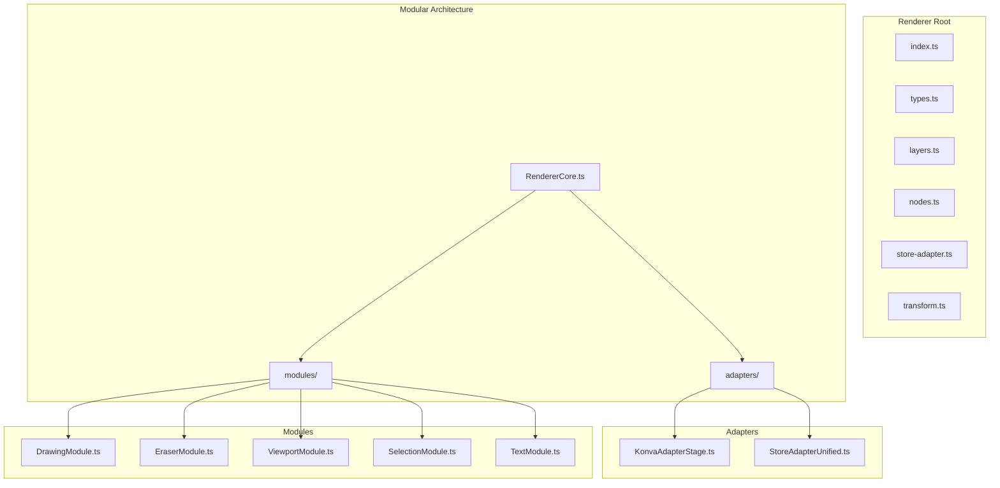
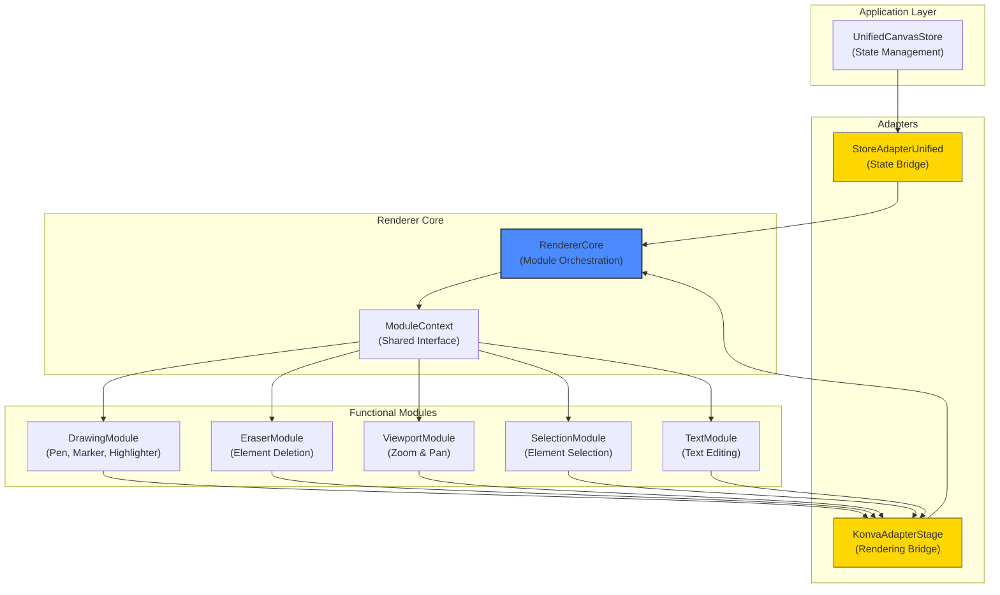
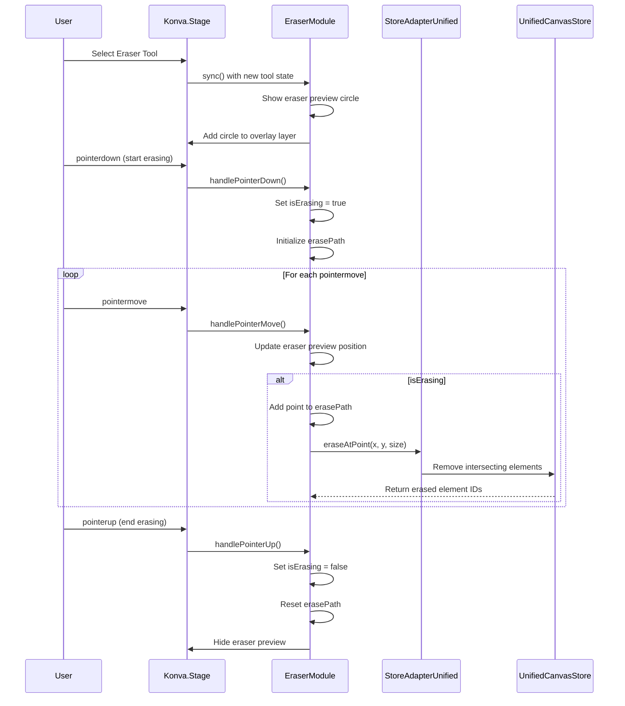
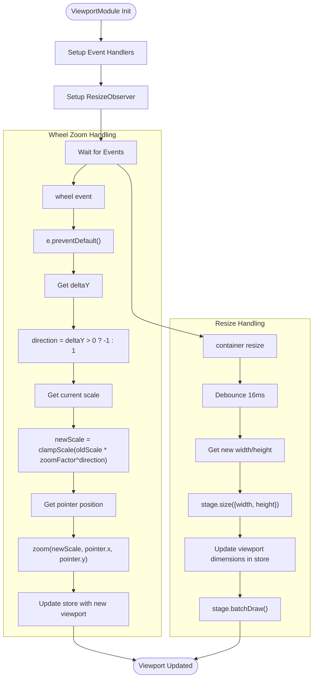
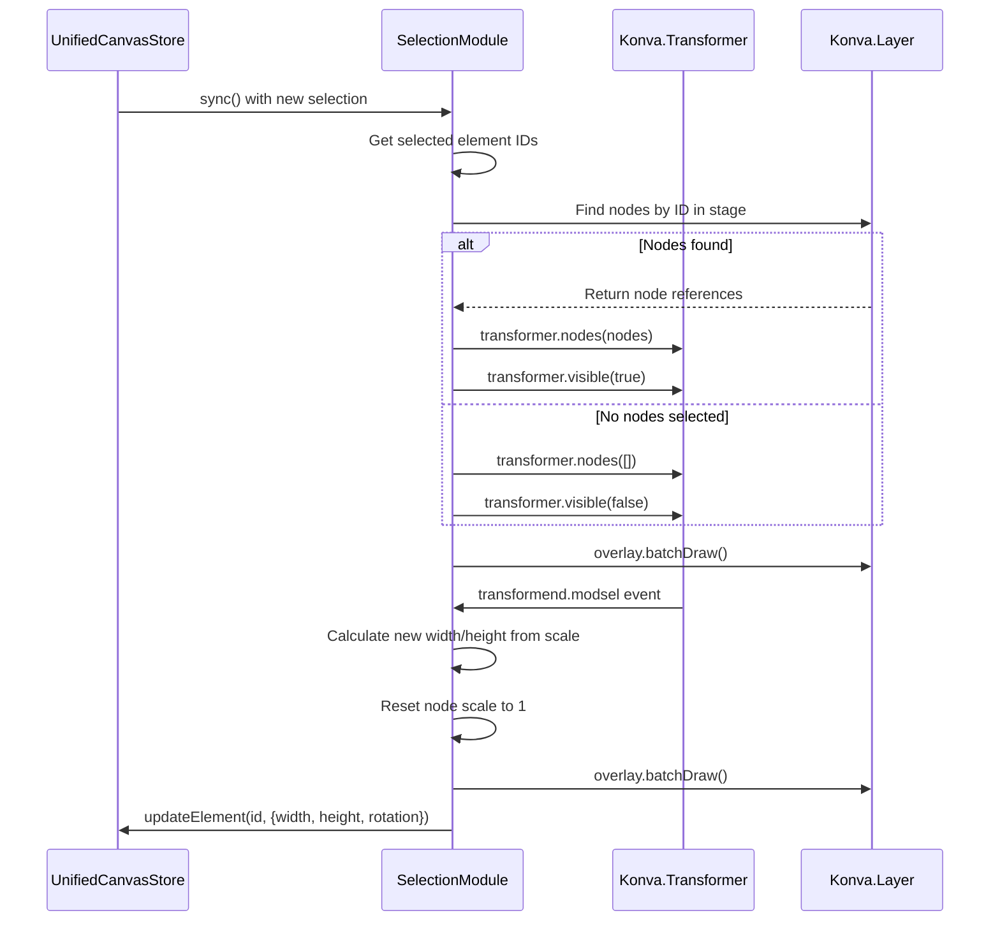
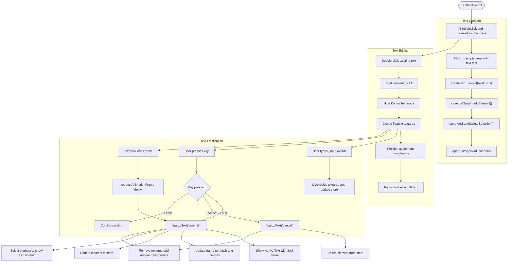
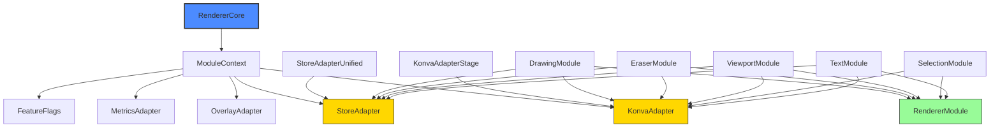

# Renderer Architecture

<cite>
**Referenced Files in This Document**   
- [RendererCore.ts](file://src/features/canvas/renderer/modular/RendererCore.ts)
- [types.ts](file://src/features/canvas/renderer/modular/types.ts)
- [StoreAdapterUnified.ts](file://src/features/canvas/renderer/modular/adapters/StoreAdapterUnified.ts)
- [KonvaAdapterStage.ts](file://src/features/canvas/renderer/modular/adapters/KonvaAdapterStage.ts)
- [DrawingModule.ts](file://src/features/canvas/renderer/modular/modules/DrawingModule.ts)
- [EraserModule.ts](file://src/features/canvas/renderer/modular/modules/EraserModule.ts)
- [ViewportModule.ts](file://src/features/canvas/renderer/modular/modules/ViewportModule.ts)
- [SelectionModule.ts](file://src/features/canvas/renderer/modular/modules/SelectionModule.ts)
- [TextModule.ts](file://src/features/canvas/renderer/modular/modules/TextModule.ts)
</cite>

## Table of Contents
1. [Introduction](#introduction)
2. [Project Structure](#project-structure)
3. [Core Components](#core-components)
4. [Architecture Overview](#architecture-overview)
5. [Detailed Component Analysis](#detailed-component-analysis)
6. [Dependency Analysis](#dependency-analysis)
7. [Performance Considerations](#performance-considerations)
8. [Troubleshooting Guide](#troubleshooting-guide)
9. [Conclusion](#conclusion)

## Introduction
This document provides comprehensive architectural documentation for the Canvas Renderer in LibreOllama, a modular rendering system designed to handle drawing operations, element management, and state synchronization. The renderer integrates with React-Konva and implements a plugin-based architecture that separates concerns across drawing, selection, viewport management, and text editing. The system is built around a core that orchestrates multiple modules through a well-defined context interface, enabling extensibility while maintaining performance and consistency. This documentation details the high-level design, component interactions, rendering pipeline, and cross-cutting concerns such as performance optimization and error handling.

## Project Structure
The Canvas Renderer is organized within the `src/features/canvas/renderer` directory, following a modular architecture pattern. The structure separates core functionality from adapters, modules, and utilities, enabling clean separation of concerns and maintainability.



**Diagram sources**
- [RendererCore.ts](file://src/features/canvas/renderer/modular/RendererCore.ts)
- [types.ts](file://src/features/canvas/renderer/modular/types.ts)

**Section sources**
- [RendererCore.ts](file://src/features/canvas/renderer/modular/RendererCore.ts)
- [types.ts](file://src/features/canvas/renderer/modular/types.ts)

## Core Components
The Canvas Renderer system is built around several core components that work together to provide a responsive and performant drawing experience. The architecture follows a modular design pattern where the RendererCore orchestrates various specialized modules through a shared context. Each module handles a specific aspect of canvas functionality, such as drawing, erasing, or text editing, while the adapters provide abstraction layers between the renderer and external systems like the state store and Konva.js rendering engine. This separation enables independent development, testing, and optimization of each functional area while maintaining a cohesive user experience.

**Section sources**
- [RendererCore.ts](file://src/features/canvas/renderer/modular/RendererCore.ts)
- [types.ts](file://src/features/canvas/renderer/modular/types.ts)

## Architecture Overview
The Canvas Renderer implements a modular architecture that decouples core rendering functionality from specific implementation details. At the heart of the system is the RendererCore, which manages the lifecycle of various modules and coordinates state synchronization. The architecture follows a clean separation between the rendering engine (Konva.js), the application state (Zustand store), and the user interaction logic (modules). This design enables the system to handle complex drawing operations while maintaining responsiveness and scalability.



**Diagram sources**
- [RendererCore.ts](file://src/features/canvas/renderer/modular/RendererCore.ts)
- [StoreAdapterUnified.ts](file://src/features/canvas/renderer/modular/adapters/StoreAdapterUnified.ts)
- [KonvaAdapterStage.ts](file://src/features/canvas/renderer/modular/adapters/KonvaAdapterStage.ts)

## Detailed Component Analysis
This section provides an in-depth analysis of each key component in the Canvas Renderer system, detailing their responsibilities, interactions, and implementation patterns. The modular design enables each component to focus on a specific aspect of canvas functionality while maintaining loose coupling through well-defined interfaces.

### Drawing Module Analysis
The DrawingModule handles pen, marker, and highlighter drawing functionality, implementing high-performance preview rendering and RAF (RequestAnimationFrame) batching to ensure smooth user experience. It manages drawing state, handles pointer events, and commits strokes to the store through optimized drawing paths.

```mermaid
classDiagram
class DrawingModule {
-isDrawing : boolean
-currentTool : 'pen'|'marker'|'highlighter'|null
-points : number[]
-lastPoint : {x : number, y : number}|null
-pooledNode : Konva.Line|null
-previewLayer : Konva.Layer|null
-rafId : number
-pendingUpdate : boolean
+init(ctx : ModuleContext) : void
+sync(snapshot : CanvasSnapshot) : void
+onEvent(evt : CanvasEvent, snapshot : CanvasSnapshot) : boolean
+destroy() : void
-handlePointerDown(e : KonvaEventObject) : void
-handlePointerMove(e : KonvaEventObject) : void
-handlePointerUp(e : KonvaEventObject) : void
-addPoint(x : number, y : number) : void
-setupPreviewLine() : void
-schedulePreviewUpdate() : void
-updatePreviewLine() : void
-getToolStyle(tool : string) : any
-commitDrawing() : void
-commitPenStroke() : void
-commitMarkerStroke() : void
-commitHighlighterStroke() : void
-resetDrawingState() : void
}
class RendererModule {
<<interface>>
+init(ctx : ModuleContext) : void | Promise~void~
+sync(snapshot : CanvasSnapshot) : void
+onEvent?(evt : CanvasEvent, snapshot : CanvasSnapshot) : boolean
+destroy() : void
}
DrawingModule --|> RendererModule
```

**Diagram sources**
- [DrawingModule.ts](file://src/features/canvas/renderer/modular/modules/DrawingModule.ts)
- [types.ts](file://src/features/canvas/renderer/modular/types.ts)

**Section sources**
- [DrawingModule.ts](file://src/features/canvas/renderer/modular/modules/DrawingModule.ts)

### Eraser Module Analysis
The EraserModule provides eraser tool functionality with visual preview, hit-testing, and element deletion capabilities. It implements incremental erasing during pointer movement and maintains a preview circle that follows the cursor, providing visual feedback to users.



**Diagram sources**
- [EraserModule.ts](file://src/features/canvas/renderer/modular/modules/EraserModule.ts)
- [StoreAdapterUnified.ts](file://src/features/canvas/renderer/modular/adapters/StoreAdapterUnified.ts)

**Section sources**
- [EraserModule.ts](file://src/features/canvas/renderer/modular/modules/EraserModule.ts)

### Viewport Module Analysis
The ViewportModule manages all viewport transformations including zoom, pan, and coordinate conversions between screen and world spaces. It implements wheel-based zooming with center-point preservation and container resize handling through ResizeObserver.



**Diagram sources**
- [ViewportModule.ts](file://src/features/canvas/renderer/modular/modules/ViewportModule.ts)
- [StoreAdapterUnified.ts](file://src/features/canvas/renderer/modular/adapters/StoreAdapterUnified.ts)

**Section sources**
- [ViewportModule.ts](file://src/features/canvas/renderer/modular/modules/ViewportModule.ts)

### Selection Module Analysis
The SelectionModule manages element selection and transformation using Konva's Transformer component. It synchronizes selected elements between the store and the visual transformer, enabling users to resize, rotate, and manipulate selected elements.



**Diagram sources**
- [SelectionModule.ts](file://src/features/canvas/renderer/modular/modules/SelectionModule.ts)
- [StoreAdapterUnified.ts](file://src/features/canvas/renderer/modular/adapters/StoreAdapterUnified.ts)

**Section sources**
- [SelectionModule.ts](file://src/features/canvas/renderer/modular/modules/SelectionModule.ts)

### Text Module Analysis
The TextModule handles text element creation and editing, implementing a dual-mode system where users can create new text elements or edit existing ones. It manages a floating textarea editor that overlays the canvas during text input.



**Diagram sources**
- [TextModule.ts](file://src/features/canvas/renderer/modular/modules/TextModule.ts)
- [StoreAdapterUnified.ts](file://src/features/canvas/renderer/modular/adapters/StoreAdapterUnified.ts)

**Section sources**
- [TextModule.ts](file://src/features/canvas/renderer/modular/modules/TextModule.ts)

## Dependency Analysis
The Canvas Renderer system has a well-defined dependency structure that ensures loose coupling between components while maintaining clear interaction patterns. The core dependency is the RendererCore, which depends on the ModuleContext interface rather than concrete implementations, enabling dependency inversion.



**Diagram sources**
- [RendererCore.ts](file://src/features/canvas/renderer/modular/RendererCore.ts)
- [types.ts](file://src/features/canvas/renderer/modular/types.ts)
- [StoreAdapterUnified.ts](file://src/features/canvas/renderer/modular/adapters/StoreAdapterUnified.ts)
- [KonvaAdapterStage.ts](file://src/features/canvas/renderer/modular/adapters/KonvaAdapterStage.ts)

**Section sources**
- [RendererCore.ts](file://src/features/canvas/renderer/modular/RendererCore.ts)
- [types.ts](file://src/features/canvas/renderer/modular/types.ts)

## Performance Considerations
The Canvas Renderer implements several performance optimizations to ensure smooth user experience during intensive drawing operations. These include RAF batching for preview updates, node pooling for frequently created elements, and debounced resize handling. The DrawingModule uses requestAnimationFrame to batch preview line updates, preventing excessive rendering during rapid pointer movements. The system also implements a node pooling mechanism through acquireNode and releaseNode functions to reduce garbage collection overhead when creating and destroying temporary rendering elements. Resize operations are debounced using a 16ms timeout (approximately 60fps) to prevent excessive reflows during window resizing. The modular architecture itself contributes to performance by allowing selective module initialization and destruction based on current tool usage, reducing memory footprint and event listener overhead.

## Troubleshooting Guide
When diagnosing issues with the Canvas Renderer, focus on the interaction between modules, adapters, and the global store. Common issues include event handling conflicts between modular and legacy systems, incorrect coordinate transformations, and state synchronization problems. For drawing issues, verify that the DrawingModule is properly receiving pointer events and that the preview layer is correctly configured. For eraser problems, check that the eraser preview circle is properly added to the overlay layer and that the store's eraseAtPoint method is being called with correct parameters. Text editing issues often stem from timing conflicts between the floating textarea and Konva rendering, so ensure proper event propagation prevention and RAF scheduling. Viewport synchronization problems typically indicate mismatches between the store's viewport state and the Konva stage's scale and position properties. Use the extensive console logging in each module (prefixed with [ModuleName]) to trace the execution flow and identify where operations may be failing.

**Section sources**
- [DrawingModule.ts](file://src/features/canvas/renderer/modular/modules/DrawingModule.ts)
- [EraserModule.ts](file://src/features/canvas/renderer/modular/modules/EraserModule.ts)
- [ViewportModule.ts](file://src/features/canvas/renderer/modular/modules/ViewportModule.ts)
- [TextModule.ts](file://src/features/canvas/renderer/modular/modules/TextModule.ts)

## Conclusion
The Canvas Renderer in LibreOllama implements a sophisticated modular architecture that effectively separates concerns while maintaining high performance and responsiveness. The system's design around the RendererCore and ModuleContext interface enables extensibility and maintainability, allowing new functionality to be added without disrupting existing code. The integration with React-Konva through adapter patterns provides a clean abstraction layer between the rendering engine and application state, facilitating state synchronization and event handling. Performance optimizations such as RAF batching, node pooling, and debounced resizing ensure a smooth user experience even during intensive drawing operations. The architecture successfully balances complexity with functionality, providing a robust foundation for a feature-rich canvas editing experience.