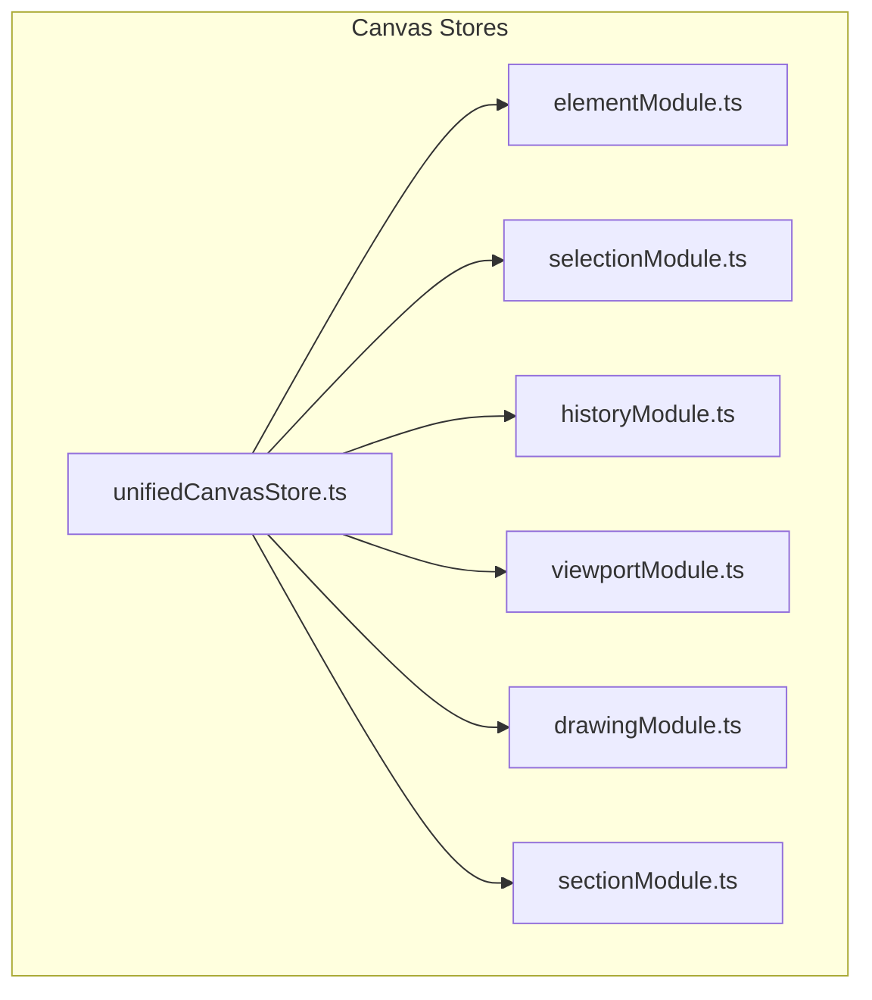
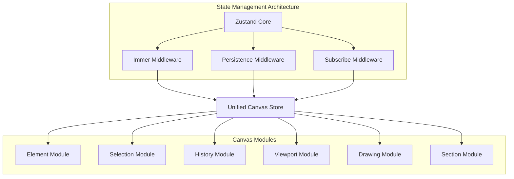
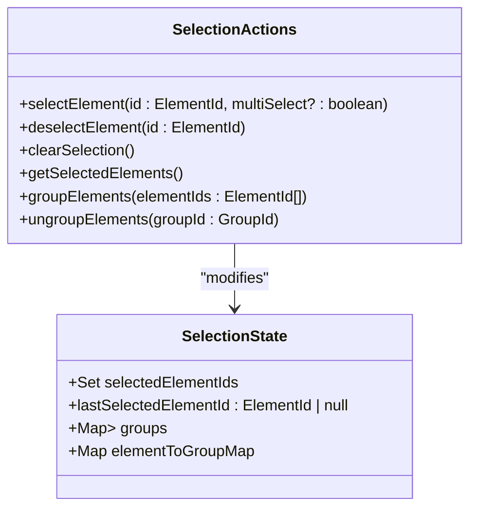
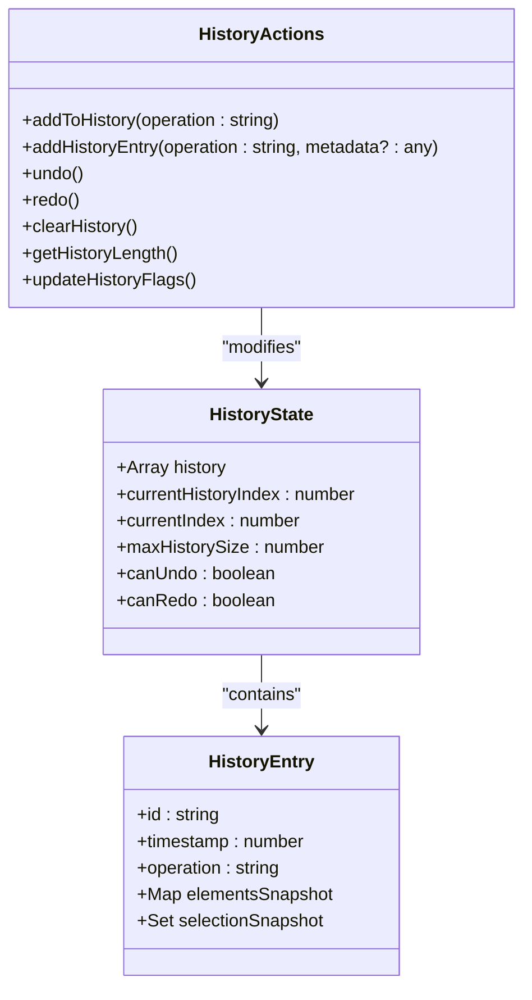
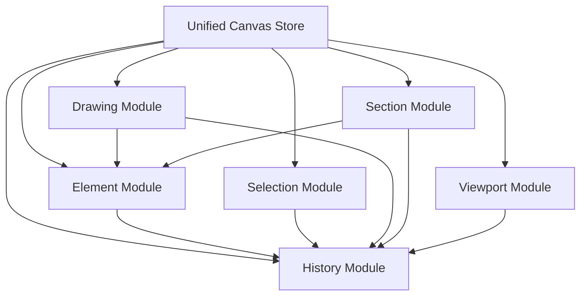

# State Management

<cite>
**Referenced Files in This Document**   
- [unifiedCanvasStore.ts](file://src/features/canvas/stores/unifiedCanvasStore.ts)
- [elementModule.ts](file://src/features/canvas/stores/modules/elementModule.ts)
- [selectionModule.ts](file://src/features/canvas/stores/modules/selectionModule.ts)
- [historyModule.ts](file://src/features/canvas/stores/modules/historyModule.ts)
- [sectionModule.ts](file://src/features/canvas/stores/modules/sectionModule.ts)
- [viewportModule.ts](file://src/features/canvas/stores/modules/viewportModule.ts)
- [drawingModule.ts](file://src/features/canvas/stores/modules/drawingModule.ts)
</cite>

## Table of Contents
1. [Introduction](#introduction)
2. [Project Structure](#project-structure)
3. [Core Components](#core-components)
4. [Architecture Overview](#architecture-overview)
5. [Detailed Component Analysis](#detailed-component-analysis)
6. [Dependency Analysis](#dependency-analysis)
7. [Performance Considerations](#performance-considerations)
8. [Troubleshooting Guide](#troubleshooting-guide)
9. [Conclusion](#conclusion)

## Introduction
This document provides comprehensive documentation for the Canvas State Management system in LibreOllama. It details the entity relationships between canvas elements, selection states, and history transactions. The unifiedCanvasStore serves as the central state management system, integrating modular components for elements, selection, viewport, drawing, history, sections, and UI state. The architecture leverages Zustand with Immer and persistence middleware to provide a reactive, type-safe, and persistable state management solution. The system supports advanced features including transaction batching, undo/redo functionality, spatial indexing for eraser operations, and section-based element containment.

## Project Structure
The Canvas State Management system is organized within the `src/features/canvas/stores` directory, following a modular architecture pattern. The core store is implemented in `unifiedCanvasStore.ts`, which composes multiple focused modules for better maintainability. Each module encapsulates specific functionality and state, promoting separation of concerns and easier testing. The modular design allows for independent development and optimization of different aspects of the canvas state.



**Diagram sources**
- [unifiedCanvasStore.ts](file://src/features/canvas/stores/unifiedCanvasStore.ts#L1-L50)
- [elementModule.ts](file://src/features/canvas/stores/modules/elementModule.ts#L1-L20)
- [selectionModule.ts](file://src/features/canvas/stores/modules/selectionModule.ts#L1-L20)

**Section sources**
- [unifiedCanvasStore.ts](file://src/features/canvas/stores/unifiedCanvasStore.ts#L1-L50)

## Core Components
The Canvas State Management system consists of several core components that work together to manage the state of the canvas. The unifiedCanvasStore serves as the central store, composed of multiple modules that handle specific aspects of the canvas state. Each module follows a consistent pattern of state and actions, with the store using Zustand's middleware for immutability (Immer), persistence, and subscription capabilities. The modular design allows for better maintainability and separation of concerns, with each module responsible for a specific domain of functionality.

**Section sources**
- [unifiedCanvasStore.ts](file://src/features/canvas/stores/unifiedCanvasStore.ts#L1-L50)
- [elementModule.ts](file://src/features/canvas/stores/modules/elementModule.ts#L1-L20)

## Architecture Overview
The Canvas State Management architecture follows a modular composition pattern, where the unifiedCanvasStore combines multiple specialized modules to provide a comprehensive state management solution. The architecture leverages Zustand with Immer for immutable state updates, persistence middleware for localStorage storage, and selector subscription for efficient reactivity. The modular design allows for better maintainability and separation of concerns, with each module handling a specific aspect of the canvas state.



**Diagram sources**
- [unifiedCanvasStore.ts](file://src/features/canvas/stores/unifiedCanvasStore.ts#L1-L50)
- [elementModule.ts](file://src/features/canvas/stores/modules/elementModule.ts#L1-L20)

## Detailed Component Analysis
This section provides a detailed analysis of each key component in the Canvas State Management system, including their state, actions, and interactions with other components.

### Element Module Analysis
The Element Module manages the state and operations for canvas elements, providing CRUD operations, batch updates, and specialized functionality for different element types. It maintains a Map of elements and an ordered array of element IDs, ensuring efficient access and rendering order. The module includes specialized operations for grouping, sticky notes, and tables, with comprehensive validation and history tracking.

```mermaid
classDiagram
class ElementState {
+Map<string, CanvasElement> elements
+Array<ElementId | SectionId> elementOrder
+stickyNoteDefaults : Object
}
class ElementActions {
+getElementById(id : ElementOrSectionId)
+addElement(element : CanvasElement)
+createElement(type : string, position : { x : number; y : number })
+updateElement(id : ElementOrSectionId, updates : Partial<CanvasElement>, options? : { skipHistory? : boolean; skipValidation? : boolean })
+batchUpdate(updates : Array<{ id : ElementOrSectionId; updates : Partial<CanvasElement> }>, options? : { skipHistory? : boolean; skipValidation? : boolean })
+deleteElement(id : ElementOrSectionId)
+deleteSelectedElements()
+clearAllElements()
+enableStickyNoteContainer(stickyNoteId : ElementId, options? : { allowedTypes? : string[]; clipChildren? : boolean; maxChildren? : number })
+addElementToStickyNote(elementId : ElementId, stickyNoteId : ElementId)
+removeElementFromStickyNote(elementId : ElementId, stickyNoteId : ElementId)
+findStickyNoteAtPoint(point : { x : number; y : number })
+isStickyNoteContainer(stickyNoteId : ElementId)
+getStickyNoteChildren(stickyNoteId : ElementId)
+constrainElementToStickyNote(elementId : ElementId, stickyNoteId : ElementId)
+clearStickyNoteChildren(stickyNoteId : ElementId)
+createStickyNoteContainerDemo()
+updateTableCell(tableId : ElementId, row : number, col : number, value : string)
+addTableRow(tableId : ElementId, position? : number)
+removeTableRow(tableId : ElementId, rowIndex : number)
+addTableColumn(tableId : ElementId, position? : number)
+removeTableColumn(tableId : ElementId, colIndex : number)
+resizeTableCell(tableId : ElementId, rowIndex : number, colIndex : number, width? : number, height? : number)
+exportElements()
+importElements(elements : CanvasElement[])
+isElementInGroup(elementId : ElementId)
+setElementGroup(elementId : ElementId, groupId : GroupId | null)
+setTextMode(id : ElementId, mode : 'autoWidth' | 'autoHeight' | 'fixed')
+resizeTextLive(id : ElementId, size : { fontSize? : number; width? : number; height? : number }, options? : { skipHistory? : boolean })
+commitTextResize(id : ElementId, size : { fontSize : number; width : number; height : number }, options? : { skipHistory? : boolean })
}
class CanvasElement {
+id : string
+type : string
+x : number
+y : number
}
ElementState --> CanvasElement : "contains"
ElementActions --> ElementState : "modifies"
```

**Diagram sources**
- [elementModule.ts](file://src/features/canvas/stores/modules/elementModule.ts#L1-L50)

**Section sources**
- [elementModule.ts](file://src/features/canvas/stores/modules/elementModule.ts#L1-L800)

### Selection Module Analysis
The Selection Module manages the state of selected elements, including single and multi-selection, grouping, and ungrouping operations. It maintains a Set of selected element IDs and tracks the last selected element for reference. The module also handles grouping operations, maintaining a Map of groups and their constituent elements, with bidirectional mapping between elements and their groups.



**Diagram sources**
- [selectionModule.ts](file://src/features/canvas/stores/modules/selectionModule.ts#L1-L20)

**Section sources**
- [selectionModule.ts](file://src/features/canvas/stores/modules/selectionModule.ts#L1-L150)

### History Module Analysis
The History Module provides undo/redo functionality for the canvas, maintaining a history stack of state snapshots. It stores snapshots of the elements Map and selection Set for each operation, allowing for precise restoration of previous states. The module implements a bounded history with a maximum size, automatically trimming old entries when the limit is exceeded. It also provides flags for determining the availability of undo and redo operations.



**Diagram sources**
- [historyModule.ts](file://src/features/canvas/stores/modules/historyModule.ts#L1-L20)

**Section sources**
- [historyModule.ts](file://src/features/canvas/stores/modules/historyModule.ts#L1-L210)

### Section Module Analysis
The Section Module manages section elements, which serve as containers for other canvas elements. Sections provide organizational structure and can constrain the movement of contained elements. The module maintains a Map of sections and a Map of section-to-element relationships, allowing for efficient lookup of elements within sections. It includes operations for creating, updating, and deleting sections, as well as capturing elements within sections based on spatial proximity.

```mermaid
classDiagram
class SectionState {
+Map<SectionId, SectionElement> sections
+Map<SectionId, Set<ElementId>> sectionElementMap
}
class SectionActions {
+createSection(x : number, y : number, width? : number, height? : number, title? : string)
+updateSection(id : SectionId, updates : Partial<SectionElement>)
+captureElementsInSection(sectionId : SectionId)
+deleteSection(id : SectionId)
+findSectionAtPoint(point : { x : number; y : number })
+addElementToSection(elementId : ElementId, sectionId : SectionId)
+updateElementCoordinatesOnSectionMove(sectionId : SectionId, deltaX : number, deltaY : number)
}
class SectionElement {
+id : SectionId
+type : 'section'
+x : number
+y : number
+width : number
+height : number
+title : string
+childElementIds : Array<ElementId>
+backgroundColor : string
+borderColor : string
+borderWidth : number
}
SectionState --> SectionElement : "contains"
SectionActions --> SectionState : "modifies"
```

**Diagram sources**
- [sectionModule.ts](file://src/features/canvas/stores/modules/sectionModule.ts#L1-L20)

**Section sources**
- [sectionModule.ts](file://src/features/canvas/stores/modules/sectionModule.ts#L1-L250)

### Drawing Module Analysis
The Drawing Module manages drawing operations on the canvas, including pen, marker, highlighter, and eraser tools. It maintains state for the current drawing operation, including the active tool, drawing path, and draft sections. The module includes specialized functionality for eraser operations, using a spatial index for efficient element lookup during erasure. It also provides configuration options for different drawing tools, allowing for customization of stroke appearance.

```mermaid
classDiagram
class DrawingState {
+isDrawing : boolean
+currentPath : Array<number>
+drawingTool : 'pen' | 'pencil' | 'marker' | 'highlighter' | 'eraser' | null
+drawingStartPoint : { x : number; y : number } | null
+drawingCurrentPoint : { x : number; y : number } | null
+draftSection : { id : string; x : number; y : number; width : number; height : number } | null
+strokeConfig : { marker : MarkerConfig; highlighter : HighlighterConfig; eraser : EraserConfig }
+spatialIndex : SimpleEraserIndex | null
+spatialIndexDirty : boolean
}
class DrawingActions {
+startDrawing(tool : 'pen' | 'pencil' | 'marker' | 'highlighter' | 'eraser', point : { x : number; y : number })
+updateDrawing(point : { x : number; y : number })
+finishDrawing()
+cancelDrawing()
+startDraftSection(point : { x : number; y : number })
+updateDraftSection(point : { x : number; y : number })
+commitDraftSection()
+cancelDraftSection()
+updateStrokeConfig(tool : 'marker' | 'highlighter' | 'eraser', config : Partial<MarkerConfig | HighlighterConfig | EraserConfig>)
+eraseAtPoint(x : number, y : number, eraserSize : number)
+eraseInPath(eraserPath : Array<number>, eraserSize : number)
+eraseInBounds(bounds : BoundingBox)
+updateSpatialIndex()
+clearSpatialIndex()
+getPathBounds(path : Array<number>)
+isElementErasable(element : CanvasElement)
}
class BoundingBox {
+x : number
+y : number
+width : number
+height : number
}
class SimpleEraserIndex {
+rebuild(erasableElements : Array<CanvasElement>)
+findIntersections(bounds : BoundingBox)
+findPathIntersections(path : Array<number>, eraserSize : number)
+clear()
+size()
}
DrawingState --> BoundingBox : "uses"
DrawingState --> SimpleEraserIndex : "contains"
DrawingActions --> DrawingState : "modifies"
```

**Diagram sources**
- [drawingModule.ts](file://src/features/canvas/stores/modules/drawingModule.ts#L1-L20)

**Section sources**
- [drawingModule.ts](file://src/features/canvas/stores/modules/drawingModule.ts#L1-L535)

### Viewport Module Analysis
The Viewport Module manages the camera/view state of the canvas, including pan, zoom, and viewport dimensions. It maintains the current viewport position, scale, and dimensions, providing actions for programmatic and user-driven viewport changes. The module includes both modern and legacy compatibility actions, ensuring backward compatibility with existing code while providing a consistent API for viewport manipulation.

```mermaid
classDiagram
class ViewportState {
+viewport : { x : number; y : number; scale : number; width : number; height : number }
+viewportBounds : { left : number; top : number; right : number; bottom : number } | null
}
class ViewportActions {
+setViewport(viewport : Partial<ViewportState['viewport']>)
+panViewport(deltaX : number, deltaY : number)
+zoomViewport(scale : number, centerX? : number, centerY? : number)
+zoomTo(x : number, y : number, scale? : number)
+pan(deltaX : number, deltaY : number)
+zoom(scale : number, centerX? : number, centerY? : number)
+setZoom(scale : number)
+setPan(x : number, y : number)
+zoomIn()
+zoomOut()
}
ViewportActions --> ViewportState : "modifies"
```

**Diagram sources**
- [viewportModule.ts](file://src/features/canvas/stores/modules/viewportModule.ts#L1-L20)

**Section sources**
- [viewportModule.ts](file://src/features/canvas/stores/modules/viewportModule.ts#L1-L155)

## Dependency Analysis
The Canvas State Management system follows a modular architecture with well-defined dependencies between components. The unifiedCanvasStore serves as the central orchestrator, composing multiple specialized modules. Each module has minimal dependencies on others, communicating primarily through the shared state and actions. The architecture uses Zustand's middleware stack to provide additional functionality like immutability, persistence, and reactivity.



**Diagram sources**
- [unifiedCanvasStore.ts](file://src/features/canvas/stores/unifiedCanvasStore.ts#L1-L50)
- [elementModule.ts](file://src/features/canvas/stores/modules/elementModule.ts#L1-L20)

**Section sources**
- [unifiedCanvasStore.ts](file://src/features/canvas/stores/unifiedCanvasStore.ts#L1-L50)

## Performance Considerations
The Canvas State Management system includes several performance optimizations to handle large canvas states efficiently. The Element Module provides specialized `addElementFast` and `addElementDrawing` methods for high-performance operations, avoiding unnecessary history tracking and state cloning during intensive operations like drawing strokes. The Drawing Module implements a spatial index for eraser operations, significantly improving performance when erasing elements by reducing the number of elements that need to be checked. The system also uses requestAnimationFrame for batching operations, ensuring smooth performance during high-frequency updates. The persistence configuration is carefully optimized to only persist essential state, reducing storage overhead and improving load times.

## Troubleshooting Guide
When troubleshooting issues with the Canvas State Management system, consider the following common scenarios and solutions:

1. **State not updating**: Ensure that state updates are performed through the store's actions rather than direct mutation. The use of Immer middleware requires that state updates be performed within the setter function.

2. **Performance issues with large canvases**: Check if the spatial index for eraser operations is being properly maintained. The `spatialIndexDirty` flag should be set to true whenever erasable elements are added or removed, triggering a rebuild of the spatial index on the next erasure operation.

3. **History not working correctly**: Verify that the `skipHistory` parameter is properly set for intermediate updates. Operations that are part of a larger transaction should typically set `skipHistory: true` to avoid cluttering the history stack with intermediate states.

4. **Elements not properly constrained to sections**: Ensure that the `updateElement` action is being used to move elements, as this action includes logic for constraining elements to their parent sections. Direct state manipulation may bypass this constraint logic.

5. **Persistence issues**: Check the `partialize` and `merge` functions in the persistence configuration to ensure that all necessary state properties are being properly serialized and deserialized.

**Section sources**
- [unifiedCanvasStore.ts](file://src/features/canvas/stores/unifiedCanvasStore.ts#L1-L50)
- [elementModule.ts](file://src/features/canvas/stores/modules/elementModule.ts#L1-L20)

## Conclusion
The Canvas State Management system in LibreOllama provides a robust, modular, and performant solution for managing complex canvas state. By leveraging Zustand with Immer and persistence middleware, the system offers a reactive, type-safe, and persistable state management solution. The modular architecture promotes separation of concerns and easier maintenance, with each module handling a specific aspect of the canvas state. The system includes advanced features like transaction batching, undo/redo functionality, and spatial indexing for eraser operations, making it well-suited for handling large and complex canvas states. The careful optimization of performance-critical paths and the comprehensive error handling make this system reliable and scalable for a wide range of use cases.