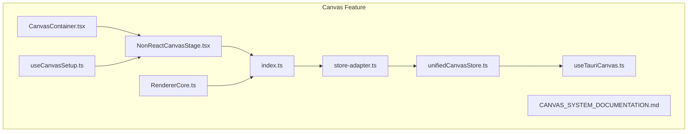
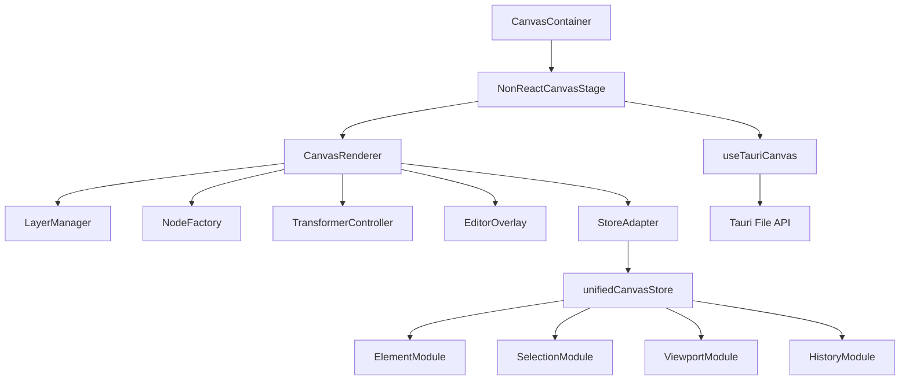
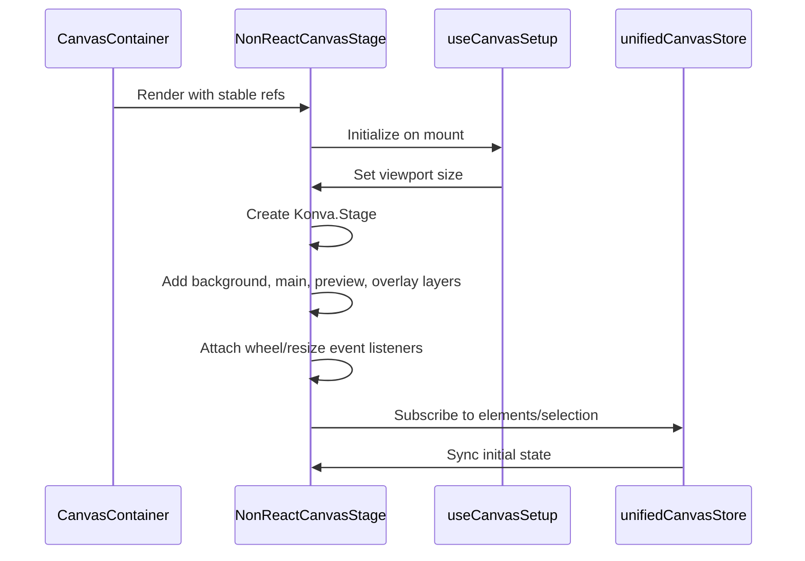
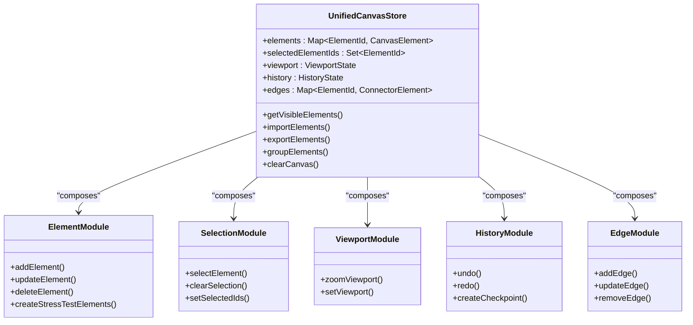
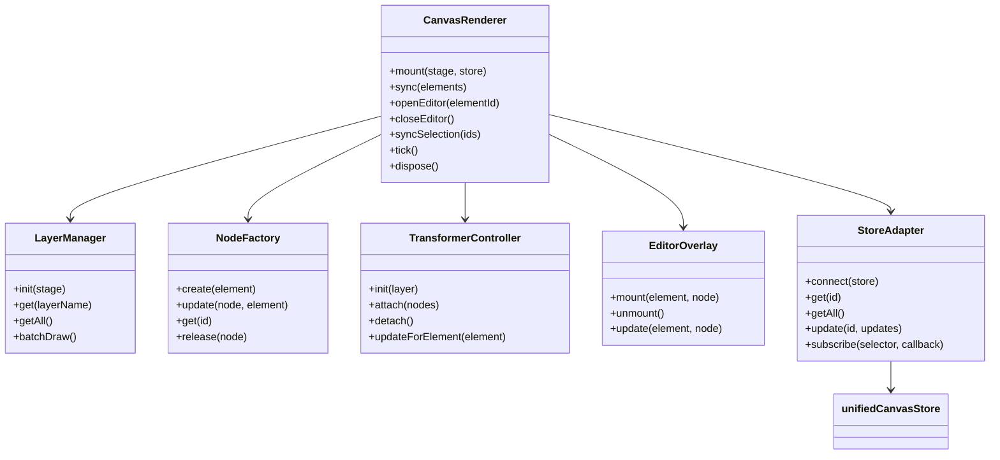
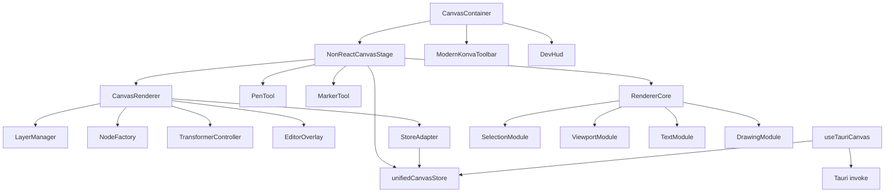

# Canvas

<cite>
**Referenced Files in This Document**   
- [CanvasContainer.tsx](file://src/features/canvas/components/CanvasContainer.tsx)
- [NonReactCanvasStage.tsx](file://src/features/canvas/components/NonReactCanvasStage.tsx)
- [unifiedCanvasStore.ts](file://src/features/canvas/stores/unifiedCanvasStore.ts)
- [useTauriCanvas.ts](file://src/features/canvas/hooks/useTauriCanvas.ts)
- [index.ts](file://src/features/canvas/renderer/index.ts)
- [store-adapter.ts](file://src/features/canvas/renderer/store-adapter.ts)
- [useCanvasSetup.ts](file://src/features/canvas/hooks/useCanvasSetup.ts)
- [RendererCore.ts](file://src/features/canvas/renderer/modular/RendererCore.ts)
- [CANVAS_SYSTEM_DOCUMENTATION.md](file://src/features/canvas/CANVAS_SYSTEM_DOCUMENTATION.md)
</cite>

## Table of Contents
1. [Introduction](#introduction)
2. [Project Structure](#project-structure)
3. [Core Components](#core-components)
4. [Architecture Overview](#architecture-overview)
5. [Detailed Component Analysis](#detailed-component-analysis)
6. [Dependency Analysis](#dependency-analysis)
7. [Performance Considerations](#performance-considerations)
8. [Troubleshooting Guide](#troubleshooting-guide)
9. [Conclusion](#conclusion)

## Introduction
The Canvas feature is a high-performance visual collaboration workspace designed for desktop applications using Tauri 2.x. Built with React 19 and Konva.js, it supports advanced diagramming, real-time collaboration, accessibility compliance (WCAG 2.1 AA), and enterprise-grade performance optimizations. The system enables users to create and manipulate shapes, text, connectors, and freehand drawings within a scalable, zoomable interface. It integrates tightly with toolbar controls, sidebar panels, and AI-powered tools while maintaining responsiveness even with large diagrams through progressive rendering and spatial indexing.

## Project Structure
The Canvas feature is organized under `src/features/canvas` with a modular architecture that separates concerns across distinct directories:
- **components**: UI components like CanvasContainer and tools
- **hooks**: Custom React hooks for setup, state, and integration
- **renderer**: Modular rendering engine with compatibility layers
- **stores**: Zustand-based state management modules
- **types**: Type definitions for elements, tools, and events
- **utils**: Performance, spatial, and state utilities
- **services**: Backend integrations including Tauri commands



**Diagram sources**
- [CanvasContainer.tsx](file://src/features/canvas/components/CanvasContainer.tsx)
- [NonReactCanvasStage.tsx](file://src/features/canvas/components/NonReactCanvasStage.tsx)
- [index.ts](file://src/features/canvas/renderer/index.ts)
- [store-adapter.ts](file://src/features/canvas/renderer/store-adapter.ts)
- [unifiedCanvasStore.ts](file://src/features/canvas/stores/unifiedCanvasStore.ts)
- [useTauriCanvas.ts](file://src/features/canvas/hooks/useTauriCanvas.ts)
- [useCanvasSetup.ts](file://src/features/canvas/hooks/useCanvasSetup.ts)
- [RendererCore.ts](file://src/features/canvas/renderer/modular/RendererCore.ts)

**Section sources**
- [CanvasContainer.tsx](file://src/features/canvas/components/CanvasContainer.tsx)
- [NonReactCanvasStage.tsx](file://src/features/canvas/components/NonReactCanvasStage.tsx)

## Core Components

The Canvas system is built around several core components that manage rendering, state, and user interaction. The primary entry point is `CanvasContainer`, which orchestrates the stage, toolbar, and overlay components. It delegates rendering to `NonReactCanvasStage`, an imperative Konva stage manager that avoids React re-renders for performance. State is managed via `unifiedCanvasStore`, a modular Zustand store that handles elements, selection, viewport, and history. The `useTauriCanvas` hook provides persistence through Tauri's file system APIs, enabling save/load operations. The rendering engine in `index.ts` coordinates layers, nodes, transformers, and editors, while `store-adapter.ts` bridges the Zustand store with the Konva renderer.

**Section sources**
- [CanvasContainer.tsx](file://src/features/canvas/components/CanvasContainer.tsx)
- [NonReactCanvasStage.tsx](file://src/features/canvas/components/NonReactCanvasStage.tsx)
- [unifiedCanvasStore.ts](file://src/features/canvas/stores/unifiedCanvasStore.ts)
- [useTauriCanvas.ts](file://src/features/canvas/hooks/useTauriCanvas.ts)
- [index.ts](file://src/features/canvas/renderer/index.ts)
- [store-adapter.ts](file://src/features/canvas/renderer/store-adapter.ts)

## Architecture Overview

The Canvas architecture follows a clean separation between declarative UI components and imperative rendering logic. React manages high-level layout and state subscriptions, while Konva handles low-level canvas drawing and event handling. The system uses a multi-layer approach with dedicated layers for background, main content, selection, and overlays. State is centralized in a modular Zustand store that supports persistence, undo/redo, and real-time updates. The renderer acts as an orchestrator, syncing store state to Konva nodes and handling user interactions like selection, transformation, and editing.



**Diagram sources**
- [CanvasContainer.tsx](file://src/features/canvas/components/CanvasContainer.tsx)
- [NonReactCanvasStage.tsx](file://src/features/canvas/components/NonReactCanvasStage.tsx)
- [index.ts](file://src/features/canvas/renderer/index.ts)
- [store-adapter.ts](file://src/features/canvas/renderer/store-adapter.ts)
- [unifiedCanvasStore.ts](file://src/features/canvas/stores/unifiedCanvasStore.ts)
- [useTauriCanvas.ts](file://src/features/canvas/hooks/useTauriCanvas.ts)

## Detailed Component Analysis

### Canvas Initialization and Setup
The canvas initialization process begins with `useCanvasSetup`, which prepares the stage dimensions and viewport. It ensures the DOM is ready before initializing the Konva stage in `NonReactCanvasStage`. This component creates the stage imperatively, sets up layers, and configures event listeners for wheel-based zooming and resize observation. The `CanvasContainer` wraps this stage with toolbar and overlay components, ensuring stable references to prevent remounting.



**Diagram sources**
- [CanvasContainer.tsx](file://src/features/canvas/components/CanvasContainer.tsx)
- [NonReactCanvasStage.tsx](file://src/features/canvas/components/NonReactCanvasStage.tsx)
- [useCanvasSetup.ts](file://src/features/canvas/hooks/useCanvasSetup.ts)
- [unifiedCanvasStore.ts](file://src/features/canvas/stores/unifiedCanvasStore.ts)

### Element Creation and Manipulation
Users create elements through toolbar interactions that update the `selectedTool` in the store. When the text tool is active, clicking the canvas creates a `text` element via `addElement`. The renderer syncs this to a Konva group containing a text node and hit area. Double-clicking triggers `openEditor`, which mounts a DOM textarea overlay for rich text input. As the user types, `liveGrow` adjusts the element width and updates the store. On commit, the final dimensions are measured and stored, with the transformer attached for resizing.

```mermaid
flowchart TD
A[User selects Text Tool] --> B[Store: setSelectedTool('text')]
B --> C[NonReactCanvasStage detects tool change]
C --> D[User clicks canvas]
D --> E[Create text element in store]
E --> F[Renderer syncs element to Konva node]
F --> G[Double-click triggers openEditor]
G --> H[Mount DOM textarea overlay]
H --> I[User types text]
I --> J[liveGrow adjusts width and updates store]
J --> K[User presses Enter]
K --> L[finalizeText measures final dimensions]
L --> M[Update store with final text and size]
M --> N[Attach transformer for resizing]
```

**Diagram sources**
- [NonReactCanvasStage.tsx](file://src/features/canvas/components/NonReactCanvasStage.tsx)
- [index.ts](file://src/features/canvas/renderer/index.ts)
- [unifiedCanvasStore.ts](file://src/features/canvas/stores/unifiedCanvasStore.ts)

### State Management with Zustand
The `unifiedCanvasStore` uses Zustand with immer and persist middleware to manage canvas state. It composes multiple modules (element, selection, viewport, history) into a single store with atomic updates. The store persists to localStorage with versioning and handles complex operations like grouping, sectioning, and edge management. Selectors are memoized using `useShallow` to prevent unnecessary re-renders. The modular design allows independent development and testing of store features.



**Diagram sources**
- [unifiedCanvasStore.ts](file://src/features/canvas/stores/unifiedCanvasStore.ts)

### Rendering Engine and Performance
The CanvasRenderer orchestrates rendering across multiple modules: LayerManager handles layer creation, NodeFactory manages Konva node lifecycle, TransformerController manages selection handles, and EditorOverlay handles text editing. The renderer syncs with the store via StoreAdapter, which provides a clean interface for element access and updates. For performance, the system uses object pooling, viewport culling, progressive rendering, and RAF coordination. The modular renderer (RendererCore) allows pluggable modules for selection, viewport, eraser, text, connector, and drawing tools.



**Diagram sources**
- [index.ts](file://src/features/canvas/renderer/index.ts)
- [store-adapter.ts](file://src/features/canvas/renderer/store-adapter.ts)
- [unifiedCanvasStore.ts](file://src/features/canvas/stores/unifiedCanvasStore.ts)
- [RendererCore.ts](file://src/features/canvas/renderer/modular/RendererCore.ts)

## Dependency Analysis

The Canvas feature has well-defined dependencies between its components. The `CanvasContainer` depends on `NonReactCanvasStage` for rendering and `ModernKonvaToolbar` for tool controls. The stage depends on the `unifiedCanvasStore` for state and `CanvasRenderer` for rendering logic. The renderer depends on `StoreAdapter` to access store data and `Konva` for canvas operations. The `useTauriCanvas` hook depends on both the store and Tauri's invoke API for persistence. The modular renderer uses dynamic imports to load optional modules only when needed.



**Diagram sources**
- [CanvasContainer.tsx](file://src/features/canvas/components/CanvasContainer.tsx)
- [NonReactCanvasStage.tsx](file://src/features/canvas/components/NonReactCanvasStage.tsx)
- [index.ts](file://src/features/canvas/renderer/index.ts)
- [store-adapter.ts](file://src/features/canvas/renderer/store-adapter.ts)
- [unifiedCanvasStore.ts](file://src/features/canvas/stores/unifiedCanvasStore.ts)
- [useTauriCanvas.ts](file://src/features/canvas/hooks/useTauriCanvas.ts)
- [RendererCore.ts](file://src/features/canvas/renderer/modular/RendererCore.ts)

## Performance Considerations

The Canvas system implements multiple performance optimizations to handle large diagrams efficiently. It uses viewport culling to hide off-screen elements, progressive rendering to batch updates, and object pooling to reduce garbage collection. The renderer coordinates all updates through a single RAF loop to maintain 60fps. For memory management, it implements weak maps, object pooling, and memory pressure detection. The modular architecture allows lazy loading of advanced features. Configuration options like `maxElements` and `renderBatchSize` allow tuning for different hardware capabilities. Grid snapping and alignment guides are implemented with spatial indexing for O(log n) queries.

## Troubleshooting Guide

Common issues in the Canvas system include text editing conflicts, transformer attachment problems, and performance degradation with large diagrams. The system includes debugging tools like `DevHud` and `PerformanceOverlayHUD` to monitor frame rate and memory usage. The `setDebugMode` function enables text alignment verification, and `getDebugInfo` provides detailed metrics for circle text synchronization. For persistence issues, the `useTauriCanvas` hook includes error handling and encryption key verification. Memory leaks are prevented through proper cleanup in the `dispose` methods of all components.

**Section sources**
- [NonReactCanvasStage.tsx](file://src/features/canvas/components/NonReactCanvasStage.tsx)
- [index.ts](file://src/features/canvas/renderer/index.ts)
- [useTauriCanvas.ts](file://src/features/canvas/hooks/useTauriCanvas.ts)
- [CANVAS_SYSTEM_DOCUMENTATION.md](file://src/features/canvas/CANVAS_SYSTEM_DOCUMENTATION.md)

## Conclusion

The Canvas feature provides a robust, high-performance visual collaboration workspace with a clean separation between UI, state, and rendering concerns. Its modular architecture enables extensibility while maintaining performance through imperative rendering and optimized state management. The integration with Tauri allows secure local persistence, and the accessibility-focused design ensures compliance with WCAG 2.1 AA standards. Future enhancements could include real-time collaboration, plugin architecture, and AI-powered design suggestions.