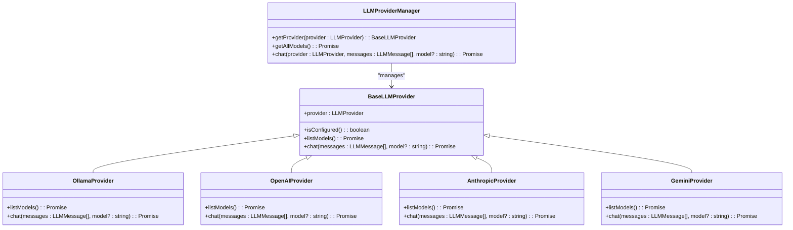

# Chat

<cite>
**Referenced Files in This Document**   
- [Chat.tsx](file://src/app/pages/Chat.tsx)
- [chatStore.ts](file://src/features/chat/stores/chatStore.ts)
- [ContextSidebar.tsx](file://src/features/chat/components/ContextSidebar.tsx)
- [ConversationList.tsx](file://src/features/chat/components/ConversationList.tsx)
- [ChatHeader.tsx](file://src/features/chat/components/ChatHeader.tsx)
- [llmProviders.ts](file://src/services/llmProviders.ts)
- [settingsStore.ts](file://src/stores/settingsStore.ts)
- [AIOutputModalPro.tsx](file://src/components/ai/AIOutputModalPro.tsx)
- [AIOutputModalFixed.tsx](file://src/components/ai/AIOutputModalFixed.tsx)
- [TextSelectionDetector.tsx](file://src/components/ai/TextSelectionDetector.tsx)
- [ollama.rs](file://src-tauri/src/commands/ollama.rs)
- [chat_operations.rs](file://src-tauri/src/database/operations/chat_operations.rs)
- [mod.rs](file://src-tauri/src/commands/chat/mod.rs)
- [chatMockData.ts](file://src/core/lib/chatMockData.ts)
</cite>

## Table of Contents
1. [Introduction](#introduction)
2. [Project Structure](#project-structure)
3. [Core Components](#core-components)
4. [Architecture Overview](#architecture-overview)
5. [Detailed Component Analysis](#detailed-component-analysis)
6. [Dependency Analysis](#dependency-analysis)
7. [Performance Considerations](#performance-considerations)
8. [Troubleshooting Guide](#troubleshooting-guide)
9. [Conclusion](#conclusion)

## Introduction
The Chat feature in LibreOllama provides an AI-powered conversation interface that enables users to interact with large language models (LLMs) through a streamlined, intuitive UI. It supports message submission, streaming AI responses, context management, and integration with multiple LLM providers including Ollama, OpenAI, Anthropic, Gemini, and Mistral. The system manages conversation state through a centralized store, handles model selection and configuration, and integrates with UI components such as the Context Sidebar and AI Output Modals. This document details the implementation of message state management, AI response handling, configuration options, and error recovery mechanisms.

## Project Structure
The Chat feature is organized within the `src/features/chat` directory, following a modular structure that separates components, stores, types, and utilities. The core state management is handled by `chatStore.ts`, while UI components are organized in the `components` subdirectory. Integration with backend services occurs through Tauri commands in `src-tauri/src/commands/chat`, and LLM provider management is centralized in `src/services/llmProviders.ts`.

**Diagram sources**
- [Chat.tsx](file://src/app/pages/Chat.tsx)
- [chatStore.ts](file://src/features/chat/stores/chatStore.ts)
- [mod.rs](file://src-tauri/src/commands/chat/mod.rs)
- [llmProviders.ts](file://src/services/llmProviders.ts)

**Section sources**
- [Chat.tsx](file://src/app/pages/Chat.tsx)
- [chatStore.ts](file://src/features/chat/stores/chatStore.ts)
- [components/](file://src/features/chat/components/)
- [mod.rs](file://src-tauri/src/commands/chat/mod.rs)

## Core Components
The Chat feature consists of several core components that work together to provide a seamless AI conversation experience. The `chatStore.ts` manages application state including conversations, messages, model selection, and settings. The `Chat.tsx` page serves as the main container, orchestrating the UI layout and connecting components. Key UI elements include the `ContextSidebar` for conversation context and settings, and the `ConversationList` for managing chat sessions. The system integrates with LLM providers through `llmProviders.ts`, which handles model listing, configuration, and API communication.

**Section sources**
- [chatStore.ts](file://src/features/chat/stores/chatStore.ts#L46-L97)
- [Chat.tsx](file://src/app/pages/Chat.tsx)
- [ContextSidebar.tsx](file://src/features/chat/components/ContextSidebar.tsx)
- [ConversationList.tsx](file://src/features/chat/components/ConversationList.tsx)
- [llmProviders.ts](file://src/services/llmProviders.ts)

## Architecture Overview
The Chat feature follows a unidirectional data flow architecture where user interactions trigger actions in the `chatStore`, which updates the state and propagates changes to UI components. When a user sends a message, the `sendMessage` action in `chatStore` first saves the user message via the Tauri `send_message` command, then updates the UI state immediately for responsiveness. The AI response is streamed from the LLM provider through the backend and displayed incrementally. Configuration is managed through `settingsStore`, which loads API keys and enabled models from persistent storage.

**Diagram sources**
- [chatStore.ts](file://src/features/chat/stores/chatStore.ts#L415-L443)
- [ollama.rs](file://src-tauri/src/commands/ollama.rs#L399-L415)
- [chat_operations.rs](file://src-tauri/src/database/operations/chat_operations.rs#L209-L234)

## Detailed Component Analysis

### Message State Management
The chat system maintains conversation state in a centralized store with separate data structures for conversations and messages. Conversations are stored as a list with metadata like title, timestamp, and pin status, while messages are organized by session ID in a record structure. This separation allows efficient loading of conversation lists without retrieving full message histories. The store uses Zustand for state management, providing reactive updates to UI components when messages are added, updated, or deleted.

**Diagram sources**
- [chatStore.ts](file://src/features/chat/stores/chatStore.ts#L46-L97)
- [chatMockData.ts](file://src/core/lib/chatMockData.ts#L0-L36)

**Section sources**
- [chatStore.ts](file://src/features/chat/stores/chatStore.ts#L46-L97)
- [chatMockData.ts](file://src/core/lib/chatMockData.ts#L0-L36)

### AI Response Handling
AI responses are handled through a streaming architecture that provides immediate feedback to users. When a message is sent, the system calls the LLM provider's chat method through the `LLMProviderManager`, which routes the request to the appropriate provider based on configuration. Responses are streamed back character by character, with each chunk emitted as a frontend event that updates the UI incrementally. This creates the appearance of the AI "typing" in real-time, improving perceived responsiveness.

The response flow includes several key steps:
1. User message is saved to the database immediately
2. Conversation history is retrieved and formatted for the LLM
3. Streaming response is initiated and displayed incrementally
4. Complete AI response is saved to the database
5. UI state is updated with the final message

Error handling is integrated throughout this process, with specific error messages for common issues like model unavailability or provider configuration problems.

**Diagram sources**
- [chatStore.ts](file://src/features/chat/stores/chatStore.ts#L415-L443)
- [ollama.rs](file://src-tauri/src/commands/ollama.rs#L399-L415)
- [llmProviders.ts](file://src/services/llmProviders.ts#L471-L522)

**Section sources**
- [chatStore.ts](file://src/features/chat/stores/chatStore.ts#L415-L443)
- [ollama.rs](file://src-tauri/src/commands/ollama.rs#L399-L415)
- [llmProviders.ts](file://src/services/llmProviders.ts#L471-L522)

### LLM Provider Integration
The system supports multiple LLM providers through a pluggable architecture implemented in `llmProviders.ts`. The `LLMProviderManager` class serves as a facade that abstracts provider-specific details and provides a unified interface for model listing and chat completion. Each provider (Ollama, OpenAI, Anthropic, etc.) implements a common interface with methods for listing available models and generating chat responses.

Provider configuration is managed through API keys stored in the settings system. The manager initializes providers based on settings loaded from persistent storage, enabling or disabling them according to whether API keys are present. This allows the UI to dynamically show only configured providers and their available models.

**Diagram sources**
- [llmProviders.ts](file://src/services/llmProviders.ts#L403-L473)
- [settingsStore.ts](file://src/stores/settingsStore.ts#L431-L465)

**Section sources**
- [llmProviders.ts](file://src/services/llmProviders.ts#L403-L473)
- [settingsStore.ts](file://src/stores/settingsStore.ts#L431-L465)

### Context Management and UI Integration
The Chat feature integrates with several UI components to provide enhanced functionality. The `ContextSidebar` component displays relevant context items (notes, tasks, events) related to the current conversation and provides access to conversation settings. Users can adjust model-specific parameters like system prompt, creativity (temperature), and maximum tokens through this interface.

The `ConversationList` component manages chat session discovery and organization, supporting search, pinning, renaming, and deletion of conversations. It integrates with the context menu system to provide additional actions like exporting conversations.

**Diagram sources**
- [ContextSidebar.tsx](file://src/features/chat/components/ContextSidebar.tsx#L131-L160)
- [chatStore.ts](file://src/features/chat/stores/chatStore.ts#L859-L878)

**Section sources**
- [ContextSidebar.tsx](file://src/features/chat/components/ContextSidebar.tsx#L131-L160)
- [chatStore.ts](file://src/features/chat/stores/chatStore.ts#L859-L878)

## Dependency Analysis
The Chat feature has well-defined dependencies between frontend components, state management, and backend services. The dependency graph shows a clear separation of concerns with the `chatStore` serving as the central coordination point.

**Diagram sources**
- [Chat.tsx](file://src/app/pages/Chat.tsx)
- [chatStore.ts](file://src/features/chat/stores/chatStore.ts)
- [llmProviders.ts](file://src/services/llmProviders.ts)
- [mod.rs](file://src-tauri/src/commands/chat/mod.rs)

**Section sources**
- [Chat.tsx](file://src/app/pages/Chat.tsx)
- [chatStore.ts](file://src/features/chat/stores/chatStore.ts)
- [llmProviders.ts](file://src/services/llmProviders.ts)
- [mod.rs](file://src-tauri/src/commands/chat/mod.rs)

## Performance Considerations
The Chat feature implements several performance optimizations to handle large conversation histories and maintain responsiveness:

1. **Lazy Loading**: Message histories are loaded only when a conversation is selected, reducing initial load time.
2. **State Normalization**: Messages are stored in a normalized structure (Record<string, ChatMessage[]>) to enable efficient lookups by conversation ID.
3. **Streaming Responses**: AI responses are streamed incrementally rather than waiting for complete responses, improving perceived performance.
4. **Debounced Provider Initialization**: The LLM provider manager uses deferred initialization to avoid blocking the main thread during startup.
5. **Efficient State Updates**: The Zustand store batches state updates and uses immutable patterns to minimize re-renders.

For very large conversations, the system could implement additional optimizations such as:
- Pagination of message history
- Message summarization for older content
- Client-side message indexing
- Web Worker processing for message formatting

**Section sources**
- [chatStore.ts](file://src/features/chat/stores/chatStore.ts#L329-L363)
- [chat_operations.rs](file://src-tauri/src/database/operations/chat_operations.rs#L209-L234)

## Troubleshooting Guide
The Chat feature includes comprehensive error handling for common issues:

### Handling Incomplete AI Responses
When AI responses are incomplete or fail to generate, the system provides specific error messages and recovery options:
- **Model not available**: "Model 'model-name' is not available. Please select a different model."
- **Provider not configured**: "The selected AI provider is not configured. Please check your API keys in settings."
- **API errors**: "AI service error: [detailed message]"

The `regenerateResponse` function includes error recovery that restores the original message state if regeneration fails, preventing data loss.

### Configuration Issues
Common configuration problems and solutions:
- **Missing API keys**: Ensure API keys are entered in Settings for the desired provider
- **Incorrect base URL**: Verify the base URL matches the provider's API endpoint
- **Disabled models**: Check that models are enabled in the provider settings

### Response Validation
The system validates responses through:
- Content length checks
- Proper message role assignment (user vs. AI)
- Timestamp consistency
- Error message formatting

When validation fails, the system logs detailed error information and presents user-friendly messages that guide troubleshooting.

**Section sources**
- [chatStore.ts](file://src/features/chat/stores/chatStore.ts#L633-L660)
- [core/lib/utils.ts](file://src/core/lib/utils.ts)
- [core/errors/errorHandler.ts](file://src/core/errors/errorHandler.ts#L176-L201)

## Conclusion
The Chat feature in LibreOllama provides a robust, extensible AI conversation interface with comprehensive state management, multi-provider LLM integration, and rich UI components. Its architecture separates concerns effectively, with clear boundaries between frontend components, state management, and backend services. The system handles message state efficiently, streams AI responses for optimal user experience, and provides extensive configuration options through the Context Sidebar. Error handling is comprehensive, with user-friendly messages and recovery mechanisms for common issues. The modular design allows for easy addition of new LLM providers and UI enhancements.