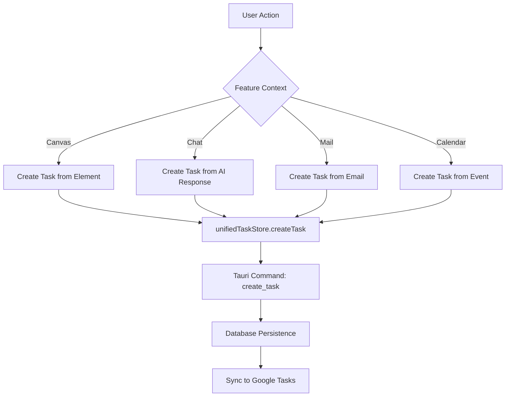

# Core Features

<cite>
**Referenced Files in This Document**   
- [Canvas.tsx](file://src/app/pages/Canvas.tsx)
- [Chat.tsx](file://src/app/pages/Chat.tsx)
- [Mail.tsx](file://src/app/pages/Mail.tsx)
- [TasksAsanaClean.tsx](file://src/app/pages/TasksAsanaClean.tsx)
- [CalendarCustom.tsx](file://src/app/pages/CalendarCustom.tsx)
</cite>

## Table of Contents
1. [Introduction](#introduction)
2. [Canvas](#canvas)
3. [Chat](#chat)
4. [Mail](#mail)
5. [Tasks](#tasks)
6. [Calendar](#calendar)
7. [Feature Integration and Workflows](#feature-integration-and-workflows)
8. [Common Issues and Solutions](#common-issues-and-solutions)
9. [Performance Considerations](#performance-considerations)

## Introduction
The LibreOllama application provides a unified workspace with five core features: Canvas, Chat, Mail, Tasks, and Calendar. These modules are designed to support visual collaboration, AI-powered conversations, email integration, task management, and scheduling. Each feature is implemented as a dedicated page component with a consistent two-pane layout pattern, utilizing shared UI components and state management via Zustand stores. The features are deeply integrated, enabling seamless workflows across modules.

## Canvas

The Canvas feature enables visual collaboration through a dynamic, interactive drawing surface powered by Konva.js. It supports real-time element creation, manipulation, and persistence.

### Component Structure
The Canvas page follows a two-pane layout with a collapsible sidebar on the left and the main canvas area on the right. The `CanvasPage` component orchestrates the layout and manages sidebar state, while `CanvasContainer` handles the rendering and interaction logic. The `CanvasSidebar` provides tools and controls for the canvas.

### State Management
Canvas state is managed through a combination of React hooks and internal Konva stage references. The `useHeader` context is used to clear default headers, allowing the canvas to maintain its own contextual UI. Canvas-specific state (e.g., selected elements, tool modes) is handled within the canvas feature's internal stores and hooks.

### Backend Integration
The canvas integrates with Tauri backend services for persistence and advanced operations. The `canvasStageRef` is passed to the sidebar to enable direct interaction with the rendering layer. Resize events are dispatched to ensure proper rendering during layout changes.

### Usage Patterns
Users can toggle the sidebar to maximize canvas space. The canvas supports direct manipulation of visual elements, with the sidebar providing access to tools and properties. The layout automatically adjusts padding and gap spacing based on sidebar state.

### Performance Considerations
The component dispatches multiple resize events with staggered timeouts (50ms, 150ms, 300ms) to ensure proper layout recalculations after CSS transitions. This prevents rendering artifacts during animations.

**Section sources**
- [Canvas.tsx](file://src/app/pages/Canvas.tsx#L1-L124)

## Chat

The Chat feature provides AI-powered conversations with support for message history, conversation management, and context awareness.

### Component Structure
The Chat interface uses a three-panel layout: conversation list (left), main chat area (center), and context sidebar (right). The main components include `ConversationList`, `ChatHeader`, `ChatMessageBubble`, `ChatInput`, and `ContextSidebar`. The layout dynamically adjusts padding based on panel visibility.

### State Management
Chat state is managed through `useChatStore`, a Zustand store that handles conversations, messages, selection state, and loading indicators. The store provides actions for CRUD operations on conversations, message sending, and error handling. Local component state manages UI controls like sidebar visibility and hover states.

### Backend Integration
The chat feature uses Tauri's `invoke` API to communicate with backend services for session management and message processing. Key operations include `update_session_title` for renaming conversations and various commands in the `src-tauri/src/commands/chat.rs` module.

### Usage Patterns
Users can create new conversations, select existing ones, and manage them via context menus (rename, delete, pin, export). Message input supports text and attachments. The interface shows typing indicators during AI responses and provides regeneration capabilities for AI messages.

### Error Handling
Errors are displayed as modal overlays with dismiss buttons, preventing UI disruption while ensuring visibility. The error state is managed by the store and cleared via user interaction.

**Section sources**
- [Chat.tsx](file://src/app/pages/Chat.tsx#L1-L362)

## Mail

The Mail feature integrates with Gmail to provide email management within the workspace.

### Component Structure
The Mail interface follows the standard two-pane layout with `MailSidebar` on the left and the main mail area on the right. The main area contains `EnhancedSearchBar`, `MailToolbar`, and `EnhancedMessageList`. Additional modals include `ComposeModal` and `MessageViewModal`. A context sidebar provides additional information.

### State Management
Mail state is managed by `useMailStore`, which tracks composition state, current message, authentication status, and account information. The store handles hydration of stored accounts and authentication state. Local component state manages UI controls like sidebar visibility and view modes.

### Backend Integration
The mail feature integrates with Google services through dedicated backend commands in `src-tauri/src/commands/gmail.rs`. Authentication is handled by `GmailAuthService` and related components in the services layer.

### Usage Patterns
Users can toggle the mail sidebar and context sidebar independently. The enhanced search bar supports advanced search functionality. The message list displays emails in either threaded or flat view, with the ability to compose new messages or view existing ones in modal dialogs.

### Development Features
Debug utilities are conditionally imported in development mode to aid Gmail integration testing.

**Section sources**
- [Mail.tsx](file://src/app/pages/Mail.tsx#L1-L107)

## Tasks

The Tasks feature provides comprehensive task management with Kanban-style organization.

### Component Structure
While the specific implementation file is not available, the project structure indicates the presence of `TasksAsanaClean.tsx` as the main page component. Supporting components include `KanbanBoard`, `KanbanColumn`, `TaskListView`, and `TaskSidebar` in the components directory. The feature likely follows the same two-pane layout pattern as other modules.

### State Management
Task state is managed by `unifiedTaskStore`, which provides a centralized store for task data across the application. The store supports filtering, column management, and Google Tasks synchronization through `useGoogleTasks` and related hooks.

### Backend Integration
Task operations are handled by Tauri commands in `src-tauri/src/commands/tasks.rs`. Database operations are managed through the Tauri database layer with schema definitions in migration files (e.g., `002_task_metadata.sql`). Google Tasks integration is provided by `googleTasksService` and related API clients.

### Usage Patterns
Based on the test files, the feature supports CRUD operations on tasks, drag-and-drop functionality, and synchronization with Google Tasks. Users can create tasks from various contexts and manage them through both list and Kanban views.

**Section sources**
- [TasksAsanaClean.tsx](file://src/app/pages/TasksAsanaClean.tsx)

## Calendar

The Calendar feature provides scheduling capabilities with integration to Google Calendar.

### Component Structure
The Calendar interface is implemented in `CalendarCustom.tsx` with supporting components in the `calendar` directory. Key components include `CalendarMonthGrid`, `CalendarWeekGrid`, `AsanaEventModal`, and `CalendarTaskSidebarEnhanced`. The feature supports multiple view modes and event manipulation.

### State Management
Calendar state is managed by `googleCalendarStore` and related hooks like `useCalendarState`. The store handles event data, selection state, and view configuration. Date utilities in `utils/dateUtils.ts` support calendar operations.

### Backend Integration
Calendar operations are handled by `googleCalendarService` and Tauri commands in `src-tauri/src/commands/calendar.rs`. Automatic synchronization is managed by `googleCalendarAutoSync` service. The feature supports drag-and-drop interactions as evidenced by the `DroppableCalendarCell` component.

### Usage Patterns
Users can view events in month or week views, create and edit events through modal dialogs, and manipulate tasks within the calendar context. The integration with Google Calendar allows for bidirectional synchronization of events.

**Section sources**
- [CalendarCustom.tsx](file://src/app/pages/CalendarCustom.tsx)

## Feature Integration and Workflows

The core features are designed to work together seamlessly, enabling powerful cross-functional workflows.

### Task Creation from Other Features
Tasks can be created from multiple contexts:
- From emails in the Mail feature
- From calendar events in the Calendar feature
- From AI suggestions in the Chat feature
- From elements in the Canvas feature

This integration is facilitated by the `unifiedTaskStore` which provides a common interface for task creation across features.

### Context Sharing
The application supports context sharing between features through:
- The `ContextSidebar` in Chat
- The `MailContextSidebar` in Mail
- Shared state stores that can be accessed across features
- Tauri commands that bridge frontend and backend functionality

### Data Flow
Data flows between features through a combination of:
- Zustand stores for frontend state
- Tauri commands for backend operations
- Event dispatching for UI coordination
- Direct component references for performance-critical operations

**Diagram sources**
- [unifiedTaskStore.ts](file://src/stores/unifiedTaskStore.ts)
- [tasks.rs](file://src-tauri/src/commands/tasks.rs)

## Common Issues and Solutions

### Canvas Rendering Issues
**Issue**: Canvas elements not rendering after sidebar toggle
**Solution**: The component dispatches multiple resize events with staggered timeouts to ensure proper layout recalculation after CSS transitions.

### Chat Message Synchronization
**Issue**: Messages not loading when switching conversations
**Solution**: The component includes a useEffect hook that ensures messages are fetched when a conversation is selected and messages are not already loaded.

### Mail Authentication Problems
**Issue**: Gmail integration failing to authenticate
**Solution**: Ensure accounts are properly loaded via `loadStoredAccounts` and authentication state is correctly managed in `useMailStore`.

### Task Synchronization Delays
**Issue**: Google Tasks not syncing immediately
**Solution**: The application uses `deferredGmailSync` utility to batch and optimize sync operations, which may introduce slight delays for performance reasons.

### Calendar Event Display
**Issue**: Events not appearing in correct time slots
**Solution**: Verify that timezone handling is consistent between the frontend and Google Calendar API, using the `dateUtils` utilities for conversion.

## Performance Considerations

### Canvas Optimization
The canvas feature implements several performance optimizations:
- Staggered resize event dispatching to prevent layout thrashing
- Direct Konva stage references for efficient rendering
- Conditional rendering of the sidebar to reduce DOM complexity

### Chat Performance
The chat feature optimizes performance through:
- Virtualized message lists (implied by structure)
- Efficient state updates via Zustand
- Selective re-renders using useCallback for event handlers
- Instant scrolling for initial loads and conversation changes

### Mail Efficiency
The mail feature enhances performance by:
- Using enhanced, optimized message lists
- Implementing efficient search with `EnhancedSearchBar`
- Lazy-loading message content in `MessageViewModal`
- Conditional rendering of sidebars and modals

### General Application Performance
The application employs several cross-feature performance strategies:
- Centralized state management to minimize prop drilling
- Efficient event handling with proper cleanup
- Code splitting through feature-based directory structure
- Optimized rendering with React's reconciliation algorithm