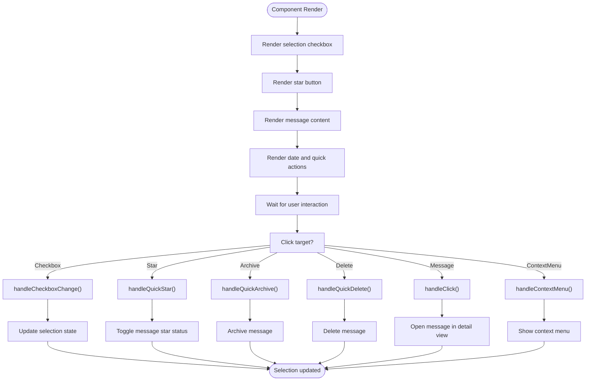

# Mail

<cite>
**Referenced Files in This Document**   
- [Mail.tsx](file://src/app/pages/Mail.tsx)
- [mailStore.ts](file://src/features/mail/stores/mailStore.ts)
- [gmailTauriService.ts](file://src/features/mail/services/gmailTauriService.ts)
- [MailSidebar.tsx](file://src/features/mail/components/MailSidebar.tsx)
- [MailToolbar.tsx](file://src/features/mail/components/MailToolbar.tsx)
- [EnhancedMessageList.tsx](file://src/features/mail/components/EnhancedMessageList.tsx)
- [EnhancedMessageItem.tsx](file://src/features/mail/components/EnhancedMessageItem.tsx)
- [MailLayout.tsx](file://src/features/mail/components/MailLayout.tsx)
- [MailErrorBoundary.tsx](file://src/features/mail/components/MailErrorBoundary.tsx)
</cite>

## Table of Contents
1. [Introduction](#introduction)
2. [Project Structure](#project-structure)
3. [Core Components](#core-components)
4. [Architecture Overview](#architecture-overview)
5. [Detailed Component Analysis](#detailed-component-analysis)
6. [Dependency Analysis](#dependency-analysis)
7. [Performance Considerations](#performance-considerations)
8. [Troubleshooting Guide](#troubleshooting-guide)
9. [Conclusion](#conclusion)

## Introduction
The Mail feature provides comprehensive email integration with Gmail, enabling users to manage their inbox directly within the application. This documentation details the implementation of authentication flows, message synchronization, UI components for reading and composing emails, and integration with other system components such as the sidebar, context menus, and AI-powered email summarization. The system handles configuration options for label management, notification settings, and security policies for attachments, while addressing common issues like authentication token expiration through automatic refresh mechanisms.

## Project Structure
The Mail feature is organized within the `src/features/mail` directory, following a modular structure that separates concerns into distinct subdirectories for components, hooks, services, stores, styles, types, and utilities. This organization facilitates maintainability and scalability of the email integration functionality.

**Diagram sources**
- [Mail.tsx](file://src/app/pages/Mail.tsx)
- [MailSidebar.tsx](file://src/features/mail/components/MailSidebar.tsx)
- [MailToolbar.tsx](file://src/features/mail/components/MailToolbar.tsx)
- [EnhancedMessageList.tsx](file://src/features/mail/components/EnhancedMessageList.tsx)
- [mailStore.ts](file://src/features/mail/stores/mailStore.ts)

**Section sources**
- [Mail.tsx](file://src/app/pages/Mail.tsx)
- [mailStore.ts](file://src/features/mail/stores/mailStore.ts)

## Core Components
The Mail feature consists of several core components that work together to provide a complete email management experience. These include the main Mail page component, sidebar navigation, toolbar with action controls, message list and item components, layout containers, and error boundary handling. The state management is centralized in the mailStore, which maintains authentication status, message data, user preferences, and synchronization state across multiple Gmail accounts.

**Section sources**
- [Mail.tsx](file://src/app/pages/Mail.tsx)
- [mailStore.ts](file://src/features/mail/stores/mailStore.ts)
- [MailSidebar.tsx](file://src/features/mail/components/MailSidebar.tsx)
- [MailToolbar.tsx](file://src/features/mail/components/MailToolbar.tsx)

## Architecture Overview
The Mail feature follows a layered architecture with clear separation between presentation components, state management, and backend services. The frontend components render the user interface and handle user interactions, while the mailStore manages application state using Zustand with persistence. The gmailTauriService acts as an adapter between the frontend and the Tauri backend, handling all Gmail API communications through secure Tauri commands.

**Diagram sources**
- [Mail.tsx](file://src/app/pages/Mail.tsx)
- [mailStore.ts](file://src/features/mail/stores/mailStore.ts)
- [gmailTauriService.ts](file://src/features/mail/services/gmailTauriService.ts)
- [MailErrorBoundary.tsx](file://src/features/mail/components/MailErrorBoundary.tsx)

## Detailed Component Analysis

### Mail Page Analysis
The Mail page serves as the entry point for the email feature, orchestrating the layout and coordination of all mail-related components. It manages the overall page structure, handles header configuration, and initializes the mail store state.

#### For Object-Oriented Components:

**Diagram sources**
- [Mail.tsx](file://src/app/pages/Mail.tsx)

**Section sources**
- [Mail.tsx](file://src/app/pages/Mail.tsx)

### Mail Store Analysis
The mailStore is the central state management component for the Mail feature, responsible for maintaining authentication state, message data, user preferences, and synchronization status across multiple Gmail accounts.

#### For Object-Oriented Components:

**Diagram sources**
- [mailStore.ts](file://src/features/mail/stores/mailStore.ts)

**Section sources**
- [mailStore.ts](file://src/features/mail/stores/mailStore.ts)

### Gmail Tauri Service Analysis
The gmailTauriService provides a clean interface for Gmail operations using Tauri commands, abstracting the communication between the frontend and the backend services.

#### For API/Service Components:

**Diagram sources**
- [gmailTauriService.ts](file://src/features/mail/services/gmailTauriService.ts)

**Section sources**
- [gmailTauriService.ts](file://src/features/mail/services/gmailTauriService.ts)

### Mail Sidebar Analysis
The MailSidebar component provides navigation and account management functionality, allowing users to switch between different views and manage their email labels.

#### For Complex Logic Components:

**Diagram sources**
- [MailSidebar.tsx](file://src/features/mail/components/MailSidebar.tsx)

**Section sources**
- [MailSidebar.tsx](file://src/features/mail/components/MailSidebar.tsx)

### Mail Toolbar Analysis
The MailToolbar component provides action controls for managing selected messages, including archiving, deleting, marking as read/unread, starring, and pagination controls.

#### For Complex Logic Components:

**Diagram sources**
- [MailToolbar.tsx](file://src/features/mail/components/MailToolbar.tsx)

**Section sources**
- [MailToolbar.tsx](file://src/features/mail/components/MailToolbar.tsx)

### Enhanced Message List Analysis
The EnhancedMessageList component displays a list of email messages with support for selection, filtering, sorting, and pagination.

#### For Complex Logic Components:

**Diagram sources**
- [EnhancedMessageList.tsx](file://src/features/mail/components/EnhancedMessageList.tsx)

**Section sources**
- [EnhancedMessageList.tsx](file://src/features/mail/components/EnhancedMessageList.tsx)

### Enhanced Message Item Analysis
The EnhancedMessageItem component represents an individual email message in the list, providing visual indicators, quick actions, and context menu functionality.

#### For Complex Logic Components:

**Diagram sources**
- [EnhancedMessageItem.tsx](file://src/features/mail/components/EnhancedMessageItem.tsx)

**Section sources**
- [EnhancedMessageItem.tsx](file://src/features/mail/components/EnhancedMessageItem.tsx)

### Mail Layout Analysis
The MailLayout component provides a structured layout for the mail interface, supporting different configurations such as sidebar, main content, and context panel.

#### For Object-Oriented Components:

**Diagram sources**
- [MailLayout.tsx](file://src/features/mail/components/MailLayout.tsx)

**Section sources**
- [MailLayout.tsx](file://src/features/mail/components/MailLayout.tsx)

## Dependency Analysis
The Mail feature has well-defined dependencies between its components, with clear separation of concerns and minimal coupling. The dependency graph shows how components interact through props, state management, and service calls.

**Diagram sources**
- [Mail.tsx](file://src/app/pages/Mail.tsx)
- [MailSidebar.tsx](file://src/features/mail/components/MailSidebar.tsx)
- [MailToolbar.tsx](file://src/features/mail/components/MailToolbar.tsx)
- [EnhancedMessageList.tsx](file://src/features/mail/components/EnhancedMessageList.tsx)
- [EnhancedMessageItem.tsx](file://src/features/mail/components/EnhancedMessageItem.tsx)
- [MailLayout.tsx](file://src/features/mail/components/MailLayout.tsx)
- [mailStore.ts](file://src/features/mail/stores/mailStore.ts)
- [gmailTauriService.ts](file://src/features/mail/services/gmailTauriService.ts)

**Section sources**
- [Mail.tsx](file://src/app/pages/Mail.tsx)
- [MailSidebar.tsx](file://src/features/mail/components/MailSidebar.tsx)
- [MailToolbar.tsx](file://src/features/mail/components/MailToolbar.tsx)
- [EnhancedMessageList.tsx](file://src/features/mail/components/EnhancedMessageList.tsx)
- [EnhancedMessageItem.tsx](file://src/features/mail/components/EnhancedMessageItem.tsx)
- [MailLayout.tsx](file://src/features/mail/components/MailLayout.tsx)
- [mailStore.ts](file://src/features/mail/stores/mailStore.ts)
- [gmailTauriService.ts](file://src/features/mail/services/gmailTauriService.ts)

## Performance Considerations
The Mail feature implements several performance optimizations to handle large mailboxes efficiently. These include token-based pagination for Gmail API calls, memoized selectors to prevent unnecessary re-renders, and lazy loading of message details. The system uses Zustand with immer for efficient state updates and persist middleware for local storage of user preferences and authentication state. Message lists are virtualized through controlled rendering of only visible items, and API rate limiting is managed through the Tauri backend services.

## Troubleshooting Guide
Common issues with the Mail feature include authentication token expiration, network connectivity problems, and API rate limiting. The system handles token expiration through automatic refresh mechanisms implemented in the gmailTauriService. When authentication fails, users are prompted to reconnect through the OAuth flow. Network issues are handled gracefully with error banners that provide refresh and reconnect options. For API rate limiting, the backend implements exponential backoff strategies to prevent overwhelming Gmail's servers. Users experiencing synchronization issues can manually refresh their inbox or check their account status in the sidebar.

**Section sources**
- [mailStore.ts](file://src/features/mail/stores/mailStore.ts)
- [gmailTauriService.ts](file://src/features/mail/services/gmailTauriService.ts)
- [EnhancedMessageList.tsx](file://src/features/mail/components/EnhancedMessageList.tsx)

## Conclusion
The Mail feature provides a comprehensive email integration solution with Gmail, offering users a seamless experience for managing their inbox within the application. The architecture follows modern frontend patterns with clear separation of concerns, efficient state management, and robust error handling. The system supports multiple Gmail accounts, provides rich UI components for message management, and integrates with other application features such as AI-powered summarization and task management. Future enhancements could include advanced search capabilities, improved offline support, and enhanced security features for sensitive attachments.