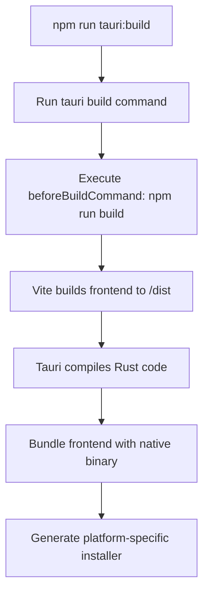
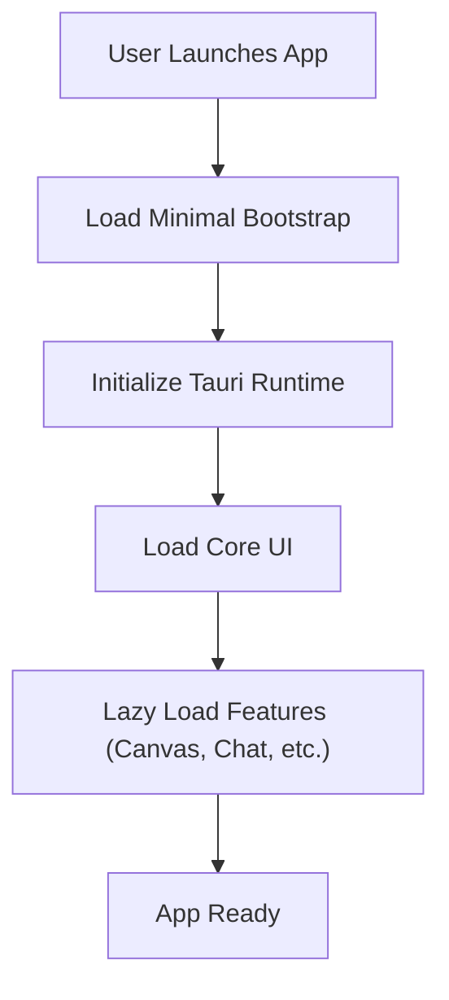

# Deployment and Distribution

<cite>
**Referenced Files in This Document**  
- [tauri.conf.json](file://src-tauri/tauri.conf.json)
- [build.rs](file://src-tauri/build.rs)
- [package.json](file://package.json)
- [production-check.sh](file://scripts/production-check.sh)
- [performance-profile.sh](file://scripts/performance-profile.sh)
</cite>

## Table of Contents
1. [Introduction](#introduction)
2. [Build Pipeline Overview](#build-pipeline-overview)
3. [Tauri Configuration in tauri.conf.json](#tauri-configuration-in-tauriconfjson)
4. [Building Production Binaries](#building-production-binaries)
5. [Cross-Platform Build Instructions](#cross-platform-build-instructions)
6. [Build Artifacts and Output Structure](#build-artifacts-and-output-structure)
7. [Code Signing and Notarization](#code-signing-and-notarization)
8. [Platform-Specific Requirements](#platform-specific-requirements)
9. [Performance Considerations](#performance-considerations)
10. [Update Mechanisms](#update-mechanisms)
11. [Common Issues and Troubleshooting](#common-issues-and-troubleshooting)

## Introduction
LibreOllama leverages Tauri to build a secure, lightweight, and cross-platform desktop application. This document details the deployment and distribution process, focusing on the Tauri-based build pipeline, configuration, and platform-specific considerations for generating production-ready binaries for Windows, macOS, and Linux. It also covers optimization strategies, security practices, and update mechanisms essential for reliable application delivery.

## Build Pipeline Overview
The build pipeline for LibreOllama integrates Vite for frontend bundling and Tauri for native application packaging. The process begins with transpiling TypeScript and bundling assets using Vite, followed by Tauri's Rust-based compilation to generate platform-specific executables. The pipeline is orchestrated through npm scripts defined in `package.json`, ensuring consistency across development and production environments.



**Diagram sources**
- [package.json](file://package.json#L10-L11)
- [tauri.conf.json](file://src-tauri/tauri.conf.json#L7-L9)

**Section sources**
- [package.json](file://package.json#L10-L11)
- [tauri.conf.json](file://src-tauri/tauri.conf.json#L7-L9)

## Tauri Configuration in tauri.conf.json
The `tauri.conf.json` file defines core application metadata, build behavior, security policies, and bundling options. It is central to configuring how the application behaves across different environments and platforms.

### Core Configuration Fields
- **productName**: Name of the application (e.g., "LibreOllama")
- **version**: Semantic version of the app
- **identifier**: Reverse DNS-style bundle identifier
- **build.beforeBuildCommand**: Command executed before Tauri build (e.g., `npm run build`)
- **build.frontendDist**: Directory containing built frontend assets
- **app.security.csp**: Content Security Policy to restrict resource loading and script execution
- **bundle.icon**: Paths to icon files for different platforms

### Environment-Specific Configuration
While the current configuration does not use environment-specific overrides, conditional logic can be implemented via build scripts or CI/CD pipelines to modify `tauri.conf.json` before build. For example, dev builds can point to a local dev server (`devUrl`), while production builds use bundled assets.

**Section sources**
- [tauri.conf.json](file://src-tauri/tauri.conf.json#L1-L30)

## Building Production Binaries
To generate production binaries, the `tauri build` command is used. This triggers the frontend build process and compiles the Rust backend into a native binary. The process ensures that debug code is excluded and assets are optimized.

### Build Preparation
Before building, ensure dependencies are installed and the environment is validated:
```bash
npm ci
npm run type-check
```

### Running the Build
```bash
npm run tauri:build
```
This executes:
1. `beforeBuildCommand`: Runs `npm run build` to compile and minify frontend assets
2. Tauri build: Compiles Rust code and bundles assets into a single binary

**Section sources**
- [package.json](file://package.json#L10-L11)
- [tauri.conf.json](file://src-tauri/tauri.conf.json#L7-L9)

## Cross-Platform Build Instructions
LibreOllama supports building for Windows, macOS, and Linux. Each platform requires specific toolchains and signing procedures.

### Windows
- **Build Command**: `npm run tauri:build`
- **Prerequisites**: Rust, Visual Studio Build Tools, WiX Toolset (for MSI installer)
- **Output**: `.msi` or `.exe` in `src-tauri/target/release/bundle/msi/`

### macOS
- **Build Command**: `npm run tauri:build`
- **Prerequisites**: Rust, Xcode Command Line Tools, Apple Developer Certificate
- **Output**: `.dmg` or `.pkg` in `src-tauri/target/release/bundle/dmg/`
- **Notarization**: Required for Gatekeeper approval; use `notarytool` via CI

### Linux
- **Build Command**: `npm run tauri:build`
- **Prerequisites**: Rust, `appimagetool`, `gtk`, `webkit2gtk`
- **Output**: AppImage, deb, or rpm in `src-tauri/target/release/bundle/appimage/`

**Section sources**
- [tauri.conf.json](file://src-tauri/tauri.conf.json#L25-L30)
- [package.json](file://package.json#L10-L11)

## Build Artifacts and Output Structure
After a successful build, artifacts are stored in platform-specific directories under `src-tauri/target/release/bundle/`. The structure includes:
- **Windows**: MSI installer, executable, uninstaller
- **macOS**: DMG image, application bundle, metadata
- **Linux**: AppImage, desktop file, icons

The bundling process respects the `bundle.icon` configuration, packaging appropriate icons for each platform.

**Section sources**
- [tauri.conf.json](file://src-tauri/tauri.conf.json#L25-L30)

## Code Signing and Notarization
Code signing is essential for platform trust and security compliance.

### Windows
- Use Authenticode signing with a valid certificate
- Sign both `.exe` and `.msi` installers
- Tools: `signtool.exe`

### macOS
- Code signing required via `codesign`
- Notarization via Apple’s `notarytool` to pass Gatekeeper
- Requires Apple Developer Program membership
- Example CI step:
```bash
xcrun notarytool submit app.dmg --keychain-profile "AC_PASSWORD" --wait
```

### Linux
- No universal signing mechanism
- AppImage can be signed using GPG
- Distribution via Snap or Flatpak includes built-in verification

**Section sources**
- [tauri.conf.json](file://src-tauri/tauri.conf.json#L25-L30)

## Platform-Specific Requirements
Each platform imposes unique constraints:

| Platform | Requirements | Notes |
|--------|--------------|-------|
| Windows | Visual Studio Build Tools, WiX | MSI creation requires WiX |
| macOS | Xcode, Apple Developer Account | Notarization mandatory for public release |
| Linux | GTK, WebKit, libappindicator | AppImage requires FUSE or runtime support |

**Section sources**
- [tauri.conf.json](file://src-tauri/tauri.conf.json#L25-L30)

## Performance Considerations
Optimizing binary size and startup performance is critical for user experience.

### Binary Size Optimization
- **Tree Shaking**: Ensure unused dependencies are excluded
- **Compression**: Tauri uses UPX by default for binary compression
- **Asset Minification**: Vite handles JS/CSS minification
- **Conditional Imports**: Load heavy modules (e.g., Konva) only when needed

### Startup Performance
- Lazy-load non-critical features
- Optimize initial render with code splitting
- Preload critical resources



**Diagram sources**
- [tauri.conf.json](file://src-tauri/tauri.conf.json#L1-L30)
- [package.json](file://package.json#L5-L6)

**Section sources**
- [package.json](file://package.json#L5-L6)
- [scripts/performance-profile.sh](file://scripts/performance-profile.sh#L0-L53)

## Update Mechanisms
Tauri supports automatic updates via the `updater` plugin. Configuration in `tauri.conf.json` enables:
- **Update URL**: Endpoint hosting `updater.json` and release binaries
- **Signature Verification**: Ensures update integrity
- **Rollback Protection**: Prevents downgrade attacks

To enable updates:
1. Add `updater` to `plugins` in `tauri.conf.json`
2. Host release metadata and binaries on a secure server
3. Use code signing to validate updates

**Section sources**
- [tauri.conf.json](file://src-tauri/tauri.conf.json#L15-L16)

## Common Issues and Troubleshooting
### Debug Code in Production
Ensure debug tools (e.g., `CanvasDebugger`) are excluded:
```bash
grep -r "Debug" dist/
```
Use `production-check.sh` to validate build cleanliness.

### CSP Violations
Adjust `app.security.csp` if legitimate resources are blocked. Example for Google APIs:
```json
"connect-src": "'self' https://www.googleapis.com"
```

### Build Failures on CI
- Ensure correct Rust and Node versions
- Install platform-specific dependencies (e.g., Xcode on macOS CI)
- Verify code signing certificates are accessible

### Large Binary Size
- Audit dependencies with `npm ls`
- Use dynamic imports for heavy modules
- Enable UPX compression in Tauri config

**Section sources**
- [scripts/production-check.sh](file://scripts/production-check.sh#L0-L74)
- [tauri.conf.json](file://src-tauri/tauri.conf.json#L10-L14)