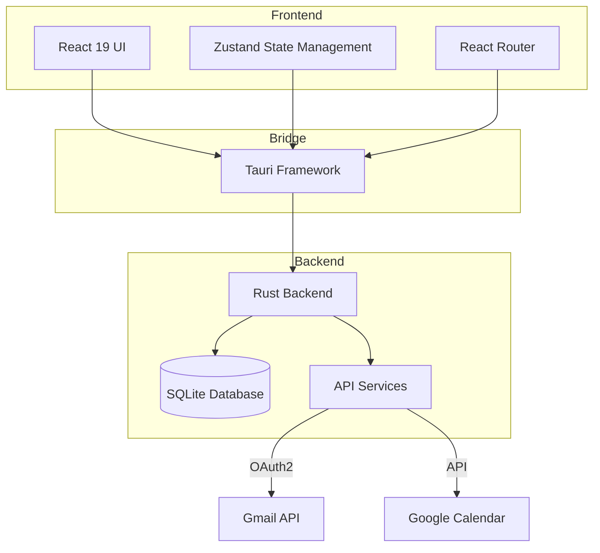

# Getting Started

<cite>
**Referenced Files in This Document**   
- [README.md](file://README.md)
- [package.json](file://package.json)
- [tauri.conf.json](file://src-tauri/tauri.conf.json)
- [Cargo.toml](file://src-tauri/Cargo.toml)
- [main.tsx](file://src/app/main.tsx)
- [App.tsx](file://src/app/App.tsx)
</cite>

## Table of Contents
1. [Project Overview](#project-overview)
2. [Architecture](#architecture)
3. [Installation and Setup](#installation-and-setup)
4. [Project Structure](#project-structure)
5. [Configuration Files](#configuration-files)
6. [Running the Application](#running-the-application)
7. [Common Setup Issues](#common-setup-issues)
8. [Platform-Specific Considerations](#platform-specific-considerations)

## Project Overview

LibreOllama is an open-source, locally-run, privacy-first productivity suite designed for thinking, creating, and organizing. It integrates AI-powered chat, a visual canvas, email management, task organization, and calendar functionality into a single cohesive workspace. The application prioritizes user privacy by running locally and leveraging secure technologies.

The suite is built as a cross-platform desktop application using modern web and systems programming technologies. It provides a unified interface for managing various productivity workflows, with a focus on seamless integration between different modules such as canvas, chat, mail, tasks, and calendar.

**Section sources**
- [README.md](file://README.md#L1-L31)

## Architecture

LibreOllama follows a hybrid architecture combining a React-based frontend with a Rust backend, unified through the Tauri framework. This architecture provides the benefits of web technologies for UI development while maintaining the performance and security advantages of native applications.

The application uses React 19 for the frontend UI, providing a modern, component-based architecture with TypeScript for type safety. The backend is implemented in Rust, leveraging its memory safety and performance characteristics for system operations and data management. Tauri serves as the bridge between these components, enabling secure communication between the frontend and backend while packaging the application as a native desktop executable.

The state management system uses Zustand for predictable state management, while data persistence is handled through SQLite for secure local storage. The application also integrates with external services like Gmail and Google Calendar through OAuth2 authentication.



**Diagram sources**
- [README.md](file://README.md#L34-L37)
- [package.json](file://package.json#L10-L15)

## Installation and Setup

### Prerequisites

Before installing LibreOllama, ensure you have the following prerequisites installed:

1. **Rust & Cargo**: Install via rustup from [rust-lang.org](https://www.rust-lang.org/tools/install)
2. **Node.js & npm**: Download from [nodejs.org](https://nodejs.org/) (LTS version recommended)
3. **Tauri CLI**: Install globally using cargo

```bash
cargo install tauri-cli
```

### Installation Steps

1. **Clone the repository and install dependencies**:
```bash
git clone https://github.com/mtmitchel/libreollama.git
cd libreollama
npm install
```

2. **Verify the installation**:
After running `npm install`, check that all dependencies are properly installed by examining the `node_modules` directory and ensuring no errors were reported during installation.

**Section sources**
- [README.md](file://README.md#L39-L50)

## Project Structure

The LibreOllama project follows a structured organization that separates frontend and backend concerns while maintaining feature-based grouping for scalability.

```
libreollama/
├── src/                       # React frontend components
│   ├── app/                   # Application root and routing
│   ├── components/            # Shared UI components
│   ├── features/              # Feature modules (canvas, mail, chat, etc.)
│   ├── stores/                # Zustand state management stores
│   ├── styles/                # CSS styles and design system
│   └── ...                    # Other frontend assets
├── src-tauri/                 # Rust backend and Tauri configuration
│   ├── src/                   # Rust source code
│   │   ├── commands/          # Tauri command handlers
│   │   ├── services/          # Backend service implementations
│   │   └── ...                # Other Rust modules
│   ├── migrations/            # Database migration scripts
│   └── ...                    # Tauri configuration files
├── public/                    # Static assets
├── scripts/                   # Utility scripts
└── ...                        # Configuration and documentation
```

The `src` directory contains all frontend code implemented in React and TypeScript, while `src-tauri` houses the Rust backend and Tauri-specific configuration. This separation allows for independent development of frontend and backend components while maintaining clear integration points through Tauri's command system.

**Section sources**
- [README.md](file://README.md#L79-L95)

## Configuration Files

### Tauri Configuration (tauri.conf.json)

The `tauri.conf.json` file configures the Tauri application settings, including build commands, security policies, and bundling options.

```json
{
  "$schema": "https://schema.tauri.app/config/2",
  "productName": "LibreOllama",
  "version": "0.1.0",
  "identifier": "com.libreollama.desktop",
  "build": {
    "beforeDevCommand": "npm run dev -- --port 1423",
    "devUrl": "http://localhost:1423",
    "beforeBuildCommand": "npm run build",
    "frontendDist": "../dist"
  },
  "app": {
    "windows": [],
    "security": {
      "csp": "default-src 'self' https: http: data: blob:; connect-src 'self' https: http: ws: wss: http://localhost:11434 ws://localhost:11434 https://www.googleapis.com https://accounts.google.com; script-src 'self' https: 'unsafe-inline' 'unsafe-eval' 'wasm-unsafe-eval'; style-src 'self' https: 'unsafe-inline'; img-src * data: blob:; font-src * data:; media-src *; frame-src *; worker-src 'self' blob: https:;"
    }
  },
  "plugins": {},
  "bundle": {
    "active": true,
    "targets": "all",
    "icon": [
      "icons/32x32.png",
      "icons/128x128.png",
      "icons/128x128@2x.png",
      "icons/icon.icns",
      "icons/icon.ico"
    ]
  }
}
```

The configuration specifies development and build commands, sets up Content Security Policy (CSP) rules for security, and defines application bundling options including icon assets.

### Package Configuration (package.json)

The `package.json` file defines the project metadata, dependencies, and npm scripts for development workflows.

Key scripts include:
- `dev`: Start the Vite development server
- `tauri:dev`: Run the full Tauri application in development mode
- `tauri:build`: Build production binaries
- `test`: Run tests with Vitest
- `lint`: Perform code quality checks

**Section sources**
- [tauri.conf.json](file://src-tauri/tauri.conf.json#L1-L31)
- [package.json](file://package.json#L5-L25)

## Running the Application

### Development Mode

To run LibreOllama in development mode, use one of the following commands:

```bash
# Run the full Tauri application (recommended for full functionality)
npm run tauri:dev

# Run the frontend only using Vite dev server (useful for UI development)
npm run dev
```

The `tauri:dev` command launches both the frontend and backend, enabling access to all features including database operations and system integrations. The `dev` command runs only the frontend, which is useful for UI development when backend services are not required.

### Production Build

To create a production build of the application:

```bash
npm run tauri:build
```

This command compiles the React application, bundles it with the Rust backend, and creates platform-specific executable files in the `src-tauri/target/release/bundle/` directory.

### Testing

The application includes a comprehensive testing suite accessible through npm scripts:

```bash
# Run all tests once
npm test

# Run tests in watch mode (re-runs on file changes)
npm run test:watch

# Run tests with coverage reporting
npm run test:coverage

# Run linting checks
npm run lint

# Check TypeScript types
npm run type-check
```

**Section sources**
- [README.md](file://README.md#L52-L67)
- [package.json](file://package.json#L6-L14)

## Common Setup Issues

### Tauri Build Errors

Tauri build failures commonly occur due to missing system dependencies. On Windows, ensure you have the Visual Studio Build Tools installed. On macOS, verify Xcode command line tools are installed:

```bash
xcode-select --install
```

On Linux, install required build tools:
- Ubuntu/Debian: `sudo apt-get install build-essential`
- Fedora: `sudo dnf groupinstall "Development Tools"`

### Dependency Conflicts

If you encounter dependency conflicts during `npm install`, try the following:

1. Clear npm cache:
```bash
npm cache clean --force
```

2. Remove node_modules and reinstall:
```bash
rm -rf node_modules package-lock.json
npm install
```

3. For persistent issues, use npm ci for a clean installation:
```bash
npm ci
```

### Port Conflicts

The development server runs on port 1423 by default. If this port is already in use, modify the `beforeDevCommand` in `tauri.conf.json` to use a different port:

```json
"beforeDevCommand": "npm run dev -- --port 1424"
```

### Database Migration Issues

On first launch, the application runs database migrations. If you encounter migration errors:

1. Verify the `src-tauri/migrations/` directory contains migration files
2. Check that the Rust backend can access the application data directory
3. Ensure the `force_run_migrations` command is properly implemented in the backend

**Section sources**
- [tauri.conf.json](file://src-tauri/tauri.conf.json#L6-L10)
- [App.tsx](file://src/app/App.tsx#L118-L135)

## Platform-Specific Considerations

### Windows

- Ensure PowerShell execution policy allows script execution
- Install Microsoft Visual C++ Build Tools if compilation fails
- Antivirus software may interfere with Tauri's native components; add exceptions if needed

### macOS

- Grant necessary permissions for the application to access system resources
- On Apple Silicon (M1/M2) Macs, ensure Rosetta is available if using x64 dependencies
- Gatekeeper may block unsigned applications; right-click and select "Open" to bypass

### Linux

- Install required system libraries:
  - WebKit2GTK for web views
  - libssl for secure connections
  - pkg-config for build configuration

- Desktop integration may require additional configuration for proper menu and notification support

- Distribution-specific package managers:
  - Ubuntu/Debian: `sudo apt-get install libwebkit2gtk-4.0-dev libssl-dev pkg-config`
  - Fedora: `sudo dnf install webkit2gtk3-devel openssl-devel pkgconf-pkg-config`

The application is designed to work consistently across all supported platforms, with Tauri handling most platform-specific differences automatically.

**Section sources**
- [README.md](file://README.md#L34-L37)
- [Cargo.toml](file://src-tauri/Cargo.toml#L1-L85)