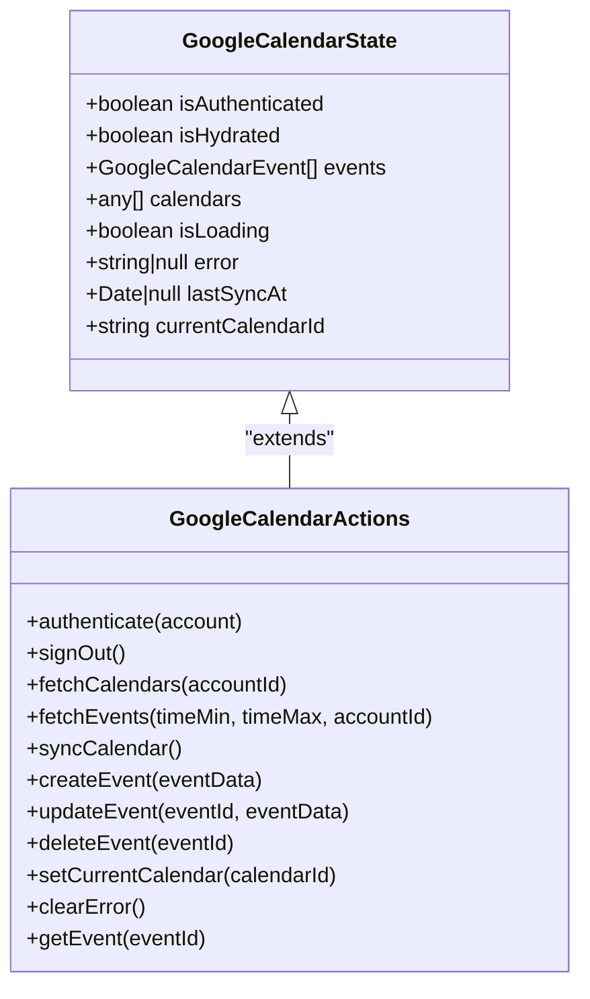
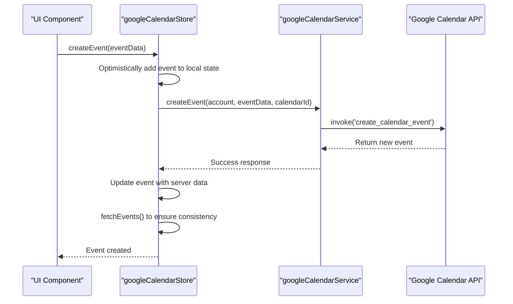
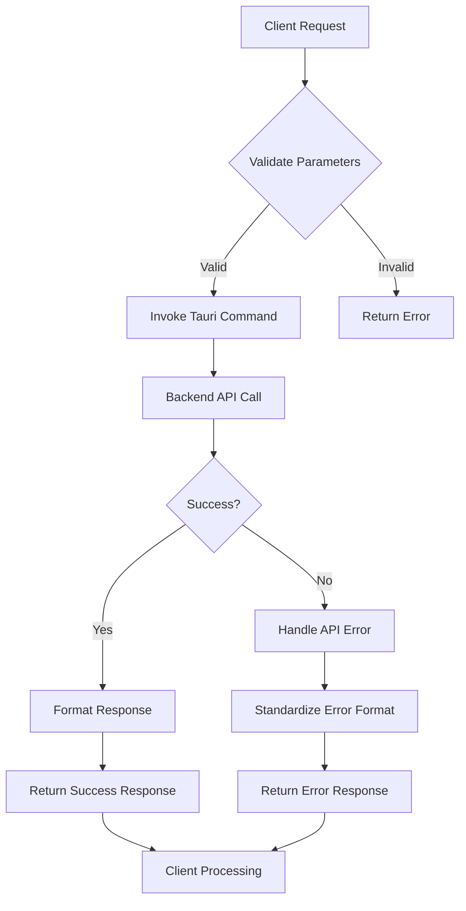
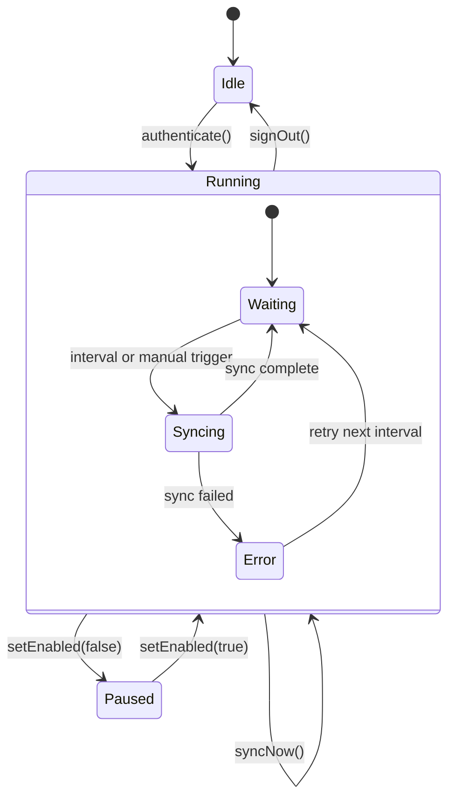
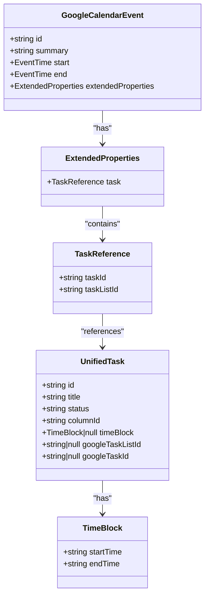
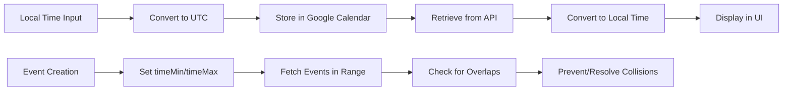
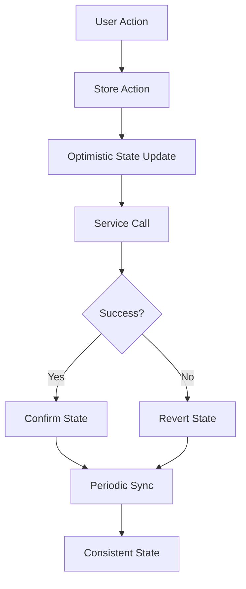

# Calendar State Management

<cite>
**Referenced Files in This Document**   
- [googleCalendarStore.ts](file://src/stores/googleCalendarStore.ts)
- [googleCalendarService.ts](file://src/services/google/googleCalendarService.ts)
- [googleCalendarAutoSync.ts](file://src/services/googleCalendarAutoSync.ts)
- [unifiedTaskStore.ts](file://src/stores/unifiedTaskStore.ts)
</cite>

## Table of Contents
1. [Introduction](#introduction)
2. [Core State Structure](#core-state-structure)
3. [Zustand Store Implementation](#zustand-store-implementation)
4. [Google Calendar API Integration](#google-calendar-api-integration)
5. [Automatic Synchronization Mechanism](#automatic-synchronization-mechanism)
6. [Calendar and Task State Coordination](#calendar-and-task-state-coordination)
7. [Event Collision and Time Zone Handling](#event-collision-and-time-zone-handling)
8. [Real-Time Updates and State Consistency](#real-time-updates-and-state-consistency)
9. [Conclusion](#conclusion)

## Introduction
The Calendar State Management system in LibreOllama provides a robust solution for handling calendar events, time zones, and view states through a centralized Zustand store. This document explains the implementation of the `useGoogleCalendarStore`, its integration with Google Calendar API via `googleCalendarService`, and the automatic synchronization mechanism in `googleCalendarAutoSync`. It also covers how calendar state coordinates with task state for time-blocked tasks, addressing common issues like event collision detection and time zone handling.

**Section sources**
- [googleCalendarStore.ts](file://src/stores/googleCalendarStore.ts#L1-L404)

## Core State Structure
The `useGoogleCalendarStore` manages calendar-related state using Zustand, a lightweight state management solution. The state structure includes authentication status, event data, UI state, and current calendar context.

### Authentication and Session State
The store tracks user authentication status and hydration state:
- `isAuthenticated`: Indicates if the user has authenticated with Google Calendar
- `isHydrated`: Tracks whether the store has been restored from localStorage
- `getCurrentAccount`: Retrieves the active Google account from mail store or settings

### Calendar Data State
The core data structures include:
- `events`: Array of `GoogleCalendarEvent` objects with extended properties
- `calendars`: List of available calendars for the authenticated account
- `currentCalendarId`: Tracks the currently active calendar (default: 'primary')

### UI and Synchronization State
UI-related state includes:
- `isLoading`: Indicates ongoing data fetch operations
- `error`: Stores error messages from API operations
- `lastSyncAt`: Timestamp of the last successful synchronization
- `currentCalendarId`: Active calendar identifier for UI context

**Diagram sources**
- [googleCalendarStore.ts](file://src/stores/googleCalendarStore.ts#L15-L404)

**Section sources**
- [googleCalendarStore.ts](file://src/stores/googleCalendarStore.ts#L15-L404)

## Zustand Store Implementation
The `useGoogleCalendarStore` is implemented using Zustand with several middleware layers for enhanced functionality.

### Middleware Composition
The store uses three key middleware packages:
- `devtools`: Enables Redux DevTools integration for debugging
- `persist`: Persists state to localStorage with selective partialization
- `immer`: Allows mutable-style updates to immutable state

### State Persistence Configuration
The persistence layer is configured to store specific state properties:
- `partialize`: Selectively persists authentication status, events, calendars, current calendar ID, and last sync timestamp
- `onRehydrateStorage`: Sets `isHydrated` flag when state is restored from storage
- Storage key: `google-calendar-storage`

### Action Implementation
Key actions provide comprehensive calendar management:
- `authenticate`: Sets authentication state and triggers initial data fetch
- `fetchEvents`: Retrieves events from all calendars with time range filtering
- `createEvent`: Creates new events with optimistic UI updates
- `updateEvent`: Updates existing events with server synchronization
- `deleteEvent`: Removes events with local and remote deletion

The store uses optimistic updates for better user experience, immediately updating the local state before confirming with the server, then refetching to ensure consistency.

**Diagram sources**
- [googleCalendarStore.ts](file://src/stores/googleCalendarStore.ts#L1-L404)
- [googleCalendarService.ts](file://src/services/google/googleCalendarService.ts#L1-L166)

**Section sources**
- [googleCalendarStore.ts](file://src/stores/googleCalendarStore.ts#L1-L404)

## Google Calendar API Integration
The `googleCalendarService` class provides a clean interface between the Zustand store and the Tauri backend for Google Calendar API operations.

### Service Architecture
The service uses Tauri's `invoke` function to communicate with the Rust backend:
- Encapsulates API calls in dedicated methods
- Handles error responses with consistent formatting
- Provides type safety through TypeScript interfaces

### Key API Methods
The service implements essential calendar operations:
- `getEvents`: Retrieves events with configurable time ranges and pagination
- `createEvent`: Creates new calendar events with extended properties
- `updateEvent`: Modifies existing events
- `deleteEvent`: Removes events from the calendar
- `getCalendars`: Lists available calendars for an account

### Error Handling Strategy
The service implements robust error handling:
- `handleApiError` method standardizes error responses
- Returns structured `ApiResponse` objects with success/failure status
- Logs detailed error information for debugging
- Preserves original error context while providing user-friendly messages

**Diagram sources**
- [googleCalendarService.ts](file://src/services/google/googleCalendarService.ts#L1-L166)

**Section sources**
- [googleCalendarService.ts](file://src/services/google/googleCalendarService.ts#L1-L166)

## Automatic Synchronization Mechanism
The `googleCalendarAutoSync` system provides background synchronization to keep calendar data up-to-date without user intervention.

### Auto-Sync Lifecycle
The synchronization system automatically starts and stops based on authentication state:
- Subscribes to store changes to detect authentication events
- Starts periodic sync when user authenticates
- Stops sync when user signs out
- Restarts sync if authentication state changes

### Synchronization Strategy
The auto-sync process uses an intelligent approach:
- Default interval: 5 minutes (configurable)
- Performs full sync of calendars and events
- Uses current month's time range for event fetching
- Logs sync duration for performance monitoring
- Handles errors gracefully without disrupting the application

### Configuration and Control
The system provides programmatic control:
- `startSync()` and `stopSync()`: Manual control of sync process
- `setSyncInterval(minutes)`: Adjust sync frequency
- `setEnabled(enabled)`: Enable/disable auto-sync feature
- `syncNow()`: Trigger immediate manual sync
- `getStatus()`: Retrieve current sync status

**Diagram sources**
- [googleCalendarAutoSync.ts](file://src/services/googleCalendarAutoSync.ts#L1-L141)

**Section sources**
- [googleCalendarAutoSync.ts](file://src/services/googleCalendarAutoSync.ts#L1-L141)

## Calendar and Task State Coordination
The calendar system integrates with the task management system to support time-blocked tasks, creating a cohesive productivity experience.

### Time-Blocked Task Implementation
Tasks can be associated with calendar events through time blocking:
- Tasks store time block information (start and end times)
- Calendar events can be created from time-blocked tasks
- Bidirectional synchronization maintains consistency

### Unified State Management
The `unifiedTaskStore` coordinates with calendar state:
- Tasks with `timeBlock` property trigger calendar event creation
- Calendar events with task references update task status
- Cross-store dependencies ensure data consistency
- Error handling accounts for schema changes and migration needs

### Integration Points
Key integration mechanisms include:
- Task creation with time blocks automatically creates calendar events
- Calendar event updates reflect in associated tasks
- Task deletion removes corresponding calendar events
- Time block modifications update both task and calendar records

**Diagram sources**
- [unifiedTaskStore.ts](file://src/stores/unifiedTaskStore.ts#L1-L799)
- [googleCalendarStore.ts](file://src/stores/googleCalendarStore.ts#L1-L404)

**Section sources**
- [unifiedTaskStore.ts](file://src/stores/unifiedTaskStore.ts#L1-L799)

## Event Collision and Time Zone Handling
The system addresses common calendar challenges through careful implementation of event collision detection and time zone management.

### Event Collision Detection
While explicit collision detection logic isn't shown in the provided code, the system supports it through:
- Complete event data retrieval for the current month
- Local state that enables client-side collision checking
- Event properties that include start and end times for comparison
- Extended properties that can store collision metadata

### Time Zone Management
The system handles time zones through several mechanisms:
- Uses ISO 8601 timestamps (RFC 3339) for all date-time values
- Relies on Google Calendar API's built-in time zone handling
- Stores times in UTC format with appropriate time zone offsets
- Converts local times to UTC for storage and back for display

### Date and Time Utilities
The system leverages consistent date handling:
- Default time ranges use `toISOString()` for proper formatting
- Event creation and modification preserve time zone context
- Time block data is stored as ISO strings for consistency
- Calendar views can adapt to user's local time zone settings

**Section sources**
- [googleCalendarStore.ts](file://src/stores/googleCalendarStore.ts#L1-L404)
- [googleCalendarService.ts](file://src/services/google/googleCalendarService.ts#L1-L166)

## Real-Time Updates and State Consistency
The system ensures real-time updates and state consistency through a combination of optimistic updates, periodic synchronization, and error recovery mechanisms.

### Optimistic Update Pattern
The store implements optimistic updates for better user experience:
- Immediately update local state upon user action
- Send changes to server in background
- Refresh data from server to ensure consistency
- Revert changes if server operation fails

### State Consistency Measures
Multiple strategies maintain state consistency:
- Automatic refetching after create operations
- Periodic synchronization via `googleCalendarAutoSync`
- Local storage persistence with hydration
- Error boundaries that preserve usable state

### Data Flow Architecture
The system follows a unidirectional data flow:
- User interactions trigger store actions
- Actions update local state immediately
- Side effects communicate with external services
- Service responses update state or trigger recovery
- Components re-render based on state changes

**Section sources**
- [googleCalendarStore.ts](file://src/stores/googleCalendarStore.ts#L1-L404)
- [googleCalendarAutoSync.ts](file://src/services/googleCalendarAutoSync.ts#L1-L141)

## Conclusion
The Calendar State Management system in LibreOllama provides a comprehensive solution for handling calendar data with robust state management, seamless Google Calendar integration, and automatic synchronization. By leveraging Zustand for state management, the system offers a clean, predictable state container with powerful middleware for persistence and debugging. The integration with Google Calendar API through a dedicated service layer ensures reliable data access, while the automatic synchronization mechanism keeps calendar data up-to-date in the background. The coordination between calendar and task states enables powerful time-blocking features, creating a cohesive productivity experience. With proper handling of time zones and mechanisms for maintaining state consistency, the system provides a reliable foundation for calendar functionality in LibreOllama.