# Canvas State Management

<cite>
**Referenced Files in This Document**   
- [unifiedCanvasStore.ts](file://src/features/canvas/stores/unifiedCanvasStore.ts)
- [historyModule.ts](file://src/features/canvas/stores/modules/historyModule.ts)
- [selectionModule.ts](file://src/features/canvas/stores/modules/selectionModule.ts)
- [elementModule.ts](file://src/features/canvas/stores/modules/elementModule.ts)
- [useCanvasHistory.ts](file://src/features/canvas/hooks/useCanvasHistory.ts)
- [useSelectionManager.ts](file://src/features/canvas/hooks/useSelectionManager.ts)
- [StoreAdapterUnified.ts](file://src/features/canvas/renderer/modular/adapters/StoreAdapterUnified.ts)
- [createUnifiedTestStore.ts](file://src/tests/helpers/createUnifiedTestStore.ts)
</cite>

## Table of Contents
1. [Introduction](#introduction)
2. [Core Architecture of unifiedCanvasStore](#core-architecture-of-unifiedcanvasstore)
3. [State Model Design](#state-model-design)
4. [Store Initialization and Global Access](#store-initialization-and-global-access)
5. [History Management System](#history-management-system)
6. [Selection State Management](#selection-state-management)
7. [Transaction and Batch Update Handling](#transaction-and-batch-update-handling)
8. [Performance Optimization for Large Canvases](#performance-optimization-for-large-canvases)
9. [Collaborative Editing and State Consistency](#collaborative-editing-and-state-consistency)
10. [Canvas Component Integration via Hooks](#canvas-component-integration-via-hooks)
11. [Store Adapter for Renderer Integration](#store-adapter-for-renderer-integration)
12. [Testing and Debugging Support](#testing-and-debugging-support)
13. [Conclusion](#conclusion)

## Introduction
The Canvas State Management system in LibreOllama is built around the `unifiedCanvasStore`, a centralized Zustand-based state container that manages all aspects of canvas data including elements, selections, viewport, drawing operations, and history. This document provides a comprehensive overview of its architecture, focusing on how it efficiently handles complex state interactions, supports undo/redo functionality, and enables high-performance rendering for large-scale canvases. The system is designed to be modular, extensible, and accessible to both beginners and advanced developers, with clear patterns for state management, transaction handling, and real-time collaboration.

## Core Architecture of unifiedCanvasStore
The `unifiedCanvasStore` implements a modular architecture using Zustand's middleware stack, combining `immer` for immutable updates, `subscribeWithSelector` for granular reactivity, and `persist` for local storage synchronization. The store is composed of multiple focused modules—element, selection, viewport, drawing, history, section, UI, event, and edge—each responsible for a specific domain of canvas functionality. These modules are created through factory functions (`createElementModule`, `createSelectionModule`, etc.) that receive Zustand's `set` and `get` functions, enabling them to modify state and access other parts of the store. The final store structure merges all module states and actions into a unified interface, providing a cohesive API for canvas operations while maintaining separation of concerns internally.

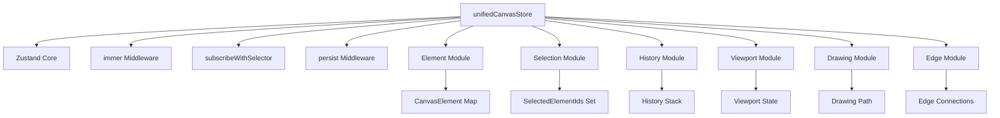

**Diagram sources**
- [unifiedCanvasStore.ts](file://src/features/canvas/stores/unifiedCanvasStore.ts#L0-L20)
- [elementModule.ts](file://src/features/canvas/stores/modules/elementModule.ts#L0-L20)
- [historyModule.ts](file://src/features/canvas/stores/modules/historyModule.ts#L0-L20)

**Section sources**
- [unifiedCanvasStore.ts](file://src/features/canvas/stores/unifiedCanvasStore.ts#L0-L20)
- [elementModule.ts](file://src/features/canvas/stores/modules/elementModule.ts#L0-L20)

## State Model Design
The state model of `unifiedCanvasStore` is designed to efficiently represent complex canvas data using optimized data structures. Canvas elements are stored in a `Map<string, CanvasElement>` for O(1) lookups, while their rendering order is maintained in an `elementOrder` array. Selection state uses a `Set<ElementId>` for fast membership checks and a `lastSelectedElementId` field to track primary selection. History is implemented as a stack of `HistoryEntry` objects containing snapshots of elements and selection state. The store also manages specialized states like `edges` (for connector lines), `sections` (grouping containers), and `draft` (for in-progress drawing). This design ensures that common operations—element lookup, selection toggle, history navigation—are performed efficiently even with thousands of elements.

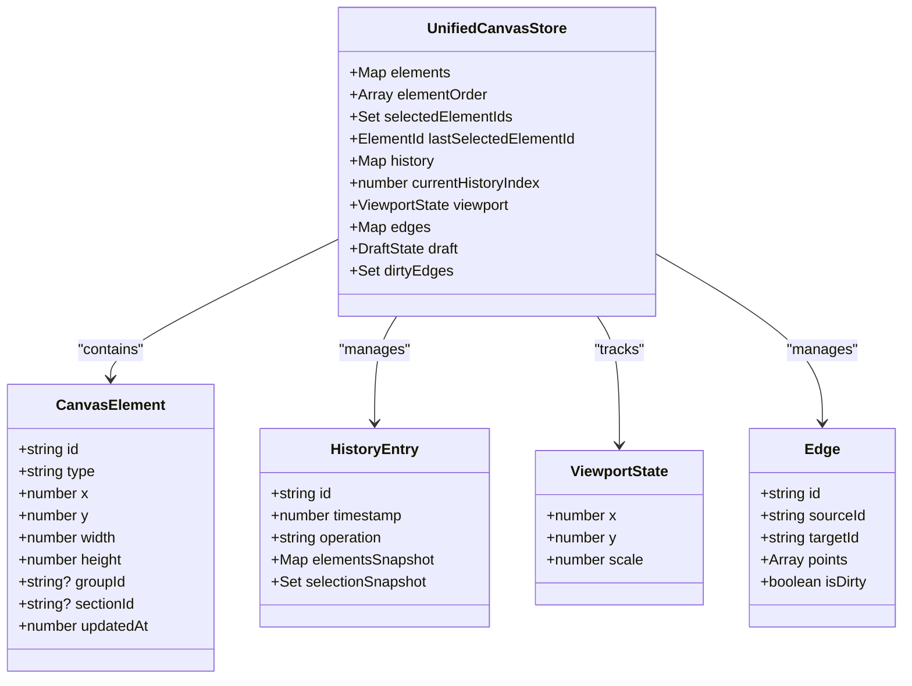

**Diagram sources**
- [unifiedCanvasStore.ts](file://src/features/canvas/stores/unifiedCanvasStore.ts#L118-L135)
- [elementModule.ts](file://src/features/canvas/stores/modules/elementModule.ts#L0-L20)
- [historyModule.ts](file://src/features/canvas/stores/modules/historyModule.ts#L0-L20)

**Section sources**
- [unifiedCanvasStore.ts](file://src/features/canvas/stores/unifiedCanvasStore.ts#L118-L135)
- [elementModule.ts](file://src/features/canvas/stores/modules/elementModule.ts#L0-L20)

## Store Initialization and Global Access
The `unifiedCanvasStore` is initialized using Zustand's `create` function with a composition of middleware: `persist` for automatic localStorage synchronization, `subscribeWithSelector` for efficient component updates, and `immer` for simplified immutable state updates. During initialization, all modules are instantiated with their respective `set` and `get` functions, ensuring proper dependency injection. The store is exposed globally via `(window as any).__UNIFIED_CANVAS_STORE__` for debugging and external access, allowing developers to inspect and manipulate canvas state directly from the browser console. This global exposure is particularly useful for QA testing and performance diagnostics, though it is intended for development use only.

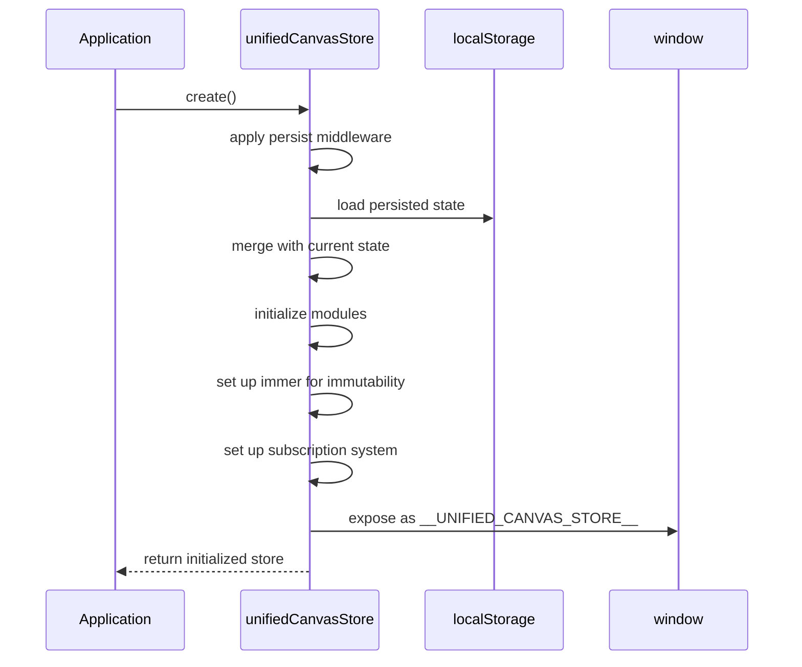

**Diagram sources**
- [unifiedCanvasStore.ts](file://src/features/canvas/stores/unifiedCanvasStore.ts#L200-L250)
- [createUnifiedTestStore.ts](file://src/tests/helpers/createUnifiedTestStore.ts#L0-L20)

**Section sources**
- [unifiedCanvasStore.ts](file://src/features/canvas/stores/unifiedCanvasStore.ts#L200-L250)
- [createUnifiedTestStore.ts](file://src/tests/helpers/createUnifiedTestStore.ts#L0-L20)

## History Management System
The history management system in `unifiedCanvasStore` is implemented through the `historyModule`, which provides a robust undo/redo mechanism for canvas operations. Each history entry captures a complete snapshot of the `elements` map and `selectedElementIds` set at the time of the operation, along with metadata like timestamp and operation type. The system maintains a bounded history stack (default 50 entries) and automatically handles branching by truncating future history when a new operation occurs after an undo. The `addToHistory` action is called after significant state changes, while intermediate updates (like drag movements) use `skipHistory=true` to avoid cluttering the stack. This design ensures that users can reliably undo complex sequences of actions while maintaining performance.

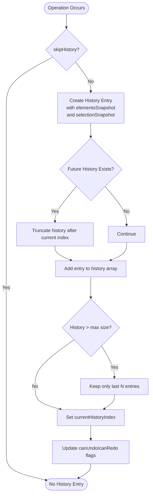

**Diagram sources**
- [historyModule.ts](file://src/features/canvas/stores/modules/historyModule.ts#L0-L208)
- [unifiedCanvasStore.ts](file://src/features/canvas/stores/unifiedCanvasStore.ts#L118-L135)

**Section sources**
- [historyModule.ts](file://src/features/canvas/stores/modules/historyModule.ts#L0-L208)

## Selection State Management
Selection state in the canvas is managed by the `selectionModule`, which maintains a `selectedElementIds` Set for tracking currently selected elements and a `lastSelectedElementId` for identifying the primary selection. The module provides actions like `selectElement`, `deselectElement`, and `clearSelection` that update this state while ensuring proper reactivity through Zustand's `set` function. Grouping functionality is also handled here, with `groups` Map tracking element groupings and `elementToGroupMap` providing reverse lookup. When elements are grouped, their movements are synchronized, and the selection system ensures that grouped elements are treated as a single unit. This design enables efficient selection operations and supports complex interactions like multi-select rectangles and group transformations.

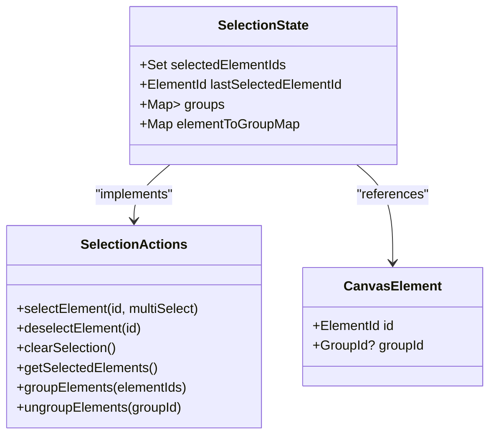

**Diagram sources**
- [selectionModule.ts](file://src/features/canvas/stores/modules/selectionModule.ts#L0-L148)
- [unifiedCanvasStore.ts](file://src/features/canvas/stores/unifiedCanvasStore.ts#L118-L135)

**Section sources**
- [selectionModule.ts](file://src/features/canvas/stores/modules/selectionModule.ts#L0-L148)

## Transaction and Batch Update Handling
The canvas system implements transaction management through the `StoreTransactionManager` pattern, allowing multiple operations to be grouped into atomic units for history and performance purposes. The `batchOperations` utility in `useCanvasHistory` enables developers to execute a series of changes without creating intermediate history entries, instead capturing the entire batch as a single undoable action. For high-frequency updates like drawing strokes, the `addElementDrawing` action bypasses history entirely, operating on a direct Map reference for maximum performance. The `batchUpdate` action in the element module uses `requestAnimationFrame` to coalesce multiple updates into a single state change, reducing re-renders and improving responsiveness. This layered approach to transactions ensures both data integrity and optimal performance.

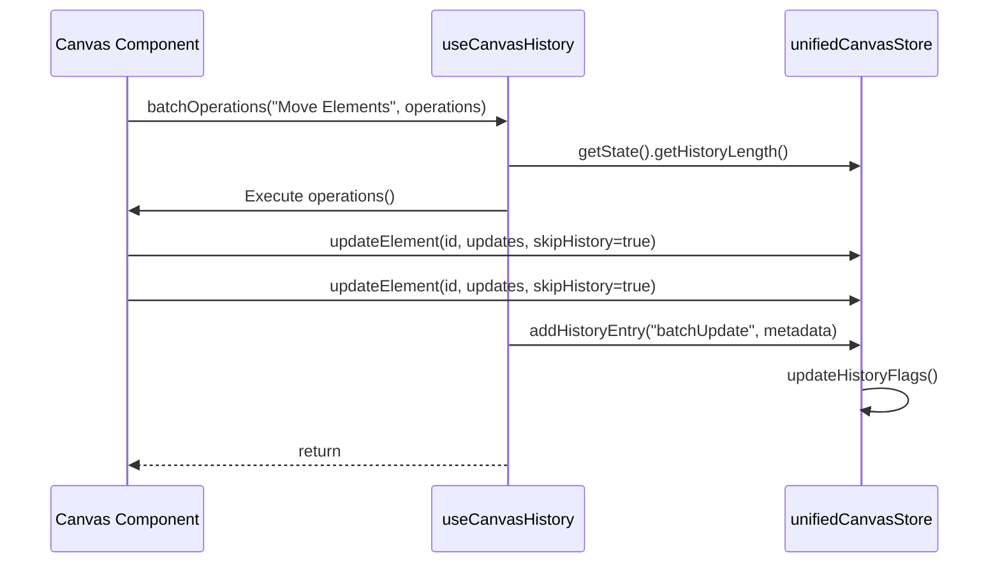

**Diagram sources**
- [useCanvasHistory.ts](file://src/features/canvas/hooks/useCanvasHistory.ts#L100-L150)
- [elementModule.ts](file://src/features/canvas/stores/modules/elementModule.ts#L500-L600)

**Section sources**
- [useCanvasHistory.ts](file://src/features/canvas/hooks/useCanvasHistory.ts#L100-L150)
- [elementModule.ts](file://src/features/canvas/stores/modules/elementModule.ts#L500-L600)

## Performance Optimization for Large Canvases
The canvas state management system includes several optimizations for handling large-scale data efficiently. Element storage uses a Map for O(1) access, while the `addElementFast` and `addElementDrawing` methods minimize overhead during high-frequency operations like drawing. The store leverages `immer` for structural sharing, ensuring that only changed parts of the state tree trigger re-renders. For edge reflow operations (updating connector lines when elements move), the system uses `requestAnimationFrame` batching to coalesce multiple updates into a single computation. The `spatialIndexDirty` flag allows deferred spatial indexing for eraser functionality, preventing unnecessary calculations during rapid drawing. These optimizations collectively enable smooth performance even with thousands of elements on the canvas.

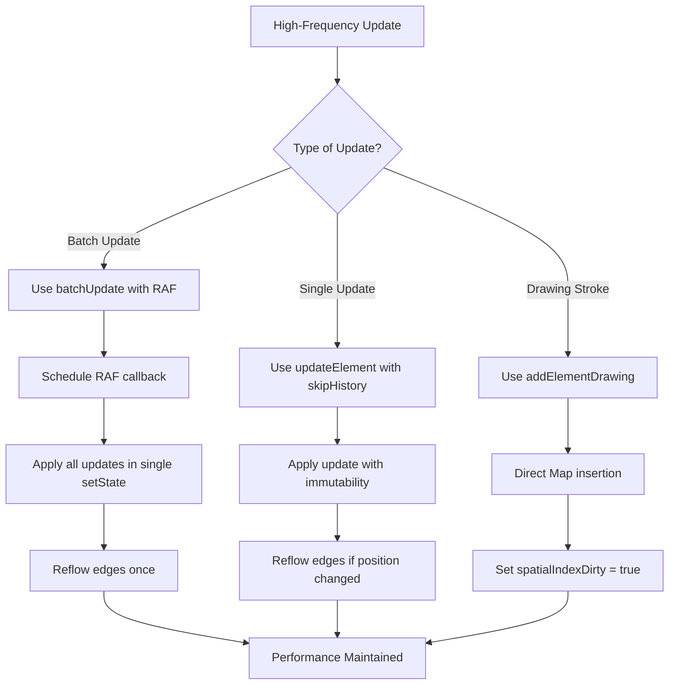

**Diagram sources**
- [elementModule.ts](file://src/features/canvas/stores/modules/elementModule.ts#L200-L300)
- [useCanvasHistory.ts](file://src/features/canvas/hooks/useCanvasHistory.ts#L100-L150)

**Section sources**
- [elementModule.ts](file://src/features/canvas/stores/modules/elementModule.ts#L200-L300)

## Collaborative Editing and State Consistency
While the current implementation focuses on single-user state management, the architecture supports collaborative editing through its deterministic state model and history system. The use of `nanoid` for element and history entry IDs ensures global uniqueness, while the immutable update pattern via `immer` prevents race conditions. The `persist` middleware synchronizes state to localStorage, providing a foundation for eventual consistency in multi-device scenarios. For real-time collaboration, the system could integrate with a CRDT (Conflict-Free Replicated Data Type) layer or operational transformation, using the existing history stack as a basis for conflict resolution. The modular design allows such features to be added without disrupting core functionality, making the canvas adaptable to future collaboration requirements.

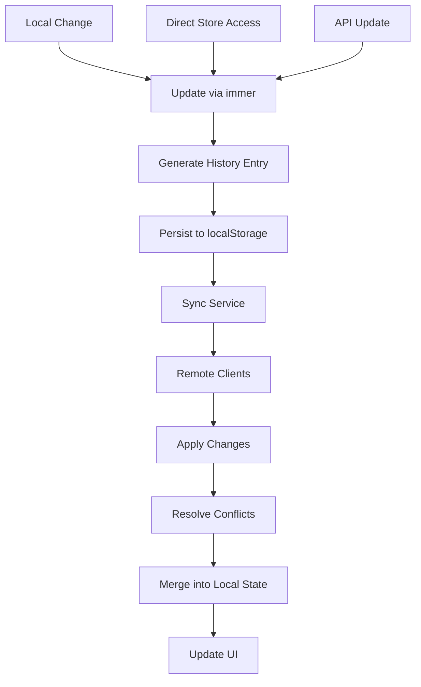

**Diagram sources**
- [unifiedCanvasStore.ts](file://src/features/canvas/stores/unifiedCanvasStore.ts#L200-L250)
- [historyModule.ts](file://src/features/canvas/stores/modules/historyModule.ts#L0-L208)

**Section sources**
- [unifiedCanvasStore.ts](file://src/features/canvas/stores/unifiedCanvasStore.ts#L200-L250)

## Canvas Component Integration via Hooks
Canvas components interact with the `unifiedCanvasStore` through custom hooks like `useCanvasHistory` and `useSelectionManager`, which provide a clean, React-friendly interface to the underlying Zustand store. `useCanvasHistory` exposes history state (canUndo, canRedo) and actions (undo, redo, batchOperations), while `useSelectionManager` provides selection state and operations (selectElement, clearSelection). These hooks use Zustand's selector pattern to minimize re-renders by subscribing only to relevant parts of the state. The `useSelectionManager` also includes utility functions like `selectInRectangle` and `getSelectionBounds` that encapsulate complex selection logic, making it easy for components to implement features like marquee selection and group transformations.

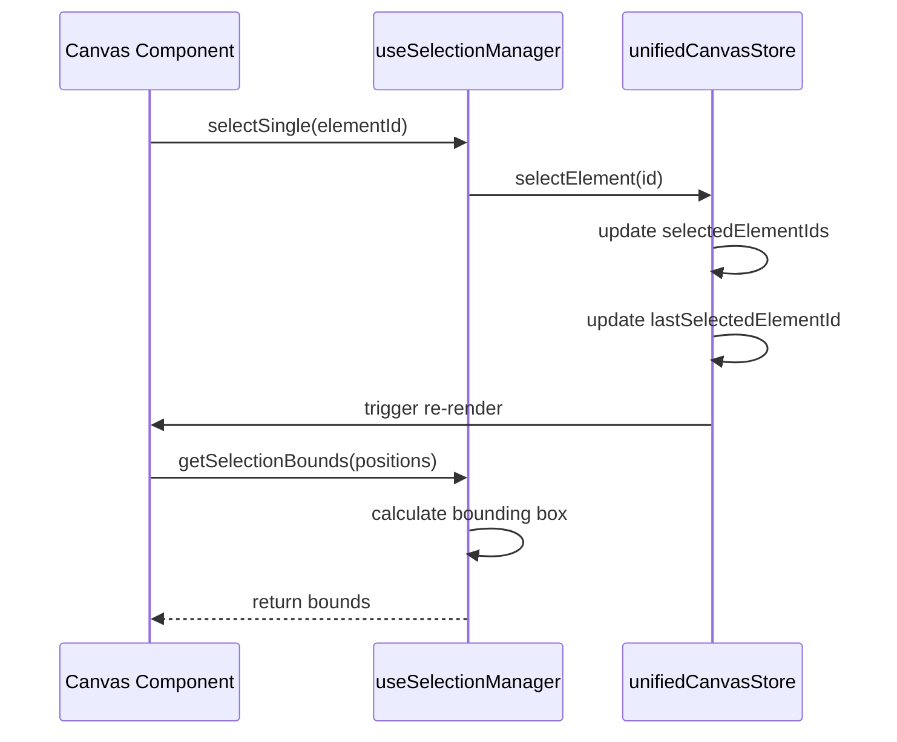

**Diagram sources**
- [useSelectionManager.ts](file://src/features/canvas/hooks/useSelectionManager.ts#L0-L184)
- [useCanvasHistory.ts](file://src/features/canvas/hooks/useCanvasHistory.ts#L0-L184)

**Section sources**
- [useSelectionManager.ts](file://src/features/canvas/hooks/useSelectionManager.ts#L0-L184)
- [useCanvasHistory.ts](file://src/features/canvas/hooks/useCanvasHistory.ts#L0-L184)

## Store Adapter for Renderer Integration
The canvas renderer integrates with the `unifiedCanvasStore` through the `StoreAdapterUnified` class, which provides a bridge between the rendering engine and the state management system. This adapter implements the `StoreAdapter` interface, exposing methods like `getSnapshot()` to retrieve the current canvas state for rendering, and `subscribe()` to receive state change notifications. It accesses the global store via `(window as any).__UNIFIED_CANVAS_STORE__` and wraps store methods in try-catch blocks for error resilience. The adapter is responsible for translating renderer events (like mouse movements during drawing) into store actions (`updateDrawing`, `finishDrawing`), ensuring a clean separation between rendering concerns and state management logic.

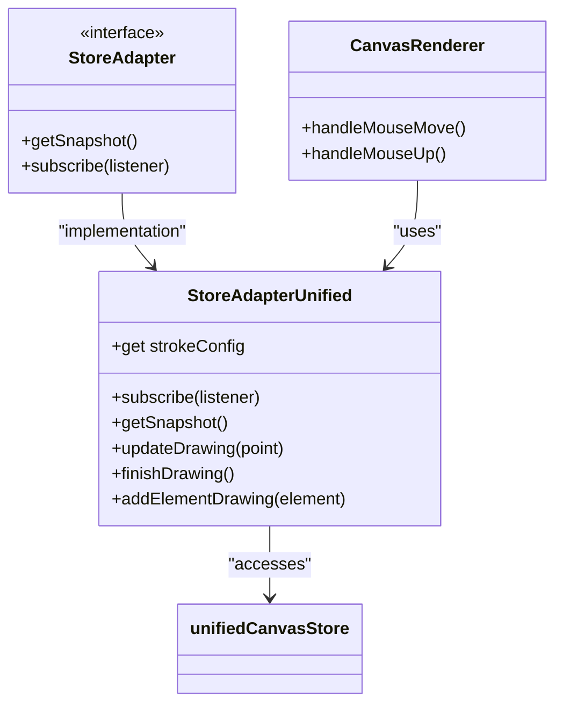

**Diagram sources**
- [StoreAdapterUnified.ts](file://src/features/canvas/renderer/modular/adapters/StoreAdapterUnified.ts#L0-L160)
- [unifiedCanvasStore.ts](file://src/features/canvas/stores/unifiedCanvasStore.ts#L200-L250)

**Section sources**
- [StoreAdapterUnified.ts](file://src/features/canvas/renderer/modular/adapters/StoreAdapterUnified.ts#L0-L160)

## Testing and Debugging Support
The canvas state management system includes comprehensive support for testing and debugging. The `createUnifiedTestStore` function in `createUnifiedTestStore.ts` allows tests to create isolated instances of the store, ensuring test independence and reliability. This factory function uses the same module composition as the production store but without persistence, making it ideal for unit and integration tests. The global exposure of the store via `__UNIFIED_CANVAS_STORE__` enables real-time inspection and manipulation during development. Additionally, the modular design allows individual modules to be tested in isolation, while the use of immutable updates and deterministic history makes it easier to reproduce and diagnose issues.

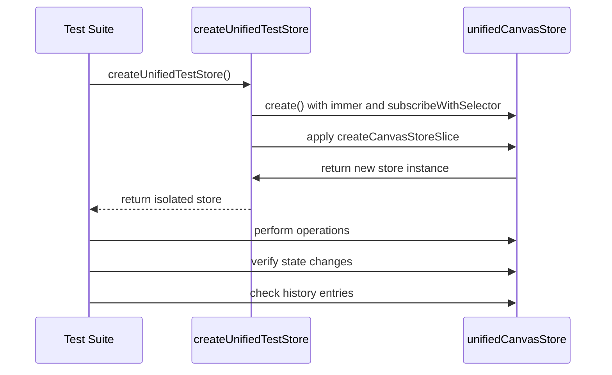

**Diagram sources**
- [createUnifiedTestStore.ts](file://src/tests/helpers/createUnifiedTestStore.ts#L0-L33)
- [unifiedCanvasStore.ts](file://src/features/canvas/stores/unifiedCanvasStore.ts#L118-L135)

**Section sources**
- [createUnifiedTestStore.ts](file://src/tests/helpers/createUnifiedTestStore.ts#L0-L33)

## Conclusion
The Canvas State Management system in LibreOllama demonstrates a sophisticated, modular approach to handling complex UI state using Zustand and Immer. By decomposing the canvas functionality into focused modules—element, selection, history, viewport, and others—it achieves a balance between maintainability and performance. The system excels in handling large-scale data through optimized data structures and transaction batching, while providing robust undo/redo capabilities and seamless React integration via custom hooks. Its architecture supports future extensibility, including real-time collaboration, and includes strong tooling for testing and debugging. This design serves as a model for complex state management in modern web applications, offering both accessibility for beginners and depth for experienced developers.