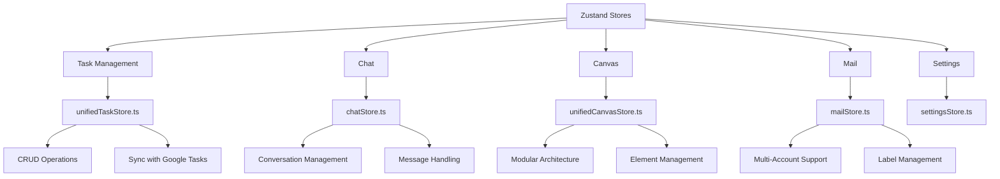
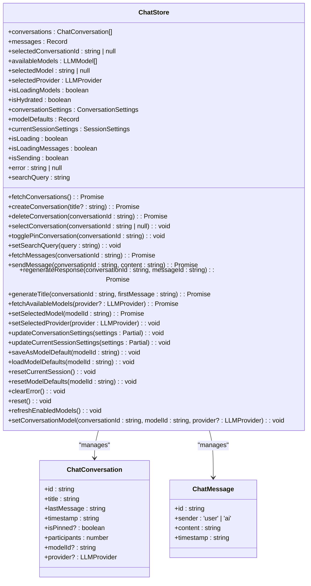
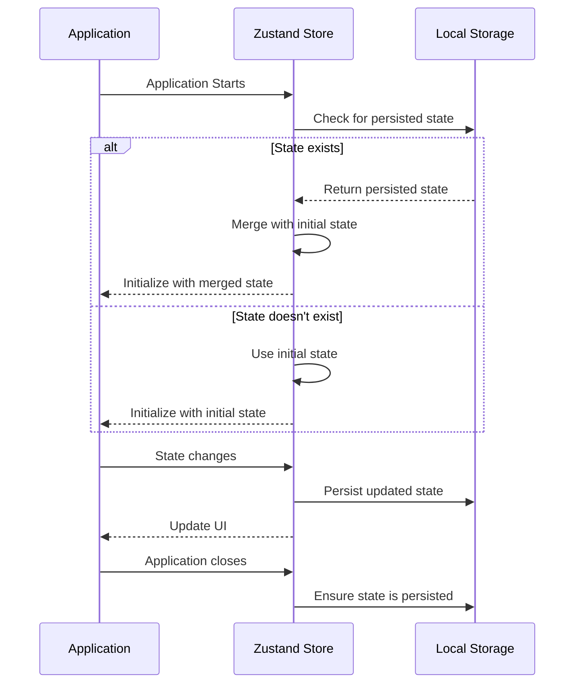
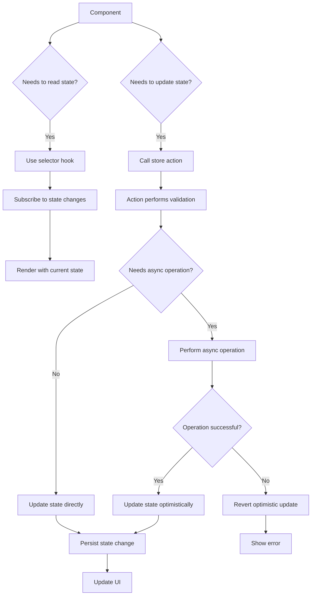
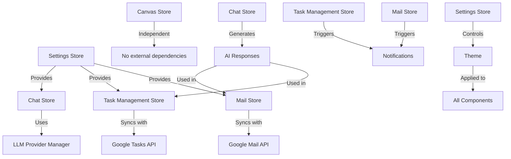
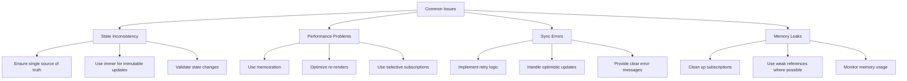
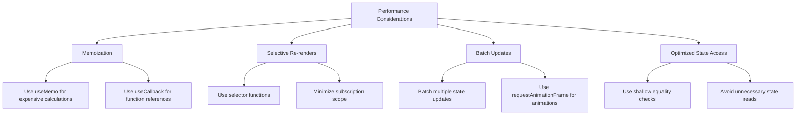

# State Management

<cite>
**Referenced Files in This Document**   
- [unifiedTaskStore.ts](file://src/stores/unifiedTaskStore.ts)
- [chatStore.ts](file://src/features/chat/stores/chatStore.ts)
- [unifiedCanvasStore.ts](file://src/features/canvas/stores/unifiedCanvasStore.ts)
- [settingsStore.ts](file://src/stores/settingsStore.ts)
- [mailStore.ts](file://src/features/mail/stores/mailStore.ts)
</cite>

## Table of Contents
1. [Introduction](#introduction)
2. [Store Architecture Overview](#store-architecture-overview)
3. [Domain-Specific Stores](#domain-specific-stores)
   - [Task Management Store](#task-management-store)
   - [Chat Store](#chat-store)
   - [Canvas Store](#canvas-store)
   - [Mail Store](#mail-store)
4. [Store Initialization and Persistence](#store-initialization-and-persistence)
5. [State Access and Update Patterns](#state-access-and-update-patterns)
6. [Store Relationships and Coordination](#store-relationships-and-coordination)
7. [Common Issues and Solutions](#common-issues-and-solutions)
8. [Performance Considerations](#performance-considerations)
9. [Conclusion](#conclusion)

## Introduction
The LibreOllama application implements a comprehensive state management system using Zustand to manage state across various domains including tasks, chat, canvas, and mail. This documentation provides a detailed analysis of the state management architecture, focusing on the implementation of domain-specific stores, their state shape, actions, and selectors. The system leverages Zustand's middleware capabilities for persistence, immutability, and development tools, ensuring a robust and maintainable state management solution. The stores are designed to handle complex interactions with backend services through Tauri, manage local state efficiently, and provide a seamless user experience across different application domains.

## Store Architecture Overview



**Diagram sources**
- [unifiedTaskStore.ts](file://src/stores/unifiedTaskStore.ts)
- [chatStore.ts](file://src/features/chat/stores/chatStore.ts)
- [unifiedCanvasStore.ts](file://src/features/canvas/stores/unifiedCanvasStore.ts)
- [mailStore.ts](file://src/features/mail/stores/mailStore.ts)
- [settingsStore.ts](file://src/stores/settingsStore.ts)

**Section sources**
- [unifiedTaskStore.ts](file://src/stores/unifiedTaskStore.ts)
- [chatStore.ts](file://src/features/chat/stores/chatStore.ts)
- [unifiedCanvasStore.ts](file://src/features/canvas/stores/unifiedCanvasStore.ts)
- [mailStore.ts](file://src/features/mail/stores/mailStore.ts)
- [settingsStore.ts](file://src/stores/settingsStore.ts)

## Domain-Specific Stores

### Task Management Store

The task management store, implemented in `unifiedTaskStore.ts`, provides a comprehensive solution for managing tasks across different domains. It uses Zustand with immer for immutable state updates, devtools for debugging, and persist for local storage.

```mermaid
classDiagram
class UnifiedTaskStore {
+tasks : Record<string, UnifiedTask>
+columns : TaskColumn[]
+showCompleted : boolean
+showCompletedByList : Record<string, boolean>
+isSyncing : boolean
+syncErrors : Record<string, string>
+createTask(input : CreateTaskInput) : Promise<string>
+updateTask(taskId : string, updates : UpdateTaskInput) : Promise<void>
+deleteTask(taskId : string) : Promise<void>
+moveTask(taskId : string, targetColumnId : string, targetIndex? : number) : Promise<void>
+addColumn(id : string, title : string, googleTaskListId? : string) : void
+updateColumn(columnId : string, updates : Partial<TaskColumn>) : Promise<void>
+deleteColumn(columnId : string) : void
+getTasksByColumn(columnId : string) : UnifiedTask[]
+getTaskByGoogleId(googleTaskId : string) : UnifiedTask | undefined
+getVisibleTasks() : UnifiedTask[]
+getVisibleTasksByColumn(columnId : string) : UnifiedTask[]
+setShowCompleted(show : boolean, listId? : string) : void
+getShowCompletedForList(listId : string) : boolean
+batchUpdateFromGoogle(updates : Array<{ taskListId : string; tasks : GoogleTask[] }>) : void
+markTaskSynced(tempId : string, googleId : string, taskListId : string) : void
}
class UnifiedTask {
+id : string
+title : string
+status : 'needsAction' | 'completed'
+updated : string
+position : string
+labels : TaskLabel[]
+priority : 'none' | 'low' | 'medium' | 'high'
+notes : string
+due : string | undefined
+columnId : string
+googleTaskListId : string | undefined
+timeBlock : TimeBlock | undefined
+syncState : 'pending_create' | 'local_only' | 'synced'
+googleTaskId : string | undefined
}
class TaskColumn {
+id : string
+title : string
+googleTaskListId : string | undefined
+taskIds : string[]
}
UnifiedTaskStore --> UnifiedTask : "manages"
UnifiedTaskStore --> TaskColumn : "manages"
```

**Diagram sources**
- [unifiedTaskStore.ts](file://src/stores/unifiedTaskStore.ts)

**Section sources**
- [unifiedTaskStore.ts](file://src/stores/unifiedTaskStore.ts)

### Chat Store

The chat store, implemented in `chatStore.ts`, manages the state for chat conversations and messages. It uses Zustand with devtools, persist, and immer middleware to provide a robust state management solution.



**Diagram sources**
- [chatStore.ts](file://src/features/chat/stores/chatStore.ts)

**Section sources**
- [chatStore.ts](file://src/features/chat/stores/chatStore.ts)

### Canvas Store

The canvas store, implemented in `unifiedCanvasStore.ts`, uses a modular architecture to manage the state of canvas elements. It combines multiple focused modules for better maintainability and scalability.

```mermaid
classDiagram
class UnifiedCanvasStore {
+elements : Map<string, CanvasElement>
+elementOrder : (ElementId | SectionId)[]
+selectedElementIds : Set<ElementId>
+lastSelectedElementId : ElementId | null
+viewport : Viewport
+isDrawing : boolean
+currentPath : number[]
+penColor : string
+history : CanvasElement[][]
+currentIndex : number
+sections : Map<SectionId, Section>
+sectionElementMap : Map<SectionId, ElementId[]>
+selectedTool : Tool
+selectedStickyNoteColor : string
+connectorId : ElementId | null
+draggedEndpoint : 'start' | 'end' | null
+isDragging : boolean
+snapTarget : { elementId : ElementId; point : { x : number; y : number } } | null
+getVisibleElements() : CanvasElement[]
+beginEndpointDrag(connectorId : ElementId, endpoint : 'start' | 'end') : void
+updateEndpointDrag(worldPos : { x : number; y : number }) : void
+commitEndpointDrag() : void
+cancelEndpointDrag() : void
+handleElementDrop(elementId : ElementId, targetId? : ElementId) : void
+createTestElements() : void
+createStressTestElements(count : number) : void
+groupElements(elementIds : ElementId[]) : GroupId
+ungroupElements(groupId : GroupId) : void
+clearCanvas() : void
}
class CanvasElement {
+id : ElementId
+type : string
+x : number
+y : number
+width? : number
+height? : number
+radius? : number
+points? : number[]
+startPoint? : { x : number; y : number }
+endPoint? : { x : number; y : number }
+text? : string
+backgroundColor? : string
+textColor? : string
+fontSize? : number
+fontFamily? : string
+isContainer? : boolean
+childElementIds? : ElementId[]
+allowedChildTypes? : string[]
+clipChildren? : boolean
+maxChildElements? : number
+parentId? : ElementId
+stickyNoteId? : ElementId
+sectionId? : SectionId
+groupId? : GroupId
+createdAt : number
+updatedAt : number
+isLocked : boolean
+isHidden : boolean
}
class Section {
+id : SectionId
+title : string
+x : number
+y : number
+width : number
+height : number
+childElementIds : ElementId[]
+createdAt : number
+updatedAt : number
+isLocked : boolean
+isHidden : boolean
}
UnifiedCanvasStore --> CanvasElement : "manages"
UnifiedCanvasStore --> Section : "manages"
```

**Diagram sources**
- [unifiedCanvasStore.ts](file://src/features/canvas/stores/unifiedCanvasStore.ts)

**Section sources**
- [unifiedCanvasStore.ts](file://src/features/canvas/stores/unifiedCanvasStore.ts)

### Mail Store

The mail store, implemented in `mailStore.ts`, manages the state for email accounts, messages, and labels. It supports multiple accounts and provides a rich set of features for email management.

```mermaid
classDiagram
class MailStore {
+accounts : Record<string, GmailAccount>
+currentAccountId : string | null
+isAuthenticated : boolean
+isHydrated : boolean
+isLoading : boolean
+isLoadingMessages : boolean
+isLoadingThreads : boolean
+isSending : boolean
+isLoadingAccounts : boolean
+accountData : Record<string, AccountData>
+currentThread : EmailThread | null
+currentMessage : ParsedEmail | null
+selectedMessages : ParsedEmail[]
+currentView : string
+searchQuery : string
+currentLabel : string | null
+selectedLabels : string[]
+labelSettings : LabelSettings
+isComposing : boolean
+composeData : ComposeEmail
+error : string | null
+connectionStatus : string
+lastSyncTime : Date | null
+settings : MailSettings
+filters : SearchFilters
+sortBy : string
+sortOrder : string
+nextPageToken : string | undefined
+pageTokens : string[]
+totalMessages : number
+totalUnreadMessages : number
+messagesLoadedSoFar : number
+currentPageSize : number
+isNavigatingBackwards : boolean
+getCurrentAccount() : GmailAccount | null
+getActiveAccountData() : AccountData | null
+getAccountById(accountId : string) : GmailAccount | null
+getAccountDataById(accountId : string) : AccountData | null
+getAllMessages() : ParsedEmail[]
+getAllThreads() : EmailThread[]
+getLabels() : GmailLabel[]
+getMessages() : ParsedEmail[]
+getAccountsArray() : GmailAccount[]
+addAccount(account : GmailAccount) : Promise<void>
+removeAccount(accountId : string) : Promise<void>
+switchAccount(accountId : string) : void
+refreshAccount(accountId : string) : Promise<void>
+syncAllAccounts() : Promise<void>
+authenticate(accountId? : string) : Promise<void>
+fetchMessages(labelId? : string, query? : string, pageToken? : string, accountId? : string) : Promise<void>
+fetchMessage(messageId : string, accountId? : string) : Promise<void>
+fetchThread(threadId : string, accountId? : string) : Promise<void>
+sendEmail(email : ComposeEmail, accountId? : string) : Promise<void>
+updateLabelSettings(settings : Partial<LabelSettings>) : void
+createLabel(label : LabelCreationRequest) : Promise<void>
+updateLabel(labelId : string, updates : LabelUpdateRequest) : Promise<void>
+deleteLabel(labelId : string) : Promise<void>
+applyLabel(messageId : string, labelId : string, accountId? : string) : Promise<void>
+removeLabel(messageId : string, labelId : string, accountId? : string) : Promise<void>
+markAsRead(messageId : string, accountId? : string) : Promise<void>
+markAsUnread(messageId : string, accountId? : string) : Promise<void>
+archiveMessage(messageId : string, accountId? : string) : Promise<void>
+deleteMessage(messageId : string, accountId? : string) : Promise<void>
+search(query : string, filters? : SearchFilters, accountId? : string) : Promise<SearchResult[]>
+getSearchSuggestions(query : string, accountId? : string) : Promise<SearchSuggestion[]>
}
class GmailAccount {
+id : string
+email : string
+name? : string
+picture? : string
+isActive : boolean
+connectedAt : string
+scopes : string[]
+services : { gmail : boolean; calendar : boolean; tasks : boolean }
+syncStatus : 'idle' | 'syncing' | 'error'
+lastSyncAt : Date | null
+errorMessage? : string
+quotaUsed : number
+quotaTotal : number | null
}
class AccountData {
+messages : ParsedEmail[]
+threads : EmailThread[]
+labels : GmailLabel[]
+drafts : ParsedEmail[]
+totalMessages : number
+unreadMessages : number
+lastSyncAt : Date
+syncInProgress : boolean
}
class ParsedEmail {
+id : string
+threadId : string
+from : { name : string; email : string }
+to : Array<{ name : string; email : string }>
+cc : Array<{ name : string; email : string }>
+bcc : Array<{ name : string; email : string }>
+subject : string
+body : string
+htmlBody : string
+attachments : Attachment[]
+isRead : boolean
+isStarred : boolean
+isImportant : boolean
+labels : string[]
+sentAt : Date
+receivedAt : Date
+size : number
+headers : Record<string, string>
}
class EmailThread {
+id : string
+messages : ParsedEmail[]
+labels : string[]
+isRead : boolean
+isStarred : boolean
+isImportant : boolean
+lastMessageAt : Date
+participants : Array<{ name : string; email : string }>
+subject : string
}
class GmailLabel {
+id : string
+name : string
+type : 'system' | 'user'
+labelListVisibility : 'labelShow' | 'labelShowIfUnread' | 'labelHide'
+messageListVisibility : 'show' | 'hide'
+color : { textColor : string; backgroundColor : string }
+messagesTotal : number
+messagesUnread : number
+threadsTotal : number
+threadsUnread : number
+isUnread : boolean
}
MailStore --> GmailAccount : "manages"
MailStore --> AccountData : "manages"
MailStore --> ParsedEmail : "manages"
MailStore --> EmailThread : "manages"
MailStore --> GmailLabel : "manages"
```

**Diagram sources**
- [mailStore.ts](file://src/features/mail/stores/mailStore.ts)

**Section sources**
- [mailStore.ts](file://src/features/mail/stores/mailStore.ts)

## Store Initialization and Persistence

The state management system in LibreOllama uses Zustand's persist middleware to ensure that application state is preserved across sessions. Each store is configured with persistence settings that determine how and what state is stored.



**Diagram sources**
- [unifiedTaskStore.ts](file://src/stores/unifiedTaskStore.ts)
- [chatStore.ts](file://src/features/chat/stores/chatStore.ts)
- [unifiedCanvasStore.ts](file://src/features/canvas/stores/unifiedCanvasStore.ts)
- [mailStore.ts](file://src/features/mail/stores/mailStore.ts)
- [settingsStore.ts](file://src/stores/settingsStore.ts)

**Section sources**
- [unifiedTaskStore.ts](file://src/stores/unifiedTaskStore.ts)
- [chatStore.ts](file://src/features/chat/stores/chatStore.ts)
- [unifiedCanvasStore.ts](file://src/features/canvas/stores/unifiedCanvasStore.ts)
- [mailStore.ts](file://src/features/mail/stores/mailStore.ts)
- [settingsStore.ts](file://src/stores/settingsStore.ts)

## State Access and Update Patterns

The state management system in LibreOllama follows consistent patterns for accessing and updating state across different domains. These patterns ensure that state changes are predictable, traceable, and efficient.



**Diagram sources**
- [unifiedTaskStore.ts](file://src/stores/unifiedTaskStore.ts)
- [chatStore.ts](file://src/features/chat/stores/chatStore.ts)
- [unifiedCanvasStore.ts](file://src/features/canvas/stores/unifiedCanvasStore.ts)
- [mailStore.ts](file://src/features/mail/stores/mailStore.ts)
- [settingsStore.ts](file://src/stores/settingsStore.ts)

**Section sources**
- [unifiedTaskStore.ts](file://src/stores/unifiedTaskStore.ts)
- [chatStore.ts](file://src/features/chat/stores/chatStore.ts)
- [unifiedCanvasStore.ts](file://src/features/canvas/stores/unifiedCanvasStore.ts)
- [mailStore.ts](file://src/features/mail/stores/mailStore.ts)
- [settingsStore.ts](file://src/stores/settingsStore.ts)

## Store Relationships and Coordination

The different stores in LibreOllama are designed to work together, coordinating state changes and ensuring consistency across the application. This section describes the relationships between stores and how they coordinate through shared state or events.



**Diagram sources**
- [unifiedTaskStore.ts](file://src/stores/unifiedTaskStore.ts)
- [chatStore.ts](file://src/features/chat/stores/chatStore.ts)
- [unifiedCanvasStore.ts](file://src/features/canvas/stores/unifiedCanvasStore.ts)
- [mailStore.ts](file://src/features/mail/stores/mailStore.ts)
- [settingsStore.ts](file://src/stores/settingsStore.ts)

**Section sources**
- [unifiedTaskStore.ts](file://src/stores/unifiedTaskStore.ts)
- [chatStore.ts](file://src/features/chat/stores/chatStore.ts)
- [unifiedCanvasStore.ts](file://src/features/canvas/stores/unifiedCanvasStore.ts)
- [mailStore.ts](file://src/features/mail/stores/mailStore.ts)
- [settingsStore.ts](file://src/stores/settingsStore.ts)

## Common Issues and Solutions

This section addresses common issues that may arise in the state management system and provides solutions for resolving them.



**Diagram sources**
- [unifiedTaskStore.ts](file://src/stores/unifiedTaskStore.ts)
- [chatStore.ts](file://src/features/chat/stores/chatStore.ts)
- [unifiedCanvasStore.ts](file://src/features/canvas/stores/unifiedCanvasStore.ts)
- [mailStore.ts](file://src/features/mail/stores/mailStore.ts)
- [settingsStore.ts](file://src/stores/settingsStore.ts)

**Section sources**
- [unifiedTaskStore.ts](file://src/stores/unifiedTaskStore.ts)
- [chatStore.ts](file://src/features/chat/stores/chatStore.ts)
- [unifiedCanvasStore.ts](file://src/features/canvas/stores/unifiedCanvasStore.ts)
- [mailStore.ts](file://src/features/mail/stores/mailStore.ts)
- [settingsStore.ts](file://src/stores/settingsStore.ts)

## Performance Considerations

The state management system in LibreOllama is designed with performance in mind, using various techniques to ensure efficient state updates and minimal re-renders.



**Diagram sources**
- [unifiedTaskStore.ts](file://src/stores/unifiedTaskStore.ts)
- [chatStore.ts](file://src/features/chat/stores/chatStore.ts)
- [unifiedCanvasStore.ts](file://src/features/canvas/stores/unifiedCanvasStore.ts)
- [mailStore.ts](file://src/features/mail/stores/mailStore.ts)
- [settingsStore.ts](file://src/stores/settingsStore.ts)

**Section sources**
- [unifiedTaskStore.ts](file://src/stores/unifiedTaskStore.ts)
- [chatStore.ts](file://src/features/chat/stores/chatStore.ts)
- [unifiedCanvasStore.ts](file://src/features/canvas/stores/unifiedCanvasStore.ts)
- [mailStore.ts](file://src/features/mail/stores/mailStore.ts)
- [settingsStore.ts](file://src/stores/settingsStore.ts)

## Conclusion
The state management system in LibreOllama, built on Zustand, provides a robust and scalable solution for managing application state across multiple domains. By leveraging Zustand's middleware capabilities for persistence, immutability, and development tools, the system ensures a consistent and maintainable state management approach. The modular architecture of the stores, combined with careful consideration of performance and coordination between stores, results in a responsive and reliable user experience. The implementation patterns demonstrated in this documentation can serve as a reference for building similar state management systems in other applications.