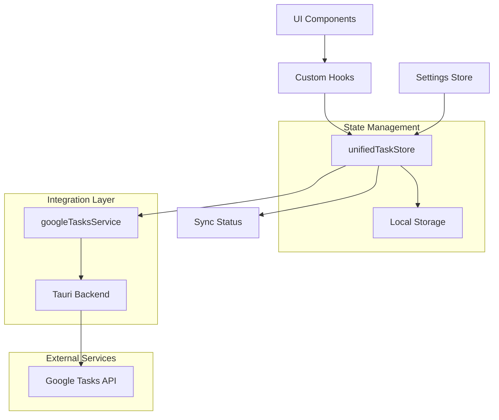
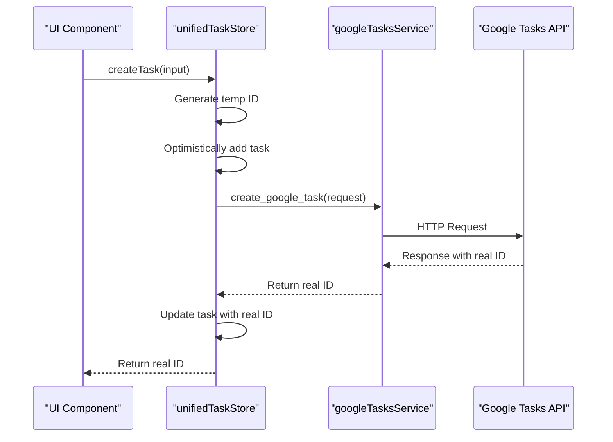
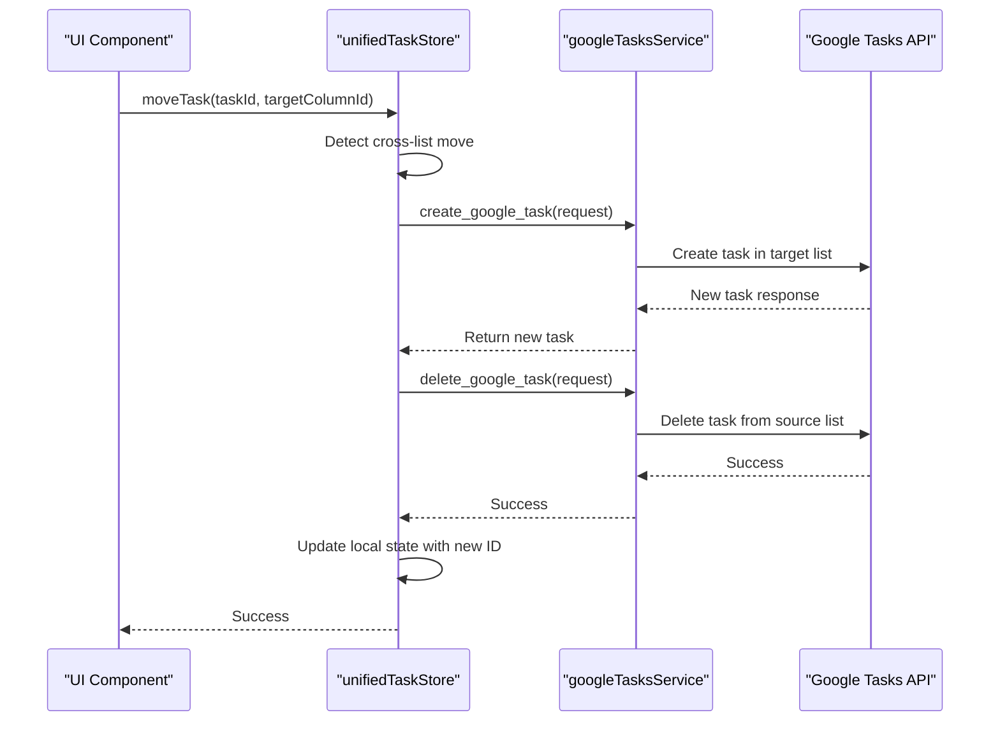
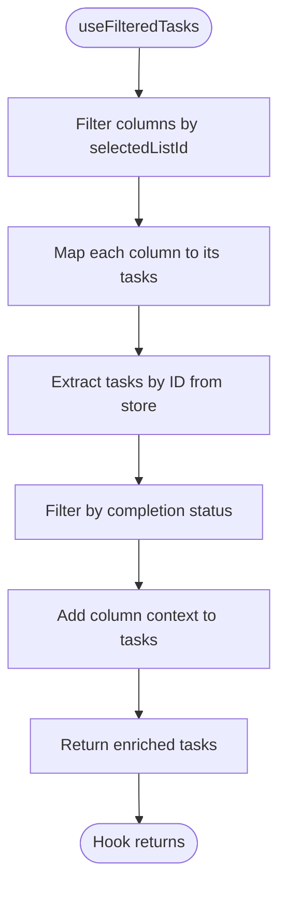
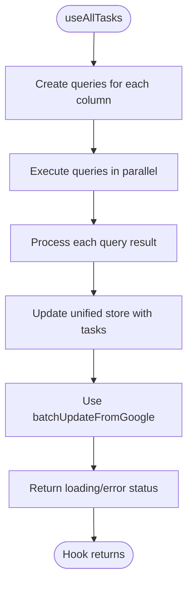
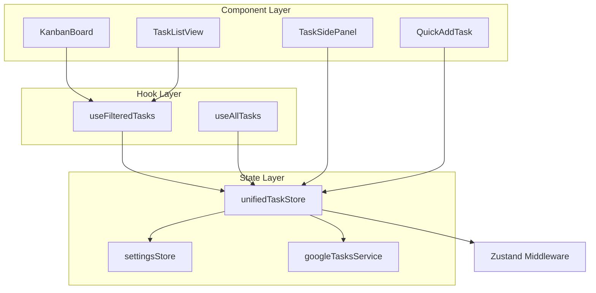

# Task State Management

<cite>
**Referenced Files in This Document**   
- [unifiedTaskStore.ts](file://src/stores/unifiedTaskStore.ts)
- [unifiedTaskStore.types.ts](file://src/stores/unifiedTaskStore.types.ts)
- [googleTasksService.ts](file://src/services/google/googleTasksService.ts)
- [useFilteredTasks.ts](file://src/hooks/useFilteredTasks.ts)
- [useAllTasks.ts](file://src/hooks/useAllTasks.ts)
- [TaskSidePanel.tsx](file://src/components/tasks/TaskSidePanel.tsx)
</cite>

## Table of Contents
1. [Introduction](#introduction)
2. [Core Components](#core-components)
3. [Architecture Overview](#architecture-overview)
4. [Detailed Component Analysis](#detailed-component-analysis)
5. [Dependency Analysis](#dependency-analysis)
6. [Performance Considerations](#performance-considerations)
7. [Troubleshooting Guide](#troubleshooting-guide)
8. [Conclusion](#conclusion)

## Introduction
The Task State Management system in LibreOllama provides a unified interface for managing tasks across local and Google Tasks environments. Built on Zustand with Immer, Devtools, and Persist middleware, this system enables real-time state management with optimistic updates, conflict resolution, and seamless synchronization. The architecture supports both local-only tasks and Google-synced tasks, maintaining data consistency while providing a responsive user experience. This document details the implementation of the unifiedTaskStore, its integration with Google Tasks API, and the supporting hooks and components that enable efficient task management.

## Core Components

The Task State Management system consists of several core components that work together to provide a seamless task management experience. The unifiedTaskStore serves as the central state management solution, while the googleTasksService handles API communication, and custom hooks like useFilteredTasks and useAllTasks provide data access patterns for components.

**Section sources**
- [unifiedTaskStore.ts](file://src/stores/unifiedTaskStore.ts)
- [googleTasksService.ts](file://src/services/google/googleTasksService.ts)
- [useFilteredTasks.ts](file://src/hooks/useFilteredTasks.ts)

## Architecture Overview

The Task State Management architecture follows a layered approach with clear separation of concerns. The unifiedTaskStore maintains the application state using Zustand, with middleware for immutability (Immer), debugging (Devtools), and persistence. The store communicates with the Google Tasks API through the googleTasksService, which abstracts the Tauri backend invocations. Components interact with the store through custom hooks that provide filtered and derived data.



**Diagram sources**
- [unifiedTaskStore.ts](file://src/stores/unifiedTaskStore.ts)
- [googleTasksService.ts](file://src/services/google/googleTasksService.ts)

## Detailed Component Analysis

### Unified Task Store Implementation

The unifiedTaskStore is implemented using Zustand, providing a lightweight yet powerful state management solution. The store maintains task state, handles CRUD operations, and manages synchronization with Google Tasks. It uses Immer middleware for immutable updates, Devtools for debugging, and Persist for local storage.

#### State Model
The state model is defined by the UnifiedTask interface, which includes both Google Tasks API fields and custom metadata. Each task has a stable local ID that never changes, even when synchronized with Google Tasks. The state also tracks synchronization status through the syncState property, which can be 'synced', 'pending_create', 'pending_update', 'pending_delete', 'local_only', or 'error'.

```mermaid
classDiagram
class UnifiedTask {
+readonly id : string
+googleTaskId? : string
+googleTaskListId? : string
+title : string
+notes? : string
+due? : string
+due_date_only? : string
+status : 'needsAction' | 'completed'
+updated : string
+position : string
+parent? : string
+labels : Array{ name : string; color : LabelColor }
+priority : 'high' | 'medium' | 'low' | 'none'
+attachments? : Array{ name : string; url : string; type : string }
+recurring? : { enabled : boolean; frequency : 'daily' | 'weekly' | 'monthly' | 'yearly'; interval? : number; endDate? : string }
+timeBlock? : { startTime : string; endTime : string; calendarEventId? : string }
+columnId : string
+syncState : TaskSyncState
+lastSyncError? : string
+lastLocalUpdate? : string
+optimisticDelete? : boolean
+previousState? : Partial~UnifiedTask~
+lastSyncTime? : string
}
class TaskColumn {
+id : string
+title : string
+googleTaskListId? : string
+taskIds : string[]
}
class UnifiedTaskState {
+tasks : Record~string, UnifiedTask~
+columns : TaskColumn[]
+lastSyncTime? : string
+isSyncing : boolean
+syncErrors : Record~string, string~
+showCompleted : boolean
+showCompletedByList : Record~string, boolean~
}
UnifiedTaskState --> UnifiedTask : "contains"
UnifiedTaskState --> TaskColumn : "contains"
```

**Diagram sources**
- [unifiedTaskStore.types.ts](file://src/stores/unifiedTaskStore.types.ts)

#### CRUD Operations
The store implements comprehensive CRUD operations with optimistic updates and error handling. When creating a task, it first adds the task locally with a temporary ID, then synchronizes with Google Tasks API. On successful creation, it updates the task with the real Google Task ID. The updateTask method follows a similar pattern, optimistically updating the local state before attempting to sync with Google.



**Diagram sources**
- [unifiedTaskStore.ts](file://src/stores/unifiedTaskStore.ts)
- [googleTasksService.ts](file://src/services/google/googleTasksService.ts)

### Google Tasks Integration

The integration with Google Tasks API is handled through the googleTasksService, which provides a clean interface for API operations. The service uses Tauri's invoke function to communicate with the backend, which in turn makes requests to the Google Tasks API. This architecture ensures that API credentials remain secure on the backend.

#### Synchronization Strategy
The synchronization strategy handles both real-time updates and conflict resolution. When moving tasks between lists (which Google Tasks API doesn't support directly), the system uses a create-then-delete pattern. For cross-list moves, it creates a new task in the target list with all metadata, then deletes the original task from the source list.



**Diagram sources**
- [unifiedTaskStore.ts](file://src/stores/unifiedTaskStore.ts)
- [googleTasksService.ts](file://src/services/google/googleTasksService.ts)

### Filtering and Querying

The system provides two primary hooks for accessing task data: useFilteredTasks and useAllTasks. These hooks abstract the complexity of state access and provide derived data for components.

#### useFilteredTasks Hook
The useFilteredTasks hook provides filtered task data based on the selected list and completion status. It combines tasks from multiple columns and adds column context to each task, making it easy for components to display tasks with their associated column information.



**Diagram sources**
- [useFilteredTasks.ts](file://src/hooks/useFilteredTasks.ts)

#### useAllTasks Hook
The useAllTasks hook uses React Query to manage data fetching and caching. It automatically loads tasks for all task lists and updates the unified store with the results. The hook handles loading states and errors, providing a clean interface for components that need access to all tasks.



**Diagram sources**
- [useAllTasks.ts](file://src/hooks/useAllTasks.ts)

## Dependency Analysis

The Task State Management system has well-defined dependencies between components. The unifiedTaskStore depends on the settingsStore to determine the active Google account, and on the googleTasksService for API communication. Components depend on the store through custom hooks, creating a clean separation between state management and presentation.



**Diagram sources**
- [unifiedTaskStore.ts](file://src/stores/unifiedTaskStore.ts)
- [useFilteredTasks.ts](file://src/hooks/useFilteredTasks.ts)
- [useAllTasks.ts](file://src/hooks/useAllTasks.ts)

## Performance Considerations

The system implements several performance optimizations to ensure a responsive user experience. The use of Zustand's selector functions minimizes unnecessary re-renders by allowing components to subscribe only to the specific state they need. The Immer middleware enables efficient immutable updates without the performance cost of deep cloning. The Persist middleware ensures that task state is preserved between sessions without requiring network requests on startup.

For data fetching, the useAllTasks hook leverages React Query's caching and stale-while-revalidate strategy, reducing the number of API calls while keeping data fresh. The 2-minute stale time balances data freshness with performance, preventing excessive API requests during active use.

## Troubleshooting Guide

The system includes several mechanisms for handling common issues in task management.

### Synchronization Conflicts
When database schema errors occur during synchronization (e.g., "no such column" errors), the system automatically attempts to run migrations before retrying the operation. This ensures that the local database schema is up-to-date before attempting to sync task data.

### Offline State Management
The unifiedTaskStore supports local-only tasks that don't require Google synchronization. These tasks have a syncState of 'local_only' and can be created and managed even when offline. When connectivity is restored, users can choose to sync these tasks to Google Tasks.

### Error Handling
The system implements comprehensive error handling with rollback mechanisms for optimistic updates. When an API call fails, the store reverts to the previous state, ensuring data consistency. The TaskSidePanel component demonstrates this by logging detailed information about update operations, making it easier to diagnose issues.

**Section sources**
- [unifiedTaskStore.ts](file://src/stores/unifiedTaskStore.ts)
- [TaskSidePanel.tsx](file://src/components/tasks/TaskSidePanel.tsx)

## Conclusion
The Task State Management system in LibreOllama provides a robust and scalable solution for managing tasks across local and cloud environments. By leveraging Zustand's simplicity and power, the system achieves excellent performance while maintaining code clarity. The thoughtful integration with Google Tasks API handles the limitations of the external service through creative solutions like the create-then-delete pattern for cross-list moves. The separation of concerns between state management, API integration, and presentation components makes the system maintainable and extensible. For developers, the system offers a solid foundation for building task management features with built-in support for synchronization, offline operation, and error recovery.