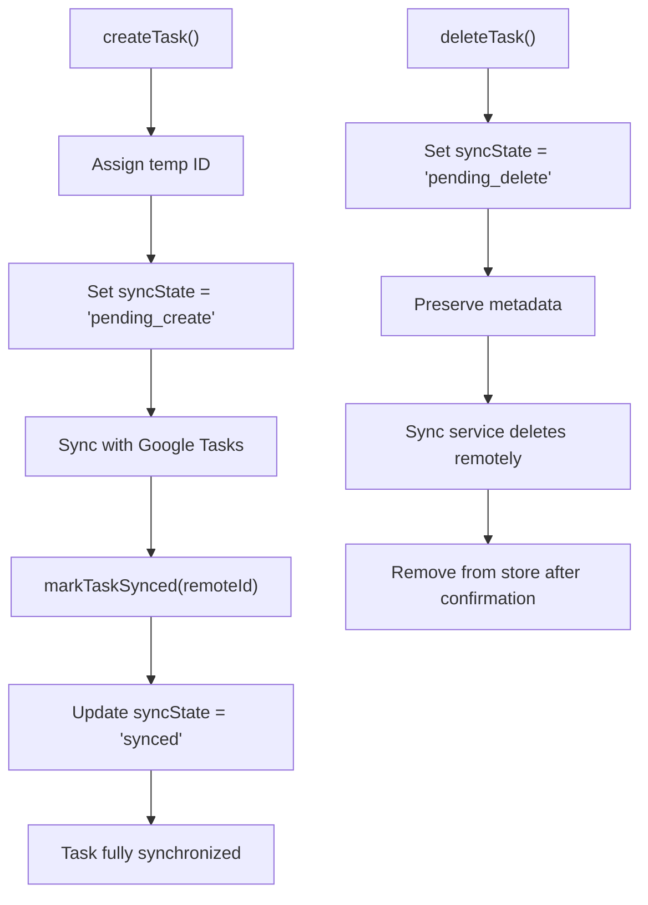
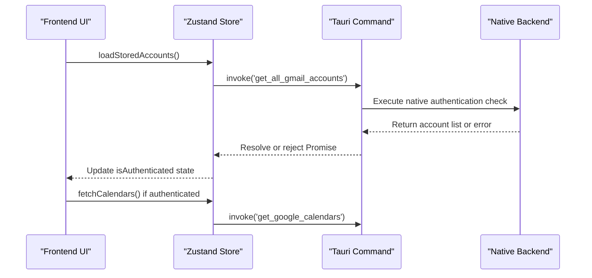
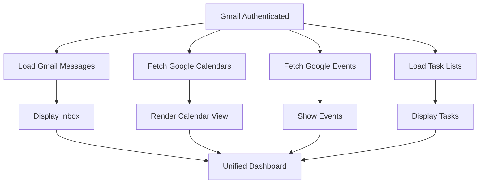
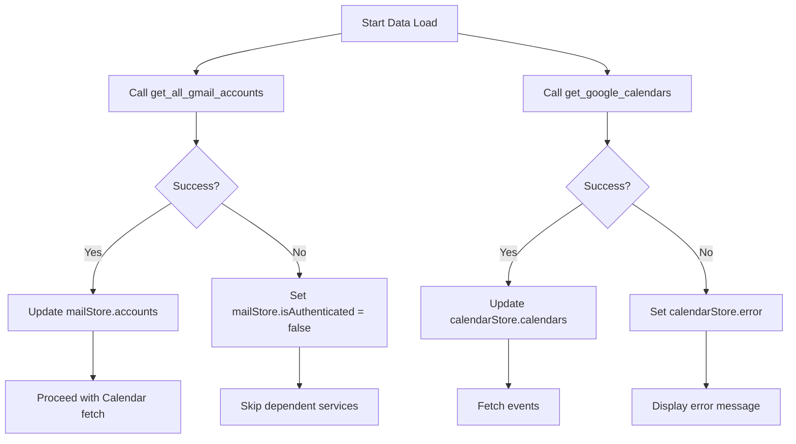
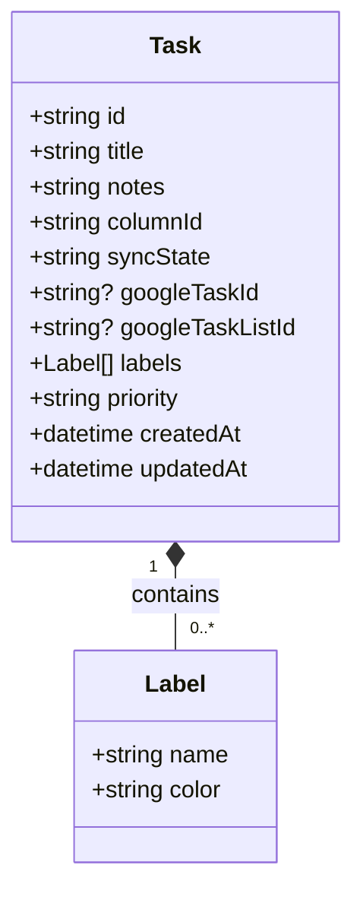

# Integration Testing

<cite>
**Referenced Files in This Document**  
- [auth-persistence.test.ts](file://src/tests/integration/auth-persistence.test.ts)
- [task-deletion-integration.test.ts](file://src/__tests__/task-deletion-integration.test.ts)
- [unifiedTaskStore.test.ts](file://src/stores/__tests__/unifiedTaskStore.test.ts)
- [unifiedTaskStore.ts](file://src/stores/unifiedTaskStore.ts)
- [tauriMocks.ts](file://src/tests/helpers/tauriMocks.ts)
</cite>

## Table of Contents
1. [Introduction](#introduction)
2. [Core Integration Testing Components](#core-integration-testing-components)
3. [Unified Task Store Integration](#unified-task-store-integration)
4. [Authentication Persistence Testing](#authentication-persistence-testing)
5. [Cross-Store Coordination](#cross-store-coordination)
6. [Error Handling and Recovery](#error-handling-and-recovery)
7. [Data Validation and Edge Case Management](#data-validation-and-edge-case-management)
8. [Tauri Command Integration](#tauri-command-integration)
9. [Best Practices and Common Issues](#best-practices-and-common-issues)
10. [Conclusion](#conclusion)

## Introduction
The integration testing system in LibreOllama ensures that multiple components interact correctly, particularly focusing on state management, authentication persistence, and database operations. These tests validate the seamless coordination between frontend stores, backend services, and Tauri commands. This document explains the implementation details of key integration tests, including `auth-persistence.test.ts` and `task-deletion-integration.test.ts`, to provide both beginners and experienced developers with a comprehensive understanding of the system's behavior under various conditions.

## Core Integration Testing Components

Integration tests in LibreOllama are located in two primary directories: `src/tests/integration` for high-level service interactions and `src/__tests__` for component-specific integration scenarios. These tests use Vitest as the testing framework and rely on mocked Tauri invoke commands to simulate native backend operations without requiring actual system calls.

The test suite emphasizes real-world usage patterns, such as authentication state synchronization across stores, task lifecycle management, and error recovery during partial failures. Mocking utilities like `setupTauriMocks` and `mockTauriInvoke` enable deterministic testing of asynchronous operations involving Gmail, Google Calendar, and Google Tasks APIs.

**Section sources**
- [auth-persistence.test.ts](file://src/tests/integration/auth-persistence.test.ts#L1-L332)
- [task-deletion-integration.test.ts](file://src/__tests__/task-deletion-integration.test.ts#L1-L96)

## Unified Task Store Integration

The unified task store serves as the central hub for managing tasks across different backends, including Google Tasks and local storage. Integration tests verify that task creation, updates, and deletions maintain consistency across UI components and backend services.

When a task is created, the store assigns a temporary ID and sets its `syncState` to `pending_create`. Upon successful synchronization with Google Tasks, the `markTaskSynced` method updates the task with the remote ID and changes the sync state to `synced`. During deletion, tasks are marked with `pending_delete` rather than immediately removed, allowing the sync service to handle remote deletion while preserving metadata for potential recovery.

**Diagram sources**
- [unifiedTaskStore.ts](file://src/stores/unifiedTaskStore.ts#L150-L250)
- [task-deletion-integration.test.ts](file://src/__tests__/task-deletion-integration.test.ts#L20-L50)

**Section sources**
- [unifiedTaskStore.ts](file://src/stores/unifiedTaskStore.ts#L100-L300)
- [task-deletion-integration.test.ts](file://src/__tests__/task-deletion-integration.test.ts#L10-L90)

## Authentication Persistence Testing

Authentication persistence tests ensure that login states for Gmail, Google Calendar, and Google Tasks are maintained across application restarts and properly restored during initialization. The `auth-persistence.test.ts` file contains comprehensive scenarios for loading stored accounts, handling missing credentials, and managing authentication errors.

The test suite mocks Tauri commands such as `get_all_gmail_accounts`, `get_google_calendars`, and `get_google_events` to simulate successful responses, empty results, and error conditions. This allows verification of graceful degradation when certain services fail while others remain functional.

**Diagram sources**
- [auth-persistence.test.ts](file://src/tests/integration/auth-persistence.test.ts#L50-L80)
- [tauriMocks.ts](file://src/tests/helpers/tauriMocks.ts#L5-L30)

**Section sources**
- [auth-persistence.test.ts](file://src/tests/integration/auth-persistence.test.ts#L1-L332)

## Cross-Store Coordination

Integration tests validate that authentication and data loading are coordinated across multiple stores, such as `useMailStore`, `useGoogleCalendarStore`, and `useUnifiedTaskStore`. The system uses a cascading authentication model where Gmail authentication status influences access to Calendar and Tasks services.

Tests verify that when Gmail authentication succeeds, Calendar and Tasks stores can proceed with data fetching. Conversely, if Gmail fails, dependent services should not attempt unnecessary API calls. Performance tests also measure the total time required to load data from all services in parallel, ensuring responsiveness even with multiple concurrent operations.

**Diagram sources**
- [auth-persistence.test.ts](file://src/tests/integration/auth-persistence.test.ts#L250-L300)
- [unifiedTaskStore.ts](file://src/stores/unifiedTaskStore.ts#L45-L60)

**Section sources**
- [auth-persistence.test.ts](file://src/tests/integration/auth-persistence.test.ts#L200-L332)

## Error Handling and Recovery

The integration test suite includes robust error recovery scenarios that simulate partial failures, such as successful Gmail authentication but failed Calendar API access. Tests verify that the application continues to function for available services while gracefully handling errors for unavailable ones.

For example, when `get_google_calendars` returns an error, the calendar store clears its data and sets an error flag, but the mail store continues to operate normally. This prevents cascading failures and allows users to access functional parts of the application even when some integrations are temporarily down.

**Diagram sources**
- [auth-persistence.test.ts](file://src/tests/integration/auth-persistence.test.ts#L280-L320)
- [tauriMocks.ts](file://src/tests/helpers/tauriMocks.ts#L20-L40)

**Section sources**
- [auth-persistence.test.ts](file://src/tests/integration/auth-persistence.test.ts#L270-L332)

## Data Validation and Edge Case Management

Integration tests rigorously validate data integrity during complex operations like task updates and deletions. The `task-deletion-integration.test.ts` file demonstrates how metadata (labels, priority, notes) is preserved throughout the deletion process, preventing accidental loss of information.

Tests also verify that partial updates do not overwrite existing fields. For instance, updating only the priority of a task should not remove existing labels, and vice versa. This ensures that different UI components (e.g., context menu vs. task modal) can safely modify specific properties without interfering with others.

**Diagram sources**
- [task-deletion-integration.test.ts](file://src/__tests__/task-deletion-integration.test.ts#L60-L90)
- [unifiedTaskStore.types.ts](file://src/stores/unifiedTaskStore.types.ts#L5-L25)

**Section sources**
- [task-deletion-integration.test.ts](file://src/__tests__/task-deletion-integration.test.ts#L1-L96)

## Tauri Command Integration

All integration tests simulate Tauri command invocations using `mockTauriInvoke`, which intercepts calls to native Rust functions like `get_all_gmail_accounts` and `get_google_calendars`. This allows testing of the entire frontend-backend interaction chain without requiring a running Tauri application.

The mocking system supports different response scenarios, including success, empty results, and errors, enabling comprehensive coverage of edge cases. Each test resets the mock state using `beforeEach` and `afterEach` hooks to ensure isolation between test cases.

**Section sources**
- [tauriMocks.ts](file://src/tests/helpers/tauriMocks.ts#L1-L50)
- [auth-persistence.test.ts](file://src/tests/integration/auth-persistence.test.ts#L10-L40)

## Best Practices and Common Issues

### Database Seeding
Integration tests avoid relying on persistent database state by using mocked responses. This eliminates the need for complex database seeding and ensures consistent test results across environments.

### Transaction Management
Since tests use mocked data, transaction management is handled implicitly through Zustand's state updates. In production, Tauri commands ensure atomic operations on the SQLite database.

### Common Pitfalls
- Direct use of `setState` on stores can bypass internal logic; tests now use store methods where possible
- Partial updates must preserve existing fields to prevent data loss
- Error handling should be localized to prevent cascading failures

## Conclusion
LibreOllama's integration testing system provides a robust framework for verifying complex interactions between frontend stores, backend services, and native Tauri commands. By focusing on real-world usage patterns, error recovery, and data integrity, these tests ensure reliable operation across diverse scenarios. Developers should follow the established patterns of mocking Tauri commands, coordinating store states, and preserving metadata during state transitions to maintain system stability and user experience.