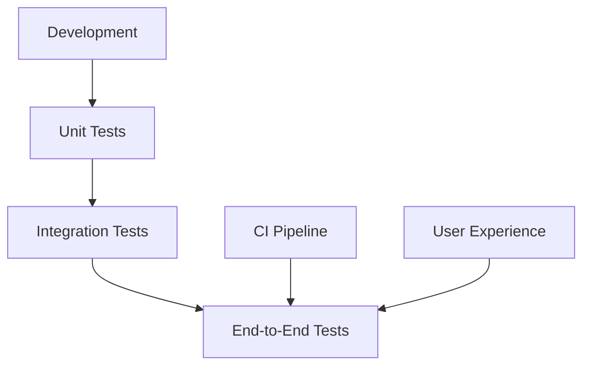
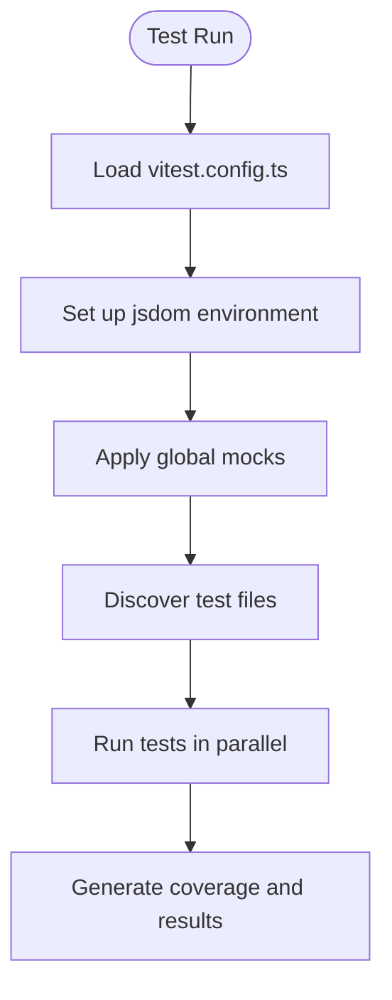
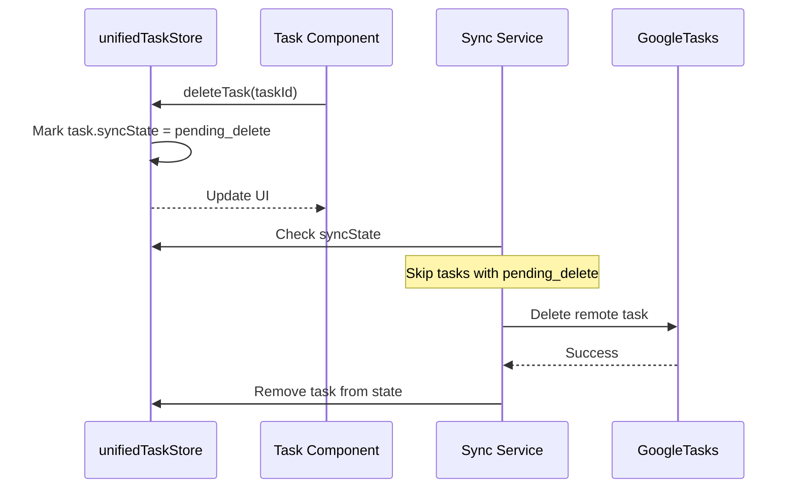
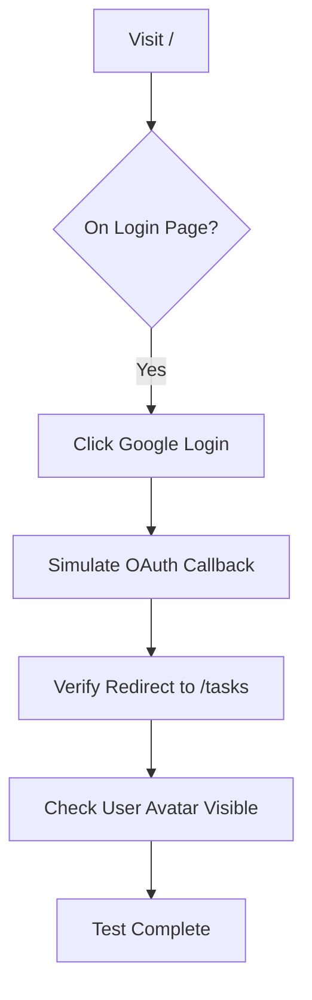

# Testing and Verification

<cite>
**Referenced Files in This Document**  
- [vitest.config.ts](file://vitest.config.ts)
- [cypress/e2e/authentication.cy.ts](file://cypress/e2e/authentication.cy.ts)
- [cypress/e2e/task-crud.cy.ts](file://cypress/e2e/task-crud.cy.ts)
- [cypress/support/commands.ts](file://cypress/support/commands.ts)
- [src/__tests__/task-deletion-integration.test.ts](file://src/__tests__/task-deletion-integration.test.ts)
- [src/tests/setup.ts](file://src/tests/setup.ts)
- [src/test-utils/zustand-reset.ts](file://src/test-utils/zustand-reset.ts)
</cite>

## Table of Contents
1. [Introduction](#introduction)
2. [Testing Strategy Overview](#testing-strategy-overview)
3. [Unit Testing with Vitest](#unit-testing-with-vitest)
4. [Integration Testing](#integration-testing)
5. [End-to-End Testing with Cypress](#end-to-end-testing-with-cypress)
6. [Test Execution and Setup](#test-execution-and-setup)
7. [Reporting and Coverage](#reporting-and-coverage)
8. [Common Issues and Solutions](#common-issues-and-solutions)
9. [Performance Considerations](#performance-considerations)
10. [Conclusion](#conclusion)

## Introduction
The LibreOllama project employs a comprehensive testing and verification system to ensure high-quality, reliable, and maintainable code. This document details the testing strategy, implementation, and best practices used across the codebase. The system is built around three core testing types: unit tests, integration tests, and end-to-end (E2E) tests. Each test type plays a distinct role in validating functionality, ensuring data integrity, and verifying user workflows. The testing stack leverages Vitest for unit and integration testing, and Cypress for E2E testing, providing a robust and scalable verification framework.

## Testing Strategy Overview
LibreOllama follows a multi-layered testing strategy designed to catch bugs early, validate complex interactions, and ensure a seamless user experience. The strategy is structured as follows:

- **Unit Tests**: Validate individual functions, hooks, and components in isolation using Vitest.
- **Integration Tests**: Verify interactions between components, stores, and services, ensuring correct data flow and state management.
- **End-to-End Tests**: Simulate real user scenarios across the full application stack using Cypress, validating UI behavior, navigation, and persistence.

This layered approach ensures comprehensive coverage while maintaining fast feedback loops during development.

**Diagram sources**
- [vitest.config.ts](file://vitest.config.ts)
- [cypress/e2e/authentication.cy.ts](file://cypress/e2e/authentication.cy.ts)

## Unit Testing with Vitest
Vitest is the primary framework for unit and component-level testing in LibreOllama. It provides a fast, Jest-compatible environment with excellent support for React and modern JavaScript features.

### Configuration and Environment
The test environment is configured in `vitest.config.ts` to simulate a browser-like environment using `jsdom`. Key configuration settings include:

- **Environment**: `jsdom` for DOM simulation
- **Setup Files**: Multiple setup files including `vitest-localstorage-mock` and custom setup scripts
- **Aliases**: `@` for `src/` and `@tests` for `src/tests/` to simplify imports
- **Exclusions**: Archive directories and build artifacts are excluded from test discovery

**Diagram sources**
- [vitest.config.ts](file://vitest.config.ts#L1-L50)

**Section sources**
- [vitest.config.ts](file://vitest.config.ts#L1-L50)
- [src/tests/setup.ts](file://src/tests/setup.ts)
- [src/test-utils/zustand-reset.ts](file://src/test-utils/zustand-reset.ts)

### Test Structure and Patterns
Unit tests focus on isolated logic such as hooks, utility functions, and state management. The `unifiedTaskStore.test.ts` file demonstrates testing of Zustand-based stores, ensuring correct state transitions and persistence behavior.

## Integration Testing
Integration tests verify that multiple units work together correctly, particularly focusing on state management, service interactions, and data flow.

### Task Deletion Flow
The `task-deletion-integration.test.ts` file provides a detailed integration test for the task deletion workflow. This test validates that:

- Tasks are correctly marked for deletion with `syncState: pending_delete`
- Metadata (labels, priority) is preserved during deletion
- Subsequent sync operations respect the deletion state
- Partial updates (e.g., priority or labels) do not cause data loss

This ensures that the application maintains data integrity across complex state transitions.

**Diagram sources**
- [src/__tests__/task-deletion-integration.test.ts](file://src/__tests__/task-deletion-integration.test.ts#L1-L95)

**Section sources**
- [src/__tests__/task-deletion-integration.test.ts](file://src/__tests__/task-deletion-integration.test.ts#L1-L95)

## End-to-End Testing with Cypress
Cypress is used for end-to-end testing of critical user workflows, ensuring the application behaves as expected from the user's perspective.

### Authentication Flow
The `authentication.cy.ts` file contains E2E tests for the authentication system, covering:

- Google login via OAuth simulation
- Session persistence across page reloads
- Logout functionality and localStorage cleanup

These tests use custom commands like `cy.login()` to set up authenticated sessions programmatically, avoiding reliance on external services.

### Task Management Workflow
The `task-crud.cy.ts` file validates the full CRUD lifecycle of tasks, including:

- Creating tasks with metadata (labels, priority, due date)
- Updating task properties without data loss
- Deleting tasks and verifying persistence

Custom Cypress commands such as `cy.createTask()` and `cy.drag()` abstract complex interactions, improving test readability and maintainability.

**Diagram sources**
- [cypress/e2e/authentication.cy.ts](file://cypress/e2e/authentication.cy.ts#L1-L66)
- [cypress/support/commands.ts](file://cypress/support/commands.ts#L1-L74)

**Section sources**
- [cypress/e2e/authentication.cy.ts](file://cypress/e2e/authentication.cy.ts#L1-L66)
- [cypress/e2e/task-crud.cy.ts](file://cypress/e2e/task-crud.cy.ts#L1-L104)
- [cypress/support/commands.ts](file://cypress/support/commands.ts#L1-L74)

## Test Execution and Setup
Tests are executed using standardized scripts defined in `package.json`. The setup process includes:

- Mocking localStorage and sessionStorage via `vitest-localstorage-mock`
- Initializing Zustand stores with reset utilities
- Setting up React rendering environment with `@vitejs/plugin-react`
- Configuring aliases for cleaner import paths

The `setup.ts` file in `src/tests/` contains global test setup logic, ensuring consistent state across test runs.

## Reporting and Coverage
The testing framework generates detailed reports including:

- Test pass/fail status
- Execution time per test suite
- Code coverage metrics
- Console output for debugging (enabled via `silent: false`)

Coverage is configured to exclude archive and build directories, focusing on active code. The system provides immediate feedback during development and comprehensive reporting in CI environments.

## Common Issues and Solutions
### Flaky Tests
Flaky tests are mitigated through:

- Increased timeouts (`testTimeout: 20000`)
- Explicit waits after state changes
- Deterministic test data (timestamps, IDs)
- Isolated localStorage per test

### Test Environment Setup
Common setup issues are addressed by:

- Using `jsdom` for consistent DOM behavior
- Pre-mocking localStorage/sessionStorage
- Hoisting critical mocks via `vitest.hoisted.setup.ts`
- Resetting global state before each test

## Performance Considerations
The test suite is optimized for speed and efficiency:

- Parallel test execution via Vitest
- Selective file watching in development
- Exclusion of archive and build directories
- Lightweight mocks for external dependencies
- Optimized dependency resolution with ESBuild

The `optimizeDeps` configuration pre-bundles frequently used libraries like `konva` and `react-konva`, reducing test startup time.

## Conclusion
LibreOllama's testing and verification system provides a robust foundation for maintaining high code quality and reliability. By combining unit, integration, and end-to-end tests with modern tools like Vitest and Cypress, the project ensures comprehensive coverage of both technical and user-facing functionality. The well-structured test architecture, clear separation of concerns, and emphasis on maintainability make it easy for developers to write, run, and debug tests, ultimately contributing to a more stable and trustworthy application.