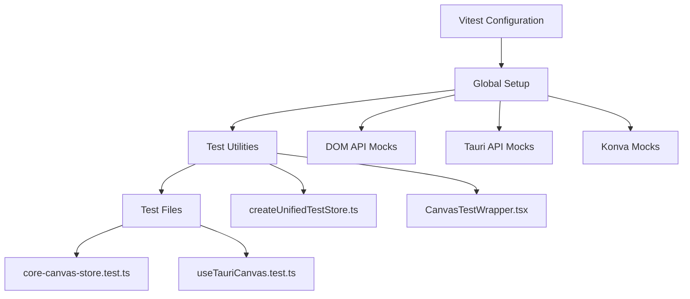
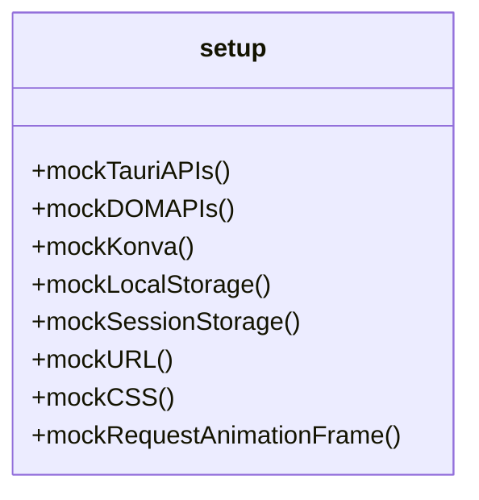
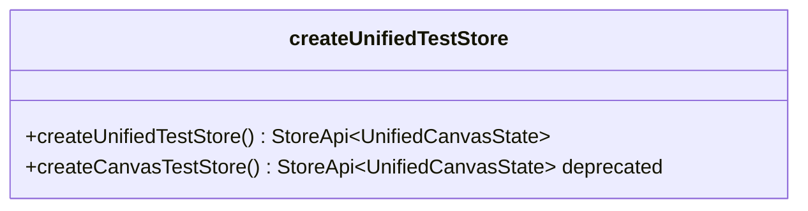
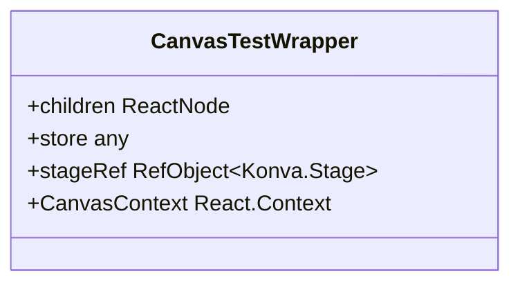
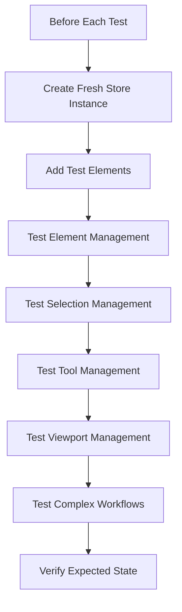
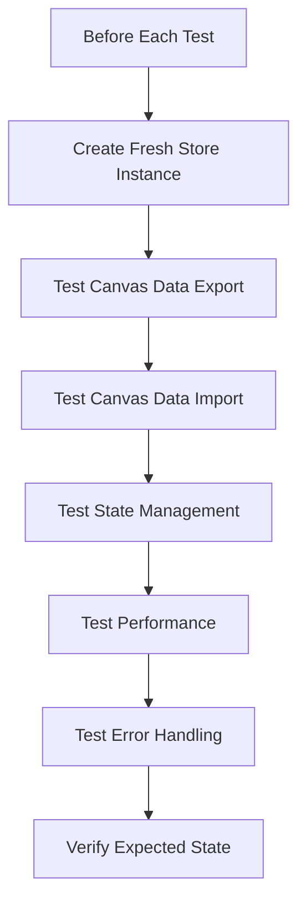

# Unit Testing

<cite>
**Referenced Files in This Document**   
- [vitest.config.ts](file://vitest.config.ts)
- [setup.ts](file://src/tests/setup.ts)
- [core-canvas-store.test.ts](file://src/tests/core-canvas-store.test.ts)
- [useTauriCanvas.test.ts](file://src/tests/hooks/useTauriCanvas.test.ts)
- [createUnifiedTestStore.ts](file://src/tests/helpers/createUnifiedTestStore.ts)
- [CanvasTestWrapper.tsx](file://src/tests/helpers/CanvasTestWrapper.tsx)
- [unifiedCanvasStore.ts](file://src/features/canvas/stores/unifiedCanvasStore.ts)
- [elementModule.ts](file://src/features/canvas/stores/modules/elementModule.ts)
- [selectionModule.ts](file://src/features/canvas/stores/modules/selectionModule.ts)
</cite>

## Table of Contents
1. [Introduction](#introduction)
2. [Project Structure](#project-structure)
3. [Core Components](#core-components)
4. [Architecture Overview](#architecture-overview)
5. [Detailed Component Analysis](#detailed-component-analysis)
6. [Dependency Analysis](#dependency-analysis)
7. [Performance Considerations](#performance-considerations)
8. [Troubleshooting Guide](#troubleshooting-guide)
9. [Conclusion](#conclusion)

## Introduction
This document provides a comprehensive overview of the unit testing framework in LibreOllama, which is built on Vitest. The framework is designed to ensure high code quality, maintainability, and reliability across the application, with a particular focus on the canvas feature. The testing strategy emphasizes real store instances over mocks, direct testing of business logic, and minimal external dependencies. This approach enables fast, deterministic, and maintainable tests that closely reflect actual application behavior. The documentation covers setup configuration, test isolation, mocking strategies, domain models of test utilities, and usage patterns for testing React components, hooks, and utility functions. It also includes concrete examples from the codebase such as `core-canvas-store.test.ts` and `useTauriCanvas.test.ts`, and addresses common issues like mock configuration and test environment setup.

## Project Structure
The unit testing framework in LibreOllama is organized within the `src/tests` directory, which contains a well-structured hierarchy of test files, mocks, and helper utilities. The main test files are located at the root of this directory, while mocks are stored in the `__mocks__` subdirectory, and reusable test helpers are in the `helpers` directory. The framework supports testing of various application layers including hooks, stores, integration scenarios, and system-level functionality. The `vitest.config.ts` file at the project root configures the Vitest environment, while `setup.ts` provides global test setup and DOM API mocks. The test structure follows a modular approach, with separate directories for different types of tests, ensuring clear separation of concerns and easy navigation.

```mermaid
graph TB
A[src/tests] --> B[__mocks__]
A --> C[helpers]
A --> D[system]
A --> E[integration]
A --> F[stores]
A --> G[utils]
A --> H[core-canvas-store.test.ts]
A --> I[useTauriCanvas.test.ts]
B --> J[@tauri-apps/api]
B --> K[canvas.ts]
B --> L[konva.ts]
C --> M[CanvasTestWrapper.tsx]
C --> N[createUnifiedTestStore.ts]
D --> O[environment.diagnostic.test.ts]
E --> P[auth-persistence.test.ts]
F --> Q[canvasElementTypes.test.ts]
```

**Diagram sources**
- [src/tests](file://src/tests)
- [src/tests/__mocks__](file://src/tests/__mocks__)
- [src/tests/helpers](file://src/tests/helpers)

**Section sources**
- [src/tests](file://src/tests)

## Core Components
The unit testing framework in LibreOllama is built around several core components that work together to provide a robust testing environment. These include the Vitest configuration, global setup file, test store factory, canvas test wrapper, and comprehensive DOM API mocks. The framework leverages real store instances for testing business logic, ensuring high fidelity and reliability of test results. It employs a store-first testing approach, where business logic is tested directly through store methods rather than through UI components. The framework also includes extensive mocks for browser APIs, Tauri APIs, and third-party libraries like Konva, enabling isolated and deterministic testing. The use of real store instances, combined with minimal mocking, allows for fast and maintainable tests that closely reflect actual application behavior.

**Section sources**
- [vitest.config.ts](file://vitest.config.ts#L1-L50)
- [setup.ts](file://src/tests/setup.ts#L1-L410)
- [createUnifiedTestStore.ts](file://src/tests/helpers/createUnifiedTestStore.ts#L1-L33)
- [CanvasTestWrapper.tsx](file://src/tests/helpers/CanvasTestWrapper.tsx#L1-L40)

## Architecture Overview
The unit testing architecture in LibreOllama follows a layered approach, with each layer responsible for a specific aspect of the testing process. At the foundation is the Vitest configuration, which sets up the test environment, defines global setup files, and configures test exclusions. Above this is the global setup layer, which provides comprehensive mocks for browser APIs, Tauri APIs, and third-party libraries. The next layer consists of test utilities and helpers, including the test store factory and canvas test wrapper, which provide reusable functionality for test setup and execution. The top layer consists of the actual test files, which use the lower layers to create isolated and deterministic test environments. This architecture enables a high degree of test isolation, ensuring that tests are not affected by external dependencies or side effects.



**Diagram sources**
- [vitest.config.ts](file://vitest.config.ts#L1-L50)
- [setup.ts](file://src/tests/setup.ts#L1-L410)
- [createUnifiedTestStore.ts](file://src/tests/helpers/createUnifiedTestStore.ts#L1-L33)
- [CanvasTestWrapper.tsx](file://src/tests/helpers/CanvasTestWrapper.tsx#L1-L40)

## Detailed Component Analysis

### Vitest Configuration Analysis
The Vitest configuration in LibreOllama is defined in the `vitest.config.ts` file and provides the foundation for the entire testing framework. It configures the test environment to use jsdom, sets up global variables, and defines a series of setup files that are executed before each test. The configuration includes comprehensive mocks for localStorage, sessionStorage, Web Workers, and other browser APIs, ensuring that tests can run in a controlled environment. It also defines a list of directories to exclude from testing, such as node_modules, dist, and various archive directories, to improve test performance and reduce noise. The configuration sets reasonable timeouts for tests and hooks, and enables console output for debugging purposes. The use of aliases for the `@` and `@tests` paths simplifies imports in test files and improves code readability.

**Section sources**
- [vitest.config.ts](file://vitest.config.ts#L1-L50)

### Global Setup Analysis
The global setup file, `setup.ts`, provides comprehensive mocks for a wide range of browser APIs and third-party libraries. It mocks Tauri APIs, DOM APIs required by ProseMirror, Konva canvas functionality, and various other browser features. The file defines a mock implementation of the `Range` class, which is required by ProseMirror, and mocks various DOM element methods like `getBoundingClientRect` and `getClientRects`. It also provides mocks for selection APIs, clipboard events, drag events, and resize observers, ensuring that tests can run without requiring a real browser environment. The setup file includes mocks for Konva's canvas rendering functionality, allowing tests to run without requiring a real canvas element. The global setup ensures that tests are isolated from external dependencies and can run in a controlled environment, improving test reliability and performance.



**Diagram sources**
- [setup.ts](file://src/tests/setup.ts#L1-L410)

**Section sources**
- [setup.ts](file://src/tests/setup.ts#L1-L410)

### Test Store Factory Analysis
The test store factory, implemented in `createUnifiedTestStore.ts`, provides a mechanism for creating isolated test instances of the unified canvas store. This factory function creates a fresh instance of the store for each test, ensuring complete test isolation and preventing side effects between tests. The factory uses Zustand's `create` function with the `immer` middleware to enable mutable-style updates to the store state, and the `subscribeWithSelector` middleware to enable fine-grained subscriptions. The factory also enables Map and Set support in Immer, which is required for the store's use of these data structures. The use of real store instances, rather than mocks, allows for high-fidelity testing of business logic and ensures that tests reflect actual application behavior. The factory provides a simple and consistent API for creating test stores, making it easy for developers to write tests that are both reliable and maintainable.



**Diagram sources**
- [createUnifiedTestStore.ts](file://src/tests/helpers/createUnifiedTestStore.ts#L1-L33)

**Section sources**
- [createUnifiedTestStore.ts](file://src/tests/helpers/createUnifiedTestStore.ts#L1-L33)

### Canvas Test Wrapper Analysis
The CanvasTestWrapper component, defined in `CanvasTestWrapper.tsx`, provides a React context for testing canvas components. It creates a minimal context that includes a store instance and a stage reference, which are required by canvas components. The wrapper uses a ref to store a reference to the Konva stage, which is created in a useEffect hook. The wrapper provides a simple API for wrapping test components, allowing developers to easily set up a test environment for canvas components. The use of a context ensures that canvas components can access the store and stage reference without requiring complex setup code. The wrapper is designed to be lightweight and focused, providing only the functionality required for testing canvas components.



**Diagram sources**
- [CanvasTestWrapper.tsx](file://src/tests/helpers/CanvasTestWrapper.tsx#L1-L40)

**Section sources**
- [CanvasTestWrapper.tsx](file://src/tests/helpers/CanvasTestWrapper.tsx#L1-L40)

### Core Canvas Store Test Analysis
The `core-canvas-store.test.ts` file provides a comprehensive suite of tests for the canvas store, demonstrating the store-first testing approach used in LibreOllama. The tests use real store instances created by the `createUnifiedTestStore` factory, ensuring high fidelity and reliability. The tests cover a wide range of functionality, including element management, selection management, tool management, viewport management, and complex workflows. Each test is focused and deterministic, testing a specific behavior or edge case. The tests use the store's public API to interact with the store, rather than mocking internal implementation details. This approach ensures that tests reflect actual application behavior and are not brittle in the face of implementation changes. The tests also demonstrate proper test isolation, with each test starting from a clean state and not relying on the state of previous tests.



**Diagram sources**
- [core-canvas-store.test.ts](file://src/tests/core-canvas-store.test.ts#L1-L338)

**Section sources**
- [core-canvas-store.test.ts](file://src/tests/core-canvas-store.test.ts#L1-L338)

### Use Tauri Canvas Test Analysis
The `useTauriCanvas.test.ts` file provides tests for the canvas store's save and load operations, following the store-first testing approach. The tests use real store instances created by the `createUnifiedTestStore` factory and focus on specific behaviors and edge cases. The tests cover canvas data export and import, state management, performance, and error handling. The tests verify that the store correctly exports and imports canvas data, preserves element relationships, handles viewport state, and maintains selection state. The tests also verify that the store can handle large datasets efficiently and correctly handles duplicate element IDs. The use of real store instances ensures that the tests reflect actual application behavior and are not brittle in the face of implementation changes. The tests demonstrate proper test isolation and determinism, with each test starting from a clean state and not relying on the state of previous tests.



**Diagram sources**
- [useTauriCanvas.test.ts](file://src/tests/hooks/useTauriCanvas.test.ts#L1-L419)

**Section sources**
- [useTauriCanvas.test.ts](file://src/tests/hooks/useTauriCanvas.test.ts#L1-L419)

## Dependency Analysis
The unit testing framework in LibreOllama has a well-defined set of dependencies that are carefully managed to ensure test reliability and performance. The primary dependency is Vitest, which provides the test runner and assertion library. The framework also depends on several Vitest plugins, including `vitest-localstorage-mock` for mocking localStorage and sessionStorage, and `@vitest/web-worker` for Web Worker testing support. The framework uses Jest DOM for DOM testing assertions and mocking. The tests themselves depend on the application's core libraries, including Zustand for state management, Immer for immutable state updates, and Konva for canvas rendering. The framework also depends on Tauri APIs for desktop application functionality. These dependencies are carefully managed through the `vitest.config.ts` file and the global setup file, ensuring that tests can run in a controlled environment.

```mermaid
graph TD
A[Vitest] --> B[vitest.config.ts]
A --> C[setup.ts]
B --> D[vitest-localstorage-mock]
B --> E[@vitest/web-worker]
C --> F[Jest DOM]
C --> G[Tauri API Mocks]
C --> H[Konva Mocks]
C --> I[DOM API Mocks]
```

**Diagram sources**
- [vitest.config.ts](file://vitest.config.ts#L1-L50)
- [setup.ts](file://src/tests/setup.ts#L1-L410)

**Section sources**
- [vitest.config.ts](file://vitest.config.ts#L1-L50)
- [setup.ts](file://src/tests/setup.ts#L1-L410)

## Performance Considerations
The unit testing framework in LibreOllama is designed with performance in mind, using several strategies to ensure fast and efficient test execution. The use of real store instances, rather than complex mocks, reduces the overhead of test setup and teardown. The framework employs a store-first testing approach, where business logic is tested directly through store methods, reducing the need for complex UI testing. The global setup file provides comprehensive mocks for browser APIs and third-party libraries, allowing tests to run without requiring a real browser environment. The framework also uses a modular approach to test organization, with separate directories for different types of tests, allowing for targeted test execution. The `vitest.config.ts` file defines a list of directories to exclude from testing, reducing the number of files that need to be processed. These strategies combine to create a testing framework that is both fast and reliable, enabling developers to run tests frequently and catch issues early in the development process.

## Troubleshooting Guide
When working with the unit testing framework in LibreOllama, several common issues may arise. One common issue is related to mock configuration, where tests may fail due to missing or incorrect mocks. This can be resolved by ensuring that all required mocks are included in the `setup.ts` file and that they are correctly configured. Another common issue is related to test environment setup, where tests may fail due to missing dependencies or incorrect configuration. This can be resolved by ensuring that the `vitest.config.ts` file is correctly configured and that all required dependencies are installed. A third common issue is related to test isolation, where tests may fail due to side effects from previous tests. This can be resolved by ensuring that each test starts from a clean state and does not rely on the state of previous tests. The use of real store instances, created by the `createUnifiedTestStore` factory, helps to ensure proper test isolation and prevent side effects between tests.

**Section sources**
- [vitest.config.ts](file://vitest.config.ts#L1-L50)
- [setup.ts](file://src/tests/setup.ts#L1-L410)
- [createUnifiedTestStore.ts](file://src/tests/helpers/createUnifiedTestStore.ts#L1-L33)

## Conclusion
The unit testing framework in LibreOllama, built on Vitest, provides a robust and reliable foundation for ensuring code quality and maintainability. The framework's store-first testing approach, use of real store instances, and comprehensive mocking strategy enable fast, deterministic, and maintainable tests that closely reflect actual application behavior. The framework's modular architecture, with clear separation of concerns between configuration, setup, utilities, and test files, makes it easy to navigate and extend. The use of real store instances, rather than complex mocks, reduces the overhead of test setup and teardown and ensures high fidelity of test results. The framework's comprehensive mocks for browser APIs, Tauri APIs, and third-party libraries allow tests to run in a controlled environment, improving test reliability and performance. Overall, the framework provides a solid foundation for ensuring the quality and reliability of the LibreOllama application.