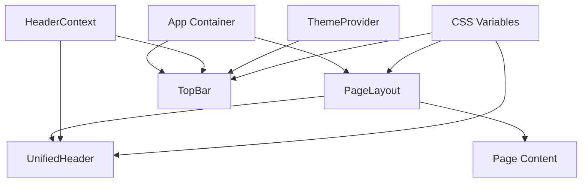
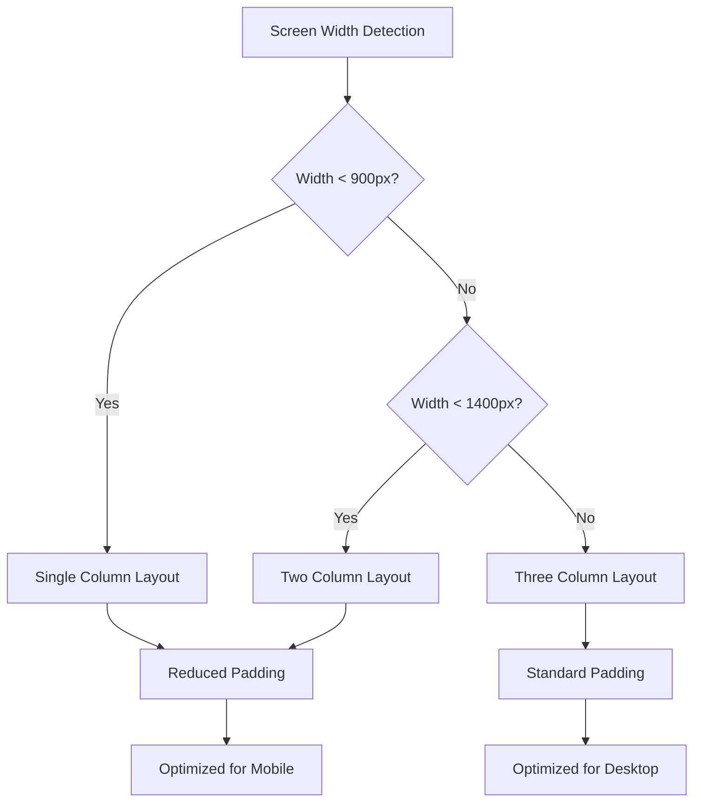
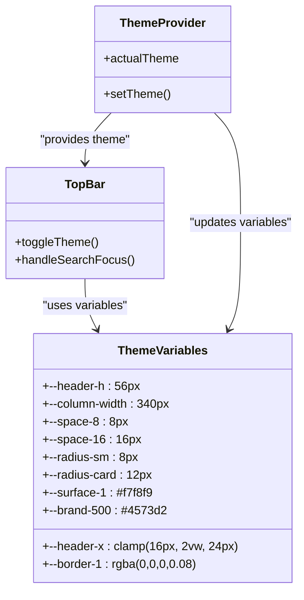
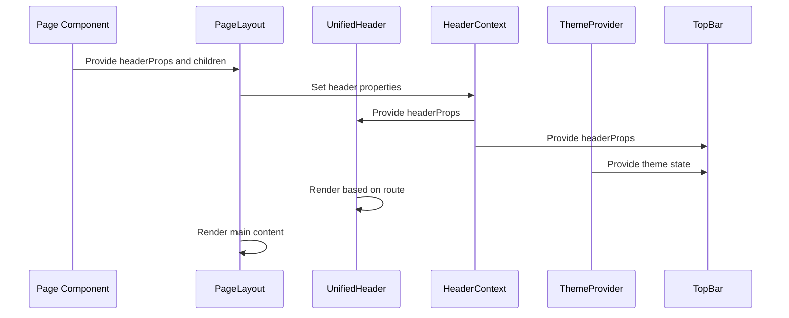

# Layout Components

<cite>
**Referenced Files in This Document**   
- [PageLayout.tsx](file://src/components/layout/PageLayout.tsx)
- [TopBar.tsx](file://src/components/layout/TopBar.tsx)
- [UnifiedHeader.tsx](file://src/components/layout/UnifiedHeader.tsx)
- [HeaderContext.tsx](file://src/app/contexts/HeaderContext.tsx)
- [asana-layout.css](file://src/styles/asana-layout.css)
- [asana-tokens.css](file://src/styles/asana-tokens.css)
- [App.tsx](file://src/app/App.tsx)
- [Button.tsx](file://src/components/ui/design-system/Button.tsx)
- [Avatar.tsx](file://src/components/ui/design-system/Avatar.tsx)
- [Card.tsx](file://src/components/ui/design-system/Card.tsx)
</cite>

## Table of Contents
1. [Introduction](#introduction)
2. [Layout System Overview](#layout-system-overview)
3. [Core Layout Components](#core-layout-components)
4. [Responsive Design Implementation](#responsive-design-implementation)
5. [Accessibility and Keyboard Navigation](#accessibility-and-keyboard-navigation)
6. [Theming and Customization](#theming-and-customization)
7. [Performance Considerations](#performance-considerations)
8. [Usage Examples](#usage-examples)
9. [Component Integration](#component-integration)
10. [Conclusion](#conclusion)

## Introduction
The LibreOllama layout system provides a consistent and flexible foundation for the application's user interface. This documentation details the core layout components—PageLayout, TopBar, and UnifiedHeader—that work together to create a cohesive user experience across all pages. These components implement a responsive design system that adapts to different screen sizes while maintaining accessibility and performance. The layout architecture leverages React context for state management and supports theming through CSS variables, enabling consistent styling across the application.

**Section sources**
- [PageLayout.tsx](file://src/components/layout/PageLayout.tsx#L1-L45)
- [TopBar.tsx](file://src/components/layout/TopBar.tsx#L1-L126)
- [UnifiedHeader.tsx](file://src/components/layout/UnifiedHeader.tsx#L1-L272)

## Layout System Overview
The LibreOllama layout system follows a hierarchical structure with three primary components working in concert. The PageLayout component serves as the outermost container, providing consistent padding and scroll behavior for all pages. Inside this container, the UnifiedHeader component manages page-specific headers and actions, while the TopBar component displays global navigation and user controls. This architecture separates concerns between page-specific and application-wide UI elements, allowing for flexible customization while maintaining visual consistency.

The layout system is built on a mobile-first responsive design approach, using CSS flexbox and media queries to adapt to different screen sizes. It incorporates accessibility features such as keyboard navigation, screen reader support, and proper semantic HTML structure. The system also implements performance optimizations like conditional rendering and efficient state management to ensure smooth interactions across all devices.



**Diagram sources**
- [PageLayout.tsx](file://src/components/layout/PageLayout.tsx#L1-L45)
- [UnifiedHeader.tsx](file://src/components/layout/UnifiedHeader.tsx#L1-L272)
- [TopBar.tsx](file://src/components/layout/TopBar.tsx#L1-L126)
- [HeaderContext.tsx](file://src/app/contexts/HeaderContext.tsx#L1-L64)

**Section sources**
- [PageLayout.tsx](file://src/components/layout/PageLayout.tsx#L1-L45)
- [TopBar.tsx](file://src/components/layout/TopBar.tsx#L1-L126)
- [UnifiedHeader.tsx](file://src/components/layout/UnifiedHeader.tsx#L1-L272)
- [asana-layout.css](file://src/styles/asana-layout.css#L1-L439)

## Core Layout Components

### PageLayout Component
The PageLayout component serves as the foundational container for all application pages, ensuring consistent structure and spacing. It accepts a headerProps object that defines the content and actions for the page header, and renders children within a scrollable main content area. The component uses flexbox layout to ensure the main content area expands to fill available space while maintaining proper scrolling behavior.

[SPEC SYMBOL](file://src/components/layout/PageLayout.tsx#L1-L45)

### TopBar Component
The TopBar component displays global application controls and user information at the top of the interface. It shows either the application logo and search functionality (when no page title is present) or the current page title with subtitle. The component includes theme toggling functionality, notifications, help access, and user profile controls. It integrates with the HeaderContext to access page-specific header properties and the ThemeProvider for theme management.

[SPEC_SYMBOL](file://src/components/layout/TopBar.tsx#L1-L126)

### UnifiedHeader Component
The UnifiedHeader component provides contextual headers for different application pages, rendering specialized interfaces based on the current route. It implements a switch pattern to display appropriate controls for each page type, such as view toggles for tasks, date navigation for calendar, or search functionality for notes. The component respects page-specific requirements by returning null for pages that manage their own headers (e.g., mail, chat). It leverages the HeaderContext to access shared header state and props.

[SPEC_SYMBOL](file://src/components/layout/UnifiedHeader.tsx#L1-L272)

**Section sources**
- [PageLayout.tsx](file://src/components/layout/PageLayout.tsx#L1-L45)
- [TopBar.tsx](file://src/components/layout/TopBar.tsx#L1-L126)
- [UnifiedHeader.tsx](file://src/components/layout/UnifiedHeader.tsx#L1-L272)

## Responsive Design Implementation
The layout system implements responsive behavior through a combination of CSS flexbox, media queries, and component-level adaptations. The asana-layout.css file defines responsive breakpoints that adjust grid layouts and spacing based on screen width. The system uses a mobile-first approach, with base styles optimized for smaller screens and progressive enhancement for larger viewports.

For screen widths below 900px, the layout reduces padding and switches to single-column layouts where appropriate. Between 900px and 1400px, it uses a two-column grid for dashboard content, and above 1400px, it expands to a three-column layout. The TopBar component adapts its display based on available space, prioritizing essential controls while maintaining usability across devices.

The responsive system also addresses touch interactions on mobile devices, ensuring adequate tap targets and preventing horizontal scrolling through proper width constraints. The layout prevents content overflow with max-width constraints and proper box-sizing properties, maintaining a clean appearance across all screen sizes.



**Diagram sources**
- [asana-layout.css](file://src/styles/asana-layout.css#L1-L439)
- [PageLayout.tsx](file://src/components/layout/PageLayout.tsx#L1-L45)

**Section sources**
- [asana-layout.css](file://src/styles/asana-layout.css#L1-L439)
- [PageLayout.tsx](file://src/components/layout/PageLayout.tsx#L1-L45)

## Accessibility and Keyboard Navigation
The layout components prioritize accessibility through semantic HTML, proper ARIA attributes, and keyboard navigation support. The PageLayout includes a "Skip to main content" link for keyboard users, positioned absolutely but revealed on focus to maintain visual cleanliness while providing essential navigation. All interactive elements in the TopBar and UnifiedHeader components are keyboard accessible, with visible focus states that meet WCAG contrast requirements.

The TopBar implements proper button roles and accessible labels for icons, ensuring screen reader users can understand the purpose of each control. The theme toggle button includes both an aria-label and title attribute for maximum compatibility. The search functionality is accessible via keyboard focus, with clear visual indicators when active.

The UnifiedHeader component uses appropriate heading levels (h1 for page titles) to maintain document structure, and all buttons include descriptive text or aria-labels. Interactive elements follow a logical tab order that matches the visual layout, and focus management is handled consistently across page transitions.

[SPEC_SYMBOL](file://src/app/App.tsx#L1-L147)
[SPEC_SYMBOL](file://src/components/layout/TopBar.tsx#L1-L126)
[SPEC_SYMBOL](file://src/components/layout/UnifiedHeader.tsx#L1-L272)

**Section sources**
- [App.tsx](file://src/app/App.tsx#L1-L147)
- [TopBar.tsx](file://src/components/layout/TopBar.tsx#L1-L126)
- [UnifiedHeader.tsx](file://src/components/layout/UnifiedHeader.tsx#L1-L272)

## Theming and Customization
The layout system supports theming through CSS variables defined in asana-tokens.css, allowing for consistent styling across components. The TopBar component integrates with the ThemeProvider to enable dynamic theme switching, with a toggle button that switches between light and dark modes based on user preference. The system respects the operating system's preferred color scheme through the prefers-color-scheme media query.

Key layout variables include spacing units (e.g., --space-8, --space-16), border radii (e.g., --radius-sm, --radius-card), and color tokens (e.g., --surface-1, --border-1). These variables are used throughout the layout components to ensure visual consistency and simplify theme customization. The button and avatar components leverage these variables for background colors, text colors, and border properties.

Customization is achieved by modifying the CSS variables in the :root selector, with dark mode variants defined in a media query. Components consume these variables directly in their styles, enabling theme changes to propagate throughout the application without requiring component-level modifications.



**Diagram sources**
- [asana-tokens.css](file://src/styles/asana-tokens.css#L1-L60)
- [TopBar.tsx](file://src/components/layout/TopBar.tsx#L1-L126)
- [ThemeProvider](file://src/components/ThemeProvider.tsx#L1-L50)

**Section sources**
- [asana-tokens.css](file://src/styles/asana-tokens.css#L1-L60)
- [TopBar.tsx](file://src/components/layout/TopBar.tsx#L1-L126)

## Performance Considerations
The layout components are optimized for performance through several strategies. The PageLayout uses React's functional component pattern with minimal re-renders, only updating when headerProps or children change. The UnifiedHeader implements conditional rendering based on the current route, avoiding unnecessary DOM elements for pages that don't require a header.

The TopBar component leverages React's useCallback hook for event handlers to prevent unnecessary re-creation, and the HeaderContext uses memoization to minimize context updates. The layout system avoids expensive operations in render methods, with all calculations and transformations performed efficiently.

The CSS architecture minimizes repaints and reflows through the use of transform and opacity for animations rather than properties that trigger layout changes. The scrollbar styling uses hardware-accelerated properties for smooth scrolling performance. The responsive design uses efficient media queries that don't trigger excessive re-layouts during window resizing.

[SPEC_SYMBOL](file://src/components/layout/PageLayout.tsx#L1-L45)
[SPEC_SYMBOL](file://src/components/layout/TopBar.tsx#L1-L126)
[SPEC_SYMBOL](file://src/components/layout/UnifiedHeader.tsx#L1-L272)
[SPEC_SYMBOL](file://src/app/contexts/HeaderContext.tsx#L1-L64)

**Section sources**
- [PageLayout.tsx](file://src/components/layout/PageLayout.tsx#L1-L45)
- [TopBar.tsx](file://src/components/layout/TopBar.tsx#L1-L126)
- [UnifiedHeader.tsx](file://src/components/layout/UnifiedHeader.tsx#L1-L272)
- [HeaderContext.tsx](file://src/app/contexts/HeaderContext.tsx#L1-L64)

## Usage Examples

### Basic Page Structure
The following example demonstrates how to structure a page using the PageLayout component with a title and primary action:

```jsx
<PageLayout 
  headerProps={{
    title: "Project Dashboard",
    primaryAction: {
      label: "Create Task",
      onClick: handleCreateTask,
      icon: <PlusIcon />
    }
  }}
>
  <div>Page content goes here</div>
</PageLayout>
```

[SPEC_SYMBOL](file://src/components/layout/PageLayout.tsx#L1-L45)

### Custom Header Configuration
This example shows how to configure a page with breadcrumb navigation and multiple secondary actions:

```jsx
<PageLayout 
  headerProps={{
    title: "Q4 Marketing Campaign",
    breadcrumb: [
      { path: "/projects", label: "Projects" },
      { path: "/projects/123", label: "Marketing" }
    ],
    secondaryActions: [
      {
        label: "Filter",
        onClick: handleFilter,
        variant: "ghost"
      },
      {
        label: "Export",
        onClick: handleExport,
        variant: "secondary"
      }
    ]
  }}
>
  <div>Page content with filtering and export options</div>
</PageLayout>
```

[SPEC_SYMBOL](file://src/components/layout/PageLayout.tsx#L1-L45)

### Contextual Header Usage
The UnifiedHeader automatically adapts to the current route, but pages can also set specific header properties through the HeaderContext:

```jsx
// In a page component
const { setHeaderProps } = useHeader();

useEffect(() => {
  setHeaderProps({
    title: "Team Tasks",
    subtitle: "Showing all active tasks",
    primaryAction: {
      label: "Add Task",
      onClick: openTaskModal
    }
  });
  
  return () => clearHeaderProps();
}, []);
```

[SPEC_SYMBOL](file://src/app/contexts/HeaderContext.tsx#L1-L64)

**Section sources**
- [PageLayout.tsx](file://src/components/layout/PageLayout.tsx#L1-L45)
- [HeaderContext.tsx](file://src/app/contexts/HeaderContext.tsx#L1-L64)

## Component Integration
The layout components integrate with other UI elements through a combination of React context, props, and CSS variables. The HeaderContext provides a centralized state management system for header properties, allowing any component to update the header content. The ThemeProvider enables theme coordination across layout and content components.

The layout system works with UI components like Button, Avatar, and Card through shared design tokens and consistent styling patterns. The Button component consumes the same CSS variables as the layout components, ensuring visual harmony. The Avatar component's status indicators and sizing align with the layout's spacing system.

Integration with page-specific components occurs through the PageLayout's children prop, which accepts any React node. This flexible approach allows pages to compose their content while maintaining consistent layout structure. The system also integrates with navigation through React Router, using the current location to determine header appearance.



**Diagram sources**
- [PageLayout.tsx](file://src/components/layout/PageLayout.tsx#L1-L45)
- [UnifiedHeader.tsx](file://src/components/layout/UnifiedHeader.tsx#L1-L272)
- [TopBar.tsx](file://src/components/layout/TopBar.tsx#L1-L126)
- [HeaderContext.tsx](file://src/app/contexts/HeaderContext.tsx#L1-L64)

**Section sources**
- [PageLayout.tsx](file://src/components/layout/PageLayout.tsx#L1-L45)
- [UnifiedHeader.tsx](file://src/components/layout/UnifiedHeader.tsx#L1-L272)
- [TopBar.tsx](file://src/components/layout/TopBar.tsx#L1-L126)
- [HeaderContext.tsx](file://src/app/contexts/HeaderContext.tsx#L1-L64)

## Conclusion
The LibreOllama layout components provide a robust foundation for building consistent and accessible user interfaces. The PageLayout, TopBar, and UnifiedHeader components work together to create a cohesive experience across all application pages, with responsive design, theming support, and performance optimizations. By leveraging React context for state management and CSS variables for styling, the system enables flexible customization while maintaining visual consistency. The components are designed with accessibility in mind, supporting keyboard navigation and screen reader compatibility. Developers can easily integrate these components into new pages while adhering to the application's design language and user experience standards.