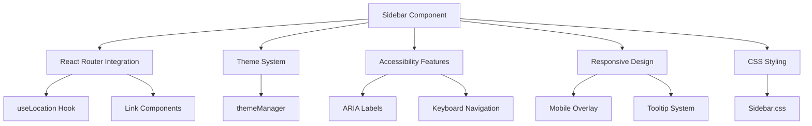
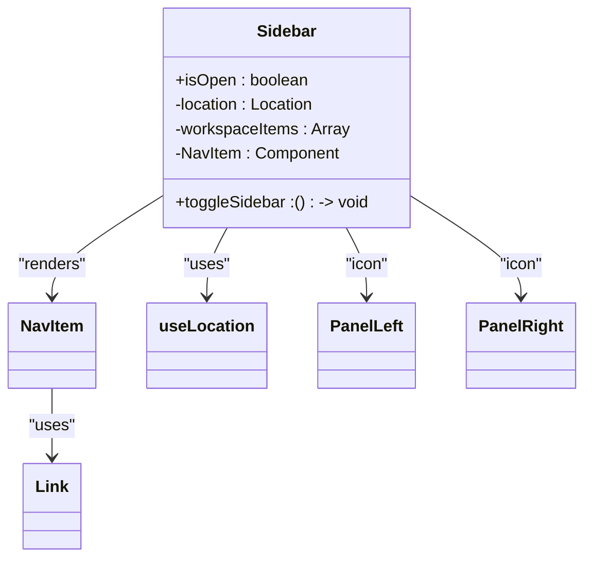
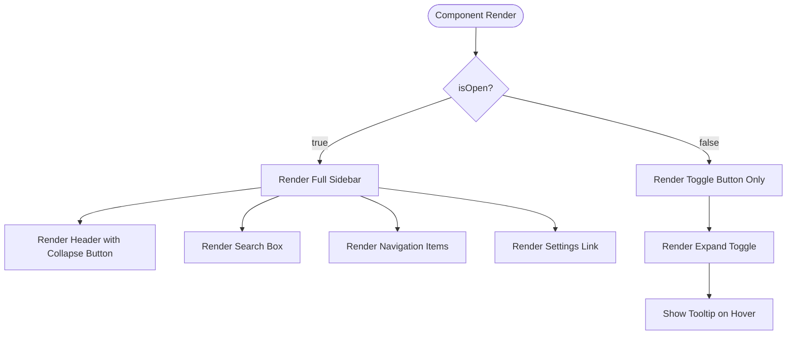
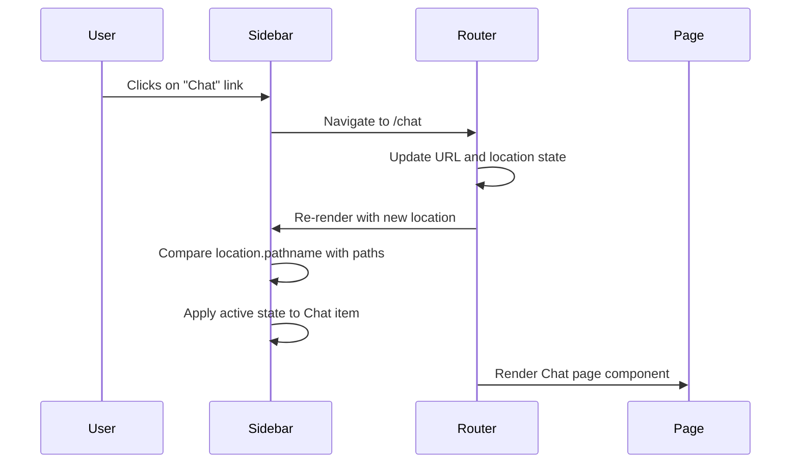
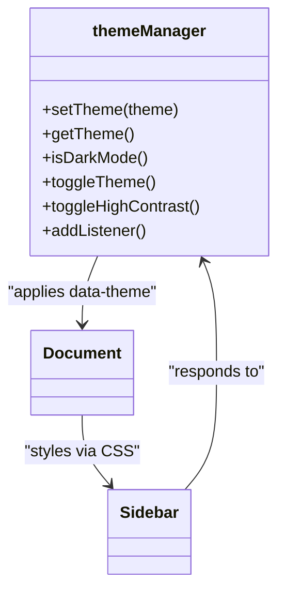

# Navigation Components

<cite>
**Referenced Files in This Document**   
- [Sidebar.tsx](file://src/components/navigation/Sidebar.tsx)
- [Sidebar.css](file://src/components/navigation/Sidebar.css)
- [themeManager.ts](file://src/core/theme/themeManager.ts)
</cite>

## Table of Contents
1. [Introduction](#introduction)
2. [Core Components](#core-components)
3. [Architecture Overview](#architecture-overview)
4. [Detailed Component Analysis](#detailed-component-analysis)
5. [Dependency Analysis](#dependency-analysis)
6. [Performance Considerations](#performance-considerations)
7. [Troubleshooting Guide](#troubleshooting-guide)
8. [Conclusion](#conclusion)

## Introduction
The Sidebar component in LibreOllama serves as the primary navigation interface, providing users with access to key application modules including Spaces, Chat, Mail, Notes, Canvas, Calendar, Tasks, and Agents. Designed with usability and accessibility in mind, the Sidebar supports collapsible behavior, theme integration, and responsive design across device sizes. It integrates tightly with the application's routing system using React Router, maintaining selection state based on the current URL path. The component also supports screen reader announcements, keyboard navigation, and responsive overlays on mobile devices. This documentation provides a comprehensive overview of the Sidebar's structure, functionality, and integration points within the LibreOllama ecosystem.

## Core Components

The Sidebar component is implemented as a React functional component located at `src/components/navigation/Sidebar.tsx`. It accepts two primary props: `isOpen` (boolean) to control its expanded/collapsed state, and `toggleSidebar` (function) to handle expansion/collapse interactions. The component renders a list of navigation items with icons from the Lucide React library, each linking to a specific route within the application. When collapsed, it displays only a toggle button with tooltips on hover. The Sidebar includes a search box, workspace navigation group, and a settings link in the footer. It uses CSS modules for styling and supports responsive behavior on mobile devices through a fixed-position overlay.

**Section sources**
- [Sidebar.tsx](file://src/components/navigation/Sidebar.tsx#L1-L156)

## Architecture Overview



**Diagram sources**
- [Sidebar.tsx](file://src/components/navigation/Sidebar.tsx#L1-L156)
- [Sidebar.css](file://src/components/navigation/Sidebar.css#L1-L404)

## Detailed Component Analysis

### Sidebar Component Analysis

The Sidebar component is structured into four main sections: Header, Search, Navigation, and Footer. The Header contains the application logo and a collapse/expand toggle button. The Search section includes an input field with a search icon. The Navigation section displays a list of workspace items with icons and labels, while the Footer contains a link to Settings.

#### Component Structure


**Diagram sources**
- [Sidebar.tsx](file://src/components/navigation/Sidebar.tsx#L1-L156)

#### Collapsible Behavior Flow


**Diagram sources**
- [Sidebar.tsx](file://src/components/navigation/Sidebar.tsx#L1-L156)
- [Sidebar.css](file://src/components/navigation/Sidebar.css#L1-L404)

### Navigation and Routing Integration

The Sidebar integrates with React Router through the `useLocation` hook to determine the currently active route. Each navigation item uses the `Link` component from `react-router-dom` to enable client-side navigation. The active state is determined by comparing the current pathname with the item's path, applying an "active" CSS class when matched. This visual feedback includes a purple accent bar on the left side of the active item and purple text color.



**Diagram sources**
- [Sidebar.tsx](file://src/components/navigation/Sidebar.tsx#L1-L156)

### Theme and Styling System

The Sidebar's visual appearance is controlled through CSS variables and integrates with the application's theme system via the `themeManager`. The component uses a light color scheme by default with specific color assignments: white background (#FFFFFF), light gray borders (#E4E7EB), and purple accents (#796EFF) for active states and the logo. The theme system allows switching between light, dark, and high-contrast modes, which are applied globally through data attributes on the document element.



**Diagram sources**
- [themeManager.ts](file://src/core/theme/themeManager.ts#L1-L317)
- [Sidebar.css](file://src/components/navigation/Sidebar.css#L1-L404)

## Dependency Analysis

The Sidebar component has several key dependencies that enable its functionality:

```mermaid
graph TD
Sidebar --> React : "built with"
Sidebar --> react-router-dom : "for routing"
Sidebar --> lucide-react : "for icons"
Sidebar --> CSS : "for styling"
react-router-dom --> history : "navigation state"
CSS --> themeManager : "theme integration"
Sidebar --> Accessibility : "ARIA compliance"
```

**Diagram sources**
- [Sidebar.tsx](file://src/components/navigation/Sidebar.tsx#L1-L156)
- [Sidebar.css](file://src/components/navigation/Sidebar.css#L1-L404)

## Performance Considerations

The Sidebar component is optimized for performance through several mechanisms. It uses React's functional component pattern with props-based state management, avoiding unnecessary class overhead. The component only re-renders when the `isOpen` prop or location changes, leveraging React Router's efficient location change detection. CSS transitions are used for smooth animations with a 200ms duration, providing visual feedback without jank. The collapsed state minimizes DOM elements, rendering only a single toggle button when closed. On mobile devices, the Sidebar uses CSS transforms for sliding animations rather than repositioning, which is GPU-accelerated. The component also implements efficient hover effects using CSS rather than JavaScript event handlers.

**Section sources**
- [Sidebar.tsx](file://src/components/navigation/Sidebar.tsx#L1-L156)
- [Sidebar.css](file://src/components/navigation/Sidebar.css#L1-L404)

## Troubleshooting Guide

Common issues with the Sidebar component and their solutions:

1. **Sidebar not responding to toggle**: Ensure the `toggleSidebar` function is properly passed from the parent component and bound correctly.

2. **Active state not updating**: Verify that React Router is properly configured and that the `useLocation` hook is receiving updated location objects on navigation.

3. **Theme not applying**: Check that the `themeManager` has initialized and applied the correct `data-theme` attribute to the document element.

4. **Mobile overlay not appearing**: Confirm that the parent layout component is rendering the `.asana-sidebar-overlay` element adjacent to the Sidebar.

5. **Tooltip not showing in collapsed state**: Ensure the `data-tooltip` attribute is present on navigation items and that the CSS `::after` pseudo-element is not being blocked by other styles.

6. **Keyboard navigation issues**: Verify that all interactive elements have proper `tabindex` values and that focus styles are visible in the current theme.

**Section sources**
- [Sidebar.tsx](file://src/components/navigation/Sidebar.tsx#L1-L156)
- [Sidebar.css](file://src/components/navigation/Sidebar.css#L1-L404)

## Conclusion

The Sidebar component in LibreOllama provides a robust, accessible, and visually consistent navigation interface that integrates seamlessly with the application's routing system and theme capabilities. Its collapsible design optimizes screen real estate while maintaining accessibility through tooltips and keyboard navigation. The component follows modern React patterns and leverages CSS modules for maintainable styling. With proper integration of the theme system and responsive design principles, the Sidebar delivers a consistent user experience across different devices and user preferences. Future enhancements could include support for custom navigation items, drag-and-drop reordering, and deeper integration with user authentication state to show context-specific navigation options.