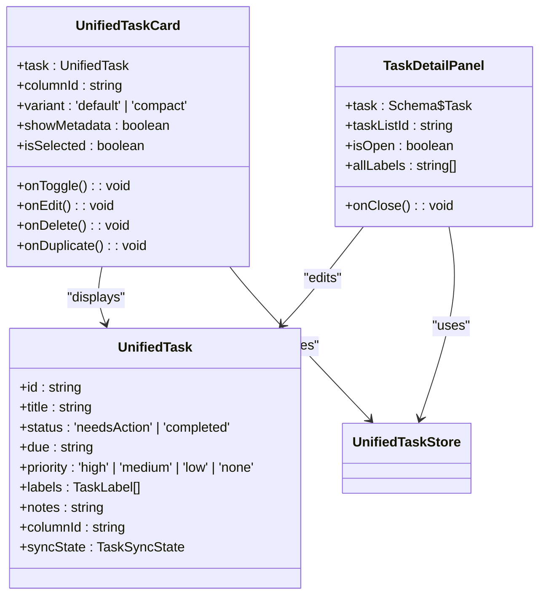
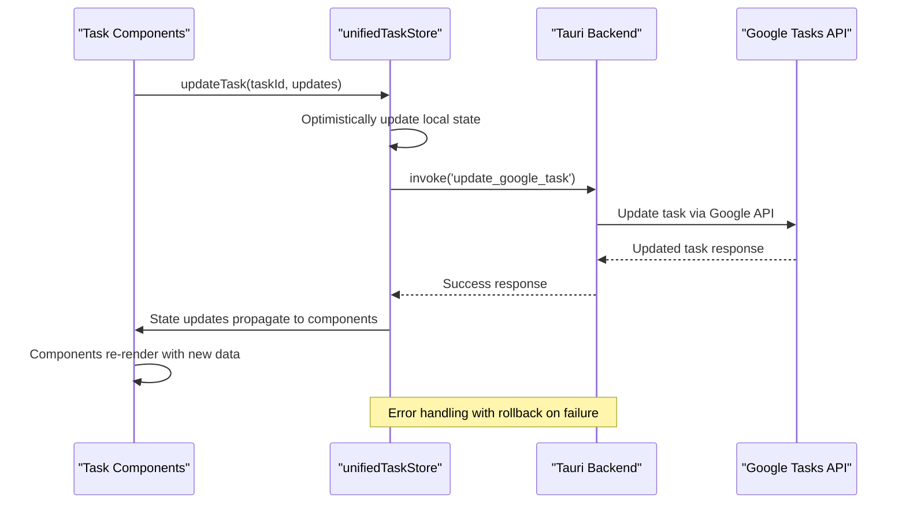
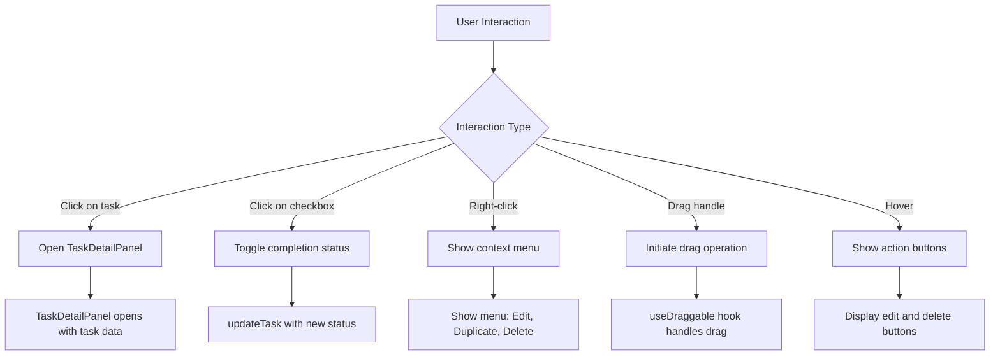

# Task Components

<cite>
**Referenced Files in This Document**   
- [UnifiedTaskCard.tsx](file://src/components/tasks/UnifiedTaskCard.tsx)
- [TaskDetailPanel.tsx](file://src/components/tasks/TaskDetailPanel.tsx)
- [unifiedTaskStore.ts](file://src/stores/unifiedTaskStore.ts)
- [unifiedTaskStore.types.ts](file://src/stores/unifiedTaskStore.types.ts)
</cite>

## Table of Contents
1. [Introduction](#introduction)
2. [Core Components](#core-components)
3. [Component Architecture](#component-architecture)
4. [State Management Integration](#state-management-integration)
5. [Event Handling and User Interaction](#event-handling-and-user-interaction)
6. [Customization Options](#customization-options)
7. [Accessibility and Keyboard Support](#accessibility-and-keyboard-support)
8. [Extensibility and External Integration](#extensibility-and-external-integration)
9. [Usage Examples](#usage-examples)
10. [Troubleshooting Guide](#troubleshooting-guide)

## Introduction
The task management UI components in LibreOllama provide a comprehensive system for visualizing and interacting with tasks. The core components, UnifiedTaskCard and TaskDetailPanel, offer a seamless user experience for task management with rich feature support including drag-and-drop functionality, real-time updates, and integration with Google Tasks. These components are designed with accessibility and extensibility in mind, allowing for customization and integration with external services.

## Core Components

The task management system is built around two primary components that handle task visualization and detailed interaction.

### UnifiedTaskCard
The UnifiedTaskCard component serves as the primary visual representation of tasks in lists and boards. It displays essential task information including title, due date, priority, labels, and completion status. The component supports multiple variants (default and compact) and provides visual feedback for overdue tasks with red highlighting. It implements drag-and-drop functionality through the dnd-kit library, allowing users to reorder tasks or move them between columns.

### TaskDetailPanel
The TaskDetailPanel component provides an expanded view for detailed task manipulation. It appears as a modal dialog that allows users to edit all task properties including title, notes, due date, priority, labels, and subtasks. The panel includes a comprehensive set of controls for task management, including completion toggling, label management, subtask creation, and deletion. It integrates with the unified task store to ensure real-time updates across the application.

**Section sources**
- [UnifiedTaskCard.tsx](file://src/components/tasks/UnifiedTaskCard.tsx#L21-L211)
- [TaskDetailPanel.tsx](file://src/components/tasks/TaskDetailPanel.tsx#L19-L325)

## Component Architecture

The task components follow a modular architecture that separates concerns between presentation, state management, and business logic.



**Diagram sources**
- [UnifiedTaskCard.tsx](file://src/components/tasks/UnifiedTaskCard.tsx#L21-L211)
- [TaskDetailPanel.tsx](file://src/components/tasks/TaskDetailPanel.tsx#L19-L325)
- [unifiedTaskStore.types.ts](file://src/stores/unifiedTaskStore.types.ts#L0-L106)

## State Management Integration

The task components integrate with a centralized state management system based on Zustand, providing real-time updates and synchronization across the application.

### Unified Task Store
The unifiedTaskStore serves as the single source of truth for all task-related data. It manages the complete task state including tasks, columns, and UI preferences. The store implements persistence, ensuring that task data is preserved across application restarts.

### Data Flow


**Diagram sources**
- [unifiedTaskStore.ts](file://src/stores/unifiedTaskStore.ts#L0-L799)
- [TaskDetailPanel.tsx](file://src/components/tasks/TaskDetailPanel.tsx#L19-L325)

**Section sources**
- [unifiedTaskStore.ts](file://src/stores/unifiedTaskStore.ts#L0-L799)
- [unifiedTaskStore.types.ts](file://src/stores/unifiedTaskStore.types.ts#L0-L106)

## Event Handling and User Interaction

The task components implement comprehensive event handling for various user interactions.

### UnifiedTaskCard Interactions


### TaskDetailPanel Interactions
The TaskDetailPanel handles various input events for task modification:
- Title changes trigger immediate updates with onBlur saving
- Due date selection updates the task due property
- Priority selection maps to high/medium/low/none values
- Label addition and removal modify the labels array
- Subtask creation and completion status changes
- Notes updates with real-time saving

**Section sources**
- [UnifiedTaskCard.tsx](file://src/components/tasks/UnifiedTaskCard.tsx#L21-L211)
- [TaskDetailPanel.tsx](file://src/components/tasks/TaskDetailPanel.tsx#L19-L325)

## Customization Options

The task components offer several customization options for appearance and behavior.

### UnifiedTaskCard Props
| Prop | Type | Default | Description |
|------|------|---------|-------------|
| task | UnifiedTask | required | The task object to display |
| columnId | string | required | ID of the containing column |
| onToggle | function | required | Callback for completion toggle |
| onEdit | function | required | Callback for edit action |
| onDelete | function | required | Callback for delete action |
| onDuplicate | function | required | Callback for duplicate action |
| variant | 'default' \| 'compact' | 'default' | Visual density of the card |
| showMetadata | boolean | true | Whether to display metadata row |
| isSelected | boolean | false | Visual selection state |

### Visual Customization
The components support visual customization through CSS variables and conditional rendering:
- Compact variant reduces vertical space for dense layouts
- Selected state highlights the card with accent border
- Overdue tasks display with red text and background
- Priority levels have color-coded indicators
- Labels display with color swatches based on their color property

**Section sources**
- [UnifiedTaskCard.tsx](file://src/components/tasks/UnifiedTaskCard.tsx#L21-L211)
- [TaskDetailPanel.tsx](file://src/components/tasks/TaskDetailPanel.tsx#L19-L325)

## Accessibility and Keyboard Support

The task components implement comprehensive accessibility features to ensure usability for all users.

### Keyboard Navigation
- **Tab Navigation**: Users can navigate between interactive elements using Tab and Shift+Tab
- **Space/Enter**: Activate buttons and checkboxes
- **Escape**: Close the TaskDetailPanel modal
- **Arrow Keys**: Navigate within the context menu
- **Ctrl+Enter**: Save changes in TaskDetailPanel

### ARIA Attributes
The components use appropriate ARIA attributes to enhance screen reader support:
- Proper labeling of interactive elements
- Status announcements for state changes
- Role attributes for modal dialogs
- Live regions for dynamic content updates

### Focus Management
The components implement proper focus management:
- Focus trapping within the TaskDetailPanel modal
- Return focus to the triggering element when closing
- Visual focus indicators for keyboard navigation
- Skip links for bypassing repetitive content

**Section sources**
- [TaskDetailPanel.tsx](file://src/components/tasks/TaskDetailPanel.tsx#L19-L325)
- [UnifiedTaskCard.tsx](file://src/components/tasks/UnifiedTaskCard.tsx#L21-L211)

## Extensibility and External Integration

The task components are designed to be extensible and integrate with external services.

### Custom Actions
The components can be extended with custom actions through their callback props:
- onEdit can be overridden to implement custom editing workflows
- onDuplicate can be extended to include additional duplication logic
- onDelete can include confirmation dialogs or additional cleanup

### Google Tasks Integration
The components integrate with Google Tasks through the unified task store:
- Two-way synchronization of task data
- Conflict resolution for offline changes
- Error handling and retry mechanisms
- Progress indicators for sync operations

### API Extension Points
The components provide several extension points for integration:
- Custom context menu items
- Additional metadata fields
- Integration with calendar services for time blocking
- Connection to external task management systems

**Section sources**
- [unifiedTaskStore.ts](file://src/stores/unifiedTaskStore.ts#L0-L799)
- [TaskDetailPanel.tsx](file://src/components/tasks/TaskDetailPanel.tsx#L19-L325)

## Usage Examples

### Basic Task Card Usage
```jsx
<UnifiedTaskCard
  task={task}
  columnId="column-1"
  onToggle={() => handleToggle(task.id)}
  onEdit={() => openTaskDetail(task)}
  onDelete={() => confirmDelete(task.id)}
  onDuplicate={() => duplicateTask(task)}
  variant="default"
/>
```

### Compact Task List
```jsx
<div className="task-list">
  {tasks.map(task => (
    <UnifiedTaskCard
      key={task.id}
      task={task}
      columnId={currentColumn.id}
      onToggle={() => toggleTaskStatus(task.id)}
      onEdit={() => setSelectedTask(task)}
      onDelete={() => deleteTask(task.id)}
      onDuplicate={() => duplicateTask(task)}
      variant="compact"
      showMetadata={true}
    />
  ))}
</div>
```

### Task Detail Panel Integration
```jsx
<TaskDetailPanel
  task={selectedTask}
  taskListId={currentListId}
  isOpen={isDetailOpen}
  onClose={() => setIsDetailOpen(false)}
  allLabels={availableLabels}
/>
```

### Customized Task Card with Selection
```jsx
<UnifiedTaskCard
  task={task}
  columnId={column.id}
  onToggle={handleToggle}
  onEdit={handleEdit}
  onDelete={handleDelete}
  onDuplicate={handleDuplicate}
  isSelected={selectedTaskId === task.id}
  showMetadata={showTaskMetadata}
/>
```

**Section sources**
- [UnifiedTaskCard.tsx](file://src/components/tasks/UnifiedTaskCard.tsx#L21-L211)
- [TaskDetailPanel.tsx](file://src/components/tasks/TaskDetailPanel.tsx#L19-L325)

## Troubleshooting Guide

### Common Issues and Solutions

#### Task Not Updating After Edit
**Symptom**: Changes in TaskDetailPanel don't persist
**Solution**: Ensure the updateTask action is properly connected to the unified task store and that the task ID is correctly passed.

#### Drag-and-Drop Not Working
**Symptom**: Unable to reorder tasks by dragging
**Solution**: Verify that the DndContext is properly wrapped around the task list and that the useDraggable hook is correctly implemented.

#### Sync Issues with Google Tasks
**Symptom**: Tasks not syncing with Google Tasks
**Solution**: Check the unified task store's syncState property and ensure the active Google account is properly configured in settings.

#### Performance Issues with Large Task Lists
**Symptom**: Slow rendering with many tasks
**Solution**: Implement virtualization for task lists and ensure proper React.memo usage on task components.

#### Context Menu Not Appearing
**Symptom**: Right-click doesn't show context menu
**Solution**: Verify that the ContextMenu component is properly imported and that the items prop contains valid menu items.

**Section sources**
- [unifiedTaskStore.ts](file://src/stores/unifiedTaskStore.ts#L0-L799)
- [TaskDetailPanel.tsx](file://src/components/tasks/TaskDetailPanel.tsx#L19-L325)
- [UnifiedTaskCard.tsx](file://src/components/tasks/UnifiedTaskCard.tsx#L21-L211)