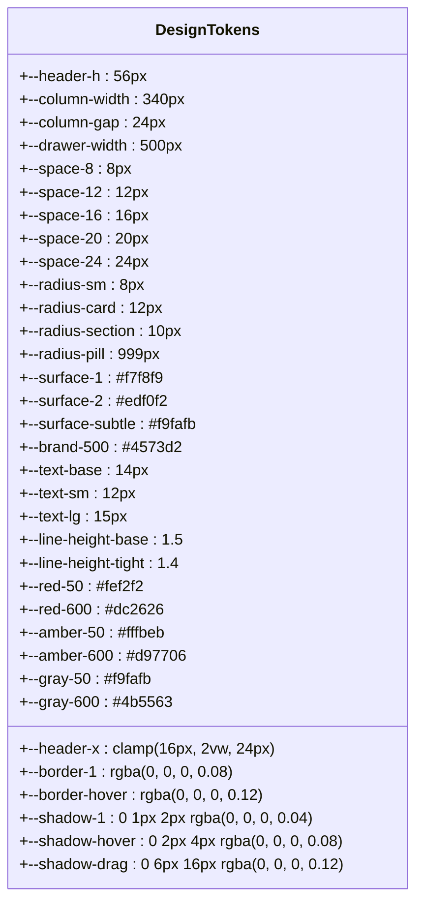
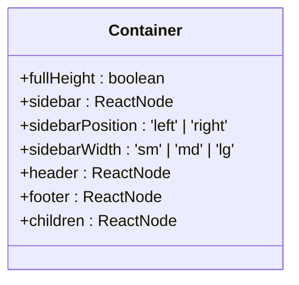
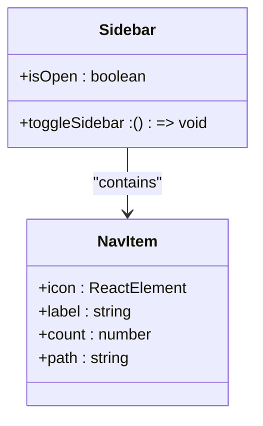
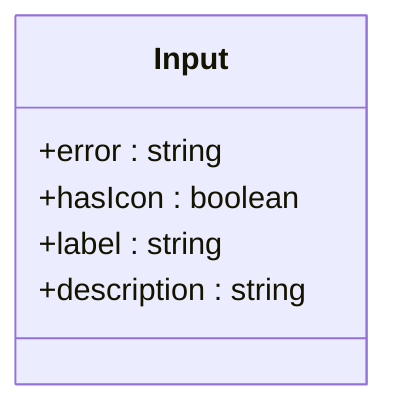
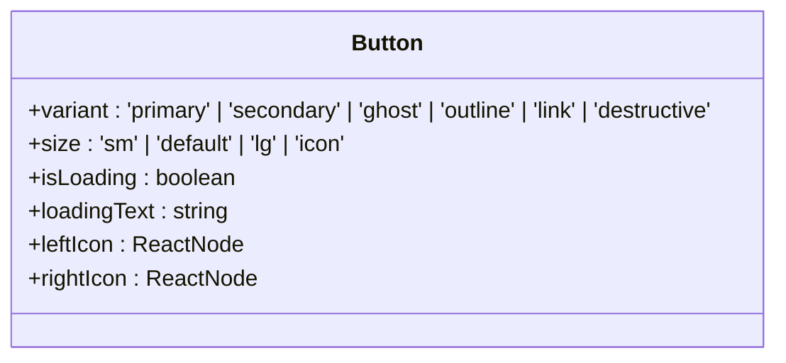
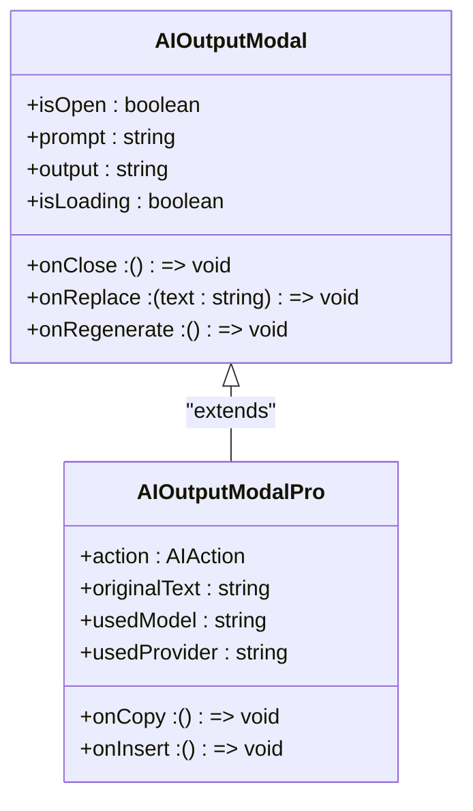
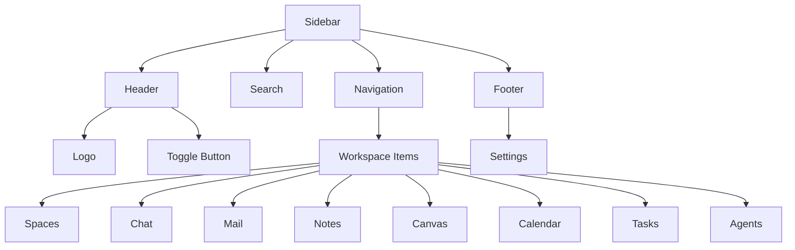

# UI Components

<cite>
**Referenced Files in This Document**   
- [UnifiedTaskCard.tsx](file://src/components/tasks/UnifiedTaskCard.tsx)
- [AIOutputModal.tsx](file://src/components/ai/AIOutputModal.tsx)
- [AIOutputModalPro.tsx](file://src/components/ai/AIOutputModalPro.tsx)
- [Sidebar.tsx](file://src/components/navigation/Sidebar.tsx)
- [index.tsx](file://src/components/ui/index.tsx)
- [Button.tsx](file://src/components/ui/design-system/Button.tsx)
- [asana-tokens.css](file://src/styles/asana-tokens.css)
- [DesignTokens.stories.tsx](file://src/stories/DesignTokens.stories.tsx)
</cite>

## Table of Contents
1. [Introduction](#introduction)
2. [Design System Overview](#design-system-overview)
3. [Layout Components](#layout-components)
4. [Navigation Elements](#navigation-elements)
5. [Form Controls](#form-controls)
6. [Custom UI Elements](#custom-ui-elements)
7. [TaskCard Component](#taskcard-component)
8. [AIOutputModal Component](#aioutputmodal-component)
9. [Sidebar Component](#sidebar-component)
10. [Responsive Design Guidelines](#responsive-design-guidelines)
11. [Accessibility Compliance](#accessibility-compliance)
12. [Component States and Animations](#component-states-and-animations)
13. [Styling and Theming](#styling-and-theming)
14. [Cross-Browser Compatibility](#cross-browser-compatibility)
15. [Performance Optimization](#performance-optimization)
16. [Component Composition](#component-composition)

## Introduction
The LibreOllama UI component library provides a comprehensive set of reusable components that form the foundation of the application's user interface. Built with React and styled using a custom design system, these components ensure consistency, accessibility, and performance across the entire application. This documentation details the component design system, including layout components, navigation elements, form controls, and custom UI elements, with specific focus on key components like TaskCard, AIOutputModal, and Sidebar.

## Design System Overview
The LibreOllama design system is built on a foundation of design tokens that ensure visual consistency across the application. The system uses CSS custom properties to define colors, spacing, typography, and other visual attributes.



**Diagram sources**
- [asana-tokens.css](file://src/styles/asana-tokens.css)

**Section sources**
- [asana-tokens.css](file://src/styles/asana-tokens.css)
- [DesignTokens.stories.tsx](file://src/stories/DesignTokens.stories.tsx)

## Layout Components
The layout components in LibreOllama provide the structural foundation for the application's user interface. These components handle the overall page structure, including headers, sidebars, and content areas.

### Container Component
The Container component is a flexible layout wrapper that supports various layout patterns including sidebar layouts, header/footer layouts, and full-width content areas. It uses CSS flexbox to create responsive layouts that adapt to different screen sizes.



**Diagram sources**
- [Container.tsx](file://src/components/ui/design-system/Container.tsx)

**Section sources**
- [Container.tsx](file://src/components/ui/design-system/Container.tsx)

### PageLayout Component
The PageLayout component provides a standardized page structure with consistent spacing and alignment. It handles the main application layout, including the top navigation bar and main content area.

## Navigation Elements
The navigation elements in LibreOllama provide users with intuitive ways to move through the application and access different features.

### Sidebar Component
The Sidebar component is a primary navigation element that appears on the left side of the application. It provides access to different workspace areas and can be collapsed to a narrow icon bar for space efficiency.



**Diagram sources**
- [Sidebar.tsx](file://src/components/navigation/Sidebar.tsx)

**Section sources**
- [Sidebar.tsx](file://src/components/navigation/Sidebar.tsx)

### Navigation Items
The navigation items in the sidebar represent different application sections such as Spaces, Chat, Mail, Notes, Canvas, Calendar, Tasks, and Agents. Each item displays an icon and label, with an optional badge showing a count of unread items or pending tasks.

## Form Controls
The form controls in LibreOllama provide a consistent and accessible interface for user input and data entry.

### Input Component
The Input component is a styled text input field that supports various states including error, disabled, and focused. It includes built-in support for labels, descriptions, and error messages.



**Diagram sources**
- [index.tsx](file://src/components/ui/index.tsx)

**Section sources**
- [index.tsx](file://src/components/ui/index.tsx)

### Textarea Component
The Textarea component is a multi-line text input field with resizable height. It supports the same states and features as the Input component, including error states and descriptive labels.

### Checkbox Component
The Checkbox component provides a styled checkbox input with support for labels, descriptions, and error states. It includes visual feedback for checked and unchecked states.

## Custom UI Elements
The custom UI elements in LibreOllama extend beyond standard form controls to provide specialized functionality for the application.

### Button Component
The Button component is a versatile UI element with multiple variants and sizes. It supports loading states, icons, and different visual styles to match various use cases.



**Diagram sources**
- [Button.tsx](file://src/components/ui/design-system/Button.tsx)

**Section sources**
- [Button.tsx](file://src/components/ui/design-system/Button.tsx)

### Card Component
The Card component is a container for grouping related content. It provides a consistent visual style with rounded corners, subtle shadows, and proper spacing.

## TaskCard Component
The TaskCard component displays individual tasks in the application's task management system. It provides a compact representation of task information with support for various states and interactions.

```mermaid
classDiagram
class UnifiedTaskCard {
+task : UnifiedTask
+columnId : string
+onToggle : () => void
+onEdit : () => void
+onDelete : () => void
+onDuplicate : () => void
+variant : 'default' | 'compact'
+showMetadata : boolean
+isSelected : boolean
}
class UnifiedTask {
+id : string
+title : string
+status : 'completed' | 'incomplete'
+due : string
+priority : 'none' | 'low' | 'medium' | 'high'
+labels : Array<string | {name : string, color : string}>
+recurring : {enabled : boolean, frequency : string}
}
UnifiedTaskCard --> UnifiedTask : "displays"
```

**Diagram sources**
- [UnifiedTaskCard.tsx](file://src/components/tasks/UnifiedTaskCard.tsx)

**Section sources**
- [UnifiedTaskCard.tsx](file://src/components/tasks/UnifiedTaskCard.tsx)

### Props and Attributes
The TaskCard component accepts the following props:

| Prop | Type | Description |
|------|------|-------------|
| task | UnifiedTask | The task object to display |
| columnId | string | The ID of the column containing the task |
| onToggle | () => void | Callback when task completion status is toggled |
| onEdit | () => void | Callback when task is clicked for editing |
| onDelete | () => void | Callback when task is deleted |
| onDuplicate | () => void | Callback when task is duplicated |
| variant | 'default' \| 'compact' | Visual style of the card |
| showMetadata | boolean | Whether to display task metadata |
| isSelected | boolean | Whether the task is currently selected |

### Events
The TaskCard component emits the following events through its callback props:
- onToggle: When the user toggles the task's completion status
- onEdit: When the user clicks on the task to edit it
- onDelete: When the user deletes the task
- onDuplicate: When the user duplicates the task

### Customization Options
The TaskCard component can be customized through its props:
- variant: Controls the visual density of the card
- showMetadata: Toggles the display of task metadata such as due date, priority, and labels
- isSelected: Highlights the card when it is selected

## AIOutputModal Component
The AIOutputModal component displays the output of AI-generated content in a modal dialog. It provides users with options to copy, replace, or regenerate the AI-generated text.



**Diagram sources**
- [AIOutputModal.tsx](file://src/components/ai/AIOutputModal.tsx)
- [AIOutputModalPro.tsx](file://src/components/ai/AIOutputModalPro.tsx)

**Section sources**
- [AIOutputModal.tsx](file://src/components/ai/AIOutputModal.tsx)
- [AIOutputModalPro.tsx](file://src/components/ai/AIOutputModalPro.tsx)

### Props and Attributes
The AIOutputModal component accepts the following props:

| Prop | Type | Description |
|------|------|-------------|
| isOpen | boolean | Controls whether the modal is visible |
| onClose | () => void | Callback when the modal is closed |
| prompt | string | The original prompt sent to the AI |
| output | string | The AI-generated output |
| isLoading | boolean | Whether the AI is still generating content |
| onReplace | (text: string) => void | Callback when user wants to replace original text |
| onRegenerate | () => void | Callback when user wants to regenerate the output |

The AIOutputModalPro component extends these props with additional functionality:
- action: The type of AI action performed (e.g., summarize, translate)
- originalText: The original text that was processed
- usedModel: The AI model used for generation
- usedProvider: The AI service provider used
- onCopy: Callback when user copies the output
- onInsert: Callback when user inserts the output

### Usage Example
```jsx
<AIOutputModal
  isOpen={showModal}
  onClose={() => setShowModal(false)}
  prompt="Summarize the following text"
  output={aiOutput}
  isLoading={generating}
  onReplace={(text) => replaceText(text)}
  onRegenerate={() => regenerateOutput()}
/>
```

## Sidebar Component
The Sidebar component provides primary navigation for the application, allowing users to switch between different workspace areas.



**Diagram sources**
- [Sidebar.tsx](file://src/components/navigation/Sidebar.tsx)

**Section sources**
- [Sidebar.tsx](file://src/components/navigation/Sidebar.tsx)

### Props and Attributes
The Sidebar component accepts the following props:

| Prop | Type | Description |
|------|------|-------------|
| isOpen | boolean | Controls whether the sidebar is expanded or collapsed |
| toggleSidebar | () => void | Callback when the sidebar toggle button is clicked |

### Events
The Sidebar component handles the following events:
- Click on toggle button: Expands or collapses the sidebar
- Click on navigation items: Navigates to the corresponding application section
- Click on settings: Navigates to the settings page

### Customization Options
The Sidebar component can be customized through its props:
- isOpen: Controls the initial state of the sidebar (expanded or collapsed)
- The component automatically adjusts its layout based on the isOpen prop, showing either a full sidebar with labels or a narrow icon bar

## Responsive Design Guidelines
The LibreOllama UI components are designed to be responsive and adapt to different screen sizes and device types.

### Breakpoints
The application uses the following breakpoints for responsive design:
- Mobile: up to 768px
- Tablet: 769px to 1024px
- Desktop: 1025px and above

### Layout Adaptation
Components adapt their layout based on screen size:
- The Sidebar collapses to a narrow icon bar on smaller screens
- Cards and other UI elements adjust their width and spacing
- Text sizes and line heights are optimized for readability on different devices

### Mobile Considerations
On mobile devices, the UI components are optimized for touch interaction:
- Tap targets are at least 44px in size
- Spacing between interactive elements is sufficient to prevent accidental taps
- Forms and inputs are optimized for mobile keyboards

## Accessibility Compliance
The LibreOllama UI components follow accessibility best practices to ensure the application is usable by all users, including those with disabilities.

### Keyboard Navigation
All interactive components are fully keyboard accessible:
- Users can navigate through the UI using the Tab key
- Interactive elements have visible focus indicators
- Modal dialogs trap focus within the dialog until closed

### Screen Reader Support
Components include appropriate ARIA attributes:
- Labels and descriptions for form controls
- Roles and states for interactive elements
- Live regions for dynamic content updates

### Color Contrast
The design system ensures sufficient color contrast:
- Text and background colors meet WCAG 2.1 AA contrast requirements
- Interactive elements have distinct visual states for different conditions

### Focus Management
The application manages focus appropriately:
- Focus is set to the first interactive element in modal dialogs
- Focus is returned to the triggering element when dialogs are closed
- Focus is managed during dynamic content updates

## Component States and Animations
The UI components in LibreOllama include various states and subtle animations to provide visual feedback and enhance the user experience.

### Component States
Components support the following states:
- Default: Normal state
- Hover: When the user hovers over an interactive element
- Active: When an element is being pressed
- Focus: When an element has keyboard focus
- Disabled: When an element is not interactive
- Loading: When an element is waiting for data or processing

### Animations and Transitions
The application uses subtle animations for various interactions:
- Fade-in and zoom-in animations for modal dialogs
- Scale transformations for button presses
- Smooth transitions for sidebar expansion and collapse
- Pulse animations for loading indicators

```mermaid
stateDiagram-v2
[*] --> Default
Default --> Hover : Mouse over
Hover --> Active : Mouse down
Active --> Default : Mouse up
Default --> Focus : Keyboard focus
Focus --> Default : Focus lost
Default --> Disabled : Disabled
Disabled --> Default : Enabled
Default --> Loading : Processing
Loading --> Default : Complete
```

**Diagram sources**
- [Button.tsx](file://src/components/ui/design-system/Button.tsx)
- [AIOutputModal.tsx](file://src/components/ai/AIOutputModal.tsx)

**Section sources**
- [Button.tsx](file://src/components/ui/design-system/Button.tsx)
- [AIOutputModal.tsx](file://src/components/ai/AIOutputModal.tsx)

## Styling and Theming
The LibreOllama UI components support theming to allow for visual customization and dark mode support.

### Design Tokens
The styling system is based on CSS custom properties (variables) that define the visual attributes of components:
- Colors: Primary, secondary, success, warning, error
- Spacing: Consistent spacing units
- Typography: Font sizes, weights, and line heights
- Radius: Border radii for rounded corners
- Shadows: Subtle shadows for depth

### Theme Support
The application supports both light and dark themes:
- The default theme is a light theme with subtle colors
- A dark theme is available for users who prefer it
- Theme switching is handled through CSS media queries and JavaScript

### Customization
Developers can customize the appearance of components by:
- Overriding CSS custom properties
- Using different variants and sizes
- Applying custom class names

## Cross-Browser Compatibility
The LibreOllama UI components are designed to work consistently across different web browsers.

### Supported Browsers
The application supports the following browsers:
- Chrome (latest two versions)
- Firefox (latest two versions)
- Safari (latest two versions)
- Edge (latest two versions)

### Compatibility Considerations
The components use modern web technologies while maintaining compatibility:
- CSS Grid and Flexbox for layout
- CSS custom properties for theming
- Modern JavaScript syntax with appropriate transpilation
- SVG for icons and illustrations

### Testing
The components are tested across different browsers to ensure consistent appearance and behavior.

## Performance Optimization
The UI components are optimized for performance to ensure a smooth user experience.

### Rendering Performance
Components are optimized to minimize re-renders:
- Use of React.memo for pure components
- Efficient state management
- Virtualization for large lists

### Bundle Size
The component library is optimized for small bundle size:
- Tree-shaking to include only used components
- Code splitting for lazy loading
- Minification and compression

### Memory Management
The application manages memory efficiently:
- Proper cleanup of event listeners
- Avoidance of memory leaks in components
- Efficient handling of large datasets

## Component Composition
The UI components in LibreOllama are designed to be composable, allowing developers to create complex interfaces by combining simple components.

### Composition Patterns
Common composition patterns include:
- Container components that wrap other components
- Higher-order components that add functionality
- Compound components that share state

### Integration with Other Elements
Components can be easily integrated with other UI elements:
- The Sidebar can be combined with different content areas
- The TaskCard can be used in various contexts such as lists and boards
- The AIOutputModal can be triggered from different parts of the application

### Best Practices
When composing components, follow these best practices:
- Keep components focused on a single responsibility
- Use clear and consistent props
- Document component interfaces
- Test composed components thoroughly