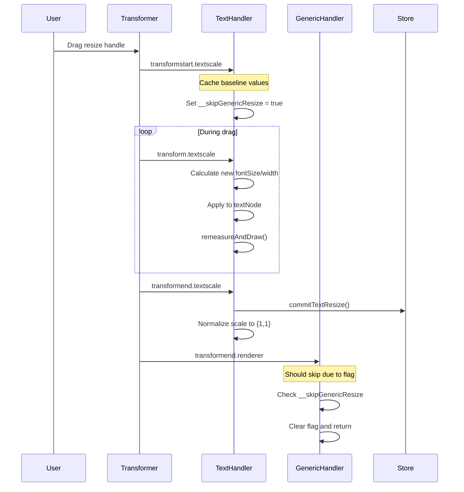

# Font Resize Implementation Analysis Report

**Date:** 2025-09-01  
**Status:** Active Implementation with Alignment Issues  
**Author:** Claude Code Analysis  

## Executive Summary

This report provides a comprehensive analysis of the text box font resizing implementation in LibreOllama's canvas system. The system converts Konva scale transforms into direct fontSize changes to maintain crisp text rendering during resize operations, but currently experiences frame alignment issues.

---

## 1. System Architecture

### 1.1 Core Components

- **CanvasRendererV2**: Main renderer service handling all Konva interactions
- **Unified Canvas Store**: Zustand store managing element state
- **Transformer**: Konva's built-in resize/rotate tool
- **Text Elements**: Konva.Group containing Konva.Text nodes

### 1.2 Element Structure

Text elements follow this hierarchical structure:

```
Konva.Group (name: 'text', id: ElementId)
├── Konva.Rect (name: 'hit-area') - Invisible click target
├── Konva.Rect (name: 'frame') - Visual border (optional)
├── Konva.Rect (name: 'bg') - Background (optional)
└── Konva.Text (name: 'text', class: '.text') - Actual text content
```

---

## 2. Font Resize Implementation

### 2.1 Main Handler Location

**File:** `src/features/canvas/services/CanvasRendererV2.ts`  
**Method:** `attachTextResizeHandlers()` (Lines 1728-1884)

### 2.2 Event Flow



### 2.3 Key Implementation Details

#### Transform Start Handler
```typescript
const onTransformStart = () => {
  base = {
    fontSize: textNode.fontSize(),
    width: Math.max(1, textNode.width() || 1),
    height: Math.max(1, textNode.height() || 1),
  };
  // Skip generic normalization for this gesture
  try { groupNode.setAttr('__skipGenericResize', true); } catch {}
  // ... text mode conversions ...
};
```

#### Live Transform Handler
```typescript
const onTransform = () => {
  const sx = groupNode.scaleX() || 1;
  const sy = groupNode.scaleY() || 1;
  const mode = classifyHandle();

  let nextFont = base.fontSize;
  let nextWidth = base.width;

  if (mode === 'corner') {
    const s = Math.sqrt(Math.max(0.0001, sx) * Math.max(0.0001, sy));
    nextFont = clamp(base.fontSize * s, MIN_FONT, MAX_FONT);
    nextWidth = Math.max(MIN_WIDTH, Math.round(base.width * sx));
  } else if (mode === 'vertical') {
    nextFont = clamp(base.fontSize * sy, MIN_FONT, MAX_FONT);
    nextWidth = Math.max(MIN_WIDTH, Math.round(base.width * sy)); // Point-text width expansion
  } else {
    // horizontal - font unchanged
    nextFont = base.fontSize;
    nextWidth = Math.max(MIN_WIDTH, Math.round(base.width * sx));
  }

  // Apply live changes WITHOUT normalizing scale
  textNode.fontSize(nextFont);
  textNode.width(nextWidth);
  remeasureAndDraw();
};
```

#### Transform End Handler
```typescript
const onTransformEnd = () => {
  // Final calculations...
  textNode.fontSize(finalFont);
  textNode.width(finalWidth);
  groupNode.scale({ x: 1, y: 1 }); // Normalize scale ONCE

  // Measure actual height from rendered glyphs
  const box = textNode.getClientRect({ skipTransform: true, skipStroke: true, skipShadow: true });
  const finalHeight = Math.max(1, Math.ceil(box.height));

  // Update hit area and persist to store
  try { this.ensureHitAreaSize(groupNode, finalWidth, finalHeight); } catch {}
  
  // Persist ALL THREE dimensions
  store.getState().commitTextResize(elId, { 
    fontSize: finalFont, 
    width: finalWidth, 
    height: finalHeight 
  });
  
  transformer.forceUpdate();
};
```

---

## 3. Handle Classification System

The implementation distinguishes between different resize handles:

### 3.1 Handle Types

```typescript
const classifyHandle = (): 'corner' | 'vertical' | 'horizontal' => {
  const name = (transformer as any)._movingAnchorName as string | undefined;
  if (!name) return 'corner';
  const hasTB = /(top|bottom)/.test(name);
  const hasLR = /(left|right)/.test(name);
  if (hasTB && hasLR) return 'corner';
  if (hasTB) return 'vertical';
  if (hasLR) return 'horizontal';
  return 'corner';
};
```

### 3.2 Scaling Behavior by Handle

| Handle Type | Font Scaling | Width Behavior | Use Case |
|-------------|--------------|----------------|----------|
| Corner | `√(sx × sy)` | Proportional to sx | Natural scaling |
| Vertical | `sy` | Proportional to sy | Font size maps to height |
| Horizontal | No change | Proportional to sx | Width-only resize |

---

## 4. Potential Interference Points

### 4.1 Generic Transform Handler

**Location:** Lines 533-640 in `CanvasRendererV2.ts`

**Issue:** The generic handler runs on `transformend.renderer` and can interfere with text elements:

```typescript
// POTENTIAL CONFLICT: Generic handler forcing text dimensions
if (text) {
  const isTextElement = group.name() === 'text';
  if (!isTextElement) {
    // Only sticky notes get forced dimensions
    (text as any).width(Math.max(1, nextW - 2 * pad));
    (text as any).height(Math.max(1, nextH - 2 * pad));
  }
  // Text elements should keep fontSize-calculated dimensions
}
```

**Protection:** The `__skipGenericResize` flag should prevent this, but event order may cause issues.

### 4.2 Legacy React-Konva Components

**Status:** Mostly disabled, but some remnants exist:
- `SelectionLayer.tsx` - Contains transformer logic (potentially unused)
- `MainLayer.tsx` - React-Konva text elements (should be disabled)

### 4.3 Transformer Attachment

**Current Implementation:**
```typescript
// Text elements are attached to transformer at GROUP level
nodes.forEach(node => {
  if (node.name() === 'text') {
    const group = node as Konva.Group;
    const textNode = group.findOne<Konva.Text>('.text');
    if (textNode && group.id()) {
      this.attachTextResizeHandlers(group, textNode, this.transformer, group.id());
    }
  }
});
```

**Note:** Transformer is attached to the group, handlers read scale from group.

---

## 5. Current Issues

### 5.1 Frame Alignment Problem

**Symptoms:**
- Text appears to resize but frame stays small
- Characters may appear clipped or vanish
- Visual disconnect between text size and container

**Root Causes:**
1. **Event Timing:** Generic handler may run before/after text handler
2. **Scale Persistence:** Scale not being fully normalized during transform
3. **Hit Area Sync:** Frame rectangles not updating to match text dimensions
4. **Height Calculation:** Measured height may not reflect actual visual bounds

### 5.2 Potential Solutions

#### A. Event Order Enforcement
Ensure text handler always runs before generic handler:

```typescript
// Use higher priority event namespace
groupNode.on('transformend.textscale.priority', onTransformEnd);
```

#### B. Force Frame Update in Live Transform
```typescript
const remeasureAndDraw = () => {
  const box = textNode.getClientRect({ skipTransform: true, skipStroke: true, skipShadow: true });
  const nextH = Math.max(1, Math.ceil(box.height));
  
  // CRITICAL: Update ALL frame rectangles live
  const allRects = groupNode.find('Rect');
  allRects.forEach((rect) => {
    if (rect.name() === 'frame' || rect.name() === 'bg') {
      rect.width(textNode.width());
      rect.height(nextH);
    }
  });
  
  // ... rest of remeasureAndDraw
};
```

#### C. Scale Cleanup During Transform
```typescript
const onTransform = () => {
  // After applying fontSize/width changes:
  textNode.fontSize(nextFont);
  textNode.width(nextWidth);
  
  // EXPERIMENTAL: Reset scale during transform to prevent accumulation
  textNode.scaleX(1);
  textNode.scaleY(1);
  
  remeasureAndDraw();
};
```

---

## 6. Configuration Constants

```typescript
const MIN_FONT = 8;      // Minimum font size
const MAX_FONT = 512;    // Maximum font size  
const MIN_WIDTH = 30;    // Minimum text width
```

---

## 7. Integration Points

### 7.1 Store Methods
- `commitTextResize(id, {fontSize, width, height})` - Preferred method
- `updateElement(id, updates)` - Fallback method

### 7.2 Text Modes
- `autoWidth` - Text expands horizontally as needed
- `autoHeight` - Text expands vertically as needed  
- `fixed` - Both dimensions constrained

### 7.3 Frame Synchronization
```typescript
ensureHitAreaSize(group, width, height) // Updates hit-area rectangle
```

---

## 8. Debugging Information

### 8.1 Debug Flags
Enable console logging by searching for:
- `[DEBUG]` - General selection/transformer logs
- `[RESIZE DEBUG]` - Generic handler logs
- Console logs in text handlers (currently minimal)

### 8.2 Key Inspection Points
1. **Transform Values:** Check `groupNode.scaleX()`, `groupNode.scaleY()` during transform
2. **Text Dimensions:** Monitor `textNode.fontSize()`, `textNode.width()`, `textNode.height()`
3. **Frame Rectangles:** Inspect frame/bg rect dimensions vs text dimensions
4. **Event Order:** Log timestamp of `transformend.textscale` vs `transformend.renderer`

---

## 9. Recommendations

### 9.1 Immediate Fixes
1. **Verify Event Order:** Ensure text handler completes before generic handler
2. **Live Frame Updates:** Update frame rectangles during `onTransform`, not just `onTransformEnd`
3. **Scale Management:** Consider resetting text scale during transform to prevent accumulation

### 9.2 Long-term Improvements
1. **Unified Event System:** Consolidate all transform handling into a single, priority-ordered system
2. **Visual Debugging:** Add debug mode showing frame vs text boundaries
3. **Performance Optimization:** Reduce number of `forceUpdate()` calls during live transform

---

## 10. Code References

**Main Implementation:**
- `CanvasRendererV2.ts:1728-1884` - Text resize handlers
- `CanvasRendererV2.ts:533-640` - Generic transform handler  
- `CanvasRendererV2.ts:1408-1495` - Selection sync and transformer attachment

**Supporting Files:**
- `unifiedCanvasStore.ts` - Element state management
- `enhanced.types.ts` - Type definitions
- Various React-Konva files (legacy, should be unused)

---

## Conclusion

The font resize system is architecturally sound but suffers from timing and synchronization issues between the specialized text handler and generic transform handler. The frame alignment problem likely stems from incomplete frame updates during live transforms and potential conflicts between event handlers.

The implementation correctly converts scale transforms to fontSize changes for crisp rendering, but the visual frame (hit-area, border rectangles) may not be updating in real-time to match the text dimensions, causing the perceived misalignment.

**Priority:** Focus on ensuring frame rectangles update during live transforms and verify the event execution order between text and generic handlers.