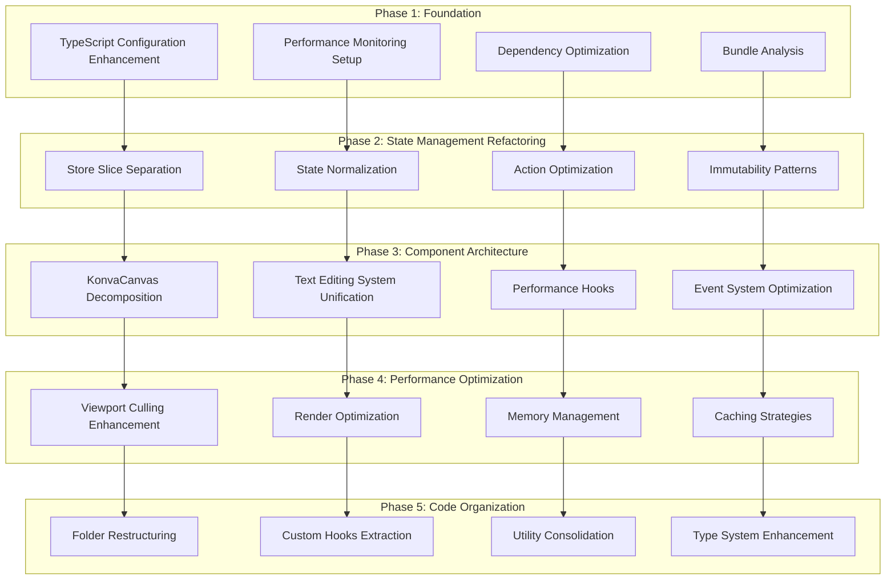
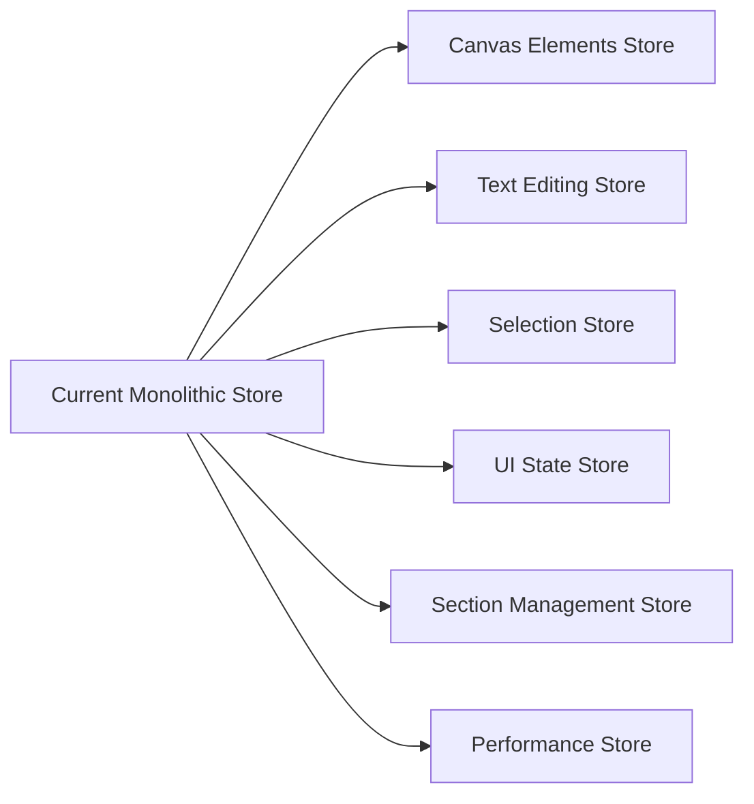
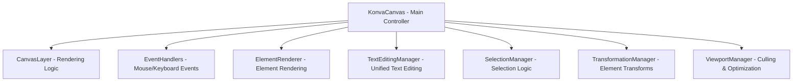
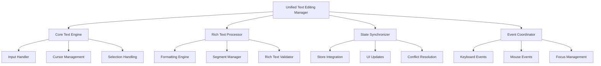
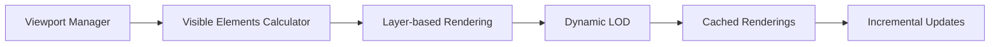
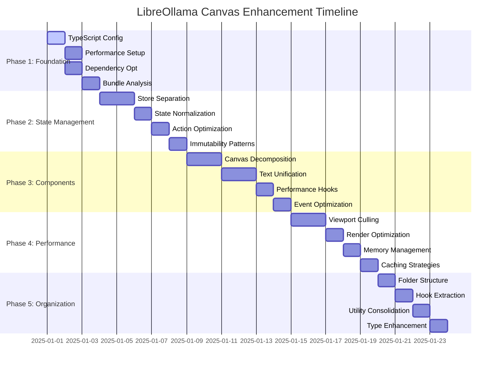

# LibreOllama Canvas Architecture Enhancement Plan

## Executive Summary

The LibreOllama canvas system requires comprehensive architectural improvements to address text editing performance issues and state inconsistencies. This plan provides a systematic approach to refactor the current React 19 + TypeScript + Konva + Zustand architecture, focusing on performance optimization, state management improvements, and modular component design.

## Current Architecture Assessment

### Technical Stack
- **Frontend**: React 19.1.0 + TypeScript (strict mode)
- **Canvas**: Konva 9.3.20 + React-Konva 19.0.5
- **State Management**: Zustand 5.0.5 + Immer 10.1.1
- **Build Tool**: Vite 6.0.3
- **Target**: Tauri desktop application

### Strengths Identified
- ✅ Modern React 19 + TypeScript setup with strict typing
- ✅ Zustand + Immer for predictable state management
- ✅ Well-structured component hierarchy
- ✅ Comprehensive table data model with rich text support
- ✅ Existing performance monitoring hooks (useViewportCulling, useDebounce)

### Critical Issues Found
- ❌ **KonvaCanvas.tsx is monolithic** (1,850 lines) with multiple responsibilities
- ❌ **Multiple text editing systems** causing interference and race conditions:
  - TextEditingOverlay for basic text
  - RichTextCellEditor for table cells
  - UnifiedTextEditor for rich text
  - ContentEditableRichTextEditor for advanced editing
- ❌ **State synchronization problems** between Zustand store and UI components
- ❌ **Performance bottlenecks** from excessive re-renders and unoptimized operations
- ❌ **Complex coordinate system management** for sections and elements
- ❌ **Store size issues** (konvaCanvasStore.ts at 1,842 lines)

## Detailed Enhancement Plan



## Phase 1: Foundational Setup (1-2 days)

**Goal**: Establish performance monitoring and optimize build configuration

### 1.1 TypeScript Configuration Enhancement
- **Target File**: `tsconfig.json`
- **Enhancements**:
  - Enable stricter compiler options for better performance
  - Add performance-focused compiler flags (`incremental: true`, `tsBuildInfoFile`)
  - Optimize module resolution for Konva/React-Konva
  - Configure path mapping for better tree-shaking

### 1.2 Performance Monitoring Setup
- **New Directory**: `src/utils/performance/`
- **Components**:
  ```
  src/utils/performance/
  ├── PerformanceMonitor.ts       # Central performance tracking
  ├── RenderTimeTracker.ts        # Component render time tracking  
  ├── MemoryUsageMonitor.ts       # Memory usage tracking
  ├── CanvasProfiler.ts           # Canvas-specific operation profiling
  └── MetricsCollector.ts         # Performance metrics aggregation
  ```

### 1.3 Dependency Optimization
- **Target Files**: `package.json`, `vite.config.ts`
- **Changes**:
  - Configure bundle splitting for Konva components
  - Optimize tree-shaking for unused Konva features
  - Add performance-focused dev dependencies (React DevTools Profiler)
  - Configure Vite for optimal canvas rendering

### 1.4 Bundle Analysis
- **Tools**: Add bundle analyzer integration
- **Metrics**: Identify largest dependencies and optimization opportunities
- **Goal**: Baseline performance measurements

## Phase 2: State Management Refactoring (3-4 days)

**Goal**: Eliminate state inconsistencies and race conditions

### 2.1 Store Slice Separation
- **Current**: `src/stores/konvaCanvasStore.ts` (1,842 lines) - monolithic store
- **Target**: Multiple focused, composed stores



**New Store Structure**:
```
src/stores/
├── slices/
│   ├── canvasElementsStore.ts    # Element CRUD operations
│   ├── textEditingStore.ts       # Unified text editing state
│   ├── selectionStore.ts         # Selection and interaction state
│   ├── uiStateStore.ts          # UI-specific state (zoom, pan, etc.)
│   ├── sectionStore.ts          # Section management
│   └── performanceStore.ts      # Performance metrics and flags
├── selectors/
│   ├── elementSelectors.ts      # Memoized element selectors
│   ├── textEditingSelectors.ts  # Text editing state selectors
│   └── performanceSelectors.ts  # Performance metric selectors
├── middleware/
│   ├── performanceMiddleware.ts # Performance tracking middleware
│   └── debugMiddleware.ts       # Development debugging
└── index.ts                     # Store composition and exports
```

### 2.2 State Normalization
- **Pattern**: Normalize nested data structures for better performance
- **Benefits**: 
  - Eliminate deep object mutations
  - Improve update performance
  - Reduce unnecessary re-renders
- **Implementation**:
  - Flatten element hierarchies using entity-relationship patterns
  - Create lookup tables for O(1) access
  - Separate derived state from base state

### 2.3 Action Optimization
- **Focus**: Batch operations and reduce state update frequency
- **Implementation**:
  - Debounced actions for high-frequency operations (text input, mouse movement)
  - Batch updates for multiple element changes
  - Optimistic updates for UI responsiveness
  - Action queuing for complex operations

### 2.4 Immutability Patterns
- **Enhancement**: Optimize Immer usage patterns
- **Implementation**:
  - Use shallow updates where possible
  - Implement structural sharing optimization
  - Add memory leak prevention
  - Create performance-focused update utilities

## Phase 3: Component Architecture (4-5 days)

**Goal**: Decompose monolithic components and unify text editing

### 3.1 KonvaCanvas Decomposition
- **Current**: `src/components/canvas/KonvaCanvas.tsx` (1,850 lines)
- **Target**: Modular, focused components



**New Component Structure**:
```
src/components/canvas/
├── core/
│   ├── KonvaCanvas.tsx           # Main orchestrator (< 300 lines)
│   ├── CanvasLayer.tsx           # Layer management and rendering
│   ├── ElementRenderer.tsx       # Element rendering logic
│   └── ViewportManager.tsx       # Viewport culling and optimization
├── editing/
│   ├── TextEditingManager.tsx    # Unified text editing coordinator
│   ├── UnifiedRichTextEditor.tsx # Consolidated rich text editor
│   ├── TextEditingOverlay.tsx    # Optimized overlay component
│   └── TextStateManager.tsx     # Text editing state management
├── interaction/
│   ├── EventHandlers.tsx         # Mouse/keyboard event management
│   ├── SelectionManager.tsx      # Element selection logic
│   ├── TransformationManager.tsx # Transform operations
│   └── DragDropManager.tsx       # Drag and drop coordination
├── performance/
│   ├── MemoizedElements.tsx      # Memoized element components
│   ├── VirtualizedCanvas.tsx     # Virtualization support
│   └── PerformanceMonitor.tsx    # Real-time performance monitoring
└── utils/
    ├── CoordinateUtils.ts        # Coordinate system utilities
    ├── RenderingUtils.ts         # Rendering optimization utilities
    └── CacheUtils.ts             # Caching utilities
```

### 3.2 Text Editing System Unification

**Problem**: Multiple competing text editing systems cause state conflicts and race conditions

**Current Fragmented Systems**:
- `TextEditingOverlay` - Basic text editing
- `RichTextCellEditor` - Table cell editing
- `UnifiedTextEditor` - Rich text editing
- `ContentEditableRichTextEditor` - Advanced editing
- `RichTextCellEditor.new.tsx` - Alternative implementation

**Solution**: Single, unified text editing architecture



**Implementation Plan**:
```
src/components/canvas/editing/
├── UnifiedTextEditingManager.tsx  # Main coordinator
├── core/
│   ├── TextEngine.tsx            # Core text processing
│   ├── InputHandler.tsx          # Input event processing  
│   ├── CursorManager.tsx         # Cursor positioning
│   └── SelectionManager.tsx      # Text selection logic
├── richtext/
│   ├── RichTextProcessor.tsx     # Rich text formatting
│   ├── SegmentManager.tsx        # Text segment management
│   ├── FormattingEngine.tsx      # Apply/remove formatting
│   └── RichTextValidator.tsx     # Validate rich text structure
├── state/
│   ├── TextStateSynchronizer.tsx # State sync with store
│   ├── ConflictResolver.tsx      # Resolve editing conflicts
│   └── UndoRedoManager.tsx       # Text editing history
└── overlay/
    ├── TextEditingOverlay.tsx    # Visual editing overlay
    ├── FormattingToolbar.tsx     # Formatting controls
    └── TextMetricsCalculator.tsx # Text measurement utilities
```

### 3.3 Performance Hooks
**New Custom Hooks**:
```
src/hooks/canvas/
├── useCanvasPerformance.ts      # Performance monitoring and metrics
├── useTextEditingState.ts       # Unified text editing state management
├── useElementMemoization.ts     # Element caching and memoization
├── useViewportCulling.ts        # Enhanced viewport-based rendering
├── useDebounced.ts              # Debounced operations with cleanup
├── useCanvasEvents.ts           # Optimized event handling
├── useElementSelection.ts       # Element selection state
└── useCoordinateTransform.ts    # Coordinate system transformations
```

### 3.4 Event System Optimization
- **Debouncing**: High-frequency events (mouse move, text input, resize)
- **Event Delegation**: Reduce event listener overhead
- **Proper Cleanup**: Async operation cancellation and memory leak prevention
- **Event Pooling**: Reuse event objects for performance

## Phase 4: Performance Optimization (3-4 days)

**Goal**: Eliminate rendering bottlenecks and memory leaks

### 4.1 Enhanced Multi-Layer Viewport Culling



**Implementation**:
- Calculate visible elements based on viewport bounds and zoom level
- Implement Level-of-Detail (LOD) rendering for complex elements
- Cache rendered elements outside viewport
- Progressive loading for complex elements (tables, rich text)
- Spatial indexing for efficient collision detection

### 4.2 Render Optimization
- **React.memo**: Strategic component memoization
- **useMemo/useCallback**: Cache expensive calculations and event handlers
- **Shallow comparison**: Optimized prop comparison strategies
- **Batch updates**: Group related state changes
- **Frame-based rendering**: Spread expensive operations across frames

### 4.3 Memory Management
- **Event Cleanup**: Proper event listener and timer cleanup
- **Object Pooling**: Reuse objects for frequent operations
- **Weak References**: Prevent memory leaks in caches
- **Garbage Collection**: Optimize allocation patterns
- **Memory Profiling**: Continuous memory usage monitoring

### 4.4 Caching Strategies
```
src/utils/cache/
├── ElementCache.ts              # Element rendering cache with LRU
├── TextMeasurementCache.ts      # Text metrics cache
├── GeometryCache.ts             # Shape calculation cache
├── ImageCache.ts                # Image loading and processing cache
├── CoordinateCache.ts           # Coordinate transformation cache
└── CacheManager.ts              # Centralized cache management
```

**Cache Features**:
- LRU (Least Recently Used) eviction policies
- Memory-aware cache sizing
- Cache invalidation strategies
- Performance metrics for cache effectiveness

## Phase 5: Code Organization (2-3 days)

**Goal**: Improve maintainability and developer experience

### 5.1 Folder Restructuring
```
src/
├── components/canvas/
│   ├── core/                        # Core canvas functionality
│   │   ├── KonvaCanvas.tsx
│   │   ├── CanvasLayer.tsx
│   │   ├── ElementRenderer.tsx
│   │   └── ViewportManager.tsx
│   ├── elements/                    # Element-specific components
│   │   ├── shapes/
│   │   ├── text/
│   │   ├── tables/
│   │   └── images/
│   ├── editing/                     # Text editing system
│   │   ├── UnifiedTextEditingManager.tsx
│   │   ├── core/
│   │   ├── richtext/
│   │   ├── state/
│   │   └── overlay/
│   ├── interaction/                 # User interaction
│   │   ├── EventHandlers.tsx
│   │   ├── SelectionManager.tsx
│   │   ├── TransformationManager.tsx
│   │   └── DragDropManager.tsx
│   ├── performance/                 # Performance optimizations
│   │   ├── MemoizedElements.tsx
│   │   ├── VirtualizedCanvas.tsx
│   │   └── PerformanceMonitor.tsx
│   └── utils/                       # Canvas utilities
│       ├── CoordinateUtils.ts
│       ├── RenderingUtils.ts
│       └── CacheUtils.ts
├── stores/
│   ├── slices/                      # Individual store slices
│   ├── selectors/                   # Memoized selectors
│   ├── middleware/                  # Store middleware
│   └── types.ts                     # Store type definitions
├── hooks/
│   ├── canvas/                      # Canvas-specific hooks
│   ├── performance/                 # Performance optimization hooks
│   ├── text-editing/                # Text editing hooks
│   └── common/                      # Shared hooks
├── utils/
│   ├── cache/                       # Caching utilities
│   ├── performance/                 # Performance monitoring
│   ├── math/                        # Mathematical utilities
│   └── validation/                  # Data validation utilities
└── types/
    ├── canvas.ts                    # Canvas-specific types
    ├── text-editing.ts              # Text editing types
    ├── performance.ts               # Performance monitoring types
    └── store.ts                     # Store-related types
```

### 5.2 Custom Hooks Extraction
- Extract reusable logic from large components
- Create performance-focused hooks with proper memoization
- Implement proper dependency management and cleanup
- Add comprehensive TypeScript types for all hooks

### 5.3 Utility Consolidation
- Consolidate scattered utility functions into focused modules
- Create performance-optimized utility functions
- Implement proper tree-shaking support
- Add comprehensive unit tests for utilities

### 5.4 Type System Enhancement
- Improve type safety for canvas operations
- Create performance-focused type definitions
- Implement runtime type checking for development builds
- Add comprehensive JSDoc documentation for all public APIs

## Risk Mitigation & Implementation Strategy

### Risk Assessment
1. **Breaking Changes**: Extensive refactoring may introduce regressions
   - **Mitigation**: Incremental rollout with feature flags
2. **Performance Degradation**: Incorrect optimization may worsen performance
   - **Mitigation**: Comprehensive benchmarking before/after each phase
3. **State Corruption**: Store changes may cause data loss
   - **Mitigation**: Maintain backwards compatibility during transition
4. **Integration Issues**: New architecture may not integrate well
   - **Mitigation**: Gradual migration with parallel systems during transition

### Implementation Strategy
1. **Feature Flags**: All new components behind configurable flags
2. **A/B Testing**: Compare old vs new implementations
3. **Rollback Plan**: Quick rollback mechanism for each phase
4. **Comprehensive Testing**: Unit, integration, and performance tests
5. **Performance Benchmarks**: Continuous performance monitoring

### Success Metrics
- **Text Input Latency**: < 16ms (60 FPS target)
- **Memory Usage**: < 50% of current baseline
- **Render Time**: < 8ms per frame for smooth animations
- **State Update Frequency**: 90% reduction in unnecessary updates
- **Bundle Size**: < 10% increase despite enhanced functionality
- **Developer Experience**: 50% reduction in time-to-fix for text editing bugs

## Implementation Timeline



**Total Estimated Time**: 15-18 development days

## Dependencies Between Tasks

### Critical Path Dependencies
1. **Foundation → State Management**: Performance monitoring must be in place before measuring store optimizations
2. **State Management → Components**: Store structure must be stable before component refactoring
3. **Components → Performance**: Component architecture must be modular before optimization
4. **Performance → Organization**: Optimizations must be proven before final organization

### Parallel Execution Opportunities
- TypeScript configuration can be done in parallel with performance setup
- Some component decomposition can happen while state management is being refactored
- Code organization can begin while performance optimizations are being implemented

## Conclusion

This comprehensive enhancement plan addresses all identified text editing performance issues and state inconsistencies while maintaining a systematic, low-risk approach. Each phase builds upon the previous one, ensuring stability and measurable progress toward a more performant, maintainable canvas system.

The plan prioritizes the most critical issues (text editing unification and state management) while establishing the foundation for long-term architectural improvements. The modular approach allows for incremental delivery and reduces the risk of introducing regressions.

Success will be measured through concrete performance metrics, improved developer experience, and elimination of the current text editing conflicts that impact user experience.