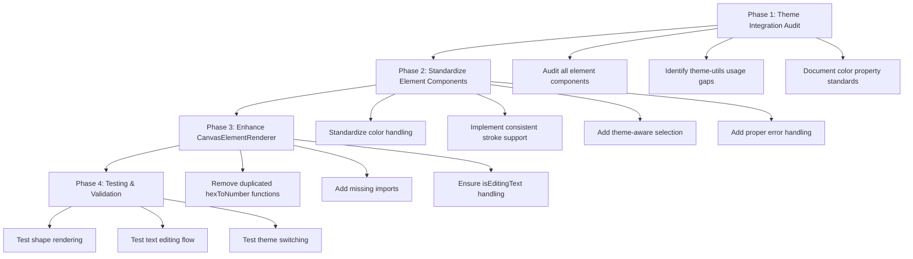

# Canvas Rendering Issues - Comprehensive Implementation Plan

## Executive Summary

This document provides a detailed implementation plan to fix critical canvas rendering issues in the React + PixiJS application. After thorough analysis, the primary issues are inconsistent theme integration, missing stroke/border support, hard-coded selection colors, and duplicated utility functions across element components.

## Problem Analysis

### Root Cause Issues Identified

1. **Inconsistent Theme Integration**: Components like [`Triangle.tsx`](src/components/canvas/elements/Triangle.tsx:13-17) and [`Star.tsx`](src/components/canvas/elements/Star.tsx:13-17) have their own basic `hexToNumber` functions instead of using the robust [`theme-utils.ts`](src/lib/theme-utils.ts) system.

2. **Missing Stroke/Border Support**: Several components only implement fill colors but ignore `strokeColor`, `strokeWidth`, and `backgroundColor` properties.

3. **Hard-coded Selection Colors**: Components use hard-coded selection colors (`0x007acc`) instead of theme-aware selection colors from `getThemeColors().selectionBlue`.

4. **Inconsistent Color Property Usage**: Confusion about which property serves what purpose (`element.color` vs `element.backgroundColor` vs `element.strokeColor`).

5. **Missing Default Color System**: Components fall back to random hard-coded colors instead of using the theme-aware default system via `getDefaultElementColors()`.

### Component Status Analysis

**✅ Well-implemented Components:**
- [`Rectangle.tsx`](src/components/canvas/elements/Rectangle.tsx) - Uses theme-utils correctly, proper stroke support
- [`Circle.tsx`](src/components/canvas/elements/Circle.tsx) - Good theme integration, consistent patterns
- [`StickyNote.tsx`](src/components/canvas/elements/StickyNote.tsx) - Proper conditional rendering, theme-aware
- [`TextElement.tsx`](src/components/canvas/elements/TextElement.tsx) - Correct editing state handling

**❌ Needs Fixing:**
- [`Triangle.tsx`](src/components/canvas/elements/Triangle.tsx) - Basic hexToNumber, hard-coded colors
- [`Star.tsx`](src/components/canvas/elements/Star.tsx) - Same issues as Triangle
- [`Arrow.tsx`](src/components/canvas/elements/Arrow.tsx) - Inconsistent theme usage
- [`Line.tsx`](src/components/canvas/elements/Line.tsx) - Missing stroke standardization
- [`Hexagon.tsx`](src/components/canvas/elements/Hexagon.tsx) - Needs full standardization
- [`DrawingElement.tsx`](src/components/canvas/elements/DrawingElement.tsx) - Path rendering needs theme support

## Implementation Roadmap



## Color Property Standards

Establish clear conventions for consistent color handling:

| Property | Purpose | Usage |
|----------|---------|--------|
| `element.backgroundColor` | Shape fill color | Primary fill for shapes, can be 'transparent' |
| `element.color` | Text color (for text elements) OR stroke color (for shapes without backgroundColor) | Context-dependent usage |
| `element.strokeColor` | Explicit stroke/border color | Always used for borders when specified |
| `element.strokeWidth` | Border thickness | Numeric value, defaults to 2 |

## Phase 1: Theme Integration Audit

### Objective
Identify and document all inconsistencies in theme system usage across element components.

### Tasks
1. **Audit Component Imports**
   - Verify all components import from `../../../lib/theme-utils`
   - Check for duplicate utility functions
   - Document missing imports

2. **Color Handling Analysis**
   - Map how each component handles colors
   - Identify hard-coded values
   - Document theme-utils usage patterns

3. **Selection System Review**
   - Check selection color consistency
   - Verify theme-aware selection indicators
   - Document selection bounds calculations

### Deliverable
Complete audit report with specific fixes needed per component.

## Phase 2: Standardize Element Components

### Objective
Update all problematic components to use consistent patterns and theme integration.

### 2.1 Component Template Pattern

All shape components should follow this standardized approach:

```typescript
import React, { useCallback } from 'react';
import { Graphics } from '@pixi/react';
import { CanvasElement } from '../../../stores/canvasStore';
import { hexStringToNumber, getThemeColors, getDefaultElementColors } from '../../../lib/theme-utils';

interface ComponentProps {
  element: CanvasElement;
  isSelected?: boolean;
  onMouseDown?: (e: any, elementId: string) => void;
}

const Component: React.FC<ComponentProps> = ({ element, isSelected, onMouseDown }) => {
  const draw = useCallback((g: any) => {
    g.clear();
    
    const themeColors = getThemeColors();
    const defaultColors = getDefaultElementColors('component-type');
    
    // Validate dimensions with safety checks
    const width = Math.max(element.width || 100, 1);
    const height = Math.max(element.height || 100, 1);
    
    // Handle colors consistently using theme-utils
    const fillColor = element.backgroundColor && element.backgroundColor !== 'transparent'
      ? hexStringToNumber(element.backgroundColor)
      : defaultColors.fill;
    
    const strokeColor = element.strokeColor 
      ? hexStringToNumber(element.strokeColor)
      : element.color 
        ? hexStringToNumber(element.color)
        : defaultColors.stroke;
        
    const strokeWidth = element.strokeWidth || 2;
    
    // Always set line style to ensure shape is visible
    g.lineStyle(strokeWidth, strokeColor);
    
    // Only add fill if not transparent
    if (element.backgroundColor !== 'transparent') {
      g.beginFill(fillColor);
    }
    
    // Draw shape-specific logic here
    // [Shape drawing commands using validated dimensions]
    
    if (element.backgroundColor !== 'transparent') {
      g.endFill();
    }
    
    // Theme-aware selection indicator
    if (isSelected) {
      g.lineStyle(2, themeColors.selectionBlue, 1);
      // Draw selection outline with proper bounds
    }
  }, [element.width, element.height, element.backgroundColor, element.strokeColor, element.strokeWidth, element.color, isSelected]);

  const handlePointerDown = useCallback((e: any) => {
    if (onMouseDown) {
      onMouseDown(e, element.id);
    }
  }, [onMouseDown, element.id]);

  return (
    <Graphics
      x={element.x}
      y={element.y}
      draw={draw}
      interactive={true}
      pointerdown={handlePointerDown}
      cursor="pointer"
    />
  );
};

export default Component;
```

### 2.2 Priority Component Updates

#### **HIGH PRIORITY - Immediate Impact**

**1. Triangle.tsx**
- **Issues**: Basic `hexToNumber` function, hard-coded fill color `#8b5cf6`, hard-coded selection color `0x007acc`
- **Fixes Needed**:
  - Replace local `hexToNumber` with `hexStringToNumber` from theme-utils
  - Add imports for `getThemeColors` and `getDefaultElementColors`
  - Implement backgroundColor/strokeColor/strokeWidth support
  - Use theme-aware selection color
  - Add dimension validation

**2. Star.tsx**
- **Issues**: Same as Triangle - basic hex conversion, hard-coded colors
- **Fixes Needed**:
  - Replace local `hexToNumber` with theme-utils functions
  - Update color handling to support all color properties
  - Implement proper stroke support
  - Fix selection indicator to use theme colors
  - Add proper dimension validation

#### **MEDIUM PRIORITY - Quality Improvements**

**3. Arrow.tsx, Line.tsx, Hexagon.tsx**
- **Expected Issues**: Likely similar theme integration problems
- **Standard Fixes**: Apply the component template pattern

**4. DrawingElement.tsx**
- **Special Considerations**: Path rendering requires careful color handling for stroke paths

### 2.3 Implementation Steps Per Component

For each component that needs updating:

1. **Update Imports**
   ```typescript
   // Remove any local hexToNumber functions
   // Add these imports:
   import { hexStringToNumber, getThemeColors, getDefaultElementColors } from '../../../lib/theme-utils';
   ```

2. **Update Color Handling**
   ```typescript
   // Replace hard-coded colors with:
   const themeColors = getThemeColors();
   const defaultColors = getDefaultElementColors('component-type');
   
   const fillColor = element.backgroundColor && element.backgroundColor !== 'transparent'
     ? hexStringToNumber(element.backgroundColor)
     : defaultColors.fill;
   
   const strokeColor = element.strokeColor 
     ? hexStringToNumber(element.strokeColor)
     : element.color 
       ? hexStringToNumber(element.color)
       : defaultColors.stroke;
   ```

3. **Update Selection Indicators**
   ```typescript
   // Replace hard-coded selection colors with:
   if (isSelected) {
     g.lineStyle(2, themeColors.selectionBlue, 1);
     // Draw selection outline
   }
   ```

4. **Add Dimension Validation**
   ```typescript
   const width = Math.max(element.width || 100, 1);
   const height = Math.max(element.height || 100, 1);
   ```

## Phase 3: Enhance CanvasElementRenderer

### Objective
Ensure the dispatcher handles all cases properly and integrates with the updated components.

### 3.1 Current Issues
- Missing import for `useCanvasStore` (needed for `isEditingText` check)
- Ensure proper conditional rendering during text editing
- Verify all element types are properly routed to components

### 3.2 Required Updates

**Update Imports**
```typescript
import { CanvasElement, useCanvasStore } from '../../stores/canvasStore';
```

**Add Text Editing State Handling**
```typescript
const CanvasElementRenderer: React.FC<CanvasElementRendererProps> = ({
  element,
  isSelected = false,
  onMouseDown,
  onDoubleClick
}) => {
  // Early validation
  if (!element || !validateCanvasElement(element)) {
    console.warn('CanvasElementRenderer: Invalid element', element);
    return <Graphics />;
  }
  
  // Check for editing state - critical for text elements
  const isEditingText = useCanvasStore((state) => state.isEditingText);
  
  // Hide element during editing for text-based elements
  if (isEditingText === element.id && (element.type === 'text' || element.type === 'sticky-note')) {
    return null;
  }
  
  // Rest of component dispatch logic...
};
```

### 3.3 Error Handling Improvements

Add comprehensive error boundaries:
```typescript
try {
  switch (element.type) {
    // ... cases
    default:
      console.warn(`CanvasElementRenderer: Unknown element type "${element.type}" for element ID "${element.id}". Rendering placeholder.`);
      return <Graphics />;
  }
} catch (error) {
  console.error(`CanvasElementRenderer: Error rendering element "${element.id}" of type "${element.type}":`, error);
  return <Graphics x={element.x} y={element.y} />;
}
```

## Phase 4: Testing & Validation

### Objective
Comprehensive testing to ensure all rendering issues are resolved.

### 4.1 Test Scenarios

**Shape Creation Testing**
- [ ] Create Rectangle - verify theme colors, stroke support
- [ ] Create Circle - verify fill and stroke rendering
- [ ] Create Triangle - verify updated theme integration
- [ ] Create Star - verify updated color handling
- [ ] Create other shapes - verify consistent behavior

**Color Handling Testing**
- [ ] Test with custom backgroundColor
- [ ] Test with transparent backgrounds
- [ ] Test with custom strokeColor and strokeWidth
- [ ] Test theme switching (light/dark mode)
- [ ] Test with invalid color values (error handling)

**Text Editing Flow Testing**
- [ ] Double-click text element → editing mode activates
- [ ] Text element disappears during editing
- [ ] Type content and blur → text reappears with content
- [ ] Double-click sticky note → same behavior

**Selection System Testing**
- [ ] Click shape → blue selection outline appears
- [ ] Selection color matches theme
- [ ] Multiple selection works properly
- [ ] Selection bounds are accurate

**Error Handling Testing**
- [ ] Invalid elements don't crash the canvas
- [ ] Missing properties have sensible defaults
- [ ] Console warnings for invalid data
- [ ] Graceful degradation for unknown element types

### 4.2 Performance Validation

**Component Optimization**
- [ ] Verify `React.memo` usage on all components
- [ ] Check `useCallback` dependencies are correct
- [ ] Test with large numbers of elements (50+ shapes)
- [ ] Monitor for unnecessary re-renders

**Memory Management**
- [ ] No memory leaks during element creation/deletion
- [ ] PixiJS Graphics objects properly cleaned up
- [ ] Event listeners properly removed

### 4.3 Regression Testing

**Existing Functionality**
- [ ] Well-implemented components (Rectangle, Circle, StickyNote, TextElement) still work correctly
- [ ] No performance degradation
- [ ] All existing interactions preserved

## Implementation Priority Order

### Sprint 1 (High Impact, Quick Wins)
1. **Triangle.tsx** - Most obvious rendering issues, simple fix
2. **Star.tsx** - Same pattern as Triangle
3. **CanvasElementRenderer.tsx** - Add missing imports and error handling

### Sprint 2 (Quality Improvements)
4. **Arrow.tsx, Line.tsx** - Stroke-focused components
5. **Hexagon.tsx** - Standard shape pattern
6. **DrawingElement.tsx** - More complex path rendering

### Sprint 3 (Polish & Validation)
7. Comprehensive testing suite
8. Performance optimization
9. Documentation updates

## Code Quality Standards

### Required Patterns
- All components MUST use `hexStringToNumber` from theme-utils
- All components MUST support `backgroundColor`, `strokeColor`, `strokeWidth`
- All components MUST use theme-aware default colors via `getDefaultElementColors`
- All components MUST handle transparent backgrounds properly
- All components MUST use `themeColors.selectionBlue` for selection

### Performance Requirements
- Components MUST be wrapped in `React.memo`
- Draw callbacks MUST use `useCallback` with proper dependencies
- Dimension validation MUST use `Math.max()` for minimum values

### Error Handling Requirements
- Invalid color values MUST fallback to theme defaults
- Missing dimensions MUST use sensible defaults
- Invalid elements MUST render placeholder Graphics without crashing

## Success Criteria

### Primary Goals
- [ ] All shapes render consistently with proper colors
- [ ] Text elements show/hide correctly during editing
- [ ] Selection indicators use theme-aware colors
- [ ] No hard-coded colors remain in any component
- [ ] All components use centralized theme-utils functions

### Secondary Goals
- [ ] Improved performance with large element counts
- [ ] Comprehensive error handling prevents crashes
- [ ] Clean, maintainable component architecture
- [ ] Easy to add new shape types in the future

## Conclusion

This implementation plan addresses all identified rendering issues through systematic standardization of theme integration, color handling, and component architecture. The phased approach ensures minimal disruption while delivering immediate improvements to the most problematic components first.

The standardized component template provides a sustainable foundation for future development, making it easy to add new shape types while maintaining consistency and theme integration across the entire canvas rendering system.