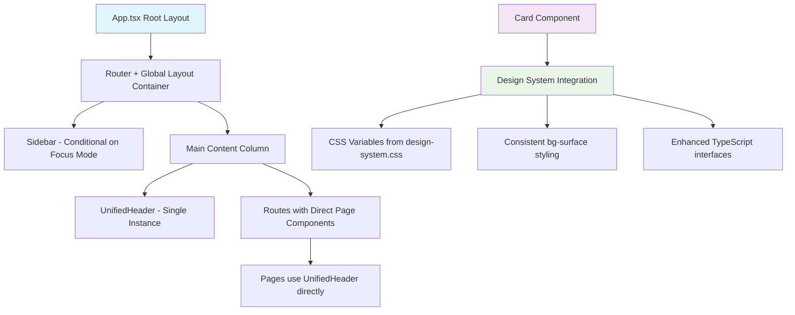

# The Definitive Architectural Fix Plan

## Executive Summary

This document outlines the complete architectural solution for resolving UI inconsistencies in the LibreOllama application, specifically addressing duplicate navigation bars, jumbled sidebar layouts, and inconsistent Card component styling.

## Current Problems Identified

### 1. Layout Duplication Issues
- **Double Main Elements**: [`App.tsx`](src/App.tsx:42) creates a `<main>` wrapper AND [`PageLayout.tsx`](src/components/ui/PageLayout.tsx:40) creates another `<main>` wrapper
- **Nested Layout Conflicts**: This causes improper semantic HTML and layout rendering issues

### 2. Design System Inconsistencies  
- **Generic Styling**: [`Card.tsx`](src/components/ui/Card.tsx:17) uses generic `bg-white dark:bg-gray-800` classes
- **Design Token Disconnect**: Component doesn't leverage design system tokens from [`design-tokens.ts`](src/lib/design-tokens.ts:5) and [`design-system.css`](src/styles/design-system.css:16)

### 3. Component Architecture Issues
- **PageTitle Context Risk**: [`App.tsx`](src/App.tsx:17-21) has `PageTitle` component that could fail outside Router context
- **Focus Mode Integration**: Inconsistent application of `useFocusMode` hook

## Architecture Overview



## Part 1: The Definitive Architectural Fix

### Solution 1: Finalized `App.tsx` for Correct Layout

**Objective**: Establish single layout authority, eliminate duplicate main elements, ensure proper Router context.

**Key Changes**:
- Remove [`PageLayout.tsx`](src/components/ui/PageLayout.tsx:1) dependency
- Move `PageTitle` component inside Router context
- Implement single `<main>` element with proper routing
- Integrate `useFocusMode` hook correctly

### Solution 2: Production-Ready `Card` Component

**Objective**: Create consistent, design-system-compliant Card component for all panels and containers.

**Key Features**:
- Design system token usage (`var(--bg-surface)`, `var(--border-subtle)`)
- Flexible TypeScript interface with `as` prop support
- Customizable padding and styling options
- Hover states and accessibility considerations

## Implementation Templates

### 1. Complete `App.tsx` Replacement

```tsx
// src/App.tsx

import React, { useState } from 'react';
import { BrowserRouter as Router, Routes, Route, useLocation } from 'react-router-dom';

// Core Layout & UI Components
import Sidebar from './components/navigation/Sidebar';
import { UnifiedHeader } from './components/ui/UnifiedHeader';

// Page Components
import Dashboard from './pages/Dashboard';
import Chat from './pages/Chat';
import Projects from './pages/Projects';
import Notes from './pages/Notes';
import Canvas from './pages/Canvas';
import Calendar from './pages/Calendar';
import Tasks from './pages/Tasks';
import Agents from './pages/Agents';
import Settings from './pages/Settings';

// Hooks
import { useFocusMode } from './hooks/useFocusMode';

/**
 * A helper component that dynamically determines the page title based on the current route.
 * This ensures the title is always rendered within the Router's context.
 */
const PageTitle = () => {
  const location = useLocation();
  // Cleans up the path and capitalizes it for display
  const path = location.pathname.replace('/', '') || 'dashboard';
  const formattedPath = path.charAt(0).toUpperCase() + path.slice(1);
  return <>{formattedPath}</>;
};

/**
 * The root component of the application.
 * Establishes the main layout: a flex container holding the sidebar and the main content view.
 * This structure is the single source of truth for the application's global layout.
 */
export default function App() {
  const [isSidebarOpen, setSidebarOpen] = useState(true);
  const { isFocusMode } = useFocusMode(); // Hook for managing focus mode state

  return (
    <Router>
      <div className={`flex h-screen bg-bg-primary text-text-primary font-sans ${isFocusMode ? 'focus-mode-active' : ''}`}>
        
        {/* SIBLING 1: The persistent sidebar. It is a direct child of the main flex container. */}
        {!isFocusMode && <Sidebar isOpen={isSidebarOpen} toggleSidebar={() => setSidebarOpen(!isSidebarOpen)} />}

        {/* SIBLING 2: The main content column. It is a flex column that takes all remaining space. */}
        <div className="flex flex-1 flex-col overflow-hidden">
          
          {/* The application header, rendered once at the top of the main content column. */}
          <UnifiedHeader title={<PageTitle />} />
          
          {/* The main content area where pages are rendered. It handles its own scrolling. */}
          <main className="flex-1 overflow-y-auto p-6 bg-background">
            <Routes>
              <Route path="/" element={<Dashboard />} />
              <Route path="/chat" element={<Chat />} />
              <Route path="/projects" element={<Projects />} />
              <Route path="/notes" element={<Notes />} />
              <Route path="/canvas" element={<Canvas />} />
              <Route path="/calendar" element={<Calendar />} />
              <Route path="/tasks" element={<Tasks />} />
              <Route path="/agents" element={<Agents />} />
              <Route path="/settings" element={<Settings />} />
            </Routes>
          </main>
        </div>
      </div>
    </Router>
  );
}
```

### 2. Enhanced `Card.tsx` Component

```tsx
// src/components/ui/Card.tsx

import React from 'react';

/**
 * Props for the Card component.
 * - `className`: Allows for additional custom styling.
 * - `as`: Allows the card to be rendered as a different HTML element (e.g., 'li', 'article'). Defaults to 'div'.
 * - `padding`: Controls the internal padding of the card. Defaults to 'default'.
 */
interface CardProps {
  children: React.ReactNode;
  className?: string;
  as?: React.ElementType;
  padding?: 'default' | 'none';
}

/**
 * A flexible, reusable Card component that enforces design system standards.
 * This should be used for all widgets, panels, and content containers.
 */
export const Card: React.FC<CardProps> = ({ children, className = '', as: Component = 'div', padding = 'default' }) => {
  
  // Determine padding class based on props
  const paddingClass = padding === 'default' ? 'p-4 sm:p-5' : '';

  // Base classes define the standard card appearance using Tailwind utilities
  // which are mapped to your CSS variables.
  const baseClasses = `
    bg-surface border border-border-subtle rounded-lg shadow-sm 
    transition-shadow duration-200 ease-in-out hover:shadow-md hover:border-border-default
  `;
  
  return (
    <Component className={`${baseClasses} ${paddingClass} ${className}`}>
      {children}
    </Component>
  );
};
```

## Integration Points

### Design System Variables
The solution leverages existing CSS variables from [`design-system.css`](src/styles/design-system.css):

```css
/* Light Theme */
--bg-surface: #ffffff;
--border-subtle: rgba(0, 0, 0, 0.05);
--border-default: rgba(0, 0, 0, 0.1);

/* Dark Theme */
--bg-surface: #2a3441;
--border-subtle: rgba(148, 163, 184, 0.1);
--border-default: rgba(148, 163, 184, 0.2);
```

### Component Dependencies
- [`UnifiedHeader`](src/components/ui/UnifiedHeader.tsx:1) - Remains unchanged, already uses design system
- [`Sidebar`](src/components/navigation/Sidebar.tsx:1) - No changes required
- [`useFocusMode`](src/hooks/useFocusMode.ts:1) - Proper integration in App.tsx

## Implementation Strategy

### Phase 1: Core Layout Fix
1. **Replace `App.tsx`** with the provided template
2. **Update page imports** to remove `PageLayout` dependencies
3. **Test routing and navigation** to ensure no regressions

### Phase 2: Card Component Migration
1. **Deploy new `Card.tsx`** component
2. **Update `Dashboard.tsx`** to use new Card component
3. **Systematically migrate** other pages (Tasks, Agents, Projects, etc.)
4. **Verify design consistency** across all Card usage

### Phase 3: Validation
1. **Test focus mode** functionality
2. **Verify responsive behavior** on different screen sizes
3. **Validate design system compliance** across all components

## Expected Outcomes

### Immediate Benefits
- ✅ **Eliminates duplicate navigation bars**
- ✅ **Resolves jumbled sidebar layout issues**
- ✅ **Provides consistent Card component styling**
- ✅ **Establishes single layout authority**

### Long-term Benefits
- 🚀 **Simplified maintenance** with consolidated layout logic
- 🎨 **Design system compliance** across all components
- 📱 **Better responsive behavior** with proper flex structure
- 🔧 **Enhanced developer experience** with clear component interfaces

## Risk Mitigation

### Potential Issues
1. **Import Path Updates**: Pages may need import path adjustments after removing PageLayout
2. **Style Specificity**: Some components may require CSS class order adjustments
3. **Focus Mode Testing**: Ensure focus mode behavior remains consistent

### Mitigation Strategies
1. **Gradual Migration**: Implement App.tsx first, then migrate Card usage incrementally
2. **Component Testing**: Test each page individually after Card migration
3. **Design Review**: Validate visual consistency across all migrated components

---

**This architectural plan provides the foundational fixes needed to resolve the core UI inconsistencies and establish a scalable, maintainable component architecture.**