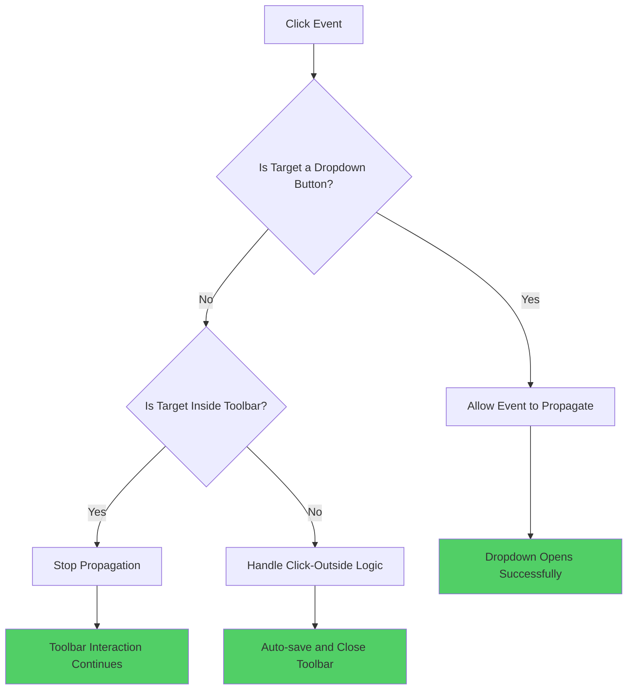
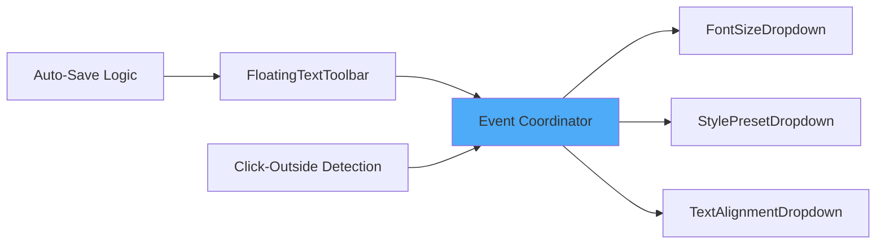

# FloatingTextToolbar Dropdown Fix - Complete Analysis & Implementation Plan

## Executive Summary

The FloatingTextToolbar dropdowns (FontSizeDropdown, StylePresetDropdown, and TextAlignmentDropdown) are currently non-functional due to event propagation conflicts. This document provides a comprehensive root cause analysis and detailed implementation plan to restore dropdown functionality while maintaining existing toolbar behavior.

## Root Cause Analysis

### Primary Issue: Event Propagation Conflict

**Location**: [`src/components/canvas/FloatingTextToolbar.tsx:158`](src/components/canvas/FloatingTextToolbar.tsx:158)

```tsx
<div ref={toolbarRef} style={pillStyle} onClick={(e) => e.stopPropagation()}>
```

**Problem Description**:
- The toolbar container uses blanket `e.stopPropagation()` on all click events
- This prevents dropdown button click events from reaching their handlers
- Result: Dropdown buttons appear unresponsive to user clicks

### Event Flow Analysis

```mermaid
graph TD
    A[User Clicks Dropdown Button] --> B[Event Reaches Toolbar Container]
    B --> C[e.stopPropagation() Called]
    C --> D[Event Stopped - Never Reaches Button]
    D --> E[Dropdown Button onClick Never Fires]
    E --> F[Dropdown Remains Closed]
    
    style C fill:#ff6b6b
    style D fill:#ff6b6b
    style E fill:#ff6b6b
    style F fill:#ff6b6b
```

### Secondary Issues Identified

1. **Redundant Click-Outside Detection**: Each dropdown has individual click-outside handlers that may conflict
2. **Event Handler Timing**: 100ms delay in toolbar event listener registration creates timing issues
3. **Z-Index Management**: Multiple dropdowns lack coordination for proper layering

## Solution Architecture

### Core Strategy: Selective Event Propagation

Replace blanket `stopPropagation()` with intelligent event handling that:
- Allows dropdown interactions to function normally
- Maintains toolbar click-outside detection
- Preserves auto-save functionality



### Component Integration Architecture



## Implementation Plan

### Phase 1: Critical Event Propagation Fix

**Priority**: CRITICAL - Restores basic dropdown functionality

#### 1.1 Modify Toolbar Event Handling

**File**: [`src/components/canvas/FloatingTextToolbar.tsx`](src/components/canvas/FloatingTextToolbar.tsx)

**Current Code** (Line 158):
```tsx
<div ref={toolbarRef} style={pillStyle} onClick={(e) => e.stopPropagation()}>
```

**New Implementation**:
```tsx
<div 
  ref={toolbarRef} 
  style={pillStyle} 
  onClick={(e) => {
    const target = e.target as HTMLElement;
    const isDropdownButton = target.closest('[data-dropdown-button]');
    const isInteractiveElement = target.closest('button, input, select');
    
    // Only stop propagation for non-interactive elements
    if (!isDropdownButton && !isInteractiveElement) {
      e.stopPropagation();
    }
  }}
>
```

#### 1.2 Add Data Attributes to Dropdown Components

**File**: [`src/components/canvas/ToolbarComponents.tsx`](src/components/canvas/ToolbarComponents.tsx)

Add `data-dropdown-button` attribute to each dropdown trigger button:

**FontSizeDropdown** (Line ~302):
```tsx
<button
  data-dropdown-button
  onClick={() => setIsOpen(!isOpen)}
  // ... existing props
>
```

**StylePresetDropdown** (Line ~473):
```tsx
<button
  data-dropdown-button
  onClick={() => setIsOpen(!isOpen)}
  // ... existing props
>
```

**TextAlignmentDropdown** (Line ~639):
```tsx
<button
  data-dropdown-button
  onClick={() => setIsOpen(!isOpen)}
  // ... existing props
>
```

#### 1.3 Add Container Data Attributes

Add `data-dropdown-container` to each dropdown root element for improved click-outside detection:

```tsx
<div ref={dropdownRef} data-dropdown-container style={{ position: 'relative', display: 'inline-block' }}>
```

### Phase 2: Optimize Click-Outside Detection

**Priority**: HIGH - Improves reliability and performance

#### 2.1 Enhanced Click-Outside Logic

**File**: [`src/components/canvas/FloatingTextToolbar.tsx`](src/components/canvas/FloatingTextToolbar.tsx)

**Current Code** (Lines 60-94):
```tsx
const handleClickOutside = (event: MouseEvent) => {
  const target = event.target as Element;
  
  if (!toolbarRef.current?.contains(target)) {
    const isClickOnDropdown = target.closest('[data-dropdown-content]') !== null;
    const isClickOnTextElement = target.closest(`[id="${element.id}"]`) !== null;
    const isClickOnStage = target.closest('.konva-canvas-container') !== null;
    
    if (!isClickOnTextElement && !isClickOnDropdown && (isClickOnStage || !target.closest('.konva-canvas-container'))) {
      onDone();
    }
  }
};
```

**Enhanced Implementation**:
```tsx
const handleClickOutside = (event: MouseEvent) => {
  const target = event.target as Element;
  
  // Check if click is inside any dropdown (including content and buttons)
  const isClickInDropdown = target.closest('[data-dropdown-container]') !== null;
  
  // Check if click is inside toolbar
  const isClickInToolbar = toolbarRef.current?.contains(target);
  
  // Check if click is on the text element being edited
  const isClickOnTextElement = target.closest(`[id="${element.id}"]`) !== null;
  
  // Check if click is on the stage/canvas
  const isClickOnStage = target.closest('.konva-canvas-container') !== null;
  
  // Only close if clicking completely outside toolbar, dropdowns, and text element
  if (!isClickInToolbar && !isClickInDropdown && !isClickOnTextElement && 
      (isClickOnStage || !target.closest('.konva-canvas-container'))) {
    console.log('🔍 [TOOLBAR DEBUG] Click outside detected - auto-saving');
    onDone();
  }
};
```

#### 2.2 Remove Redundant Event Listeners

**File**: [`src/components/canvas/ToolbarComponents.tsx`](src/components/canvas/ToolbarComponents.tsx)

Remove individual click-outside detection from dropdown components since toolbar will handle it:

**Remove from FontSizeDropdown** (Lines 267-278):
```tsx
// REMOVE THIS BLOCK
React.useEffect(() => {
  const handleClickOutside = (event: MouseEvent) => {
    if (dropdownRef.current && !dropdownRef.current.contains(event.target as Node)) {
      setIsOpen(false);
    }
  };

  if (isOpen) {
    document.addEventListener('mousedown', handleClickOutside);
    return () => document.removeEventListener('mousedown', handleClickOutside);
  }
}, [isOpen]);
```

**Apply same removal to**:
- StylePresetDropdown (Lines 451-462)
- TextAlignmentDropdown (Lines 617-628)

### Phase 3: Component Coordination Enhancement

**Priority**: MEDIUM - Improves user experience

#### 3.1 Dropdown State Management

Add centralized dropdown state management to prevent multiple dropdowns from being open simultaneously:

**File**: [`src/components/canvas/FloatingTextToolbar.tsx`](src/components/canvas/FloatingTextToolbar.tsx)

```tsx
// Add state for tracking open dropdown
const [openDropdown, setOpenDropdown] = React.useState<string | null>(null);

// Pass to dropdown components
<FontSizeDropdown
  value={format.fontSize}
  onChange={(size) => onFormatChange('fontSize', size)}
  isOpen={openDropdown === 'fontSize'}
  onToggle={() => setOpenDropdown(openDropdown === 'fontSize' ? null : 'fontSize')}
/>
```

#### 3.2 Z-Index Coordination

Ensure proper layering of dropdown content:

```tsx
// In dropdown content styles
zIndex: 10001 + (isOpen ? 1 : 0)
```

### Phase 4: Testing & Validation

**Priority**: HIGH - Ensures solution reliability

#### 4.1 Functional Testing Checklist

- [ ] **FontSizeDropdown**: Button responds to clicks, dropdown opens/closes
- [ ] **StylePresetDropdown**: Button responds to clicks, dropdown opens/closes  
- [ ] **TextAlignmentDropdown**: Button responds to clicks, dropdown opens/closes
- [ ] **Click-outside behavior**: Toolbar closes when clicking outside
- [ ] **Auto-save functionality**: Changes are preserved when toolbar closes
- [ ] **Multiple dropdown prevention**: Only one dropdown open at a time
- [ ] **Event cleanup**: No memory leaks from event listeners

#### 4.2 Edge Case Testing

- [ ] **Rapid clicking**: Multiple fast clicks on dropdown buttons
- [ ] **Keyboard navigation**: Tab through dropdown options
- [ ] **Mobile touch events**: Touch interactions work correctly
- [ ] **Browser compatibility**: Test in Chrome, Firefox, Safari, Edge

#### 4.3 Performance Validation

- [ ] **Event listener count**: Verify no excessive event listeners
- [ ] **Memory usage**: Check for memory leaks during extended use
- [ ] **Rendering performance**: Ensure smooth dropdown animations

## Technical Specifications

### Data Attribute Standards

| Attribute | Purpose | Applied To |
|-----------|---------|------------|
| `data-dropdown-container` | Identifies dropdown component root | Each dropdown wrapper div |
| `data-dropdown-button` | Identifies dropdown trigger buttons | Dropdown button elements |
| `data-dropdown-content` | Identifies dropdown content panels | Dropdown content divs |

### Event Handling Hierarchy

1. **Toolbar Level**: Manages overall click-outside detection and auto-save
2. **Dropdown Level**: Manages individual dropdown open/close state
3. **Content Level**: Handles option selection and form interactions

### Z-Index Management

| Component | Z-Index | Purpose |
|-----------|---------|---------|
| Toolbar | 10000 | Base toolbar layer |
| Dropdown Content | 10001 | Above toolbar |
| Active Dropdown | 10002 | Above other dropdowns |

## Risk Assessment

### Low Risk Changes
- Adding data attributes to existing elements
- Refining click-outside detection logic
- Removing redundant event listeners

### Medium Risk Changes
- Modifying core event propagation behavior
- Centralizing dropdown state management

### High Risk Changes
- None identified in this plan

### Mitigation Strategies

1. **Incremental Implementation**: Implement and test each phase separately
2. **Rollback Plan**: Keep backup of working components
3. **Comprehensive Testing**: Test each change thoroughly before proceeding
4. **User Validation**: Verify fixes with actual usage scenarios

## Success Criteria

### Primary Goals (Must Have)
- ✅ All dropdown buttons respond to clicks immediately
- ✅ Dropdown content displays correctly with proper styling
- ✅ Click-outside detection works reliably
- ✅ Auto-save functionality is preserved
- ✅ No JavaScript errors or console warnings

### Secondary Goals (Should Have)
- ✅ Only one dropdown open at a time
- ✅ Smooth dropdown animations
- ✅ Proper keyboard navigation support
- ✅ Mobile-friendly touch interactions
- ✅ No memory leaks from event listeners

### Tertiary Goals (Nice to Have)
- ✅ Improved accessibility compliance
- ✅ Enhanced visual feedback for interactions
- ✅ Consistent behavior across all browsers
- ✅ Performance optimizations

## Implementation Timeline

| Phase | Duration | Dependencies |
|-------|----------|--------------|
| Phase 1: Critical Fix | 2-3 hours | None |
| Phase 2: Optimization | 1-2 hours | Phase 1 complete |
| Phase 3: Enhancement | 2-3 hours | Phase 2 complete |
| Phase 4: Testing | 1-2 hours | All phases complete |

**Total Estimated Time**: 6-10 hours

## Conclusion

This comprehensive plan addresses the root cause of the dropdown functionality issues while establishing a robust, maintainable architecture for future enhancements. The phased approach ensures minimal risk while delivering immediate fixes for the broken functionality.

The solution prioritizes:
1. **Immediate functionality restoration** through event propagation fixes
2. **Long-term maintainability** through clean architecture
3. **User experience** through proper interaction patterns
4. **Code quality** through systematic refactoring

Upon completion, all dropdown components will function reliably while maintaining the existing toolbar behavior and auto-save functionality.