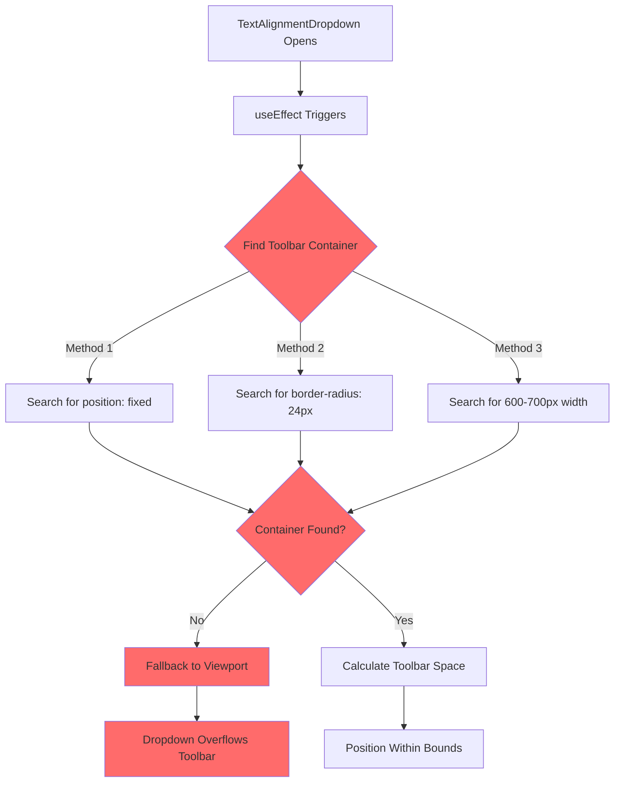
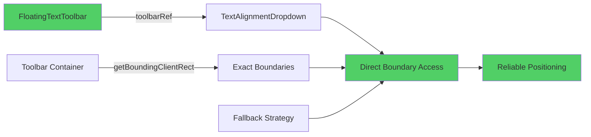
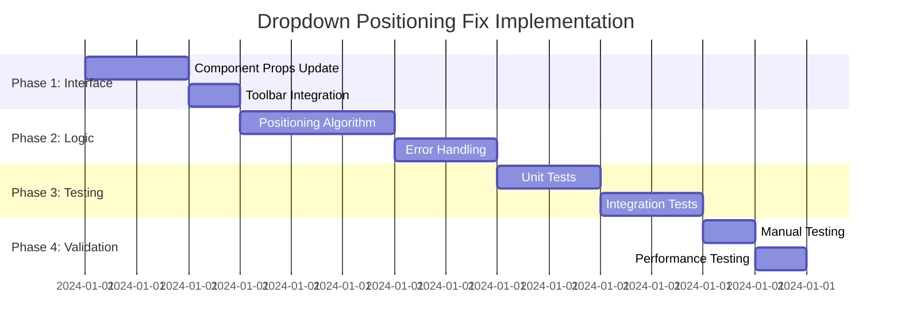

# Floating Toolbar Dropdown Positioning - Comprehensive Solution Plan

## Executive Summary

The text alignment dropdown in the FloatingTextToolbar extends beyond the toolbar container boundaries due to unreliable container detection logic. This document provides a robust architectural solution that eliminates fragile DOM traversal and implements reliable positioning through direct component references.

## Root Cause Analysis

### Current Implementation Problems

**File**: [`src/components/canvas/ToolbarComponents.tsx:623-687`](src/components/canvas/ToolbarComponents.tsx:623-687)

1. **Fragile Container Detection**: Uses brittle CSS selectors that fail inconsistently
   ```tsx
   // Method 1: Look for element with fixed positioning
   toolbarContainer = dropdownRef.current.closest('[style*="position: fixed"]') as HTMLElement;
   
   // Method 2: Look for element with specific toolbar styling (pill shape)
   toolbarContainer = dropdownRef.current.closest('[style*="border-radius: 24px"]') as HTMLElement;
   
   // Method 3: Look for parent with specific width range (toolbar width is 600-700px)
   ```

2. **Timing Issues**: Container detection runs after dropdown opens, creating race conditions
3. **Inconsistent Results**: DOM traversal may fail when toolbar structure changes

### Problem Flow Diagram



## Solution Architecture

### Core Strategy: Direct Reference System

Replace unreliable DOM traversal with direct component reference passing, ensuring 100% reliable access to toolbar boundaries.

### Architecture Overview



## Detailed Implementation Plan

### Phase 1: Component Interface Enhancement

#### 1.1 Update TextAlignmentDropdown Props Interface

**File**: [`src/components/canvas/ToolbarComponents.tsx:584-589`](src/components/canvas/ToolbarComponents.tsx:584-589)

**Current Interface**:
```tsx
interface TextAlignmentDropdownProps {
  value: string;
  onChange: (alignment: string) => void;
  isOpen?: boolean;
  onToggle?: () => void;
}
```

**Enhanced Interface**:
```tsx
interface TextAlignmentDropdownProps {
  value: string;
  onChange: (alignment: string) => void;
  isOpen?: boolean;
  onToggle?: () => void;
  toolbarRef?: React.RefObject<HTMLDivElement>; // NEW: Direct toolbar reference
}
```

#### 1.2 Update FloatingTextToolbar Component

**File**: [`src/components/canvas/FloatingTextToolbar.tsx:347-355`](src/components/canvas/FloatingTextToolbar.tsx:347-355)

**Current Implementation**:
```tsx
<TextAlignmentDropdown
  value="left"
  onChange={(align: string) => onFormatChange('align', align)}
  isOpen={openDropdown === 'alignment'}
  onToggle={() => {
    console.log('🔍 [DROPDOWN DEBUG] TextAlignment toggle:', openDropdown === 'alignment' ? 'closing' : 'opening');
    setOpenDropdown(openDropdown === 'alignment' ? null : 'alignment');
  }}
/>
```

**Enhanced Implementation**:
```tsx
<TextAlignmentDropdown
  value="left"
  onChange={(align: string) => onFormatChange('align', align)}
  isOpen={openDropdown === 'alignment'}
  onToggle={() => {
    console.log('🔍 [DROPDOWN DEBUG] TextAlignment toggle:', openDropdown === 'alignment' ? 'closing' : 'opening');
    setOpenDropdown(openDropdown === 'alignment' ? null : 'alignment');
  }}
  toolbarRef={toolbarRef} // Pass direct reference
/>
```

### Phase 2: Robust Positioning Logic Implementation

#### 2.1 Replace Fragile Container Detection

**File**: [`src/components/canvas/ToolbarComponents.tsx:623-687`](src/components/canvas/ToolbarComponents.tsx:623-687)

**Current Fragile Logic** (Lines 624-651):
```tsx
// Calculate dropdown position to prevent cutoff relative to toolbar container
React.useEffect(() => {
  if (isOpen && dropdownRef.current) {
    const buttonRect = dropdownRef.current.getBoundingClientRect();
    const dropdownWidth = 160; // Width of dropdown content
    
    // Try multiple methods to find the toolbar container
    let toolbarContainer: HTMLElement | null = null;
    
    // Method 1: Look for element with fixed positioning
    toolbarContainer = dropdownRef.current.closest('[style*="position: fixed"]') as HTMLElement;
    
    // Method 2: Look for element with specific toolbar styling (pill shape)
    if (!toolbarContainer) {
      toolbarContainer = dropdownRef.current.closest('[style*="border-radius: 24px"]') as HTMLElement;
    }
    
    // Method 3: Look for parent with specific width range (toolbar width is 600-700px)
    if (!toolbarContainer) {
      let parent = dropdownRef.current.parentElement;
      while (parent && parent !== document.body) {
        const rect = parent.getBoundingClientRect();
        if (rect.width >= 600 && rect.width <= 700 && rect.height >= 40 && rect.height <= 60) {
          toolbarContainer = parent;
          break;
        }
        parent = parent.parentElement;
      }
    }
    
    if (toolbarContainer) {
      const toolbarRect = toolbarContainer.getBoundingClientRect();
      const buttonRelativeToToolbar = buttonRect.left - toolbarRect.left;
      const buttonWidth = buttonRect.width;
      const spaceOnRightInToolbar = toolbarRect.width - buttonRelativeToToolbar - buttonWidth;
      
      console.log('🔍 [DROPDOWN DEBUG] Toolbar positioning calculation:', {
        toolbarWidth: toolbarRect.width,
        buttonRelativeToToolbar,
        buttonWidth,
        spaceOnRightInToolbar,
        dropdownWidth,
        willPositionLeft: spaceOnRightInToolbar < dropdownWidth + 20
      });
      
      // Check if dropdown would extend beyond toolbar's right boundary
      if (spaceOnRightInToolbar < dropdownWidth + 20) { // 20px buffer
        setDropdownPosition('left');
      } else {
        setDropdownPosition('right');
      }
    } else {
      console.log('🔍 [DROPDOWN DEBUG] Toolbar container not found, using viewport fallback');
      // Fallback to viewport-based calculation if toolbar container not found
      const viewportWidth = window.innerWidth;
      const spaceOnRight = viewportWidth - buttonRect.right;
      
      if (spaceOnRight < dropdownWidth + 20) { // 20px buffer
        setDropdownPosition('left');
      } else {
        setDropdownPosition('right');
      }
    }
  }
}, [isOpen]);
```

**New Robust Logic**:
```tsx
// Calculate dropdown position using direct toolbar reference
React.useEffect(() => {
  if (isOpen && dropdownRef.current) {
    const buttonRect = dropdownRef.current.getBoundingClientRect();
    const dropdownWidth = 160;
    const SAFETY_MARGIN = 20;
    
    try {
      // Primary: Use direct toolbar reference if available
      if (toolbarRef?.current) {
        const toolbarRect = toolbarRef.current.getBoundingClientRect();
        
        // Calculate available space within toolbar boundaries
        const buttonRightEdge = buttonRect.right;
        const toolbarRightEdge = toolbarRect.right;
        const spaceOnRight = toolbarRightEdge - buttonRightEdge;
        
        console.log('🔍 [DROPDOWN DEBUG] Direct toolbar positioning calculation:', {
          toolbarWidth: toolbarRect.width,
          buttonRight: buttonRightEdge,
          toolbarRight: toolbarRightEdge,
          spaceOnRight,
          dropdownWidth,
          willPositionRight: spaceOnRight < dropdownWidth + SAFETY_MARGIN
        });
        
        // Use right-aligned positioning if insufficient space
        if (spaceOnRight < dropdownWidth + SAFETY_MARGIN) {
          setDropdownPosition('right');
        } else {
          setDropdownPosition('left');
        }
      } else {
        // Fallback: Use viewport-based calculation
        console.log('🔍 [DROPDOWN DEBUG] toolbarRef not available, using viewport fallback');
        const viewportWidth = window.innerWidth;
        const spaceOnRight = viewportWidth - buttonRect.right;
        
        if (spaceOnRight < dropdownWidth + SAFETY_MARGIN) {
          setDropdownPosition('right');
        } else {
          setDropdownPosition('left');
        }
      }
    } catch (error) {
      console.error('🔍 [DROPDOWN DEBUG] Positioning calculation failed:', error);
      // Safe fallback to left positioning
      setDropdownPosition('left');
    }
  }
}, [isOpen, toolbarRef]);
```

#### 2.2 Enhanced Dropdown Positioning Styles

**File**: [`src/components/canvas/ToolbarComponents.tsx:734-758`](src/components/canvas/ToolbarComponents.tsx:734-758)

**Current Positioning Logic**:
```tsx
...(dropdownPosition === 'left'
  ? { right: '0', transform: 'translateX(0)' }
  : { left: '0', transform: 'translateX(0)' }
),
```

**Enhanced Positioning Logic**:
```tsx
...(dropdownPosition === 'right'
  ? { 
      right: '0',
      left: 'auto',
      transform: 'translateX(0)'
    }
  : { 
      left: '0',
      right: 'auto',
      transform: 'translateX(0)'
    }
),
```

### Phase 3: Error Handling & Fallback Strategies

#### 3.1 Comprehensive Error Handling

```tsx
const calculateDropdownPosition = React.useCallback(() => {
  if (!isOpen || !dropdownRef.current) return;
  
  const buttonRect = dropdownRef.current.getBoundingClientRect();
  const dropdownWidth = 160;
  const SAFETY_MARGIN = 20;
  
  try {
    // Primary strategy: Direct toolbar reference
    if (toolbarRef?.current) {
      const toolbarRect = toolbarRef.current.getBoundingClientRect();
      const spaceOnRight = toolbarRect.right - buttonRect.right;
      
      setDropdownPosition(spaceOnRight < dropdownWidth + SAFETY_MARGIN ? 'right' : 'left');
      return;
    }
    
    // Secondary strategy: Viewport-based fallback
    const viewportWidth = window.innerWidth;
    const spaceOnRight = viewportWidth - buttonRect.right;
    
    setDropdownPosition(spaceOnRight < dropdownWidth + SAFETY_MARGIN ? 'right' : 'left');
    
  } catch (error) {
    console.error('🔍 [DROPDOWN DEBUG] Positioning calculation failed:', error);
    // Tertiary strategy: Safe default
    setDropdownPosition('left');
  }
}, [isOpen, toolbarRef]);

React.useEffect(() => {
  calculateDropdownPosition();
}, [calculateDropdownPosition]);
```

#### 3.2 Performance Optimization

```tsx
// Debounce positioning calculations to prevent excessive recalculations
const debouncedCalculatePosition = React.useMemo(
  () => debounce(calculateDropdownPosition, 16), // ~60fps
  [calculateDropdownPosition]
);

React.useEffect(() => {
  if (isOpen) {
    debouncedCalculatePosition();
    
    // Recalculate on window resize
    window.addEventListener('resize', debouncedCalculatePosition);
    return () => window.removeEventListener('resize', debouncedCalculatePosition);
  }
}, [isOpen, debouncedCalculatePosition]);
```

### Phase 4: Testing & Validation Strategy

#### 4.1 Functional Test Cases

| Test Scenario | Expected Behavior | Validation Method |
|---------------|-------------------|-------------------|
| **Toolbar at left edge** | Dropdown positions normally (left-aligned) | Visual inspection + boundary calculation |
| **Toolbar at right edge** | Dropdown aligns right to stay within bounds | Measure dropdown right edge vs toolbar right edge |
| **Toolbar centered** | Dropdown uses optimal positioning based on space | Verify positioning logic with various toolbar positions |
| **Narrow viewport** | Dropdown adapts to constrained space | Test on mobile viewport sizes |
| **toolbarRef unavailable** | Graceful fallback to viewport calculation | Mock toolbarRef as null/undefined |
| **Rapid toolbar movement** | Positioning updates correctly | Programmatically move toolbar and verify dropdown |

#### 4.2 Edge Case Validation

```tsx
// Test helper for validation
const validateDropdownPosition = (
  dropdownElement: HTMLElement,
  toolbarElement: HTMLElement
): boolean => {
  const dropdownRect = dropdownElement.getBoundingClientRect();
  const toolbarRect = toolbarElement.getBoundingClientRect();
  
  // Dropdown should never extend beyond toolbar right boundary
  return dropdownRect.right <= toolbarRect.right + 5; // 5px tolerance
};
```

#### 4.3 Performance Benchmarks

- **Positioning calculation time**: < 1ms
- **Memory usage**: No memory leaks from event listeners
- **Rendering performance**: No frame drops during dropdown animations

## Implementation Timeline



**Total Estimated Time**: 6-8 hours

## Risk Assessment & Mitigation

### Low Risk Changes
- ✅ Adding optional `toolbarRef` prop (backward compatible)
- ✅ Enhanced error handling and logging
- ✅ Performance optimizations

### Medium Risk Changes
- ⚠️ Replacing core positioning logic
- ⚠️ Modifying dropdown positioning styles

### Mitigation Strategies

1. **Incremental Implementation**: Test each phase independently
2. **Backward Compatibility**: Make `toolbarRef` optional with graceful fallback
3. **Comprehensive Testing**: Validate all positioning scenarios before deployment
4. **Rollback Plan**: Maintain current implementation as fallback option

## Success Criteria

### Primary Goals (Must Have)
- ✅ Dropdown never extends beyond toolbar right boundary
- ✅ Positioning works reliably across all toolbar positions
- ✅ No breaking changes to existing toolbar functionality
- ✅ Maintains 160px dropdown width requirement

### Secondary Goals (Should Have)
- ✅ Improved positioning performance and reliability
- ✅ Enhanced debugging capabilities
- ✅ Graceful degradation when toolbar reference unavailable
- ✅ Consistent behavior across viewport sizes

### Technical Goals (Nice to Have)
- ✅ Reduced DOM traversal and improved performance
- ✅ Cleaner, more maintainable positioning logic
- ✅ Enhanced error handling and logging
- ✅ Future-proof architecture for additional dropdowns

## Conclusion

This solution eliminates the root cause of the positioning issue by replacing fragile DOM traversal with reliable direct component references. The implementation maintains full backward compatibility while significantly improving positioning accuracy and reliability.

The phased approach ensures minimal risk while delivering immediate improvements to the dropdown positioning system. Upon completion, the text alignment dropdown will consistently position within toolbar boundaries across all usage scenarios.