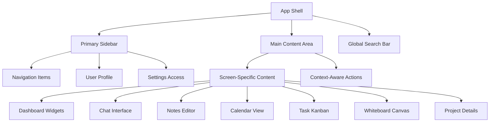
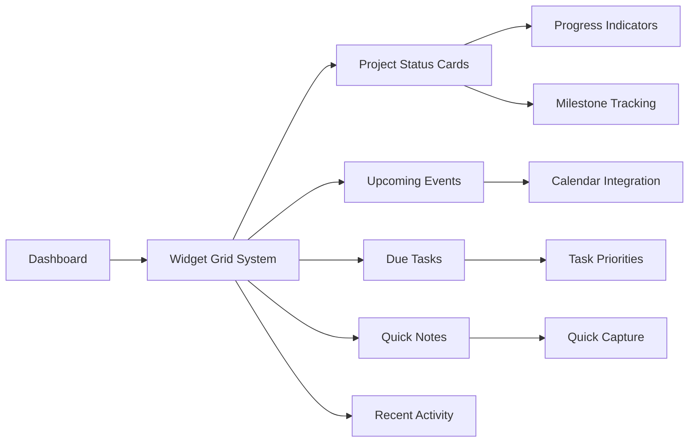
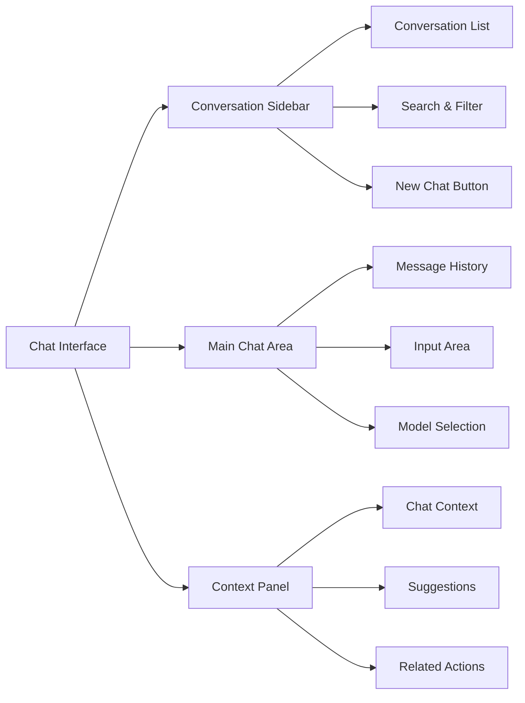
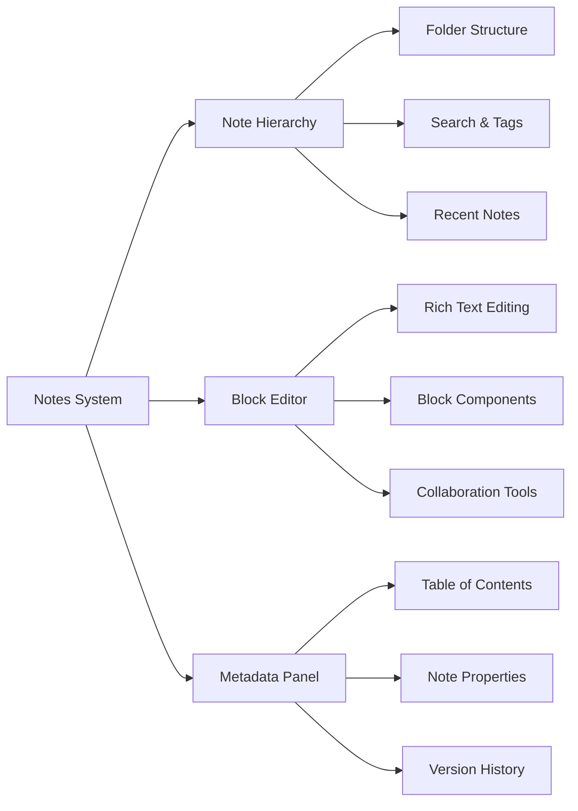
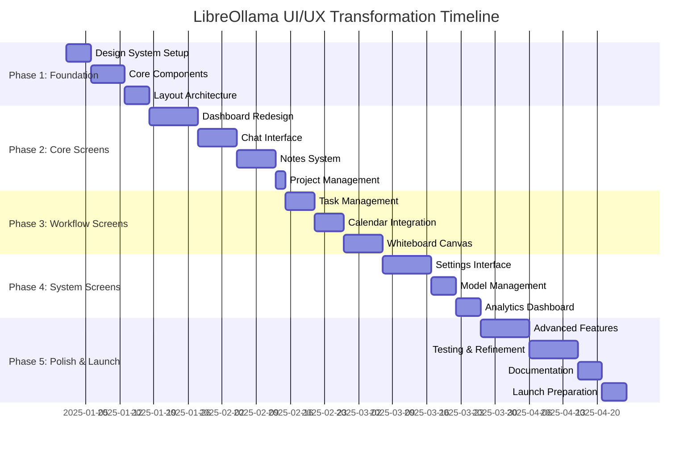

# LibreOllama UI/UX Transformation - Implementation Roadmap

## Executive Summary

This document outlines the comprehensive transformation of LibreOllama from its current interface into a modern, professional productivity platform. The implementation follows a hybrid approach: immediate design system foundation followed by phased screen transformations, ensuring backend stability while delivering immediate visual improvements.

## Project Overview

### Objectives
- Transform LibreOllama into a modern, professional productivity platform
- Implement design foundation shown in user mockups
- Maintain backend architecture integrity
- Ensure smooth user transition with minimal disruption
- Deliver immediate visual improvements while systematically upgrading UX

### Approach: Hybrid Implementation Strategy
1. **Immediate Design System Foundation**: New visual primitives, core components, and layout architecture
2. **Phased Screen Transformation**: Strategic rollout of redesigned modules
3. **Iterative Refinement**: Continuous improvement based on user feedback

## Phase 1: Design System Foundation (Days 1-17)

### 1.1 Core Design Tokens Implementation (Days 1-5)

#### Color System
```typescript
const designTokens = {
  colors: {
    // Primary brand colors from mockups
    primary: {
      50: '#f0f9ff',
      100: '#e0f2fe',
      200: '#bae6fd',
      300: '#7dd3fc',
      400: '#38bdf8',
      500: '#3b82f6', // Main blue
      600: '#2563eb',
      700: '#1d4ed8',
      800: '#1e40af',
      900: '#1e3a8a'
    },
    // Professional neutral grays
    neutral: {
      50: '#f8fafc',
      100: '#f1f5f9',
      200: '#e2e8f0',
      300: '#cbd5e1',
      400: '#94a3b8',
      500: '#64748b',
      600: '#475569',
      700: '#334155',
      800: '#1e293b',
      900: '#0f172a'
    },
    // Semantic colors
    success: {
      50: '#ecfdf5',
      500: '#10b981',
      600: '#059669'
    },
    warning: {
      50: '#fffbeb',
      500: '#f59e0b',
      600: '#d97706'
    },
    error: {
      50: '#fef2f2',
      500: '#ef4444',
      600: '#dc2626'
    }
  },
  typography: {
    fontFamily: {
      sans: ['Inter', 'system-ui', 'sans-serif'],
      mono: ['JetBrains Mono', 'Consolas', 'monospace']
    },
    fontSize: {
      xs: ['0.75rem', { lineHeight: '1rem' }],
      sm: ['0.875rem', { lineHeight: '1.25rem' }],
      base: ['1rem', { lineHeight: '1.5rem' }],
      lg: ['1.125rem', { lineHeight: '1.75rem' }],
      xl: ['1.25rem', { lineHeight: '1.75rem' }],
      '2xl': ['1.5rem', { lineHeight: '2rem' }],
      '3xl': ['1.875rem', { lineHeight: '2.25rem' }]
    },
    fontWeight: {
      normal: '400',
      medium: '500',
      semibold: '600',
      bold: '700'
    }
  },
  spacing: {
    // 8px base unit system
    unit: 8,
    scale: {
      0: '0px',
      1: '4px',   // 0.5 * 8px
      2: '8px',   // 1 * 8px
      3: '12px',  // 1.5 * 8px
      4: '16px',  // 2 * 8px
      5: '20px',  // 2.5 * 8px
      6: '24px',  // 3 * 8px
      8: '32px',  // 4 * 8px
      10: '40px', // 5 * 8px
      12: '48px', // 6 * 8px
      16: '64px', // 8 * 8px
      20: '80px', // 10 * 8px
      24: '96px'  // 12 * 8px
    }
  },
  borderRadius: {
    none: '0px',
    sm: '4px',
    base: '6px',
    md: '8px',
    lg: '12px',
    xl: '16px',
    full: '9999px'
  },
  shadows: {
    sm: '0 1px 2px 0 rgb(0 0 0 / 0.05)',
    base: '0 1px 3px 0 rgb(0 0 0 / 0.1), 0 1px 2px -1px rgb(0 0 0 / 0.1)',
    md: '0 4px 6px -1px rgb(0 0 0 / 0.1), 0 2px 4px -2px rgb(0 0 0 / 0.1)',
    lg: '0 10px 15px -3px rgb(0 0 0 / 0.1), 0 4px 6px -4px rgb(0 0 0 / 0.1)',
    xl: '0 20px 25px -5px rgb(0 0 0 / 0.1), 0 8px 10px -6px rgb(0 0 0 / 0.1)'
  }
}
```

#### Tailwind Configuration Update
```typescript
// tailwind.config.ts updates
module.exports = {
  theme: {
    extend: {
      colors: designTokens.colors,
      fontFamily: designTokens.typography.fontFamily,
      fontSize: designTokens.typography.fontSize,
      fontWeight: designTokens.typography.fontWeight,
      spacing: designTokens.spacing.scale,
      borderRadius: designTokens.borderRadius,
      boxShadow: designTokens.shadows
    }
  }
}
```

### 1.2 Core Component Redesign (Days 6-12)

#### Priority Component Updates

**1. Button Component Enhancement**
- Location: [`tauri-app/src/components/ui/button-v2.tsx`](tauri-app/src/components/ui/button-v2.tsx)
- Updates: Modern styling, proper hover states, loading states
- Variants: primary, secondary, tertiary, ghost, destructive
- Sizes: sm, md, lg, icon

**2. Input/InputField Component**
- Location: [`tauri-app/src/components/ui/input-field.tsx`](tauri-app/src/components/ui/input-field.tsx)
- Updates: Clean borders, focus states, error states, icon support
- Features: Label integration, helper text, validation styling

**3. Card Component**
- Location: [`tauri-app/src/components/ui/card.tsx`](tauri-app/src/components/ui/card.tsx)
- Updates: Subtle shadows, proper spacing, hover states
- Variants: default, elevated, bordered, interactive

**4. Badge Component**
- Location: [`tauri-app/src/components/ui/badge.tsx`](tauri-app/src/components/ui/badge.tsx)
- Updates: Refined styling for tags and status indicators
- Variants: default, secondary, success, warning, error, outline

**5. Navigation Components**
- Primary Sidebar: [`tauri-app/src/components/navigation/PrimarySidebar.tsx`](tauri-app/src/components/navigation/PrimarySidebar.tsx)
- Context-Aware Top Bar: [`tauri-app/src/components/ContextAwareTopBar.tsx`](tauri-app/src/components/ContextAwareTopBar.tsx)
- Updates: Clean styling, proper spacing, active states

### 1.3 Layout Architecture Implementation (Days 13-17)

#### Main Layout Structure


#### Responsive Design Implementation
- Mobile-first approach with breakpoints: sm(640px), md(768px), lg(1024px), xl(1280px)
- Collapsible sidebar for smaller screens
- Touch-friendly interface elements (44px minimum touch targets)
- Adaptive typography and spacing

## Phase 2: Core Screen Transformations (Days 18-45)

### 2.1 Dashboard Redesign (Days 18-27)

#### Widget-Based Dashboard System


#### Implementation Details
- **File**: [`tauri-app/src/components/screens/DashboardScreen.tsx`](tauri-app/src/components/screens/DashboardScreen.tsx)
- **Features**:
  - Drag-and-drop widget arrangement
  - Customizable widget sizes
  - Real-time data updates
  - Quick action buttons
  - Responsive grid layout

#### Widget Components
1. **Project Status Widget**: Progress bars, milestone tracking
2. **Upcoming Events Widget**: Calendar integration, event previews
3. **Due Tasks Widget**: Priority indicators, quick completion
4. **Quick Notes Widget**: Rapid note capture, recent notes
5. **Recent Activity Widget**: Cross-feature activity feed

### 2.2 AI Chat Interface Redesign (Days 28-35)

#### Chat Interface Architecture


#### Implementation Details
- **File**: [`tauri-app/src/components/screens/AIChatScreen.tsx`](tauri-app/src/components/screens/AIChatScreen.tsx)
- **Features**:
  - Clean conversation list with search
  - Modern message bubbles with proper spacing
  - Context-aware suggestions panel
  - Attachment support with preview
  - Real-time typing indicators
  - Message threading and reactions

### 2.3 Notes/Documentation Redesign (Days 36-43)

#### Notes System Architecture


#### Implementation Details
- **File**: [`tauri-app/src/components/notes/BlockEditor.tsx`](tauri-app/src/components/notes/BlockEditor.tsx)
- **Features**:
  - Block-based editing system
  - Rich text formatting
  - Embedded media support
  - Real-time collaboration
  - Version history tracking
  - Export capabilities

### 2.4 Project Management Interface (Days 44-45)

#### Project Overview Design
- **File**: New component `ProjectOverviewScreen.tsx`
- **Features**:
  - Project timeline visualization
  - Team member management
  - Milestone tracking
  - Resource allocation
  - Progress reporting

## Phase 3: Workflow Screen Transformations (Days 46-65)

### 3.1 Task Management Redesign (Days 46-51)

#### Kanban Board Enhancement
- **File**: [`tauri-app/src/components/tasks/KanbanBoard.tsx`](tauri-app/src/components/tasks/KanbanBoard.tsx)
- **Features**:
  - Drag-and-drop task management
  - Custom board layouts
  - Task filtering and search
  - Priority indicators
  - Due date tracking
  - Team assignment

### 3.2 Calendar Integration (Days 52-57)

#### Calendar System Redesign
- **File**: [`tauri-app/src/components/calendar/EnhancedCalendar.tsx`](tauri-app/src/components/calendar/EnhancedCalendar.tsx)
- **Features**:
  - Multiple view modes (day, week, month)
  - Event creation and editing
  - Calendar synchronization
  - Meeting scheduling
  - Reminder system

### 3.3 Whiteboard/Canvas Improvements (Days 58-65)

#### Spatial Workspace Enhancement
- **File**: [`tauri-app/src/components/notes/EnhancedWhiteboardCanvas.tsx`](tauri-app/src/components/notes/EnhancedWhiteboardCanvas.tsx)
- **Features**:
  - Improved drawing tools
  - Shape libraries
  - Collaboration features
  - Export capabilities
  - Template system

## Phase 4: System Screen Transformations (Days 66-85)

### 4.1 Settings & Configuration (Days 66-75)

#### Settings Interface Redesign
- **File**: [`tauri-app/src/components/AdvancedSettings.tsx`](tauri-app/src/components/AdvancedSettings.tsx)
- **Features**:
  - Organized settings panels
  - Search functionality
  - Import/export configurations
  - Theme customization
  - Keyboard shortcuts management

### 4.2 Model Management (Days 76-80)

#### Model Selection Interface
- **File**: [`tauri-app/src/components/ModelManager.tsx`](tauri-app/src/components/ModelManager.tsx)
- **Features**:
  - Model library browser
  - Installation progress tracking
  - Performance metrics
  - Model comparison tools
  - Usage analytics

### 4.3 Analytics Dashboard (Days 81-85)

#### Data Visualization Improvements
- **File**: [`tauri-app/src/components/analytics/ProductivityDashboard.tsx`](tauri-app/src/components/analytics/ProductivityDashboard.tsx)
- **Features**:
  - Interactive charts and graphs
  - Productivity insights
  - Usage patterns analysis
  - Goal tracking
  - Report generation

## Phase 5: Advanced Features & Polish (Days 86-105)

### 5.1 Enhanced User Experience Features

#### Smart Search Implementation
- Global search with context-aware results
- Fuzzy matching and intelligent suggestions
- Cross-feature search capabilities
- Recent searches and favorites

#### Command Palette Enhancement
- **File**: [`tauri-app/src/components/ui/command-palette.tsx`](tauri-app/src/components/ui/command-palette.tsx)
- Natural language command processing
- Contextual action suggestions
- Keyboard shortcut integration
- AI-powered command completion

#### Focus Mode Improvements
- Distraction-free work environment
- Customizable focus sessions
- Productivity tracking
- Integration with Pomodoro technique

### 5.2 Collaboration Features

#### Real-time Collaboration
- Live editing and commenting
- Presence indicators
- Conflict resolution
- Activity feeds

#### Sharing & Permissions
- Granular access controls
- Link sharing with expiration
- Team workspace management
- Guest access capabilities

### 5.3 Productivity Enhancements

#### Template System
- Pre-built templates for common workflows
- Custom template creation
- Template sharing and marketplace
- Smart template suggestions

#### Automation Features
- Smart suggestions based on usage patterns
- Automated task creation
- Workflow triggers
- Integration with external tools

## Implementation Timeline



## Technical Implementation Strategy

### Development Approach

1. **Design System First**: Establish visual foundation before screen transformations
2. **Component Library**: Build reusable, composable components
3. **Progressive Enhancement**: Add advanced features incrementally
4. **Performance Optimization**: Maintain fast load times and smooth interactions
5. **Accessibility**: Ensure WCAG 2.1 AA compliance throughout
6. **Testing Strategy**: Comprehensive testing at each phase

### Code Organization

```
tauri-app/src/
├── components/
│   ├── ui/                 # Core design system components
│   ├── screens/            # Screen-level components
│   ├── navigation/         # Navigation components
│   ├── widgets/           # Dashboard widgets
│   └── templates/         # Reusable templates
├── hooks/                 # Custom React hooks
├── lib/                   # Utility functions and types
├── styles/               # Global styles and themes
└── types/                # TypeScript type definitions
```

### Quality Assurance

#### Testing Strategy
- **Unit Tests**: Component-level testing with Jest and React Testing Library
- **Integration Tests**: Feature-level testing with Cypress
- **Visual Regression Tests**: Automated screenshot comparison
- **Performance Tests**: Bundle size and runtime performance monitoring
- **Accessibility Tests**: Automated and manual accessibility auditing

#### Browser Compatibility
- **Target Browsers**: Chrome 90+, Firefox 88+, Safari 14+, Edge 90+
- **Mobile Support**: iOS Safari 14+, Chrome Mobile 90+
- **Testing Matrix**: Automated testing across all target browsers

#### Performance Metrics
- **Page Load Time**: Target under 2 seconds
- **Bundle Size**: Optimize for minimal impact
- **Lighthouse Score**: Maintain 90+ across all categories
- **Core Web Vitals**: Meet Google's performance standards

## Success Metrics & KPIs

### User Experience Metrics
- **Task Completion Time**: Reduce by 30% compared to current interface
- **User Satisfaction**: Achieve 4.5/5 rating in user surveys
- **Feature Adoption**: 80% of users actively using new features within 30 days
- **Support Tickets**: Reduce UI-related support requests by 50%

### Technical Metrics
- **Performance**: Maintain sub-2-second load times
- **Accessibility**: Achieve 95+ Lighthouse accessibility score
- **Browser Compatibility**: 99% compatibility across target browsers
- **Bundle Size**: Keep JavaScript bundle under 1MB gzipped

### Business Metrics
- **User Retention**: Increase monthly active users by 25%
- **Feature Engagement**: Improve feature usage rates by 40%
- **User Onboarding**: Reduce time-to-first-value by 50%
- **Customer Satisfaction**: Increase NPS score by 20 points

## Risk Management

### Potential Risks & Mitigation Strategies

#### Technical Risks
1. **Performance Degradation**
   - Risk: New UI components impact application performance
   - Mitigation: Continuous performance monitoring, lazy loading, code splitting

2. **Browser Compatibility Issues**
   - Risk: New features not working across all target browsers
   - Mitigation: Comprehensive cross-browser testing, progressive enhancement

3. **Bundle Size Increase**
   - Risk: New components significantly increase application size
   - Mitigation: Tree shaking, dynamic imports, component optimization

#### User Experience Risks
1. **User Adaptation Challenges**
   - Risk: Users struggle to adapt to new interface
   - Mitigation: Comprehensive onboarding, progressive disclosure, user training

2. **Feature Regression**
   - Risk: Existing functionality breaks during transformation
   - Mitigation: Comprehensive testing, feature flags, rollback capabilities

3. **Accessibility Compliance**
   - Risk: New interface doesn't meet accessibility standards
   - Mitigation: Accessibility-first design, automated testing, manual audits

#### Project Risks
1. **Timeline Delays**
   - Risk: Implementation takes longer than planned
   - Mitigation: Agile methodology, regular checkpoints, scope adjustment

2. **Resource Constraints**
   - Risk: Insufficient development resources
   - Mitigation: Phased approach, priority-based implementation, external support

### Rollback Strategy

#### Feature Flags Implementation
- Implement feature flags for all major UI changes
- Enable gradual rollout to user segments
- Quick rollback capability if issues arise
- A/B testing for user preference validation

#### Backup Plans
- Maintain current interface as fallback option
- Database migration rollback procedures
- Component version management
- User preference preservation

## Documentation & Training

### Developer Documentation
- **Component Library**: Comprehensive component documentation with examples
- **Design System Guide**: Usage guidelines and best practices
- **Implementation Guide**: Step-by-step implementation instructions
- **API Documentation**: Updated API documentation for new features

### User Documentation
- **User Guide**: Comprehensive guide to new interface features
- **Video Tutorials**: Screen-recorded walkthroughs of key features
- **Migration Guide**: Help users transition from old to new interface
- **FAQ**: Common questions and troubleshooting

### Training Materials
- **Onboarding Flow**: Interactive tutorial for new users
- **Feature Announcements**: In-app notifications for new features
- **Help System**: Contextual help and tooltips
- **Support Resources**: Updated support documentation

## Conclusion

This comprehensive transformation roadmap will modernize LibreOllama into a professional, user-friendly productivity platform while maintaining the robust backend architecture. The hybrid implementation approach ensures immediate visual improvements while systematically upgrading the entire user experience.

The phased approach allows for:
- **Immediate Impact**: Users see visual improvements from day one
- **Risk Mitigation**: Issues can be identified and addressed incrementally
- **Continuous Feedback**: User input guides subsequent development phases
- **Maintainable Progress**: Each phase builds upon the previous foundation

Success will be measured through improved user satisfaction, increased feature adoption, and enhanced productivity metrics, positioning LibreOllama as a leading productivity platform in the AI-assisted workspace category.