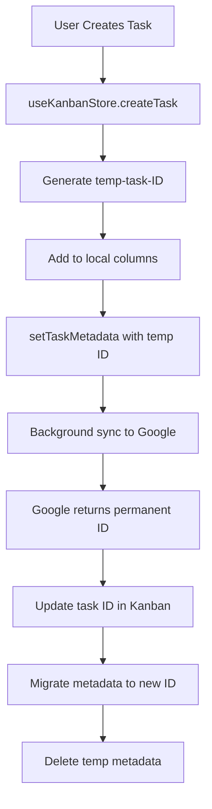
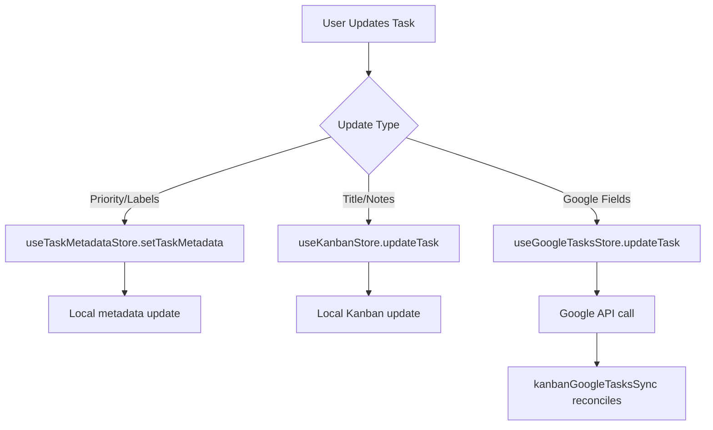
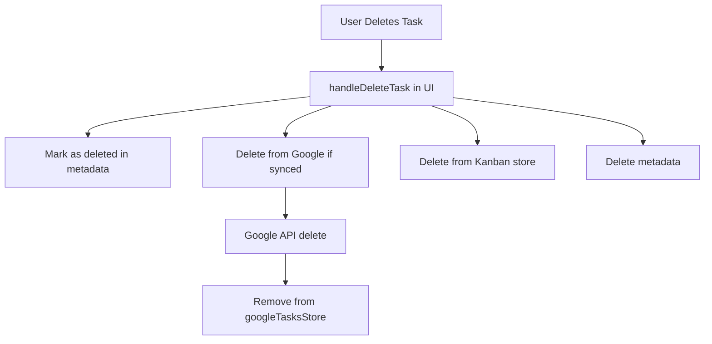

# Task System Data Flow Audit

## Current Architecture Overview

The task system currently uses 4 separate data stores that attempt to represent the same task entity:

1. **useGoogleTasksStore** - Google Tasks API integration
2. **useKanbanStore** - UI representation for Kanban board
3. **useTaskMetadataStore** - LibreOllama-specific metadata (labels, priority)
4. **React Query Cache** - Additional caching layer for API calls

## Data Flow Mapping

### 1. Task Creation Flow



**Issues:**
- Race condition between steps E and I
- UI may render between D and I, showing missing metadata
- If F fails, metadata orphaned under temp ID

### 2. Task Update Flow



**Issues:**
- Three separate update paths
- No coordination between stores
- Sync may overwrite local changes

### 3. Task Deletion Flow



**Issues:**
- If G fails, inconsistent state
- Deletion marker may not prevent re-sync

## Store Mutations

### useGoogleTasksStore

| Mutation | Purpose | Side Effects |
|----------|---------|--------------|
| `createTask` | Create via Google API | Updates local tasks array |
| `updateTask` | Update via Google API | Updates local tasks array |
| `deleteTask` | Delete via Google API | Removes from tasks array, NOW cleans metadata |
| `setTasks` | Bulk update from API | Overwrites entire task list |
| `syncAllTasks` | Fetch all from Google | Triggers kanbanGoogleTasksSync |

### useKanbanStore

| Mutation | Purpose | Side Effects |
|----------|---------|--------------|
| `createTask` | Create with temp ID | Triggers background Google sync |
| `updateTask` | Update local task | No API call |
| `deleteTask` | Remove from columns | NOW calls Google API if synced |
| `moveTask` | Change position/column | No API call |
| `initialize` | Load from localStorage | Clears existing data |

### useTaskMetadataStore

| Mutation | Purpose | Side Effects |
|----------|---------|--------------|
| `setTaskMetadata` | Update metadata | Merges with existing |
| `deleteTaskMetadata` | Remove metadata | None |
| `getTaskMetadata` | Read metadata | Returns null if missing |

## Store Selectors

### Component Usage Patterns

```typescript
// TasksAsanaClean.tsx - DraggableTaskCard
const metadataId = task.googleTaskId || task.id;
const metadata = useTaskMetadataStore(state => state.metadata[metadataId]) || {
  labels: [],
  priority: 'normal',
  subtasks: []
};

// AsanaKanbanBoard
const { columns, updateTask, deleteTask } = useKanbanStore();

// Task Modal
const { createTask: createGoogleTask } = useGoogleTasksStore();
```

**Issues:**
- Components must know about ID migration logic
- Fallback objects created on every render
- No memoization of selectors

## Sync Service Analysis

### kanbanGoogleTasksSync.ts

```typescript
// Polling-based sync
async syncAll() {
  for (const mapping of this.syncMappings) {
    await this.syncColumn(mapping);
  }
}

// Reconciliation logic
private async syncColumn(mapping: SyncMapping) {
  // 1. Sync Google → Kanban
  for (const googleTask of googleTasks) {
    if (metadata?.deleted) continue; // Skip deleted
    if (!existingKanbanTask) {
      await kanbanStore.createTask(...);
    }
  }
  
  // 2. Sync Kanban → Google
  for (const kanbanTask of column.tasks) {
    if (!googleTask) {
      await googleStore.createTask(...);
    }
  }
}
```

**Issues:**
- No real-time updates
- Last-write-wins conflict resolution
- Separate sync cycles can create inconsistencies

## React Query Integration

### Hooks Usage

```typescript
// useGoogleTasks.ts
export function useTaskLists() {
  return useQuery({
    queryKey: taskKeys.lists(),
    queryFn: async () => {
      const lists = await api.listTaskLists();
      setTaskLists(lists); // Updates googleTasksStore
      return lists;
    }
  });
}
```

**Issues:**
- Fourth cache layer
- Manual store synchronization
- Cache invalidation complexity

## Critical Pain Points

1. **ID Migration Race**
   - Temp ID → Google ID happens async
   - Metadata lookup fails during transition
   - Components render with missing data

2. **Store Synchronization**
   - No event bus between stores
   - Each store persists independently
   - Hydration timing varies

3. **Conflict Resolution**
   - No version tracking
   - No user notification
   - Silent data loss possible

4. **Component Complexity**
   - Must handle multiple ID formats
   - Manual fallback logic
   - Deep store knowledge required

## Recommendations Summary

1. **Immediate**: Fix deep-merge to return new references
2. **Short-term**: Add event bus for store coordination
3. **Long-term**: Migrate to unified store architecture

This audit reveals that the current architecture's complexity directly causes the metadata loss issues. The proposed unified store will eliminate these synchronization problems.