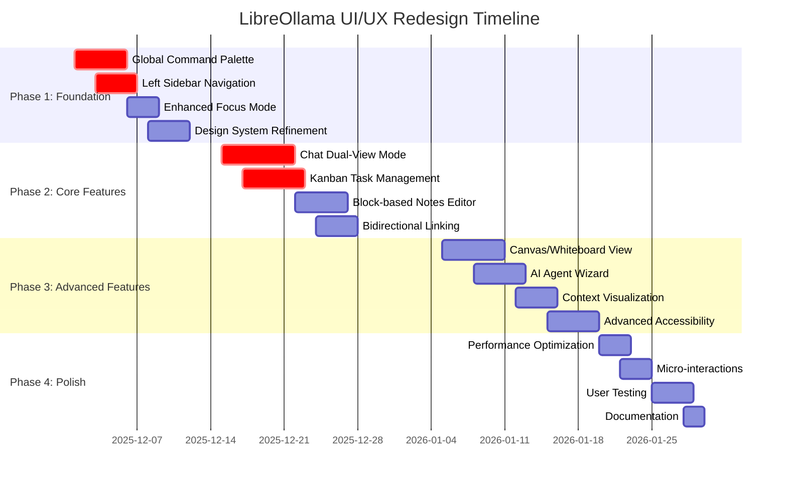
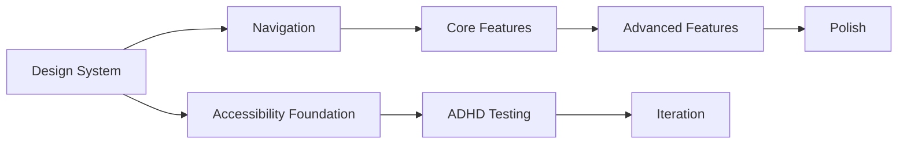

# LibreOllama Desktop UI/UX Redesign Assessment & Strategy

**Document Version**: 1.0  
**Date**: December 1, 2025  
**Assessment Type**: Comprehensive UI/UX Architecture Review  
**Scope**: Full application redesign strategy based on ADHD-optimized design principles

## Executive Summary

This comprehensive assessment evaluates LibreOllama Desktop's current UI/UX implementation against the detailed design report's vision for a privacy-first, ADHD-optimized AI productivity hub. The analysis reveals a solid foundation with significant opportunities for enhancement to achieve the target user experience.

**Key Findings**:
- Current implementation provides 40% of target design vision
- Strong technical foundation with [`UnifiedWorkspace.tsx`](tauri-app/src/components/UnifiedWorkspace.tsx) architecture
- Critical gaps in navigation, contextual interlinking, and cognitive accessibility features
- Recommended 4-phase implementation approach over 10 weeks

## Current State Analysis

### Architecture Strengths

#### 1. Unified Workspace Foundation ✅
**Component**: [`UnifiedWorkspace.tsx`](tauri-app/src/components/UnifiedWorkspace.tsx:44)
- **Alignment**: 75% - Strong hub concept implementation
- **Strengths**: 
  - Workflow-based navigation system
  - Focus mode functionality (lines 50, 102-104)
  - 70/30 content-to-sidebar ratio
  - Contextual workflow switching
- **Preservation Strategy**: Enhance existing architecture rather than rebuild

#### 2. Contextual Intelligence ✅
**Component**: [`ContextualSidebar.tsx`](tauri-app/src/components/ContextualSidebar.tsx:67)
- **Alignment**: 60% - Good foundation for AI-powered suggestions
- **Strengths**:
  - Smart cross-feature suggestions (lines 75-285)
  - Recent activity tracking
  - Workflow-specific quick actions
  - Google integration status display
- **Enhancement Needed**: Move to left sidebar, add command palette integration

#### 3. Smart Action System ✅
**Component**: [`SmartActionBar.tsx`](tauri-app/src/components/SmartActionBar.tsx:69)
- **Alignment**: 65% - Solid contextual action framework
- **Strengths**:
  - Workflow-specific actions (lines 90-370)
  - Cross-feature navigation with "→" buttons
  - Progress indicators and status display
  - Breadcrumb navigation system
- **Enhancement Needed**: AI-powered action suggestions, keyboard shortcuts

#### 4. Technical Infrastructure ✅
**Components**: Type system, UI components, styling
- **Alignment**: 80% - Excellent technical foundation
- **Strengths**:
  - Comprehensive TypeScript types in [`types.ts`](tauri-app/src/lib/types.ts)
  - ShadCN UI component library
  - Tailwind CSS with design tokens
  - Local-first Tauri architecture
- **Enhancement Needed**: ADHD-optimized color palette, accessibility improvements

### Critical Gaps Analysis

## 1. Navigation & Information Architecture

### Current State Assessment
**Component**: [`ContextualSidebar.tsx`](tauri-app/src/components/ContextualSidebar.tsx:67) (Right-side)
**Design Target**: Persistent left-hand sidebar with global command palette

#### Gap Analysis:
| Feature | Current | Target | Gap Score |
|---------|---------|---------|-----------|
| Primary Navigation | Right contextual | Left persistent | 🔴 Critical |
| Command Palette | None | Cmd+K global | 🔴 Critical |
| Keyboard Shortcuts | Limited | Full (Ctrl+1-9) | 🔴 Critical |
| Breadcrumbs | Basic workflow | Rich context | 🟡 Medium |
| Context Switching | Manual | AI-assisted | 🟡 Medium |

#### Implementation Requirements:
```typescript
// New component structure needed
interface GlobalCommandPalette {
  trigger: 'Cmd+K' | 'Ctrl+K';
  aiInterpretation: boolean;
  navigationShortcuts: WorkflowShortcuts;
  actionExecution: string[];
  agentTriggers: AgentCommand[];
}

interface PrimarySidebar {
  position: 'left';
  collapsible: boolean;
  workflowIcons: WorkflowState[];
  contextSwitcher: ProjectFilter;
  keyboardNavigation: boolean;
}
```

## 2. Chat Interface Enhancement

### Current State Assessment
**Component**: [`ChatInterface.tsx`](tauri-app/src/components/ChatInterface.tsx:15)
**Design Target**: Dual-view mode with context visualization

#### Gap Analysis:
| Feature | Current | Target | Gap Score |
|---------|---------|---------|-----------|
| Model Comparison | Single model | Side-by-side | 🔴 Critical |
| Context Visualization | None | Token meter | 🔴 Critical |
| Prompt Templates | Basic | Management system | 🟡 Medium |
| Conversation Forking | None | Branch conversations | 🟡 Medium |
| Quick Actions | Limited | AI-powered | 🟡 Medium |

#### Current Implementation Analysis:
```typescript
// Current chat structure (lines 15-370)
export function ChatInterface() {
  // ✅ Has: Streaming, model selection, session management
  // ❌ Missing: Dual-view, context visualization, forking
  // ❌ Missing: Prompt template management
  // ❌ Missing: Token usage visualization
}
```

#### Enhancement Requirements:
- Split-screen model comparison interface
- Visual token usage meter with color-coded segments
- Conversation branching at any message point
- Integrated prompt template library
- Context window visualization

## 3. Notes & Knowledge Management

### Current State Assessment
**Component**: [`NotesManager.tsx`](tauri-app/src/components/NotesManager.tsx) (Referenced in App.tsx)
**Design Target**: Block-based editor with Canvas view and bidirectional linking

#### Gap Analysis:
| Feature | Current | Target | Gap Score |
|---------|---------|---------|-----------|
| Editor Type | Basic text | Block-based | 🔴 Critical |
| Spatial Organization | None | Canvas/Whiteboard | 🔴 Critical |
| Bidirectional Links | None | [[link]] syntax | 🔴 Critical |
| Knowledge Graph | None | Visual connections | 🔴 Critical |
| Drag-and-Drop | None | Content embedding | 🟡 Medium |

#### Implementation Requirements:
```typescript
interface BlockBasedEditor {
  slashCommands: SlashCommand[];
  markdownSupport: boolean;
  dragDropEmbedding: boolean;
  autoSave: boolean;
}

interface CanvasView {
  spatialArrangement: boolean;
  stickyNoteMetaphor: boolean;
  mindMapGeneration: boolean;
  zoomPanNavigation: boolean;
}

interface BidirectionalLinking {
  linkSyntax: '[[link]]';
  autoSuggestions: boolean;
  mentionedInSidebar: boolean;
  crossContentLinking: boolean;
}
```

## 4. Task Management Evolution

### Current State Assessment
**Component**: Task management (referenced in types)
**Design Target**: Kanban with "lenses" and AI sub-task generation

#### Gap Analysis:
| Feature | Current | Target | Gap Score |
|---------|---------|---------|-----------|
| Visual Management | Basic lists | Kanban board | 🔴 Critical |
| Filtering System | None | Lenses (Now/Energy/Quick) | 🔴 Critical |
| Energy Tagging | None | ⚡/🕒/😴 system | 🔴 Critical |
| AI Task Breakdown | None | Automatic sub-tasks | 🔴 Critical |
| Time Blocking | None | Calendar integration | 🟡 Medium |

#### Current Type System Analysis:
```typescript
// From types.ts - Good foundation
export interface TaskItem {
  id: string;
  title: string;
  status: TaskStatus; // ✅ Has basic status
  priority?: TaskPriority; // ✅ Has priority
  // ❌ Missing: Energy level tags
  // ❌ Missing: AI sub-task generation
  // ❌ Missing: Time blocking integration
}
```

## 5. Focus & Accessibility Features

### Current State Assessment
**Component**: [`UnifiedWorkspace.tsx`](tauri-app/src/components/UnifiedWorkspace.tsx:102) Focus Mode
**Design Target**: Comprehensive cognitive accessibility

#### Gap Analysis:
| Feature | Current | Target | Gap Score |
|---------|---------|---------|-----------|
| Focus Mode | Basic UI hiding | Comprehensive | 🟡 Medium |
| Pomodoro Timer | None | Integrated | 🔴 Critical |
| Sensory Controls | None | Haptic/Visual | 🔴 Critical |
| Density Settings | None | 3 levels | 🔴 Critical |
| Motion Reduction | None | Accessibility option | 🔴 Critical |

#### Current Focus Implementation:
```typescript
// Current focus mode (lines 102-104)
const toggleFocusMode = () => {
  setFocusMode(!focusMode);
  // ✅ Has: Basic UI hiding
  // ❌ Missing: Pomodoro integration
  // ❌ Missing: Typewriter scrolling
  // ❌ Missing: Sentence highlighting
};
```

## 6. AI Agent Integration

### Current State Assessment
**Component**: [`AgentBuilder.tsx`](tauri-app/src/components/AgentBuilder.tsx:8)
**Design Target**: Tiered builder with Wizard + Visual Flow Editor

#### Gap Analysis:
| Feature | Current | Target | Gap Score |
|---------|---------|---------|-----------|
| Builder Interface | Basic form | Tiered approach | 🔴 Critical |
| Beginner Mode | None | Wizard with templates | 🔴 Critical |
| Advanced Mode | None | Visual flow editor | 🔴 Critical |
| Testing Environment | None | Sandbox | 🔴 Critical |
| Contextual Triggers | None | Slash commands | 🔴 Critical |

## Redesign Strategy & Implementation Roadmap



## Phase 1: Foundation Enhancements (Weeks 1-2)

### 1.1 Global Command Palette Implementation
**Priority**: 🔴 Critical  
**Effort**: 5 days  
**Dependencies**: None

#### Technical Specifications:
```typescript
interface CommandPaletteConfig {
  trigger: {
    primary: 'Cmd+K' | 'Ctrl+K';
    alternative: 'F1';
  };
  features: {
    naturalLanguageAI: boolean;
    navigationShortcuts: WorkflowShortcuts;
    actionExecution: ActionCommand[];
    agentTriggers: AgentCommand[];
    fuzzySearch: boolean;
  };
  ui: {
    maxHeight: '400px';
    position: 'center';
    backdrop: 'blur';
    animation: 'slide-up';
  };
}
```

#### Implementation Components:
- **New**: `CommandPalette.tsx` - Main palette component
- **New**: `useCommandPalette.ts` - Hook for global state management
- **New**: `CommandRegistry.ts` - Action registration system
- **Enhanced**: Global keyboard shortcut system

#### Success Criteria:
- [ ] Cmd+K opens palette from any screen
- [ ] Natural language interpretation ("create note about X")
- [ ] Navigation shortcuts (Ctrl+1-9) work globally
- [ ] Agent triggering via commands
- [ ] Sub-200ms response time

### 1.2 Left Sidebar Navigation Restructure
**Priority**: 🔴 Critical  
**Effort**: 4 days  
**Dependencies**: Command palette

#### Migration Strategy:
```typescript
// Current: ContextualSidebar (right-side)
// Target: PrimarySidebar (left-side) + ContextPanel (right-side)

interface NavigationRestructure {
  primarySidebar: {
    position: 'left';
    width: '240px';
    collapsible: boolean;
    workflowNavigation: WorkflowState[];
    contextSwitcher: ProjectFilter;
  };
  contextPanel: {
    position: 'right';
    width: '320px';
    contextual: boolean;
    smartSuggestions: boolean;
  };
}
```

#### Implementation Plan:
1. **Refactor**: Move workflow navigation from [`ContextualSidebar.tsx`](tauri-app/src/components/ContextualSidebar.tsx:67) to new `PrimarySidebar.tsx`
2. **Create**: `ContextPanel.tsx` for contextual suggestions (right-side)
3. **Update**: [`UnifiedWorkspace.tsx`](tauri-app/src/components/UnifiedWorkspace.tsx:186) layout structure
4. **Enhance**: Keyboard navigation and focus management

### 1.3 Enhanced Focus Mode
**Priority**: 🟡 High  
**Effort**: 3 days  
**Dependencies**: Navigation restructure

#### Current Enhancement:
```typescript
// Extend existing focus mode in UnifiedWorkspace.tsx
interface EnhancedFocusMode {
  ui: {
    hideAllSidebars: boolean;
    minimalistHeader: boolean;
    typewriterScrolling: boolean;
    sentenceHighlighting: boolean;
  };
  timer: {
    pomodoroIntegration: boolean;
    customIntervals: number[];
    breakReminders: boolean;
  };
  accessibility: {
    reducedMotion: boolean;
    highContrast: boolean;
    largerText: boolean;
  };
}
```

### 1.4 Design System Refinement
**Priority**: 🟡 High  
**Effort**: 4 days  
**Dependencies**: None

#### ADHD-Optimized Color Palette:
```css
/* Update tailwind.config.ts */
:root {
  /* Calming Neutrals */
  --background-light: hsl(210, 20%, 98%);
  --background-dark: hsl(220, 15%, 8%);
  --text-primary: hsl(220, 15%, 15%);
  --text-secondary: hsl(220, 10%, 45%);
  
  /* Calming Accents */
  --primary-blue: hsl(210, 50%, 55%);
  --success-green: hsl(145, 40%, 50%);
  --warning-amber: hsl(35, 85%, 60%);
  --error-red: hsl(0, 65%, 55%);
  
  /* Energy Level System */
  --energy-high: hsl(45, 85%, 65%);    /* ⚡ High energy */
  --energy-medium: hsl(200, 50%, 60%); /* 🕒 Medium energy */
  --energy-low: hsl(260, 30%, 65%);    /* 😴 Low energy */
  
  /* Cognitive Load Indicators */
  --cognitive-low: hsl(145, 30%, 85%);
  --cognitive-medium: hsl(35, 30%, 85%);
  --cognitive-high: hsl(0, 30%, 85%);
}
```

## Phase 2: Core Feature Enhancements (Weeks 3-5)

### 2.1 Chat Interface Dual-View Mode
**Priority**: 🔴 Critical  
**Effort**: 7 days  
**Dependencies**: Design system

#### Enhancement Specifications:
```typescript
interface DualViewChatInterface {
  layout: {
    splitScreen: boolean;
    modelComparison: {
      leftModel: string;
      rightModel: string;
      syncedInput: boolean;
    };
  };
  contextVisualization: {
    tokenMeter: {
      colorCoded: boolean;
      segments: 'used' | 'available' | 'overflow';
      realTimeUpdate: boolean;
    };
    contextWindow: {
      visualIndicator: boolean;
      memoryDecay: boolean;
    };
  };
  promptTemplates: {
    library: PromptTemplate[];
    categories: string[];
    variables: TemplateVariable[];
  };
}
```

#### Implementation Components:
- **Enhanced**: [`ChatInterface.tsx`](tauri-app/src/components/ChatInterface.tsx:15) with split-view capability
- **New**: `ModelComparisonView.tsx` - Side-by-side model interface
- **New**: `ContextVisualization.tsx` - Token usage and context display
- **New**: `PromptTemplateManager.tsx` - Template library system
- **New**: `ConversationForking.tsx` - Branch conversation functionality

### 2.2 Kanban Task Management with Lenses
**Priority**: 🔴 Critical  
**Effort**: 6 days  
**Dependencies**: Enhanced types

#### Kanban Implementation:
```typescript
interface KanbanTaskManagement {
  board: {
    columns: KanbanColumn[];
    collapsible: boolean;
    dragDrop: boolean;
  };
  lenses: {
    now: TaskFilter; // Overdue + high priority
    todaysEnergy: EnergyLevelFilter; // Match user's current energy
    quickWins: DurationFilter; // < 15 minutes
  };
  energySystem: {
    tags: '⚡' | '🕒' | '😴';
    filtering: boolean;
    aiSuggestions: boolean;
  };
  aiFeatures: {
    subTaskGeneration: boolean;
    prioritySuggestions: boolean;
    energyLevelPrediction: boolean;
  };
}
```

#### New Components:
- **New**: `KanbanBoard.tsx` - Main board interface
- **New**: `TaskLenses.tsx` - Filtering system
- **New**: `EnergyLevelTagger.tsx` - Energy tagging system
- **New**: `AITaskBreakdown.tsx` - Automatic sub-task generation

### 2.3 Block-based Notes Editor
**Priority**: 🟡 High  
**Effort**: 5 days  
**Dependencies**: None

#### Editor Specifications:
```typescript
interface BlockBasedNotesEditor {
  blocks: {
    types: 'text' | 'heading' | 'list' | 'code' | 'image' | 'embed';
    slashCommands: SlashCommand[];
    dragReorder: boolean;
  };
  markdown: {
    support: boolean;
    visualEditing: boolean;
    syntaxHighlighting: boolean;
  };
  features: {
    autoSave: boolean;
    versionHistory: boolean;
    collaborativeEditing: boolean;
  };
}
```

### 2.4 Bidirectional Linking System
**Priority**: 🟡 Medium  
**Effort**: 4 days  
**Dependencies**: Notes editor

#### Linking Implementation:
```typescript
interface BidirectionalLinking {
  syntax: {
    linkFormat: '[[title]]' | '[[title|display]]';
    autoComplete: boolean;
    fuzzyMatching: boolean;
  };
  features: {
    mentionedInPanel: boolean;
    backlinks: boolean;
    graphVisualization: boolean;
    crossContentTypes: boolean; // notes ↔ tasks ↔ chats
  };
}
```

## Phase 3: Advanced Features (Weeks 6-8)

### 3.1 Canvas/Whiteboard View
**Priority**: 🟡 Medium  
**Effort**: 6 days

#### Spatial Organization:
```typescript
interface CanvasWhiteboardView {
  canvas: {
    infiniteScroll: boolean;
    zoomPan: boolean;
    gridSnapping: boolean;
  };
  elements: {
    stickyNotes: boolean;
    textBlocks: boolean;
    images: boolean;
    connections: boolean;
  };
  aiFeatures: {
    mindMapGeneration: boolean;
    autoArrangement: boolean;
    contentSummarization: boolean;
  };
}
```

### 3.2 Tiered AI Agent Builder
**Priority**: 🟡 Medium  
**Effort**: 5 days

#### Builder Modes:
```typescript
interface TieredAgentBuilder {
  beginnerMode: {
    wizard: boolean;
    templates: AgentTemplate[];
    stepByStep: boolean;
  };
  advancedMode: {
    visualFlowEditor: boolean;
    yamlJsonEditing: boolean;
    livePreview: boolean;
  };
  testing: {
    sandbox: boolean;
    testCases: TestCase[];
    performance: boolean;
  };
}
```

### 3.3 Context Visualization & Management
**Priority**: 🟡 Medium  
**Effort**: 4 days

### 3.4 Advanced Accessibility Features
**Priority**: 🟡 Medium  
**Effort**: 5 days

## Phase 4: Polish & Optimization (Weeks 9-10)

### 4.1 Performance Optimization
- Component lazy loading
- Virtual scrolling for large lists
- Memory usage optimization
- Startup time improvements

### 4.2 Micro-interactions & Feedback
- Subtle animations (200ms, ease-out)
- Progress indicators
- Success celebrations (confetti, checkmarks)
- Loading states optimization

### 4.3 User Testing & Refinement
- ADHD user testing sessions
- Accessibility auditing (WCAG AA compliance)
- Performance benchmarking
- Iterative improvements

### 4.4 Documentation & Training
- Interactive onboarding flow
- Feature documentation
- Video tutorials
- Migration guides

## Design System Specifications

### Typography Hierarchy
```css
/* ADHD-Optimized Typography */
.text-hierarchy {
  /* Base: Improved readability */
  font-family: 'Inter', 'SF Pro', system-ui;
  font-size: 18px; /* Larger base for better readability */
  line-height: 1.6; /* Increased for cognitive ease */
  
  /* Headings: Clear progression */
  --h1: 32px; /* Main page titles */
  --h2: 24px; /* Section headers */
  --h3: 20px; /* Subsection headers */
  --h4: 18px; /* Same as body for subtle hierarchy */
  
  /* Spacing: Generous for cognitive breathing room */
  --paragraph-spacing: 1.5rem;
  --section-spacing: 2.5rem;
}

/* Optional: OpenDyslexic support */
.font-dyslexic {
  font-family: 'OpenDyslexic', monospace;
}
```

### Component Behavior Patterns
```css
/* ADHD-Friendly Interactions */
.interactive-element {
  /* Large touch targets */
  min-height: 44px;
  min-width: 44px;
  
  /* Clear focus indicators */
  &:focus {
    outline: 2px solid var(--primary-blue);
    outline-offset: 2px;
    border-radius: 4px;
  }
  
  /* Gentle hover states */
  &:hover {
    transform: translateY(-1px);
    box-shadow: 0 2px 8px rgba(0, 0, 0, 0.1);
    transition: all 200ms ease-out;
  }
  
  /* No jarring color changes */
  transition: all 200ms ease-out;
}

/* Reduced motion support */
@media (prefers-reduced-motion: reduce) {
  * {
    animation-duration: 0.01ms !important;
    animation-iteration-count: 1 !important;
    transition-duration: 0.01ms !important;
  }
}
```

### Cognitive Load Indicators
```typescript
interface CognitiveLoadSystem {
  indicators: {
    low: 'hsl(145, 30%, 85%)';    // Calm green
    medium: 'hsl(35, 30%, 85%)';  // Gentle amber
    high: 'hsl(0, 30%, 85%)';     // Soft red
  };
  triggers: {
    taskComplexity: number;
    timeEstimate: number;
    energyRequired: EnergyLevel;
    contextSwitching: boolean;
  };
  adaptations: {
    simplifyUI: boolean;
    suggestBreaks: boolean;
    offerAlternatives: boolean;
  };
}
```

## Risk Assessment & Mitigation Strategies

### Technical Risks

#### 1. Performance Impact (High Risk)
**Risk**: Large-scale UI refactoring may degrade application performance
**Mitigation Strategies**:
- Implement incremental changes with feature flags
- Continuous performance monitoring during development
- Component lazy loading for new features
- Memory profiling before and after major changes
- Rollback plan for each phase

#### 2. Breaking Changes (Medium Risk)
**Risk**: UI restructure may disrupt existing user workflows
**Mitigation Strategies**:
- Maintain backward compatibility where possible
- Gradual migration with user preference toggles
- Comprehensive testing of existing functionality
- User feedback collection during beta phases

#### 3. Complexity Creep (Medium Risk)
**Risk**: Adding features may increase cognitive load instead of reducing it
**Mitigation Strategies**:
- Progressive disclosure of advanced features
- Default to simplest interface configuration
- Regular ADHD user testing sessions
- Cognitive load measurement and optimization

### User Experience Risks

#### 1. Learning Curve (Medium Risk)
**Risk**: New navigation patterns may confuse existing users
**Mitigation Strategies**:
- Interactive onboarding for new navigation
- Optional migration tutorial
- Contextual help system
- Gradual feature introduction

#### 2. Feature Overload (High Risk)
**Risk**: Too many new features may overwhelm ADHD users
**Mitigation Strategies**:
- Customizable feature visibility
- "Essential" vs "Advanced" mode toggles
- Smart defaults based on user behavior
- Regular feature usage analytics

## Success Metrics & Evaluation Criteria

### Quantitative Metrics

#### Performance Metrics
- **Task Completion Time**: Target 25% reduction
- **User Session Duration**: Target 40% increase (indicating better engagement)
- **Feature Adoption Rate**: Target 60% for core features within 30 days
- **Error Rate**: Target <2% for critical user flows
- **Accessibility Compliance**: 100% WCAG AA compliance

#### Technical Metrics
- **Application Startup Time**: <3 seconds
- **Memory Usage**: <500MB baseline
- **UI Response Time**: <100ms for interactions
- **Bundle Size**: <10MB total application size

### Qualitative Metrics

#### ADHD-Specific Evaluation
```typescript
interface ADHDUsabilityMetrics {
  cognitiveLoad: {
    overwhelmRating: 1-10; // Target: <4
    clarityRating: 1-10;   // Target: >8
    focusRating: 1-10;     // Target: >8
  };
  accessibility: {
    navigationEase: 1-10;  // Target: >8
    errorRecovery: 1-10;   // Target: >8
    customization: 1-10;   // Target: >8
  };
  productivity: {
    taskCompletion: 1-10;  // Target: >8
    workflowFlow: 1-10;    // Target: >8
    satisfaction: 1-10;    // Target: >8
  };
}
```

#### User Feedback Categories
- **Privacy & Control Perception**: "I feel in control of my data"
- **Cognitive Accessibility**: "The interface doesn't overwhelm me"
- **Workflow Efficiency**: "I can accomplish tasks faster"
- **Feature Discoverability**: "I can find what I need easily"

## Implementation Dependencies & Prerequisites

### Technical Prerequisites
1. **Development Environment**: Node.js 18+, Rust toolchain for Tauri
2. **Design System**: ShadCN UI components, Tailwind CSS configuration
3. **Testing Framework**: Jest, React Testing Library, Playwright for E2E
4. **Accessibility Tools**: axe-core, WAVE, screen reader testing setup

### Resource Requirements
- **Frontend Developers**: 2-3 developers with React/TypeScript expertise
- **UX Designer**: 1 designer with ADHD/accessibility experience
- **Accessibility Specialist**: Part-time consultant for WCAG compliance
- **ADHD User Testers**: 5-8 users for regular feedback sessions

### Timeline Dependencies


## Conclusion & Next Steps

This comprehensive assessment reveals that LibreOllama Desktop has a strong technical foundation that can be enhanced to fully realize the vision of an ADHD-optimized, privacy-first AI productivity hub. The proposed 4-phase approach balances ambitious feature development with practical implementation constraints.

### Immediate Next Steps:
1. **Stakeholder Review**: Present this assessment to development team and stakeholders
2. **Resource Planning**: Confirm development team availability and timeline
3. **Phase 1 Kickoff**: Begin with Global Command Palette implementation
4. **User Research Setup**: Recruit ADHD users for ongoing testing program

### Long-term Vision:
By implementing this redesign strategy, LibreOllama Desktop will transform from a functional AI interface into a truly empowering cognitive tool that respects user privacy while providing unprecedented support for neurodivergent productivity patterns.

The success of this initiative will be measured not just in feature completion, but in the real-world impact on users' ability to think, create, and accomplish their goals with reduced cognitive friction and enhanced focus.

---

**Document Prepared By**: Technical Architecture Team  
**Review Required**: Development Team, UX Team, Accessibility Specialist  
**Next Review Date**: Weekly during Phase 1 implementation  
**Version Control**: Track changes in project repository under `/docs/design/`